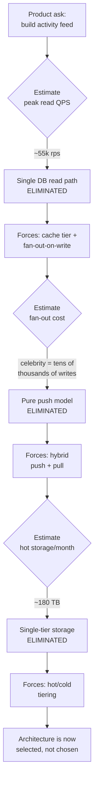
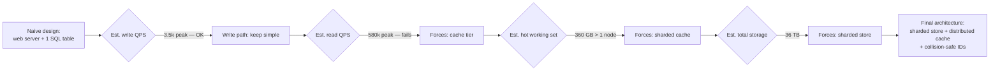
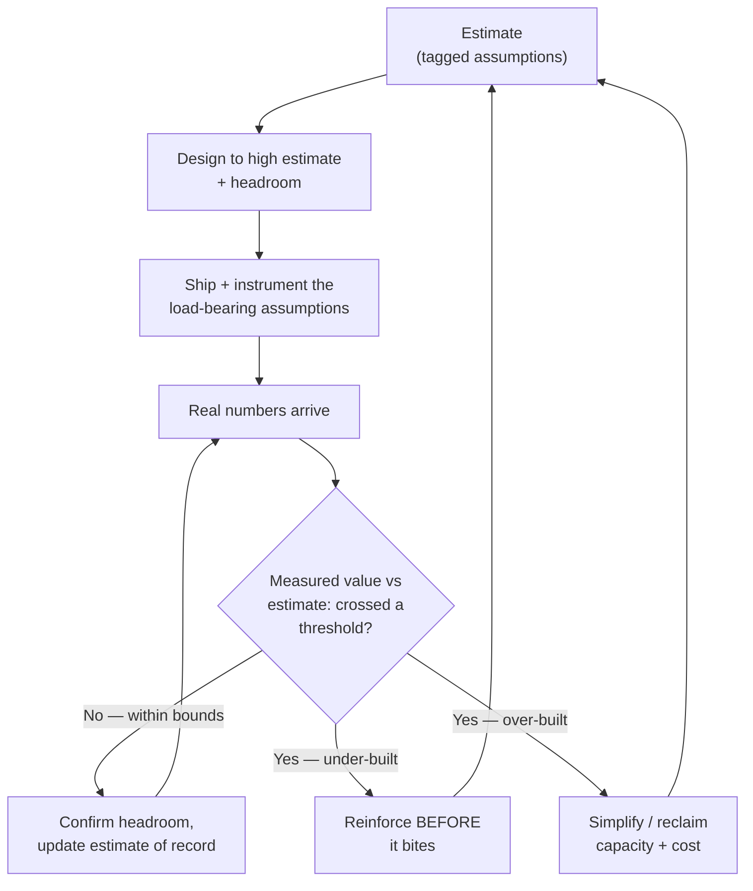

# Fermi Estimation — Senior

<!-- level-focus -->
At senior level, focus on this question:

> Which system invariant is affected by **Fermi Estimation** under failure, load, and change?

Use the smallest realistic scenario that exposes the decision and its failure behavior.
At junior and middle levels, Fermi estimation is a skill: decompose an unknown into knowable factors, multiply, sanity-check the order of magnitude. At the senior level it stops being a skill and becomes a **tool of ownership**. You no longer estimate to pass an interview or to fill a capacity slide. You estimate to *decide* — to pick the architecture, to find the one assumption that will kill the design, to tell stakeholders "no" before a line of code is written, and to know exactly which number to re-measure once the system is live.

The senior reframe: **an estimate is not a prediction, it is a forcing function.** A good estimate produces a number that *selects* an architecture. A QPS that forces sharding. A storage figure that forces tiering. A bandwidth number that forces a CDN. If your estimate does not change a decision, you did not need it — you were doing arithmetic theater.

This document is about wielding the estimate as the thing that drives the design.

## 1. The Estimate as a Forcing Function

A forcing function is a constraint that *removes options from the table* and thereby forces a decision. The senior estimator's job is to compute the smallest number of figures that collapse a large design space into a small one.

Consider the canonical chain. You start with a product ask — "build the activity feed." That ask is infinitely flexible until you attach numbers to it:

- **200M daily active users, each opening the app 8 times/day** → ~1.6B feed reads/day → ~18,500 reads/sec average → **~55,000 reads/sec peak** (3× average). That single number forces the read path off a single database and onto a fan-out-on-write model with a cache tier.
- **Each user follows ~300 accounts, each account posts ~2/day** → fan-out-on-write would write each post to ~tens of thousands of follower feeds for a celebrity → **fan-out-on-write breaks for high-fan-out accounts.** That number forces a *hybrid* model (push for normal users, pull for celebrities).
- **Average post 1 KB, retained 30 days, 200M posts/day** → ~6 TB/day → ~180 TB/month of hot data → **forces tiering**: hot store for recent, cold object storage for the long tail.

Notice what happened. We did not "design a feed and then check capacity." The capacity numbers *were* the design. Each figure eliminated an entire class of architectures.



The diagram is deliberately staged: each estimate gates the next. You cannot estimate fan-out cost sensibly until the read QPS has already pushed you toward fan-out-on-write. The estimate sequence *is* the design sequence. A senior engineer runs this loop in a meeting, on a whiteboard, in five minutes, before anyone has opened an IDE.

The mental discipline: **for every estimate, ask "what decision does this number make?"** If the answer is "none," skip it. If the answer is "it picks between A and B," compute it precisely enough to distinguish A from B — and no more precisely than that.

---

## 2. Number → Design Decision (the decision table)

Seniority shows in knowing the *thresholds* where a number flips a decision. You do not need to know that a single Postgres node does "exactly 14,200 writes/sec." You need to know it does "low tens of thousands, not hundreds of thousands" — because that's the boundary that decides whether you shard.

The table below is the load-bearing artifact of this whole topic: it maps an estimated quantity to the design decision it forces and the rough threshold at which the decision flips. These thresholds are order-of-magnitude rules of thumb, not vendor benchmarks; the point is the *flip*, not the digit.

| Estimated quantity | Comfortable on one node | Threshold that forces a change | Forced decision |
|---|---|---|---|
| Write QPS | < ~5–10k writes/sec | tens of thousands sustained | Shard the write path / partition by key |
| Read QPS | < ~10–50k reads/sec | hundreds of thousands | Add read replicas → then cache tier → then fan-out |
| Working set (hot data) | fits in RAM (≤ ~64–256 GB) | exceeds single-node RAM | Distributed cache (Redis Cluster) / partition the cache |
| Total stored data | ≤ single-disk / single-node (~few TB) | tens of TB and growing | Hot/cold tiering + object storage for cold |
| Egress bandwidth | ≤ origin NIC (~10–25 Gbps) | hundreds of Gbps to users | CDN / edge caching, push static + media off origin |
| Object size | ≤ ~1 MB | tens of MB+ (media, files) | Object store + signed URLs, not the primary DB |
| Fan-out per write | ≤ low hundreds | tens of thousands (celebrity) | Hybrid push/pull instead of pure fan-out-on-write |
| p99 latency budget | request fits in one round trip | budget < sum of serial hops | Parallelize calls / precompute / cache the slow hop |
| Data growth rate | flat or linear & slow | doubling in < ~12 months | Design for resharding *now*, not retrofit later |
| Geographic spread | single region tolerable | users on multiple continents | Multi-region replication + locality routing |

How to read this table as an owner: you are scanning your estimates against the **threshold** column. The moment any estimate crosses a threshold, the corresponding forced decision is no longer optional — it is on the critical path and must be in v1, or explicitly deferred with eyes open. The skill is recognizing the crossing early, when it costs a paragraph in a design doc, rather than late, when it costs a migration.

A subtle senior point: thresholds *interact*. Crossing the storage threshold (tiering) changes your read-QPS distribution (cold reads are slower and rarer), which changes your cache sizing, which changes your RAM threshold. Estimation is not a checklist; it is a small system of coupled inequalities. You solve the binding constraint first.

---

## 3. Sensitivity Analysis: Finding the Load-Bearing Assumption

Every estimate is a product of assumptions. Most of them don't matter. **Sensitivity analysis is the discipline of finding the one that does** — the assumption that, if wrong by 10×, breaks the design — and pressure-testing *that one* instead of polishing the others.

The core question, asked of each input: **"If I am wrong about this by 10×, does the architecture survive?"**

- If yes → the assumption is *robust*. It is not load-bearing. Stop refining it; a rough guess is fine.
- If no → the assumption is *load-bearing*. Your entire design rests on it. You must (a) tighten the estimate with real data, (b) design a fallback, or (c) build in headroom so a 10× miss still lands inside your capacity.

A 10× swing is the right test because Fermi estimates are routinely off by 3–5× on any single factor, and several factors compound. If a 10× error on one input is survivable, you have margin. If it isn't, you have a single point of failure made of arithmetic.

Here is a sensitivity table for the activity-feed example. Each row takes one assumption, swings it 10× in the dangerous direction, and asks whether the chosen architecture holds.

| Assumption | Base value | ×10 swing | Effect on design | Survives? |
|---|---|---|---|---|
| Daily active users | 200M | 2B | Linear scale-out of an already-sharded read path; more nodes, same architecture | ✅ Yes — robust |
| Avg post size | 1 KB | 10 KB | Storage 60 TB/day instead of 6 TB/day; tiering already planned, just more cold storage | ✅ Yes — robust |
| Reads per user/day | 8 | 80 | Cache hit ratio absorbs most; cache tier already exists, scale horizontally | ✅ Mostly — robust |
| **Avg accounts followed (fan-out)** | **300** | **3,000** | Fan-out-on-write cost explodes; even "normal" users become celebrity-class; push model collapses | ❌ **No — load-bearing** |
| Peak-to-average ratio | 3× | 30× | Provisioned headroom destroyed; autoscale can't react fast enough; thundering herd | ❌ **No — load-bearing** |
| Retention window | 30 days | 300 days | More cold storage, slightly higher cold-read latency; cheap to absorb | ✅ Yes — robust |

The two red rows are the entire risk of this design. Fan-out degree and peak-to-average ratio are **load-bearing**: if either is 10× worse than assumed, the architecture does not merely need more hardware — it needs a *different shape*. Everything else is a knob you turn after launch.

This is the senior move that distinguishes ownership from arithmetic: **you do not pressure-test all six rows equally.** You go to the data team and the product team and you say, "I need to know the real follow-count distribution — specifically the 99th percentile and the max — and I need the historical peak-to-average traffic ratio. Everything else I can be sloppy about." You have converted an open-ended capacity question into two sharp, answerable questions about the two assumptions that can sink the ship.

Two practical notes on sensitivity:

1. **The dangerous direction matters.** Swing each assumption toward the load it would impose. Users-up is dangerous; users-down isn't. Cache-hit-ratio-down is dangerous; up isn't. You are stress-testing, not averaging.
2. **Distributions, not means, drive the load-bearing ones.** "Average 300 follows" hides that the architecture is killed by the *tail* — the 0.01% of accounts with 50M followers. When an assumption is load-bearing, replace the mean with the distribution. The mean lied; the p99 and the max tell the truth.

---

## 4. Bounding the Risk: Design to the High Estimate

Junior estimation produces a single number. Senior estimation produces a **range**, and then deliberately decides *where in that range to design*. The answer is almost never "the average."

Capacity must be provisioned for the load you will actually see at the worst moment you care about, not the load you see on a calm Tuesday afternoon. The average is a fiction no real request ever experiences. So:

- **Provision to the high estimate, plus headroom.** Take the upper bound of your range (the load-bearing assumptions pushed to their plausible-bad values) and add margin on top. A common owner heuristic: size for ~2× your projected peak so you have room for a bad day, a viral event, and the lag before autoscaling catches up.
- **The average is for cost modeling, not capacity.** You bill against the average (what you'll actually consume), but you *design* against the peak (what you must survive). Conflating the two is how systems fall over precisely when they matter most — launch day, the big sale, the news event.
- **Headroom is not waste; it is bought time.** The gap between provisioned capacity and expected peak is your reaction window. It's the time you have to notice a trend, order more capacity, and deploy before users feel pain. Zero headroom means every surprise is an incident.

The formal version: combine the peak multiplier and the load-bearing-assumption uncertainty into a single design target.

```
Design target = (average load)
              × (peak-to-average multiplier)      ← e.g. 3×
              × (load-bearing uncertainty factor)  ← e.g. 2–3× on the risky input
              × (headroom factor)                  ← e.g. 1.5–2×
```

For the feed: 18,500 average reads/sec × 3 (peak) × 1.5 (uncertainty on read-per-user) × 1.5 (headroom) ≈ **125,000 reads/sec** as the number you actually build for, against an 18,500 average. That factor-of-~7 gap between "average" and "design target" is not pessimism — it is the difference between a system that survives its own success and one that becomes a postmortem.

The owner's judgment is in *not over-applying* this. You bound the risk on the **load-bearing** assumptions (Section 3) and design to the average-plus-modest-headroom on the robust ones. Multiplying every input by its worst case compounds into an absurd, unaffordable design — "estimate paranoia." Bound where it matters; relax where it doesn't.

---

## 5. When the Estimate Says "No" (or "Overkill")

The most valuable estimate is the one that **stops work that should not happen.** A senior engineer is paid, in part, to deliver bad news cheaply — before the sprint, not after the quarter.

**The "this won't work" estimate.** A product proposal: "real-time analytics dashboard, sub-second freshness, scanning the full event history per query." Estimate it. Events: 500k/sec × 86,400 sec/day = ~43B events/day. A "scan full history per query" at even 100M events to scan, per query, at sub-second, across hundreds of concurrent dashboards — the read amplification alone is physically impossible on the proposed single-cluster design. The estimate says **no** in ten minutes. The correct senior response is not "no" full stop; it is: *"Sub-second on full-history scan isn't reachable with scan-per-query. We can hit it with pre-aggregated rollups at minute granularity, or true sub-second on a bounded recent window. Which does the product actually need?"* The estimate killed the impossible design *and* surfaced the two affordable ones.

**The "this is overkill" estimate.** The mirror image, and just as common. The team is about to build a sharded, multi-region, eventually-consistent datastore for an internal admin tool. Estimate the load: 200 internal users, maybe 5 actions/minute each, ~17 writes/sec peak, a few GB of data total. That fits on **one modest database instance with a daily backup**, for years. The distributed design is months of work and a permanent operational tax to solve a problem that does not exist. The estimate says **overkill**, and the senior move is to delete the complexity from the plan before it is built. Avoided complexity is the cheapest complexity.

Both directions share the same logic: **the estimate is a gate that runs before the build.** It has two exits — "won't work, change the requirement or the approach" and "overkill, simplify the approach." Either way, it converts a months-long mistake into a five-minute calculation. This is the highest-leverage thing estimation does, and it is invisible: nobody sees the disaster that didn't happen.

---

## 6. Worked Example: An Estimate That Changes the Design

Let's run the full owner loop on a concrete problem and watch the estimate *rewrite* the architecture mid-design.

**The ask:** "Build a URL-shortener-style redirect service. Users create short links; the world clicks them. Plan for 5 years."

**First-pass design (the naive one):** A web service in front of a relational database. `INSERT` on create, `SELECT` on redirect. One table, an index on the short code. Done. Now estimate it — and let the numbers decide whether this survives.

**Step 1 — Writes (link creation).** Suppose 100M new links/day. 100M / 86,400 ≈ ~1,160 writes/sec average, ~3,500/sec peak. *Decision:* comfortably one node's write capacity (Section 2 threshold ~5–10k). **The write path does not force sharding.** Naive design holds here.

**Step 2 — Reads (redirects).** Each link gets clicked, say, 100× over its life, and clicks cluster early. If 100M links/day are created and the read:write ratio is ~100:1, that's ~116k reads/sec average, and with a 5× peak from virality, **~580k reads/sec peak.** *Decision:* this blows straight past the single-node and even read-replica thresholds. The naive `SELECT`-per-redirect collapses. **The estimate just killed the naive read path.** Forced decision: the redirect lookup must be served from an in-memory cache, not the database.

**Step 3 — Working set (does the cache fit?).** Over 5 years at 100M/day, total links ≈ 100M × 365 × 5 ≈ **~180B links.** Each cache entry (short code → long URL + metadata) ≈ ~200 bytes. The full set ≈ 36 TB — *does not fit in one machine's RAM.* But we don't need the full set hot; redirect traffic is heavily skewed to recent and popular links. If the hot working set is ~1% of links (~1.8B entries × 200 B ≈ ~360 GB), it *still* exceeds a single cache node. **Forced decision: a distributed, partitioned cache (Redis Cluster), keyed by short code.** The estimate just changed the design *again* — from "add a cache" to "add a sharded cache."

**Step 4 — Storage.** 180B links × ~200 bytes ≈ **~36 TB** of durable data, growing ~7 TB/year. *Decision:* past comfortable single-node storage. Either a horizontally-partitioned primary store or a key-value store built for this scale. **Forced decision: shard the durable store by short code** (and conveniently, short-code generation must avoid collisions across shards — which feeds back into the ID-generation design).

**Step 5 — Sensitivity check.** Which assumption is load-bearing?

| Assumption | Base | ×10 swing | Survives? |
|---|---|---|---|
| Links/day | 100M | 1B | ✅ scale-out, same shape |
| Clicks per link (read:write ratio) | 100:1 | 1000:1 | ❌ cache fleet + egress explode — **load-bearing** |
| Hot-set fraction | 1% | 10% | ❌ cache RAM 10× → 3.6 TB hot — **load-bearing** |
| Entry size | 200 B | 2 KB | ✅ more storage, tiering absorbs it |

The two load-bearing assumptions are **read:write ratio** and **hot-set fraction** — both about *read amplification*, both about the cache. So the owner's instruction to the data team is precise: *"Get me the real click-per-link distribution and the access-recency curve."* Those two numbers determine the size — and the cost — of the entire cache fleet.

**The result.** We started with "a web server and one SQL table." Four estimates later the architecture is: sharded durable store + distributed cache fronting all redirects + collision-safe distributed ID generation + read-amplification as the headline risk. **Not one of those decisions came from taste or a blog post. Every one was forced by a number.** That is the whole point: the estimate did not decorate the design — it *authored* it.



---

## 7. Communicating an Estimate So It Can Be Challenged

An estimate that only you can interrogate is a liability. The senior goal is to present numbers so that a reviewer attacks the **inputs** — which is where errors actually live — and not the **conclusion**, which is just arithmetic. If a stakeholder challenges your conclusion, they're guessing. If they challenge an input, they might be right, and you *want* them to be able to.

This requires structuring the estimate as a glass box, never a black box:

- **Lead with the assumptions table, not the answer.** Put every input on the table with its value and its source ("DAU = 200M, from the product OKR"; "reads/user = 8, *guessed* from a comparable app"). Tag each as measured / extrapolated / guessed. Now a reviewer can see exactly which inputs are soft and aim there.
- **Show the load-bearing rows in red.** Tell them up front: "The whole design rests on these two numbers. If you think either is wrong, *that's* the conversation to have." You are routing scrutiny to where it pays off.
- **Quote ranges, not points.** "55k–125k peak reads/sec depending on the read-per-user assumption" invites the reviewer to debate the assumption that moves the range. "55,000" invites them to nitpick a digit that doesn't matter.
- **Make the conclusion follow visibly from the inputs.** Show the chain: inputs → multiplication → threshold crossed → forced decision. When the logic is visible, disagreement attaches to a specific link in the chain, not to your credibility.
- **State what would change your mind.** "If the real follow-count p99 is under 500, we can use pure fan-out-on-write and skip the hybrid complexity." This turns the estimate into a falsifiable bet and tells everyone exactly which measurement to go get.

The deeper principle: a well-communicated estimate is **adversarially robust by design.** You are not defending a number; you are inviting attack on the soft inputs because that attack *improves the estimate*. The engineer who hides their assumptions to avoid being questioned has optimized for looking right over being right — the opposite of ownership.

| Black-box estimate (fragile) | Glass-box estimate (challengeable) |
|---|---|
| "We need ~125k QPS of capacity." | "Average 18.5k × 3 peak × headroom = ~125k; the 3× peak is the soft number." |
| Single point value | Range, with the driver of the range named |
| Assumptions in the author's head | Assumptions tabled, each tagged measured/guessed |
| Reviewer can only say "feels high/low" | Reviewer can say "your reads/user is wrong, here's data" |
| Conclusion defended | Inputs invited to be attacked |

---

## 8. The Estimate-Revisit Loop

An estimate is a hypothesis with a shelf life. The senior responsibility does not end when the design ships — it ends when the **guesses have been replaced by measurements** and the design has been re-checked against the real numbers. Estimation that never closes the loop is just guessing with extra confidence.

The loop:

1. **Estimate** with explicitly-tagged assumptions (measured / extrapolated / guessed).
2. **Instrument the load-bearing assumptions specifically.** Don't just collect generic metrics — emit the exact quantities your design rests on: actual follow-count distribution, actual peak-to-average ratio, actual cache hit ratio, actual hot-set fraction. You decided these were load-bearing in Section 3; now you watch them.
3. **Compare** real numbers against the estimate as data arrives. The interesting signal is not "were we right" but "which assumption was most wrong, and was it a load-bearing one?"
4. **Re-decide** if a real number crosses a threshold the estimate didn't cross (or un-crosses one it did). A measured fan-out far below the guess might mean you over-built and can simplify; far above means you under-built and must reinforce *before* it bites.
5. **Update the estimate of record** and the headroom. The design doc's numbers should track reality, not stay frozen at launch-day guesses that everyone slowly stops trusting.



The loop has two arrows back to the estimate because real data can falsify in either direction. Over-provisioning is a real, ongoing cost — reclaiming it is as much a senior duty as preventing under-provisioning. Most engineers only watch for "not enough"; owners also watch for "too much" and give the money back.

A discipline worth naming: **the launch-day estimate decays.** Traffic patterns drift, the product changes, a feature goes viral. Set a cadence (quarterly, or tied to growth milestones) to re-run the back-of-envelope against current measurements. The goal is that at no point is the live architecture justified only by a guess that nobody has checked in a year.

---

## 9. Senior Checklist

Run this list against any estimate you own. If you can't answer a line, you don't yet own the number.

- **Decision test.** For every figure I computed: *what decision does this number make?* If none, I shouldn't have computed it.
- **Threshold awareness.** Do I know the rough threshold at which each estimate flips a design decision (shard / cache / tier / CDN / hybrid)? Have I checked each estimate against it?
- **Load-bearing assumption identified.** Which single assumption, if wrong by 10×, breaks the design? Have I named it explicitly and pressure-tested *it* rather than polishing robust inputs?
- **Distributions where it matters.** For load-bearing assumptions, did I replace the mean with the tail (p99, max)? Means lie about fan-out and hot-spots.
- **Designed to the high estimate.** Did I provision to peak × uncertainty × headroom on the risky inputs — not to the comfortable average?
- **Headroom is reaction time.** Is the gap between capacity and expected peak enough to notice, provision, and deploy before users feel it?
- **Did I check for "no" and "overkill"?** Did the estimate get a chance to kill an impossible design *or* delete an unnecessary one before the build started?
- **Glass-box communication.** Are my assumptions tabled, sourced, and tagged so a reviewer attacks the inputs, not the conclusion? Did I flag the load-bearing rows and state what would change my mind?
- **Instrumented the right thing.** Am I measuring the exact load-bearing quantities in production — not just generic dashboards?
- **Closed the loop.** Is there a cadence to replace guesses with measurements, re-decide on threshold crossings (both directions), and update the estimate of record?

The thread through all ten: **a senior estimate is not arithmetic that describes a design — it is the force that produces one, the radar that finds its single greatest risk, and the contract you keep re-checking against reality.** Own the number, and the number owns the architecture.

---

*Next step:* [Professional level](professional.md)

---

## Apply it

1. State the system invariant that **Fermi Estimation** must protect.
2. Mark ownership, state, and failure propagation at each boundary.
3. Compare two designs under load, dependency failure, and future change.
4. Define recovery and compatibility behavior before implementation.
5. Test the riskiest assumption with a focused experiment.

## Verify your work

- The experiment supports the design with evidence, not preference.
- Failure injection shows the blast radius and recovery path.
- Compatibility checks cover old and new callers or data.
- Operational signals reveal invariant violations and recovery progress.

## Review questions

- Which invariant must remain true when Fermi Estimation fails?
- Where should recovery responsibility live, and why?
- Which assumption deserves an experiment before implementation?
- How can the design evolve without changing every consumer at once?
