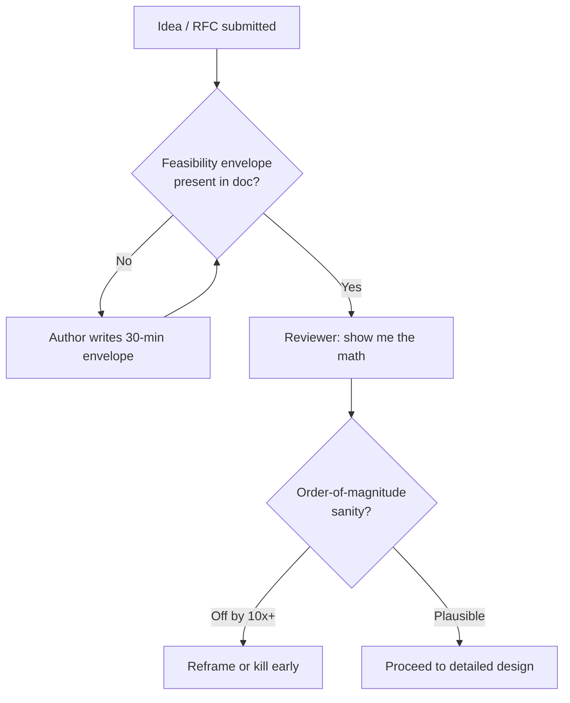
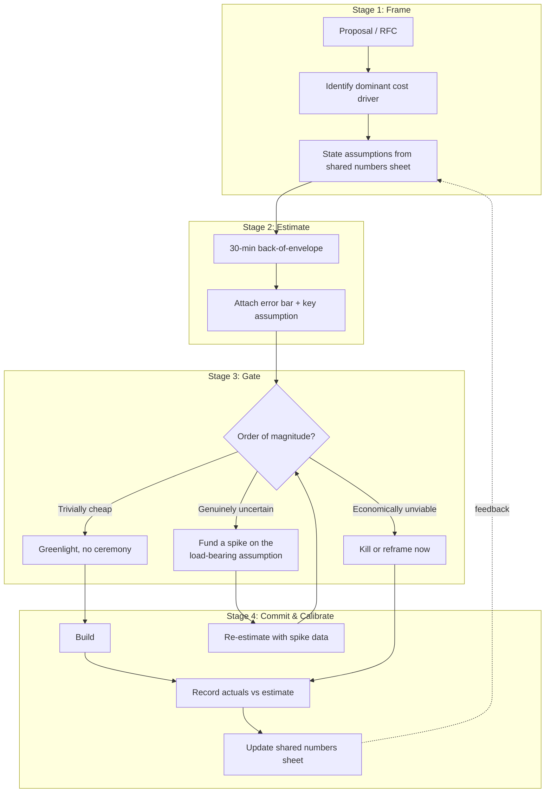

# Fermi Estimation — Staff / Principal Level

At the staff and principal level, a Fermi estimate is no longer a whiteboard
exercise to size a single service. It is a **decision instrument**: a cheap,
fast, defensible number that you wield to kill bad projects before they consume
quarters, to greenlight obvious wins without process theater, and to build an
organization that *expects* a feasibility number before anyone writes a line of
code. The skill stops being "can you compute QPS" and becomes "can you change
what the company builds with thirty minutes of arithmetic."

This file is the organizational axis of Fermi estimation. It assumes you can
already do the math; it teaches when the math is the most leveraged thing you
will do all quarter.

## Table of Contents

1. [The Leverage Shift: Estimation as a Decision Instrument](#1-the-leverage-shift-estimation-as-a-decision-instrument)
2. [Kill-or-Greenlight: The 30-Minute Project Filter](#2-kill-or-greenlight-the-30-minute-project-filter)
3. [Worked Example: Build-vs-Buy on a Portfolio Decision](#3-worked-example-build-vs-buy-on-a-portfolio-decision)
4. [Estimation in Technical Due Diligence and Cost Forecasting](#4-estimation-in-technical-due-diligence-and-cost-forecasting)
5. [Building an Estimation Culture](#5-building-an-estimation-culture)
6. [The Shared Numbers Sheet: Calibrating the Org](#6-the-shared-numbers-sheet-calibrating-the-org)
7. [False Precision and Spurious Estimates](#7-false-precision-and-spurious-estimates)
8. [Estimation as Cheap Risk Reduction Before Expensive Commitments](#8-estimation-as-cheap-risk-reduction-before-expensive-commitments)
9. [The Estimate-Gates-the-Decision Pipeline](#9-the-estimate-gates-the-decision-pipeline)
10. [Decision → Estimate → Outcome Ledger](#10-decision--estimate--outcome-ledger)
11. [Anti-Patterns at the Org Scale](#11-anti-patterns-at-the-org-scale)
12. [Staff Operating Checklist](#12-staff-operating-checklist)

---

## 1. The Leverage Shift: Estimation as a Decision Instrument

A junior engineer estimates to *answer a question*: how many machines, how much
storage. A staff engineer estimates to *make a decision smaller, earlier, and
cheaper*. The output of your estimate is not a number — it is an action: stop,
proceed, descope, or escalate.

The economics are stark. A back-of-envelope estimate costs roughly **30 minutes
to 2 hours** of one expensive person's time. The project it gates can cost
**5 to 50 engineer-quarters**. That is a leverage ratio in the thousands. When a
single afternoon of arithmetic prevents one wasted quarter for a team of five,
you have returned more value than most features you will ship that year.

Three properties make a Fermi estimate uniquely suited to be a decision gate:

- **It is fast.** You can produce it before politics, sunk cost, or a roadmap
  commitment make the decision irreversible.
- **It is transparent.** Every assumption is on the table, so the conversation
  shifts from opinion ("this feels expensive") to a falsifiable claim ("this is
  $4M/yr in egress, here is the line").
- **It is order-of-magnitude correct.** You do not need precision to make a
  go/no-go call. You need to know whether the answer is $40k or $4M — and an
  envelope reliably separates those.

The principal-level move is to insert the estimate **upstream of the
commitment**, not downstream of it. An estimate produced after the team has
spent a quarter building is a post-mortem. An estimate produced in the RFC
review is a steering wheel.

## 2. Kill-or-Greenlight: The 30-Minute Project Filter

Most project proposals fall into one of three buckets, and a quick estimate
sorts them instantly:

1. **Trivially cheap.** The estimate shows the thing costs almost nothing in
   compute, storage, or risk. *Greenlight without ceremony.* Do not make people
   write a six-page design doc to justify a $200/month cron job.
2. **Economically unviable.** The estimate shows the unit economics never close
   — the cost per request exceeds the revenue per request, or the storage growth
   bankrupts the budget within a year. *Kill it now,* while killing it is free.
3. **Genuinely uncertain.** The estimate lands in a range where the decision
   actually depends on assumptions you cannot yet pin down. *This* is where you
   invest in a deeper model, a prototype, or a spike.

The filter's value is that it makes buckets 1 and 2 — usually the majority —
*cheap to resolve*. The expensive deliberation gets reserved for bucket 3, where
it belongs.

A concrete kill: a proposal to store full-resolution device telemetry for
"future ML." Envelope: 2M devices × 1 sample/sec × 200 bytes × 86,400 sec/day
≈ **34 TB/day**, ≈ 12 PB/yr. At even $0.02/GB-month of warm storage that is
~$250k/month and climbing, before a single model is trained. Thirty minutes
ends the conversation, or reframes it into "sample at 1/min and aggregate at the
edge," which is 60× cheaper and actually shippable.

A concrete greenlight: a request to cache a third-party currency-rates API.
Envelope: 180 currency pairs × 4 bytes × refreshed hourly = a few KB in Redis,
saving ~50 req/sec of paid external calls. The estimate shows it is free and
removes a dependency. Approve it in the review, do not schedule a meeting.

The discipline is symmetric: a good filter must be *willing to greenlight*
quickly, or engineers learn that "show me the estimate" is a euphemism for "no."

## 3. Worked Example: Build-vs-Buy on a Portfolio Decision

A platform org must choose how to provide full-text search across the product.
Two proposals are on the table for the next planning cycle:

- **Build:** an in-house search service on a self-managed search cluster.
- **Buy:** a managed search SaaS priced per indexed document and per query.

The VP wants a recommendation in a week. A staff engineer produces the envelope
in an afternoon.

**Inputs (rounded to one significant figure, on purpose):**

- 500M documents to index, average 2 KB each → ~1 TB raw, ~3 TB indexed with
  replicas and overhead.
- Query load: 2,000 QPS steady, 6,000 QPS peak.
- Team availability: 4 engineers could be assigned to *build*.

**Buy estimate.** Managed SaaS quote works out to roughly $0.10 per 1k queries
plus document storage. 2,000 QPS × 2.6M sec/month ≈ **5.2B queries/month** →
~$520k/month on queries alone, before storage. That is ~$6.2M/yr. The envelope
immediately exposes that this SaaS's pricing model does not fit a high-QPS,
low-value-per-query workload — it is priced for enterprise search, not a hot
product path.

**Build estimate.** 3 TB indexed fits comfortably on ~6–9 nodes for replication
and headroom; peak 6,000 QPS at a few ms per shard query is well within that
fleet. Infra: ~9 nodes × ~$1.5k/month ≈ **$14k/month** ≈ $170k/yr. Build cost:
4 engineers × 2 quarters to production-quality ≈ 8 engineer-quarters, then ~1
engineer ongoing for operations.

| Option | Year-1 infra | Year-1 people | Year-1 total | Steady-state /yr |
|--------|-------------:|--------------:|-------------:|-----------------:|
| Buy (SaaS) | $6.2M | ~0.5 eng | ~$6.3M | ~$6.2M |
| Build      | $0.17M | ~4.5 eng (~$0.9M) | ~$1.1M | ~$0.4M |

The envelope flips the default. "Buy" intuitively *feels* like the safe,
fast choice — but the per-query pricing makes it **~6× more expensive in year
one and ~15× more expensive at steady state** for this specific traffic shape.
The decision is not close, and it took an afternoon, not a quarter-long bake-off.

The portfolio consequence: the freed budget delta (~$5M/yr) reframes the
planning conversation entirely. The recommendation is not merely "build search"
— it is "build search *and* fund the two adjacent initiatives we said we
couldn't afford." A single estimate changed what the whole portfolio could do.

The honest caveat is also part of the deliverable: the estimate assumes a
moderate-relevance search good enough for the product. If the requirement were
state-of-the-art semantic relevance, the build cost would be far higher and the
SaaS's specialized capabilities might justify the premium. The estimate names
that fork explicitly, so the VP decides on the real axis (relevance ambition),
not on a vibe.

## 4. Estimation in Technical Due Diligence and Cost Forecasting

Beyond single projects, Fermi estimation is the backbone of three recurring
staff-level deliverables.

**Capacity forecasting.** Before a budget cycle you must tell finance what
infrastructure will cost next year. You do not have a detailed model; you have
growth assumptions. Envelope: current spend × projected traffic multiplier ×
efficiency factor. If traffic 2× and you expect 20% efficiency gains, next-year
infra ≈ current × 1.6. That single line, defensible and revisable, is worth more
than a 40-tab spreadsheet nobody believes.

**Acquisition / vendor due diligence.** When evaluating a company to acquire or
a critical vendor, an envelope reveals whether their claims are physically
possible. "We serve 1M QPS from three nodes" — envelope the per-node packet rate
and you know in minutes whether that is plausible, heavily cached, or a lie.
Estimation is a **bullshit detector** for due diligence.

**Cost-per-unit economics.** For any new product surface, divide total cost by
units served: cost per active user, per API call, per stored GB. If cost-per-
user exceeds revenue-per-user and there is no path to close the gap with scale,
the business does not work — and the envelope said so before the launch.

The forecast's power is that it is **transparent and revisable**. When reality
diverges, you do not throw out the model; you update the one assumption that was
wrong and re-derive. A precise-looking forecast that cannot be re-derived is
worthless the moment an input changes.

## 5. Building an Estimation Culture

The highest-leverage thing a principal engineer does with estimation is not
producing estimates — it is making the *organization* produce them by default.
Culture is what makes the skill scale beyond your own calendar.

Concrete mechanisms that install the culture:

- **Require a feasibility estimate in every design doc / RFC.** Add a mandatory
  section: *"Back-of-envelope: expected scale, storage, cost, and the dominant
  bottleneck."* If the author cannot fill it in, they do not yet understand the
  problem, and the review surfaces that early.
- **Normalize "show me the back-of-envelope" in reviews.** When a proposal
  asserts scale or cost, the reflexive question is "what's the envelope?" — said
  without hostility, as a default expectation. The phrase should be boring, not
  confrontational.
- **Teach estimating before building.** Run estimation drills: take a real past
  project, have the team estimate it cold, then compare to actuals. People
  calibrate fast when they see their own misses.
- **Reward kills.** Publicly credit the engineer whose envelope killed a doomed
  project. If only shipping is celebrated, nobody will ever raise their hand to
  say "the math says this can't work." A killed bad project is a *win* and must
  be told as one.
- **Keep estimates lightweight.** The moment an estimate requires a template, a
  sign-off, and a meeting, people stop doing them. The cultural goal is that a
  napkin estimate is *socially cheaper* than an unexamined assertion.

The failure mode to avoid: estimation becoming a gatekeeping ritual that slows
everything down. The intent is the opposite — fast envelopes *remove* process by
letting obvious things proceed and obvious mistakes die without ceremony.

## 6. The Shared Numbers Sheet: Calibrating the Org

An estimate is only a decision instrument if people *trust it*. Trust comes from
calibration against a shared, org-wide set of latency, throughput, and cost
numbers. If two engineers estimate the same system and get answers 100× apart
because one assumed SSD random reads are "fast" and the other assumed they cost
a disk seek, neither estimate can gate a decision.

The fix is a **single source of truth for base numbers**: a maintained sheet of
the constants your org actually operates with.

| Quantity | Calibrated value (order of magnitude) |
|----------|----------------------------------------|
| L1 cache reference | ~1 ns |
| Main memory reference | ~100 ns |
| SSD random read | ~16 µs |
| Network round trip (same DC) | ~0.5 ms |
| Network round trip (cross-region) | ~70–150 ms |
| Read 1 MB sequentially from SSD | ~50 µs |
| Disk (HDD) seek | ~5–10 ms |
| Our typical service p99 | ~40 ms (org-specific) |
| Our blended compute cost | ~$X / vCPU-hour (org-specific) |
| Our egress cost | ~$Y / GB (org-specific) |
| Bytes per UTF-8 user record | ~1–2 KB (org-specific) |

The classic "latency numbers every programmer should know" table is the
canonical public anchor for the hardware rows; a widely-cited interactive version
is maintained at <https://colin-scott.github.io/personal_website/research/interactive_latency.html>,
which animates how those numbers have shifted over time. The org-specific rows —
your real per-vCPU cost, your real egress price, your real record sizes — are the
ones you must own and update, because they are what turn a generic envelope into
*your company's* economics.

When the sheet is shared and trusted, two things happen. First, estimates become
**comparable**: any two engineers reach the same order of magnitude, so the
debate is about assumptions, not arithmetic. Second, estimates become
**reviewable by non-experts**: a finance partner or a PM can follow an envelope
built from published constants and challenge the *inputs* without needing to know
SSD physics. Calibration is what makes the estimate a shared language rather than
a private opinion.

## 7. False Precision and Spurious Estimates

The most dangerous estimate is not the rough one — it is the **precise-looking
one that nobody pressure-tested**. A number like "$3,847,219 annual cost" carries
an aura of rigor that a range like "roughly $3–5M" does not, and that aura
suppresses scrutiny. People defer to the decimal places.

Failure modes to police at the org level:

- **Spurious significant figures.** Carrying six digits through a calculation
  whose inputs are guesses good to one digit. The output cannot be more precise
  than its inputs. State results as orders of magnitude or single-significant-
  figure ranges, and the false confidence evaporates.
- **The unexamined detailed model.** A 40-row spreadsheet *feels* more
  trustworthy than a napkin, but complexity is not correctness. A detailed model
  with one wrong assumption buried in row 31 is more dangerous than a transparent
  envelope, because the error is harder to see and easier to trust.
- **Anchoring on the artifact.** Once a precise number is written down, it
  becomes the anchor everyone negotiates around, even when its basis was a
  finger in the air. Always attach the dominant assumption to the number so the
  reader negotiates with the *assumption*, not the digits.
- **Estimate laundering.** A guess from one team becomes a "fact" when quoted by
  another, losing its uncertainty in transit. Carry the provenance and the error
  bars with the number.

The principal-level habit: **demand the error bar.** When someone presents a
precise number, the question is "what's the range, and which single assumption
moves it most?" An estimate that cannot state its own uncertainty has not been
pressure-tested and must not gate a decision. Honest imprecision beats dishonest
precision every time.

## 8. Estimation as Cheap Risk Reduction Before Expensive Commitments

Reframe estimation in the language leadership already uses: **risk management**.
Every large commitment — a re-platform, a region expansion, a multi-year vendor
contract — carries the risk that the fundamental economics or physics do not
work. An envelope is the cheapest possible probe of that risk.

The asymmetry is the whole argument. The estimate costs hours; the commitment
costs quarters or millions. Even if the estimate is only *order-of-magnitude*
correct, it reliably distinguishes "this is fine" from "this is impossible" —
and impossibility is exactly the risk you most need to retire early.

A useful framing for the cost of *not* estimating:

| When you discover infeasibility | Cost to recover |
|---------------------------------|-----------------|
| At the envelope stage (hours in) | ~0 — pivot for free |
| At the prototype stage (weeks in) | weeks of work, low political cost |
| At the design-review stage (a sprint in) | a sprint, some sunk cost |
| Mid-build (a quarter in) | a quarter, real sunk cost, morale hit |
| At launch / in production | quarters, public failure, trust damage |

The cost of discovering "this can't work" grows by an order of magnitude at each
stage. The envelope is your chance to discover it in the first column, where it
is free. This is why a staff engineer treats the absence of an envelope on a
major commitment as a *risk red flag* in its own right, regardless of how
confident the proposers feel.

Pair the estimate with a **pre-mortem on its assumptions**: "if this envelope is
wrong, which assumption broke, and how would we know early?" That turns the
estimate into a monitoring plan — you instrument the one or two inputs that the
decision hinges on, so reality corrects you in weeks, not after the launch.

## 9. The Estimate-Gates-the-Decision Pipeline

The following staged pipeline shows how a single envelope routes a proposal
through the organization. The estimate is not an input to the process — it is the
gate that determines which path the proposal takes, and how much further
investment it earns.

Two structural features make this a *system* rather than a one-off:

- **The uncertain bucket loops.** A genuinely uncertain proposal does not get
  killed or approved on a coin flip — it earns a *targeted* spike on the single
  load-bearing assumption, then re-enters the gate with better numbers. You spend
  investigation budget only where the decision is actually sensitive.
- **Actuals feed back into calibration.** Every shipped project records estimate
  vs. reality, and the deltas update the shared numbers sheet. The org's
  estimates get *more* trustworthy over time, which makes the gate more
  authoritative, which makes the culture self-reinforcing.

## 10. Decision → Estimate → Outcome Ledger

The most persuasive case for an estimation culture is a track record. Keep a
visible ledger of decisions the envelope actually changed. It calibrates the org,
credits the kills, and makes the next "show me the math" uncontroversial.

| Decision under review | The 30-min estimate | Action taken | Outcome |
|-----------------------|---------------------|--------------|---------|
| Store full-res device telemetry "for ML" | ~12 PB/yr, ~$250k/mo and growing | Killed; switched to edge aggregation at 1/min | 60× cost avoided; ML still feasible on samples |
| Build vs. buy full-text search | Buy ≈ $6.2M/yr vs. build ≈ $0.4M/yr steady | Build approved; freed ~$5M reframed portfolio | Two adjacent initiatives funded with the delta |
| Cache third-party FX rates | A few KB Redis, removes 50 req/s paid dep | Greenlit in review, no doc required | Dependency removed, vendor bill cut |
| "Real-time" cross-region strong consistency | ~140 ms RTT floor vs. 40 ms p99 SLO | Killed the strong-consistency requirement | Redesigned around regional + async; SLO met |
| Per-user cost of new free tier | Cost/user > 3× revenue/user, no scale fix | Launch gated; pricing redesigned first | Avoided a launch that lost money per signup |
| Migrate logs to premium hot storage | ~$2M/yr at projected volume | Reframed to tiered hot/warm/cold | ~80% of the cost avoided, query SLA kept |
| Acquisition target's "1M QPS / 3 nodes" claim | Packet-rate envelope: implausible un-cached | Pushed for architecture proof in diligence | Claim was a cached benchmark; valuation adjusted |

The pattern across the ledger: the estimate's job was rarely to produce the final
engineering plan. Its job was to **change the decision** — kill, greenlight,
reframe, or descope — at a stage where changing it was nearly free.

## 11. Anti-Patterns at the Org Scale

- **Estimation theater.** Mandating envelopes as a checkbox that nobody reads.
  If the number never changes a decision, the ritual is pure overhead and teams
  will rightly resent it. The envelope must have teeth — sometimes it must kill.
- **Gatekeeping disguised as rigor.** Using "show me the estimate" selectively to
  block projects you dislike while waving through ones you favor. This poisons
  the culture instantly; the question must be a default applied evenly, not a
  weapon.
- **Precision worship.** Rejecting a one-significant-figure envelope because it
  "isn't rigorous," then trusting a detailed spreadsheet with hidden wrong
  assumptions. Optimize for *transparency and revisability*, not decimal places.
- **The hero estimator.** Only one principal can produce trusted envelopes, so
  the skill never scales and the org bottlenecks on one calendar. The goal is to
  make *everyone* estimate, not to be the oracle.
- **Estimate-and-forget.** Producing the envelope, making the decision, and never
  recording actuals. Without the feedback loop, the numbers sheet stagnates and
  trust in estimates slowly erodes.
- **Killing the greenlights.** Using estimates only to say no. If a fast,
  positive estimate doesn't *accelerate* obviously-good work, engineers learn the
  process is a brake and route around it.

## 12. Staff Operating Checklist

Use this as the reflexive routine when a significant decision crosses your desk.

- [ ] **Is there an envelope?** If a major commitment has no feasibility number,
      that absence is itself a risk flag — produce one before anything else.
- [ ] **What is the dominant cost driver?** Estimate that to one significant
      figure; ignore the rest until the driver is pinned.
- [ ] **Which bucket?** Trivially cheap → greenlight fast. Unviable → kill or
      reframe now. Uncertain → spike the one load-bearing assumption.
- [ ] **What's the error bar?** Demand the range and the single assumption that
      moves it most. Reject false precision.
- [ ] **Did I use the shared numbers?** Anchor on the org's calibrated constants
      so the estimate is comparable and reviewable.
- [ ] **What changes if I'm wrong?** Run a pre-mortem on the key assumption and
      instrument it so reality corrects you in weeks.
- [ ] **Did the estimate change the decision?** If not, ask whether the estimate
      was needed — or whether you anchored on a foregone conclusion.
- [ ] **Did I record the actuals?** Close the loop: feed the delta back into the
      numbers sheet and the decision ledger.

The through-line of every item: the estimate exists to make a *better decision,
sooner, more cheaply* — and to make the next thousand decisions a little better
by calibrating the organization that produced it.

*Next step:* [Interview questions](interview.md)
