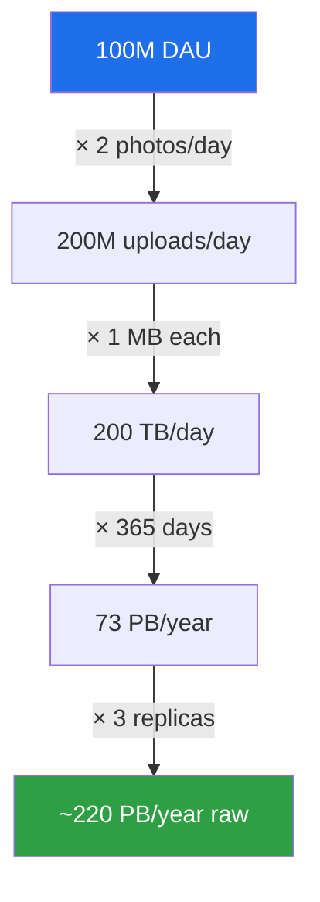
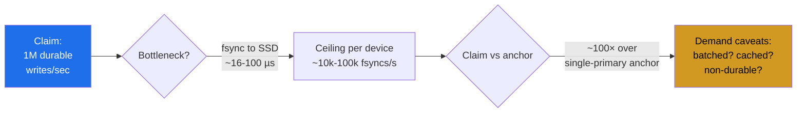

# Number Tables — Interview Questions

A back-of-the-envelope estimate is only as good as the constants you feed it. This file drills the canonical reference numbers an interviewer expects you to recall on demand — the latency ladder, powers of two, time intervals, availability nines, throughput anchors, and the derived constants that turn a vague claim into a defensible number in thirty seconds. Each answer shows its arithmetic so you can reproduce it under pressure, not just recite it.

## Table of Contents

1. [Junior Questions](#junior-questions)
2. [Middle Questions](#middle-questions)
3. [Senior Questions](#senior-questions)
4. [Professional / Deep-Dive Questions](#professional--deep-dive-questions)
5. [Staff / Judgment Questions](#staff--judgment-questions)

---

## Junior Questions

**Q1: Recite the latency ladder from L1 cache to a cross-continental round trip, with a human-scale analogy.**

> The trick is to anchor a handful of points and interpolate the rest. The canonical ladder (Jeff Dean / Peter Norvig numbers, refreshed):
>
> | Operation | Latency | Human scale (×1 billion) |
> |---|---|---|
> | L1 cache reference | ~1 ns | 1 second |
> | Branch mispredict | ~3 ns | 3 seconds |
> | L2 cache reference | ~4 ns | 4 seconds |
> | Mutex lock/unlock | ~17 ns | 17 seconds |
> | Main memory (RAM) reference | ~100 ns | ~1.5 minutes |
> | Compress 1 KB (Snappy) | ~2 µs | ~33 minutes |
> | Read 1 MB sequentially from RAM | ~3 µs | ~50 minutes |
> | SSD random read (NVMe) | ~16 µs | ~4.4 hours |
> | Read 1 MB from SSD | ~50 µs | ~14 hours |
> | Round trip within same datacenter | ~500 µs | ~6 days |
> | Read 1 MB from spinning disk | ~1 ms | ~11.5 days |
> | Disk seek | ~3–10 ms | ~1–4 months |
> | Round trip CA → Netherlands → CA | ~150 ms | ~5 years |
>
> The "×1 billion" column is the human-scale analogy: if 1 ns were 1 second, then a memory reference is a coffee break, an SSD read is a working day, a cross-Atlantic round trip is half a career. The key relationships to internalize: **memory is ~100× faster than SSD random access, SSD is ~10–100× faster than disk seek, and the network across a continent dwarfs every local operation by orders of magnitude.**
>
> 🎞️ **See it animated:** [Latency Numbers Every Programmer Should Know](https://colin-scott.github.io/personal_website/research/interactive_latency.html)

**Q2: What are the powers of two for the common data-size units, and what's the quick mental shortcut?**

> Every power of ten in bytes maps to a nearby power of two. The shortcut: **2¹⁰ ≈ 10³ (1,024 ≈ 1,000)**, so each "kilo" step in base-2 is ~2.4% larger than its base-10 cousin, and the gap compounds.
>
> | Power | Exact value | Approx | Unit | "Size of" |
> |---|---|---|---|---|
> | 2¹⁰ | 1,024 | ~1 thousand | KB | a short paragraph |
> | 2²⁰ | 1,048,576 | ~1 million | MB | a small book / low-res photo |
> | 2³⁰ | 1,073,741,824 | ~1 billion | GB | a movie / a service's heap |
> | 2⁴⁰ | 1.1 × 10¹² | ~1 trillion | TB | a small DB / a laptop disk |
> | 2⁵⁰ | 1.1 × 10¹⁵ | ~1 quadrillion | PB | a large company's data lake |
>
> So 32-bit addressing tops out at 2³² = 4 GB, and a value that fits in a `uint64` reaches 2⁶⁴ ≈ 1.8 × 10¹⁹ — enough to count every byte in any system you'll ever build.

**Q3: How many seconds are in a day? A month? A year? Why does a system designer memorize these?**

> | Interval | Seconds | Memorize as |
> |---|---|---|
> | 1 day | 86,400 | "~10⁵" |
> | 1 month (30 days) | 2,592,000 | "~2.5 × 10⁶" |
> | 1 year | 31,536,000 | "~3 × 10⁷ (π × 10⁷ is a famous mnemonic)" |
>
> Arithmetic: 60 × 60 × 24 = 86,400. Then × 30 ≈ 2.6 million, × 365 ≈ 31.5 million. You memorize these because every capacity problem pivots between a *rate* (requests/sec) and a *total* (requests/day or storage/year). Example: "1 billion requests/day" ÷ 86,400 ≈ **11,600 requests/sec** average. That single division is the most common first step in a capacity interview, and **π × 10⁷ ≈ 31.4 million ≈ seconds/year** is the mnemonic worth carrying.

**Q4: What are typical object sizes you should assume when no number is given?**

> Default assumptions that interviewers accept without pushback:
>
> | Object | Assumed size |
> |---|---|
> | A char (ASCII) | 1 byte |
> | A Unicode char (UTF-8 avg) | 1–4 bytes |
> | An `int` / `int64` | 4 / 8 bytes |
> | A UUID | 16 bytes raw, 36 bytes as text |
> | A tweet / short post | ~300 bytes |
> | A typical web page (HTML) | ~100 KB |
> | A compressed photo | ~200 KB – 2 MB |
> | A minute of MP3 audio | ~1 MB |
> | A minute of 1080p video | ~10–50 MB |
> | A single DB row (narrow) | ~100 bytes – 1 KB |
>
> The point isn't precision; it's having a defensible number to multiply by user counts. "1 billion tweets × 300 bytes ≈ 300 GB/day of raw text" is a 5-second estimate that frames the whole storage discussion.

**Q5: Convert 1 Gbps to MB/s. Why isn't it 1,000?**

> 1 Gbps = 1 gigabit per second = 10⁹ **bits**/s. Divide by 8 to get bytes: 10⁹ / 8 = 1.25 × 10⁸ bytes/s = **125 MB/s**.
>
> It isn't 1,000 because networking is quoted in *bits* and storage in *bytes* — a factor of 8 that trips up beginners constantly. Carry this as a one-liner: **1 Gbps ≈ 125 MB/s**. So a 10 Gbps NIC moves ~1.25 GB/s, and saturating a 1 Gbps link with 1 MB files means ~125 files/sec.

---

## Middle Questions

**Q6: Map the availability nines to actual downtime per year. Where's the cliff?**

> Multiply the "unavailable fraction" by the seconds in a year (~31.5 million):
>
> | Availability | Unavailable fraction | Downtime/year | Downtime/month | Downtime/day |
> |---|---|---|---|---|
> | 90% ("one nine") | 0.1 | 36.5 days | ~3 days | ~2.4 h |
> | 99% ("two nines") | 0.01 | 3.65 days | ~7.2 h | ~14.4 min |
> | 99.9% ("three nines") | 0.001 | 8.76 h | ~43.8 min | ~1.44 min |
> | 99.99% ("four nines") | 0.0001 | 52.6 min | ~4.4 min | ~8.6 s |
> | 99.999% ("five nines") | 0.00001 | 5.26 min | ~26 s | ~0.86 s |
>
> The cliff is between **three and four nines.** At three nines you can absorb a 9-hour incident, page a human, and recover manually within budget. At four nines you have ~4 minutes/month — far less than the time it takes a human to wake up and SSH in — so four nines *forces* automated failover, and five nines forces redundancy at every layer with no human in the recovery path. Each extra nine roughly **10×'s your cost and operational discipline.**

**Q7: A service does 50,000 requests/sec. How much is that per day, and what does it tell you?**

> 50,000 × 86,400 ≈ 4.32 × 10⁹ ≈ **4.3 billion requests/day.** Going the other direction: a "billion-requests-a-day" headline is only ~11.6k RPS average — modest. The asymmetry between the scary daily number and the calm per-second number is exactly why interviewers ask you to convert: marketing speaks in days, engineering capacity speaks in seconds.
>
> Always pair the average with a **peak factor.** Real traffic isn't flat; assume peak ≈ 2–3× average (sometimes 5–10× for spiky consumer apps). So 50k RPS average likely means provisioning for **100k–150k RPS peak.**

**Q8: What are the throughput anchors you should know for a single server, Redis, a SQL DB, and an SSD?**

> These are order-of-magnitude anchors, not guarantees — but defensible defaults:
>
> | Component | Throughput anchor |
> |---|---|
> | Single app server (simple request) | ~1,000–10,000 RPS |
> | Redis / in-memory cache | ~100,000+ ops/sec/node |
> | SQL DB (writes, single primary) | ~1,000–10,000 writes/sec |
> | SQL DB (reads, indexed) | ~10,000+ reads/sec |
> | NVMe SSD random IOPS | ~100,000–1,000,000 IOPS |
> | NVMe SSD sequential bandwidth | ~1–7 GB/s |
> | 10 Gbps NIC | ~1.25 GB/s |
>
> The mental model: **memory/cache is the cheap tier (100k+ ops), the relational DB is the bottleneck tier (low thousands of writes), and the network/disk sit in between.** When a design needs 100k writes/sec and you've anchored a single primary at ~5k, you've just discovered you need sharding — that's the whole value of the anchor.

**Q9: Explain the "1 million × 1 KB = 1 GB" identity and why it's so useful.**

> 1,000,000 × 1,000 bytes = 10⁹ bytes = **1 GB.** This is the most reusable identity in capacity estimation because so many objects are ~1 KB (a DB row, a small JSON doc, a log line). The pattern generalizes:
>
> - 1 million × 1 KB = 1 GB
> - 1 billion × 1 KB = 1 TB
> - 1 million × 1 MB = 1 TB
> - 1 billion × 1 MB = 1 PB
>
> So "we store 1 KB per user and have 500 million users" → 500 GB, instantly. The identity lets you skip the zeros-counting that causes most arithmetic errors in interviews.

**Q10: Walk through estimating daily storage for a system using only memorized constants.**

> Take a photo-sharing app: 100 million daily active users, each uploads 2 photos/day at 1 MB each.
>
> ```
> uploads/day = 100M users × 2 = 200M photos/day
> bytes/day   = 200M × 1 MB = 200 TB/day      (using 1M×1MB = 1 TB)
> bytes/year  = 200 TB × 365 ≈ 73 PB/year
> ```
>
> Add replication (×3 for durability) → ~220 PB/year of raw capacity. Every number here came from memorized constants: the 1M×1MB identity, days/year ≈ 365, and a default 3× replication factor. No calculator, ~60 seconds.



**Q11: Base-10 vs base-2 — when does the difference actually matter, and by how much?**

> The discrepancy grows with each unit step because 2¹⁰/10³ = 1.024, compounding:
>
> | Unit | Base-10 (SI) | Base-2 (IEC) | Drift |
> |---|---|---|---|
> | KB / KiB | 1,000 | 1,024 | +2.4% |
> | MB / MiB | 10⁶ | 1,048,576 | +4.9% |
> | GB / GiB | 10⁹ | 1,073,741,824 | +7.4% |
> | TB / TiB | 10¹² | 2⁴⁰ | +10% |
> | PB / PiB | 10¹⁵ | 2⁵⁰ | +12.6% |
>
> For *estimation*, ignore it — a 7% error at the GB level is noise next to your 2–3× peak-factor uncertainty. It matters when (a) a customer disputes "why does my 1 TB disk show 931 GB?" (disk vendors sell base-10, OS reports base-2), or (b) you're sizing a buffer where off-by-7% causes an overflow. **Rule: use base-2 for memory/RAM and addressing, base-10 for disk/network marketing and quick mental math.**

---

## Senior Questions

**Q12: How have these numbers shifted since the original 2009 latency table, and what changed in system design as a result?**

> The biggest shift is the **death of the disk seek as the default storage assumption.** In 2009, "storage" meant a spinning disk with a ~10 ms seek; random reads were catastrophically expensive, so designs went to extreme lengths to make all access sequential (LSM trees, log-structured everything).
>
> | Operation | ~2009 | Today (NVMe era) | Change |
> |---|---|---|---|
> | Disk random read | ~10 ms (seek) | ~16–100 µs (NVMe) | **~100–600× faster** |
> | Storage sequential BW | ~100 MB/s | ~1–7 GB/s (NVMe) | ~10–70× |
> | Datacenter RTT | ~500 µs | ~500 µs (mostly flat) | unchanged |
> | Cross-continent RTT | ~150 ms | ~150 ms | unchanged |
> | Memory reference | ~100 ns | ~100 ns | unchanged |
>
> What *didn't* change: **memory latency and the speed of light.** Network round trips are still governed by physics, and RAM is still ~100 ns. The consequence: the historic gap between "random" and "sequential" storage access collapsed for SSDs (~1.5–3×, not ~100×), so many LSM-vs-B-tree trade-offs that were obvious on disk are now genuinely close calls. Meanwhile cross-region latency stayed put, making geo-distribution the dominant latency constraint in modern designs.

**Q13: What's the speed-of-light floor for cross-region latency, and how do you derive it?**

> Light in fiber travels at ~⅔ of c in vacuum: c ≈ 3 × 10⁸ m/s, so in fiber ~2 × 10⁸ m/s, ≈ **5 µs per km** one way (or ~1 ms per 200 km).
>
> New York → London is ~5,500 km great-circle. One way: 5,500 × 5 µs/km ≈ 27.5 ms. **Round trip ≈ 55 ms — and that's the theoretical floor**, before routers, fiber that doesn't follow great circles, queuing, and TLS handshakes. Real-world NY–London RTT is ~70–80 ms.
>
> Why it matters: **no amount of money buys below this number.** If a synchronous cross-region quorum write needs 2 round trips to a region 80 ms away, you've committed to ~160 ms latency floor regardless of how fast your servers are. This is why "just add a region" doesn't fix latency for synchronous protocols — and why designs reach for async replication, regional read replicas, or CRDTs instead.

**Q14: Show how to sanity-check a vendor claim in 30 seconds using number tables.**

> Claim: "Our single Postgres instance handles 1 million transactions per second."
>
> Sanity check: 1M TPS. A durable write must hit disk (fsync). Even an NVMe SSD fsync is ~16–100 µs; at best ~10⁴–10⁵ fsyncs/sec from one device if each is independent. Group commit can batch many transactions per fsync, so it's not strictly impossible — but 1M *durable* writes/sec from a single primary would require batching ~10–100 transactions per fsync *and* CPU to process 1M txns. Anchoring a single SQL primary at ~10k writes/sec, the claim is **~100× above the anchor** → almost certainly read-heavy, cached, batched, or measured without durable fsync.
>
> The 30-second method: (1) identify the bottleneck resource (here, the fsync), (2) recall its anchor latency, (3) compute the ceiling, (4) compare to the claim's order of magnitude. If the claim is >10× the anchor, demand the caveats.



**Q15: Why is a calibrated company-specific numbers sheet worth more than generic constants?**

> Generic constants get you within an order of magnitude — enough to catch a 100× blunder but not to size a real fleet. A *calibrated* sheet replaces "a server does ~1k–10k RPS" with **your** measured truth: "an `m5.2xlarge` running our checkout service does 1,800 RPS at p99 < 200 ms before GC pauses spike."
>
> | | Generic constant | Calibrated sheet |
> |---|---|---|
> | Server RPS | "~1k–10k" (10× range) | "1,800 RPS for service X on instance Y" |
> | DB write ceiling | "~few thousand/sec" | "4,200 writes/sec on our schema with our indexes" |
> | Cache hit latency | "~100k ops/sec" | "p99 0.4 ms, 220k ops/sec on our Redis tier" |
> | Storage cost | "varies" | "$0.023/GB-month, ×3 replication, +30% overhead" |
>
> The calibrated version removes the 10× uncertainty that dominates every estimate — turning "we need somewhere between 5 and 50 servers" into "we need 14." It also encodes *your* workload's quirks (object size distribution, read/write ratio, p99 vs mean) that generic numbers can't. The cost: it must be re-measured as hardware, runtimes, and code change — a stale calibrated sheet is worse than an honest generic range because it carries false confidence.

**Q16: Reconcile the two ways to express the same constant: latency vs throughput. When do you reach for each?**

> They're reciprocals of each other for a single resource, but they answer different questions.
>
> - **Latency** answers "how long does *one* operation take?" — relevant for user-facing tail behavior, SLOs, and serial dependency chains. If a request makes 5 sequential DB calls at 1 ms each, latency math gives you 5 ms floor.
> - **Throughput** answers "how many can I do *per second*?" — relevant for capacity, fleet sizing, and saturation. A 1 ms operation implies ≤1,000/sec *per thread*, but with 64 threads you might hit 64,000/sec.
>
> The bridge: **throughput = concurrency / latency** (Little's Law in disguise). A disk with 100 µs latency but 32-deep queue depth delivers 32 / 100µs = 320,000 IOPS, not 10,000. Confusing the two is the classic interview trap: dividing total work by single-op latency *ignores parallelism* and under-provisions, while assuming infinite parallelism ignores the serial latency floor a user actually feels.

---

## Professional / Deep-Dive Questions

**Q17: Derive the storage and bandwidth for a write-heavy logging pipeline end to end, naming every constant used.**

> Spec: 200,000 app servers, each emits 100 log lines/sec, each line ~500 bytes, retained 30 days, compressed 5:1.
>
> ```
> lines/sec   = 200,000 × 100         = 2 × 10⁷ lines/sec
> raw B/sec   = 2×10⁷ × 500 B         = 10¹⁰ B/sec = 10 GB/sec raw
> ingest bw   = 10 GB/s ÷ 0.125 GB/s  = 80 × 10 Gbps NICs just to ingest
> compressed  = 10 GB/s ÷ 5           = 2 GB/sec on the wire after compression
> per day     = 2 GB/s × 86,400       = ~173 TB/day compressed
> 30-day      = 173 TB × 30           ≈ 5.2 PB retained
> ```
>
> Constants used: 1 Gbps = 0.125 GB/s, seconds/day = 86,400, a default 5:1 text compression ratio, and the implicit "500 bytes/log line" object size. The headline finding: **at 10 GB/s raw, the ingest network is the first wall** — you need ~80 saturated 10 Gbps links or a compress-at-source strategy before storage even enters the conversation. This is the value of doing the bandwidth line *before* the storage line.

**Q18: How do you account for amplification factors that the naive estimate misses?**

> The naive "users × payload" number is almost always low because real systems amplify. Track these multipliers explicitly:
>
> | Amplification | Typical factor | Why |
> |---|---|---|
> | Replication | ×3 | Durability across nodes/AZs |
> | Indexes | ×1.5–3 | Secondary indexes duplicate keys |
> | Read amplification (LSM) | ×5–20 | A read touches multiple SST levels |
> | Write amplification (LSM) | ×10–30 | Compaction rewrites data repeatedly |
> | Protocol/encoding overhead | ×1.2–2 | JSON, headers, base64, padding |
> | Peak vs average traffic | ×2–10 | Diurnal + event spikes |
> | Retry storms | ×1.5–3 | Failed requests re-sent |
>
> So "100 GB of user data" might need **100 × 3 (replicas) × 2 (indexes) ≈ 600 GB** of provisioned storage, and a write workload of "1k writes/sec logical" can become 10–30k physical writes/sec under LSM compaction. A senior estimate states which amplifiers it's applying; a junior one quietly omits them and lands 5–10× low.

**Q19: The latency ladder is per-operation. How do you compose it into a realistic request budget?**

> You don't add latencies blindly — you separate **serial** (on the critical path) from **parallel** (overlapped) work. Take a request that: checks an auth cache, reads 3 DB rows, calls 2 downstream services, renders.
>
> ```
> Serial path (critical):
>   auth cache (Redis)     0.5 ms
>   DB read (one of three) 2   ms   ← other 2 reads issued in parallel
>   downstream A (slowest) 40  ms   ← B runs concurrently, hidden
>   render + serialize     5   ms
>   ----------------------------------
>   p50 budget          ≈ 47.5 ms
> ```
>
> Three DB reads in parallel cost the time of *one* (max), not three (sum). Two downstream calls fanned out cost the *slower* of the two. But tail latency doesn't compose so kindly: if each parallel call has a p99 of 100 ms, the *combined* p99 of "wait for all N" rises toward the max-of-N — fan out to 10 services and you're effectively sampling the p99 tail 10 times, so the request p99 trends toward each call's p99.9. **The number table gives per-op latency; the skill is knowing when to sum (serial), when to max (parallel), and that tails amplify under fan-out.**

**Q20: What's the relationship between cache hit ratio and effective latency, and how do small ratio changes hit hard?**

> Effective latency = (hit_ratio × hit_latency) + (miss_ratio × miss_latency). With a 1 ms cache hit and a 50 ms miss (DB + downstream):
>
> | Hit ratio | Effective latency | Misses out of 1M |
> |---|---|---|
> | 99% | 0.99×1 + 0.01×50 = **1.49 ms** | 10,000 |
> | 95% | 0.95×1 + 0.05×50 = **3.45 ms** | 50,000 |
> | 90% | 0.90×1 + 0.10×50 = **5.9 ms** | 100,000 |
> | 50% | 0.50×1 + 0.50×50 = **25.5 ms** | 500,000 |
>
> The non-intuitive part: because the *miss* dominates the weighted sum, dropping from 99% → 95% (a "small" 4-point change) **more than doubles** effective latency, and the absolute miss count quintuples — which also quintuples downstream load, potentially saturating the DB and pushing miss latency even higher (a feedback spiral). This is why cache hit ratio is one of the highest-leverage numbers to know and monitor: a tail of misses, not the hits, sets your latency and your backend load.

**Q21: How do you estimate memory footprint for an in-memory index or cache, and where do the hidden costs hide?**

> Naive: entries × value size. Real: add per-entry overhead that the table-of-constants tells you to expect.
>
> Cache 1 billion 16-byte keys → 100-byte values in a hash map:
>
> ```
> payload  = 1B × (16 + 100) B        = 116 GB
> overhead = 1B × ~50 B/entry          = 50 GB
>            (pointers, bucket slots, alignment, GC headers)
> total    ≈ 166 GB  → ~43% overhead over raw payload
> ```
>
> Hidden costs: hash-table load factor (you provision ~1.5× buckets to keep collisions low), per-object headers (8–16 bytes in managed runtimes), pointer fan-out (8 bytes each), and memory fragmentation (10–30%). The constant to memorize: **assume 30–100% overhead on top of raw payload for an in-memory structure**, more for small objects (overhead is fixed per entry, so it dominates when values are tiny). A billion tiny entries is an overhead problem, not a payload problem.

---

## Staff / Judgment Questions

**Q22: An interviewer says your estimate is "off by 10×." How do you respond, and what does the number table have to do with it?**

> First, don't flinch — a 10× challenge is usually a probe, not a correction. The response is to *show the constants*: "My estimate rests on three numbers — 1 KB/object, 86,400 sec/day, and 3× replication. If you think I'm 10× high, the disagreement is in one of those. Which one?" This converts a vague accusation into a specific, checkable claim.
>
> Most "10× off" disputes trace to exactly one of: (a) a base-10/base-2 or bit/byte slip (the 8× factor), (b) a missing or doubled amplifier (replication, peak factor), or (c) average-vs-peak confusion. By having named your constants out loud *as you used them*, you've made the estimate auditable — you can re-run the arithmetic changing one input and see if 10× falls out. **The number table's real value in an interview isn't recall for its own sake; it's that explicit, named constants make your reasoning falsifiable, which is exactly what staff-level judgment looks like.**

**Q23: When should you deliberately ignore precise numbers and reason purely by order of magnitude?**

> Almost always, in the *first pass.* The goal of back-of-the-envelope work is to answer "what kind of problem is this?" — and that's an order-of-magnitude question. Is this 10 servers or 10,000? 1 GB or 1 PB? A single region or global? Precision to the second significant figure is wasted effort until you've placed the problem on the right shelf.
>
> Reach for precision only when: (1) you're near a **decision boundary** — 9 servers vs 11 doesn't matter, but 0.9 vs 1.1 of a 10 Gbps NIC decides whether you need a second one; (2) a **cost or capacity threshold** is close (provisioning a reserved-instance fleet, a disk that's 80% full); or (3) an **SLO budget** is tight (a 200 ms p99 where you're spending 180 ms). The judgment is recognizing that **most estimates are decisions between orders of magnitude, and there the constants only need to be right to within ~2–3×.** Spending interview minutes computing 47.3 vs 47.8 TB signals you've missed what the exercise is *for*.

**Q24: How do you keep a numbers sheet from becoming a liability as it ages?**

> A calibrated sheet decays because the world underneath it moves: NVMe replaced disk, a runtime upgrade changed GC behavior, a code change altered the object-size distribution, a cloud instance family got retired. A stale number carries *false confidence* — worse than a generic range, because nobody re-questions a "measured" figure.
>
> Practices that keep it honest:
>
> | Practice | Why |
> |---|---|
> | Date-stamp every constant | A 2009 disk-seek number is a trap in 2024 |
> | Record the measurement context | "1,800 RPS *on m5.2xlarge, service X, p99<200ms*" — not a bare "1,800" |
> | Re-derive on hardware/runtime changes | NVMe, new instance families, GC changes invalidate anchors |
> | Keep a generic fallback column | When the calibrated number is stale, you still have the order of magnitude |
> | Track the ratio, not just the absolute | "cache is ~100× faster than DB" survives hardware changes better than "0.4 ms" |
>
> The deepest move is to **prefer ratios and relationships over absolutes** where you can — "memory is ~100× faster than SSD random read" has held for over a decade, while the absolute nanosecond figures drifted. Ratios encode the *structure* of the system, which changes far more slowly than the raw speeds. A staff engineer treats the numbers sheet as a living instrument with a maintenance schedule, not a stone tablet.

---

*Next step:* [Fermi Estimation](../fermi-estimation/junior.md)
