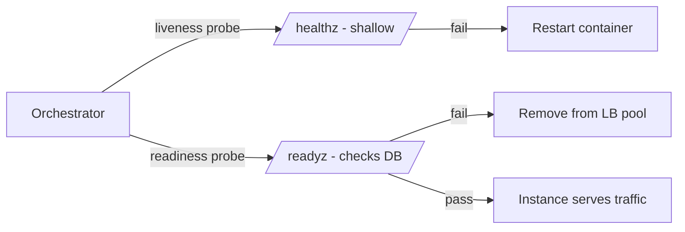

# Health Monitoring — Junior

<!-- level-focus -->
At junior level, focus on this question:

> Given a single service with one database dependency, can you build a `/healthz` liveness endpoint and a `/readyz` readiness endpoint that each report the right thing, and wire them into a Kubernetes probe spec that reacts correctly to a real failure?

Use the smallest realistic scenario that exposes the decision and its failure behavior.

---

## Core Concept 1 — What Health Monitoring Actually Checks

Health monitoring, as this guide uses the term, is not about whether your whole *fleet* is up (that's availability monitoring) or how *fast* an instance responds (that's performance monitoring). It's a narrower question about one running instance: **is this process alive, and is it currently able to do its job?** Those turn out to be two different questions, and conflating them is the single most common beginner mistake.

- **Liveness** — is the process still running and responsive, or has it hung, deadlocked, or entered a state it can never recover from on its own?
- **Readiness** — can this specific instance correctly serve a request *right now*? A process can be perfectly alive (liveness healthy) while still not ready — for example, it hasn't finished connecting to its database yet, or that database has become unreachable.

A third, less common check — **startup** — exists for slow-starting processes: "has this instance finished its one-time boot sequence?" It's a variant of readiness that only matters during the boot window, so the orchestrator doesn't kill a process that's simply still warming up.

## Core Concept 2 — Vocabulary Table

| Term | Question it answers | Who acts on a "no" | Typical action on failure |
|---|---|---|---|
| Liveness | Is the process itself broken beyond self-recovery? | The orchestrator (e.g., the Kubernetes kubelet) | Restart the container |
| Readiness | Can this instance serve traffic correctly right now? | The load balancer / service mesh | Remove the instance from the traffic pool — no restart |
| Startup | Has the one-time boot sequence finished? | The orchestrator, before liveness/readiness checks begin | Wait longer before starting liveness/readiness checks |

The mechanical consequence of confusing liveness and readiness: if a "can I reach the database" check lives in the *liveness* endpoint, a slow database causes the orchestrator to **restart** an otherwise healthy process. Restarting does nothing to fix the database — it just adds restart churn on top of an existing outage, and if every replica does this at once, you can lose the whole fleet to a problem that was never about the app.

## Core Concept 3 — Shallow vs. Deep Checks

- A **shallow check** verifies the process itself can respond — no dependency calls, no I/O beyond returning a fixed response. This is the right shape for liveness.
- A **deep check** verifies one or more dependencies are reachable (a database ping, a queue connection check). This is the right shape for readiness, but only for dependencies this instance genuinely cannot serve *any* request without.

At junior level, keep the rule simple: **liveness is always shallow. Readiness can be deep, but only for the one or two hard dependencies you can name explicitly.**

## Core Concept 4 — Why Two Endpoints Instead of One

It's tempting to build a single `/health` endpoint and point both probes at it. The problem shows up the moment a dependency has a bad few seconds: with one shared endpoint, that dependency's blip is now indistinguishable from the process itself being broken, so the orchestrator does the one thing a dependency outage can never benefit from — it restarts a process that was working fine.



Two endpoints let each signal drive the one action that actually matches what it detected: a broken process gets restarted, and an instance that's alive but temporarily can't reach its database just gets quietly pulled from rotation until it can.

## Core Concept 5 — A Repeatable Method

1. Write down, in one sentence, what "alive" means for your process — usually just "the server is accepting connections and responding."
2. Write down which dependencies, if unreachable, mean this instance truly cannot serve *any* request correctly. That list defines readiness.
3. Implement `/healthz` to check only step 1 — no dependency calls.
4. Implement `/readyz` to check only step 2, with an explicit timeout on every dependency call.
5. Wire both into your orchestrator's probe spec: `livenessProbe` calls `/healthz`, `readinessProbe` calls `/readyz`.
6. Verify each endpoint independently: stop the dependency and confirm `/readyz` turns red while `/healthz` stays green.

## Core Concept 6 — Worked Example: `orders-api`

`orders-api` is a small service backed by a single Postgres database. Here is its health check implementation:

```python
from fastapi import FastAPI, Response
import time

app = FastAPI()
START_TIME = time.time()
STARTUP_GRACE_SECONDS = 5

@app.get("/healthz")
def healthz():
    # Liveness: prove the process can still respond. No dependency calls.
    return {"status": "ok"}

@app.get("/readyz")
def readyz(response: Response):
    # Readiness: can this instance serve a real request right now?
    if time.time() - START_TIME < STARTUP_GRACE_SECONDS:
        response.status_code = 503
        return {"status": "starting"}

    try:
        db_pool.execute("SELECT 1", timeout=1.0)
    except Exception:
        response.status_code = 503
        return {"status": "db_unreachable"}

    response.status_code = 200
    return {"status": "ready"}
```

And the matching Kubernetes probe spec:

```yaml
livenessProbe:
  httpGet:
    path: /healthz
    port: 8080
  initialDelaySeconds: 5
  periodSeconds: 10
  failureThreshold: 3
readinessProbe:
  httpGet:
    path: /readyz
    port: 8080
  periodSeconds: 5
  timeoutSeconds: 2
  failureThreshold: 2
```

Trace what happens under three scenarios:

| Scenario | `/healthz` | `/readyz` | What the orchestrator does |
|---|---|---|---|
| Everything normal | 200 `ok` | 200 `ready` | Nothing — instance serves traffic |
| Postgres is down, app is fine | 200 `ok` | 503 `db_unreachable` | Instance pulled from load-balancer rotation; container is **not** restarted |
| App process is deadlocked | No response / timeout | No response / timeout | Container restarted after `failureThreshold` misses |

This is the entire point of separating the two endpoints: a downstream outage removes the instance from traffic without a pointless restart, and a genuinely broken process gets restarted without the database needing to be involved at all.

## Common Mistakes

- **Putting a database ping in `/healthz` instead of `/readyz`.** This turns every database hiccup into a restart storm across every replica.
- **No timeout on the dependency check.** A `/readyz` call that blocks for 30 seconds on a hung connection makes the probe itself part of the outage.
- **Returning 200 no matter what.** A `/readyz` that always returns `{"status": "ok"}` regardless of dependency state defeats the purpose — broken instances stay in rotation and keep serving failing requests.
- **Skipping the startup grace period.** A freshly started instance that hasn't finished connecting to its database yet fails readiness immediately and gets flagged as broken when it's simply still booting.
- **Checking things that aren't this instance's dependency.** Pinging an unrelated third-party service, or a dependency that only matters for a rarely-used endpoint, doesn't belong in the core readiness check.

## Apply it

1. Pick or stub out a small service with one database or cache dependency, and write down, in one sentence each, what "alive" and "ready" mean for it.
2. Implement `/healthz` so it never calls the dependency — it only proves the process can respond.
3. Implement `/readyz` so it calls the dependency with an explicit timeout (1-2 seconds) and returns a 503 on failure.
4. Write a Kubernetes-style probe spec with two separate blocks — `livenessProbe` and `readinessProbe` — each pointing at the correct endpoint.
5. Simulate a dependency outage (stop the database, block the port, or make a stub return an error) and observe which endpoint goes red and what the orchestrator does in response.

## Verify your work

- `/healthz` returns 200 even while the dependency is down — it never depends on anything external.
- `/readyz` returns 503 within your configured timeout when the dependency is unreachable, and 200 once it recovers.
- The probe spec has two separate blocks, not one shared health path used for both liveness and readiness.
- Killing the dependency does not cause the container to restart — it only removes the instance from the traffic pool.
- Starting a fresh instance during the startup grace period does not immediately fail readiness.

## Review questions

- What is the practical difference between a liveness check and a readiness check?
- Why should a database ping never appear inside a liveness endpoint?
- What does a shallow check verify that a deep check does not, and why must liveness stay shallow?
- What happens to a container when its readiness probe fails, versus when its liveness probe fails?
