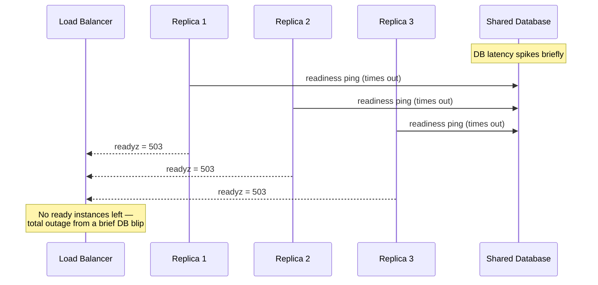

# Health Monitoring — Middle

<!-- level-focus -->
At middle level, focus on this question:

> When your service depends on a database, a cache, and a downstream payment API, which of those belong inside the readiness check versus which should be handled with retries and circuit breakers in request code — and how do you decide without turning one dependency's blip into a fleet-wide outage?

Use the smallest realistic scenario that exposes the decision and its failure behavior.

---

## Core Concept 1 — Not Every Dependency Belongs in Readiness

A junior-level readiness check answers one question per dependency: "is it reachable?" That's correct as far as it goes, but it doesn't say *which* dependencies deserve a place in the check at all. Add too few, and broken instances stay in the traffic pool serving errors. Add too many — or the wrong ones — and a single dependency's blip takes down every replica simultaneously, which is a worse outcome than the blip itself. The middle-level skill is choosing the boundary deliberately instead of reaching for "just check everything I call."

## Core Concept 2 — Hard, Soft, and Optional Dependencies

Classify every dependency your service touches along one axis: *if this dependency is unreachable, can the instance still serve any request correctly?*

| Category | Definition | Belongs in readiness? | Example |
|---|---|---|---|
| **Hard dependency** | The instance cannot serve *any* request correctly without it | Yes | The primary database an `orders-api` instance needs for every read and write |
| **Soft dependency** | Some requests degrade in quality or fall back to a cache/default, but the instance still serves traffic | No — handle with retries, timeouts, circuit breakers in request code | A recommendations cache that, when down, just means slightly worse recommendations, not failed orders |
| **Optional / per-request dependency** | Only some requests use it, and its absence should produce a clean per-request error, not an instance-wide outage | No | A downstream payment gateway called only when an order is placed — most reads never touch it |

Notice that the payment gateway in the level-focus question is a hard dependency *for the specific request path that places an order*, but it is not a hard dependency *for the instance as a whole* — the instance can still serve product lookups, cart views, and order history without it. That distinction is exactly what readiness checks, which are instance-wide, cannot express at request granularity — which is why per-request concerns belong in request-handling code (retries, circuit breakers, graceful fallbacks), not in the readiness check.

## Core Concept 3 — The Cascading-Failure Risk of Deep Checks

The reason this classification matters isn't aesthetic — it's about blast radius. If every replica's readiness check synchronously pings the same shared dependency on the same interval, a single slow response from that dependency can flip every replica to "not ready" within the same few seconds.



Before the DB blip, the system had three working instances and one slow dependency — a degraded-performance problem. After every replica's readiness check fires in lockstep, the system has zero ready instances — a total outage, self-inflicted by the health-check design rather than caused by the dependency itself. This is the core reason deep dependency checks need to be scoped narrowly and, as covered in Core Concept 6, decorrelated across replicas.

## Core Concept 4 — Testability: Exercise Health-Check Logic Without a Real Dependency

A readiness check that's only ever been tested against a live, healthy database has not actually been tested — it's only been observed to work in the one condition that matters least. Test it against failure directly:

```python
def test_readyz_returns_503_when_db_unreachable(client, monkeypatch):
    def fail(*args, **kwargs):
        raise ConnectionError("db unreachable")
    monkeypatch.setattr(db_pool, "execute", fail)

    response = client.get("/readyz")

    assert response.status_code == 503

def test_readyz_returns_200_when_db_healthy(client, monkeypatch):
    monkeypatch.setattr(db_pool, "execute", lambda *a, **k: None)

    response = client.get("/readyz")

    assert response.status_code == 200

def test_healthz_ignores_db_state(client, monkeypatch):
    def fail(*args, **kwargs):
        raise ConnectionError("db unreachable")
    monkeypatch.setattr(db_pool, "execute", fail)

    response = client.get("/healthz")

    assert response.status_code == 200
```

The third test is the one juniors usually skip, and it's the one that actually enforces the liveness/readiness boundary: it proves `/healthz` cannot be dragged down by a dependency failure, regardless of what happens to `/readyz`. Without it, a future refactor could silently move a dependency call into the liveness handler and nothing in the test suite would catch it.

## Core Concept 5 — Under- and Over-Application Signals

**Under-application** shows up as a readiness check that always returns 200 regardless of dependency state, or one that only checks that the HTTP server is listening — this is functionally a liveness check wearing a readiness label. Broken instances sit in the load-balancer pool serving errors because nothing ever told the orchestrator to pull them out.

**Over-application** shows up as a readiness check that transitively pings every downstream service the instance ever calls, including soft and optional dependencies, and includes retries and backoff *inside* the probe handler itself (which makes the probe slow enough to start timing out on its own). The result is Core Concept 3's cascading failure, now triggered by dependencies that were never actually required to serve most requests.

## Core Concept 6 — Decorrelating Checks: Caching and Jitter

Two techniques reduce the odds that a shared dependency's blip takes down every replica at once:

- **Cache the last known dependency state** for a short window (a few seconds) instead of making a fresh call on every single probe hit. Probes fire every few seconds by design; a cached "last successful check was 2 seconds ago" answer absorbs a single transient failure without flapping the instance out of rotation, while still catching a sustained outage on the next real check.
- **Add jitter to the check interval or the cache expiry** so replicas don't all query the dependency at the exact same instant. A small random offset per replica turns "every replica fails together" into "replicas fail across a spread of a few seconds," which gives the load balancer time to react to a gradual reduction in capacity instead of an instantaneous cliff.

Neither technique replaces fixing the underlying dependency issue — they exist to make the health-check layer itself less likely to amplify a transient problem into a synchronized outage.

## Core Concept 7 — Incremental Adoption

Rolling this out on an existing service that currently checks nothing (or checks everything) doesn't need a rewrite in one pass:

1. Start with liveness-only if nothing exists yet — a shallow check that proves the process responds, wired to `livenessProbe`.
2. Add readiness with exactly one hard dependency (usually the primary database), with an explicit timeout.
3. Verify blast radius by killing that one dependency in a staging environment and confirming replicas don't all fail within the same second — add jitter/caching from Core Concept 6 if they do.
4. Only after step 3 holds, consider adding a second hard dependency, re-verifying blast radius each time a new check is added — don't batch several new checks into one change.

## Core Concept 8 — Cross-Component Scenario: `orders-api`

`orders-api` calls three things: Postgres (every read and write), Redis (a product-recommendations cache), and an external payment gateway (only when placing an order).

| Dependency | Category | In readiness? | Handling |
|---|---|---|---|
| Postgres | Hard | Yes, with a 1s timeout and a 3s cached result | — |
| Redis | Soft | No | On miss/timeout, fall back to querying Postgres directly for recommendations; slower, not broken |
| Payment gateway | Optional (per-request) | No | Circuit breaker in the order-placement handler; open circuit returns a clean "payment temporarily unavailable" error to just that request |

With this split, a Redis outage degrades recommendation quality for every instance but takes nothing out of rotation. A payment-gateway outage fails only order-placement requests, cleanly, while product browsing keeps working. Only a Postgres outage — the one dependency nothing can function without — actually pulls instances from the load balancer, and even then, the cached-check-with-jitter approach from Core Concept 6 keeps replicas from all flipping to not-ready in the same instant.

## Common Mistakes

- **Treating "I call it" as equivalent to "it belongs in readiness."** Most dependencies a service calls are soft or optional, not hard — readiness should list far fewer things than the service's full dependency graph.
- **Letting a per-request concern (like the payment gateway) leak into an instance-wide readiness check.** This turns an occasional payment-provider hiccup into an outage for browsing and search too.
- **Testing the readiness handler only against a healthy dependency.** Without an explicit "dependency down" test, the boundary between liveness and readiness can silently erode during a refactor.
- **Adding retries or backoff loops inside the probe handler itself.** This makes the probe slow enough to fail on its own timeout, adding a new failure mode instead of removing one.
- **Rolling out readiness for every dependency in one change.** Without verifying blast radius one dependency at a time, you can't tell which addition introduced a synchronized-failure risk.

## Apply it

1. List every dependency a service you know actually calls, and classify each as hard, soft, or optional using Core Concept 2's table.
2. Write (or update) the readiness check to cover only the hard dependencies, and move soft/optional dependency handling into request-level retries, fallbacks, or circuit breakers.
3. Write the three tests from Core Concept 4 (readyz fails on dependency down, readyz passes on dependency up, healthz ignores dependency state) against your actual handler.
4. Add a short cache window (2-5 seconds) and a small random jitter to your readiness check's dependency call, and explain in one sentence what failure mode each one is meant to prevent.
5. In a staging or local environment, kill your one hard dependency and observe whether replicas fail within the same second or spread out — adjust the cache/jitter values if they don't spread.

## Verify your work

- Your readiness check's dependency list is shorter than your service's full list of things it calls — soft and optional dependencies are visibly absent from it.
- The three tests from Core Concept 4 exist and pass, including the one proving `/healthz` is unaffected by dependency failure.
- Killing the hard dependency in your test environment does not fail every replica within the same probe cycle — you can point to the spread in fail times as evidence, not just assume it.
- You can name, for at least one soft or optional dependency, exactly where its failure is now handled (a fallback, a circuit breaker) instead of being absent entirely.

## Review questions

- What distinguishes a hard dependency from a soft dependency, and why does only the hard one belong in a readiness check?
- Why can a health check that pings every downstream dependency cause a worse outage than the dependency failure it was checking for?
- What does caching a readiness check's last result protect against that a fresh check on every probe hit does not?
- Why is testing `/healthz` against a failing dependency necessary, even though `/healthz` should never call that dependency at all?
