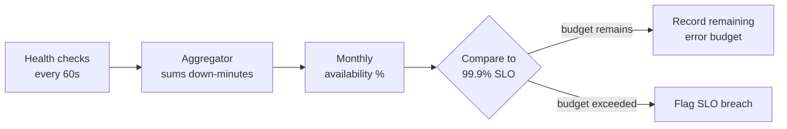

# Availability Monitoring — Junior

<!-- level-focus -->
At junior level, focus on this question:

> Given a month of health-check results for one service, how do you calculate its actual availability percentage and check it against a 99.9% target?

Use the smallest realistic scenario that exposes the decision and its failure behavior.

## 1. Vocabulary you need before doing any math

Availability monitoring answers one question over a time window: **what fraction of that window was the service actually capable of serving requests correctly?** It is not the same as the per-instance health check that produces the raw yes/no signal (that mechanism belongs to Health Monitoring) — availability monitoring is what you build on top of many of those checks, aggregated over time, and judged against a target.

Three terms get used loosely in conversation but mean specific, different things:

- **SLI (Service Level Indicator)** — the actual measured number, e.g. "99.87% of one-minute health checks passed in March."
- **SLO (Service Level Objective)** — the internal target you hold the team to, e.g. "99.9% monthly availability." This is a design input, not a hope.
- **SLA (Service Level Agreement)** — an external, often contractual, promise to a customer, usually set *looser* than the internal SLO so there is margin before a breach costs money or reputation.

A concrete example: a team might target an internal SLO of 99.9%, while the customer-facing SLA only promises 99.5% with service credits below that. The gap between SLO and SLA is deliberate slack, not measurement error.

## 2. The "nines" table — what a target actually allows

The single most useful thing a junior engineer can memorize is what each availability target permits, in real minutes, over real time windows. Percentages hide magnitude; minutes don't.

| Target | Allowed downtime / 30-day month | Allowed downtime / year |
|---|---|---|
| 99% | 432 min (~7.2 hours) | 5,256 min (~87.6 hours / 3.65 days) |
| 99.9% | 43.2 min | 525.6 min (~8.76 hours) |
| 99.95% | 21.6 min | 262.8 min (~4.38 hours) |
| 99.99% | 4.32 min (~259 sec) | 52.56 min |
| 99.999% | 0.432 min (~26 sec) | 5.256 min |

Derivation is simple arithmetic: a 30-day month has 43,200 minutes. Allowed downtime = `(1 − target) × total_minutes`. For 99.9%: `(1 − 0.999) × 43200 = 43.2` minutes. Do this calculation yourself once with a calculator before trusting the table — it removes the mystery from "the nines."

The practical lesson: moving from 99.9% to 99.99% is not "a little better," it is a **10x reduction in your entire month's downtime budget**, from 43.2 minutes to 4.32 minutes. Treat every additional nine as an order-of-magnitude harder engineering commitment, not a rounding change.

## 3. The step-by-step method

1. **Define "down" precisely, in writing, before an incident happens.** A common definition: the service is "down" for a given minute if the fraction of health checks (or synthetic transactions) failing in that minute exceeds a threshold, sustained for at least N consecutive checks (to avoid counting a single transient blip as an outage). The exact detection mechanism is Health Monitoring's job; availability monitoring consumes its output.
2. **Pick a measurement window and granularity.** Common choice: checks every 60 seconds, aggregated by calendar month or a rolling 30-day window.
3. **Sum total minutes marked "down"** across the window from the raw check history.
4. **Compute availability:** `availability % = (total_minutes − down_minutes) / total_minutes × 100`.
5. **Compare against the SLO/SLA target and compute the remaining error budget:** `remaining_budget_minutes = allowed_down_minutes − actual_down_minutes`. A positive number means you have budget left; negative means the SLO was breached this window.

## 4. Worked example

A service is checked every minute. March has 31 days = 44,640 minutes. The SLO is 99.9%, which allows `(1 − 0.999) × 44640 = 44.64` minutes of downtime.

Incident log for the month:

| Date | Event | Down minutes |
|---|---|---|
| Mar 3 | Database failover, degraded responses | 18 |
| Mar 17 | Brief connectivity blip | 2 |
| Mar 17 | Follow-on outage after failed rollback | 25 |

Total down minutes = `18 + 2 + 25 = 45`.

Availability = `(44640 − 45) / 44640 × 100 = 99.8992%`.

Remaining budget = `44.64 − 45 = −0.36` minutes. **The SLO was breached** — by less than a minute, but breached. This is the trap: if you round the availability figure to two decimal places for a dashboard, `99.8992%` rounds to `99.90%`, which *looks* like the target was hit. Always compare consumed minutes against the budget in minutes, not the display-rounded percentage, when deciding pass/fail.

## 5. From many instance checks to one aggregate number

A production service is rarely one instance — it is a fleet of N instances behind a load balancer, each with its own health check running independently. Availability monitoring's job is to turn those N parallel per-instance signals into a single **service-is-up or service-is-down** verdict for each minute, before that verdict ever gets summed into a monthly percentage. The most common rollup rule is threshold-based: the service is considered "down" for a given minute if the fraction of *healthy* instances drops below a minimum serving capacity (e.g., fewer than 50% of instances passing their health check), not merely if a single instance fails.

Worked illustration: a fleet of 10 instances, checked every minute. At minute 14:32, 3 instances fail their check. If the rollup rule is "down only when fewer than half the fleet is healthy," this minute is **not** counted as down — 7 of 10 instances (70%) are still healthy, well above the 50% threshold, even though 3 individual health checks failed. The per-instance signal is a Health Monitoring concern; deciding *how many failing instances constitute a service-level outage* is the availability-monitoring decision, and it must be written down alongside your "down" definition from section 3. A rollup threshold set too low (treating any single instance failure as a full outage) will report outages that no customer actually experienced; a threshold set too high (say, only counting it down when 100% of instances fail) will hide real, partial degradation from your monthly number.

## 6. Common junior mistakes

- **Trusting the rounded percentage instead of the minutes.** As shown above, a near-miss breach can look like a pass once rounded to two decimals. Compute and compare in minutes.
- **Treating missing monitoring data as uptime.** If the health-check pipeline itself has a gap (no data for 20 minutes because the checker crashed), that is *unknown*, not *available*. Silently counting gaps as "up" inflates your number and hides real outages that happened to coincide with the gap.
- **Ignoring measurement granularity.** A 60-second check interval cannot detect — and therefore cannot count — an outage shorter than about one interval. The smallest outage you can measure is bounded by how often you check. This is fine to accept, but it must be a stated limitation, not an unexamined assumption.
- **Deciding after the fact whether maintenance counts as downtime.** Decide the policy on planned-maintenance windows before the incident, and record it in the same place as the "down" definition. Deciding afterward, based on which answer makes the number look better, defeats the purpose of measuring at all.
- **Comparing raw percentages across months of different lengths without normalizing.** A 28-day February and a 31-day March have different total minutes; comparing bare percentages can mislead. Compare consumed-budget minutes, or normalize to a fixed-length window (e.g., a rolling 30-day window) instead.

## 7. Success criteria

- You can state the result two ways that agree: as a percentage, and as "X minutes down out of Y allowed."
- Your written definition of "down" (threshold, consecutive-check requirement, maintenance-window policy) was fixed *before* you started counting, and the same definition was applied to every incident in the window.
- Re-running your calculation from the raw check log reproduces the reported percentage exactly — no manual adjustments, no discretionary exclusions.

## Apply it

1. Build a synthetic log of one-minute health-check results for a 30-day month (43,200 rows of pass/fail), injecting at least three outages of different lengths (e.g., 5, 12, and 30 minutes) and one 15-minute gap where no check ran at all.
2. Write down your definition of "down" (failure threshold, consecutive-check rule) and your policy for the data gap, before you calculate anything.
3. Compute total down-minutes, availability percentage, and remaining error-budget minutes against a 99.9% SLO.
4. Recompute the percentage rounded to two decimal places and compare it to the exact figure — check whether rounding would have hidden a breach.
5. Write a two-line report: the availability percentage, and whether the SLO was met, using minutes (not the rounded percentage) as the deciding evidence.

## Verify your work

- Re-deriving the percentage from the raw pass/fail log matches the number in your report exactly.
- The data-gap minutes are visibly excluded from "uptime" in your calculation, not silently counted as available.
- Your report states the result in both percentage and minutes, and the pass/fail decision is based on minutes.
- Changing the consecutive-check threshold in your "down" definition changes the down-minute count in a way you can explain, not just observe.

## Review questions

- Why can a service show "99.90%" on a rounded dashboard while its exact availability breached a 99.9% SLO?
- What should a gap in monitoring data count as, and why is counting it as uptime a mistake?
- Why does a 60-second check interval put a floor on the shortest outage you can detect?
- What must be decided before an incident happens, rather than after, when computing a monthly availability number?
