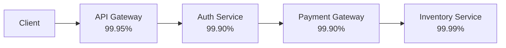
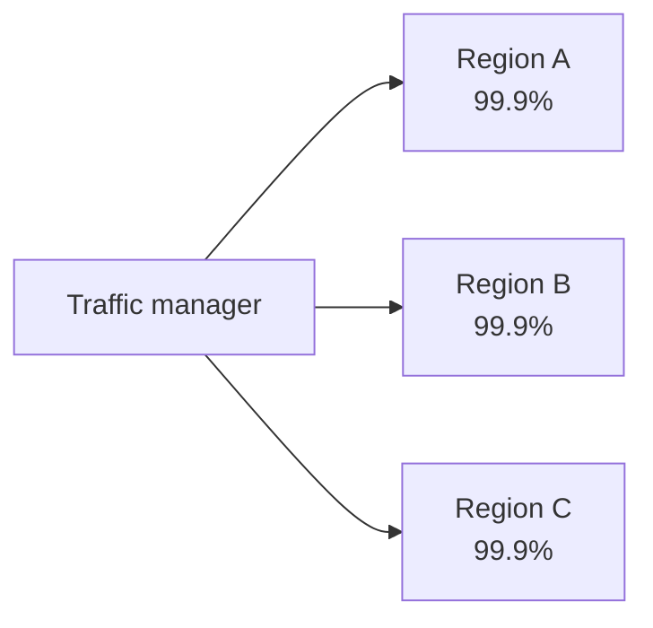

# Availability Monitoring — Middle

<!-- level-focus -->
At middle level, focus on this question:

> When a user-facing flow depends on several components, how do you roll up their individual availability numbers into one composite figure, and does the answer change if the components are redundant instead of dependent?

Use the smallest realistic scenario that exposes the decision and its failure behavior.

## 1. Two composition models, and why they give opposite answers

A single-service availability number (junior level) is rarely what a customer experiences. Real user flows cross several components, and how those components are wired together determines whether their individual availabilities *multiply against you* or *protect each other*. There are exactly two shapes to reason about:

- **Series (dependency chain).** The flow only succeeds if *every* component in the chain succeeds. Composite availability is the **product** of each component's availability: `A_total = A_1 × A_2 × ... × A_n`.
- **Parallel (redundancy).** The flow succeeds if *at least one* of several equivalent components succeeds (active-active regions, redundant instances behind a load balancer with automatic failover). Composite availability is: `A_total = 1 − (1 − A_1)(1 − A_2)...(1 − A_n)`.

The two formulas move in opposite directions as you add components: chaining components **always drags availability down** below the weakest link; adding redundant parallel paths **always pushes availability up** above the best single path (assuming independent failures — a load-bearing assumption revisited at senior level).

## 2. Worked example: a checkout flow as a dependency chain

A checkout request passes through four components, each independently measured over the same month:

| Component | Measured availability |
|---|---|
| API Gateway | 99.95% |
| Auth Service | 99.90% |
| Payment Gateway (external) | 99.90% |
| Inventory Service | 99.99% |



Every hop is required, so this is a series chain:

```
A_total = 0.9995 × 0.9990 × 0.9990 × 0.9999
        = 0.9985005 × 0.9990 × 0.9999
        = 0.9975020 × 0.9999
        ≈ 0.9974022  →  99.7402%
```

This is the fact that surprises people first encountering composite availability: **the checkout flow's real availability (99.74%) is worse than every single one of its four components' individual numbers.** Each team can honestly report their own SLO is being met, and the customer-facing flow is still degrading. The gap between "each service looks fine" and "the composite flow does not" is exactly the number a middle-level engineer is responsible for surfacing.

Downtime budget check: 99.7402% over a 30-day month (43,200 minutes) allows only `(1 − 0.997402) × 43200 ≈ 112.3` minutes — compare that to the 43.2-minute budget a single 99.9% component gets on its own. The chain has roughly 2.6x the effective downtime of any one link.

## 3. Worked example: multi-region availability as redundancy

Now contrast with a redundant deployment: the same service runs active-active across three regions, each independently measured at 99.9% (43.2 min/month allowed downtime each), fronted by a traffic manager that routes around a failed region.



```
A_total = 1 − (1 − 0.999)(1 − 0.999)(1 − 0.999)
        = 1 − (0.001)^3
        = 1 − 0.000000001
        = 0.999999999  →  99.9999999%
```

On paper this looks almost perfect — nine nines. This is the number you get **only if failures across regions are statistically independent**. In practice they rarely are: a shared DNS provider, a shared cloud control plane, a shared CI/CD pipeline pushing the same bad config to all three regions simultaneously, or a shared upstream dependency (like the Payment Gateway in the chain above) can take down all three regions at once. Treating the parallel formula as ground truth without examining what the regions actually share is the single most common middle-level over-application mistake — the math is correct, the independence assumption behind it usually is not fully true, and the gap between the two is a design question, not an arithmetic one.

## 4. Choosing what to measure, and at what boundary

A middle-level engineer's real job is choosing the **boundary of composition** — which components to include in the rollup and which to treat as a single opaque node — and the **measurement window**. Three concrete decisions come up in almost every design:

- **Rolling window vs. calendar window.** A rolling 28-day (or 30-day) window updates continuously and gives faster feedback; a calendar-month window aligns with billing/reporting cycles but resets budget on the 1st regardless of where you are in an incident. Pick based on what the number is *for*: engineering feedback favors rolling; external SLA reporting favors calendar.
- **Per-component SLOs vs. one flow-level SLO.** Tracking availability per component gives fast, localized signal for on-call, but multiplies the number of dashboards and alerts a team must maintain — over-application shows up as an on-call rotation drowning in per-endpoint pages for components that don't actually threaten the customer-facing flow. Under-application shows up as a single opaque "is checkout up" number that cannot tell you *which* dependency is degrading when it breaches.
- **Where to draw the boundary of "the service."** Should the composite availability calculation include a third-party payment gateway you don't control? Excluding it hides real customer impact; including it means your own SLO is now hostage to a vendor's incident. The common practice is to track it in the *composite customer-facing number* but exclude it from the *team's own SLO* used for internal accountability, and to hold a separate contractual expectation (their SLA) against it.

## 5. Incremental adoption

Composite availability is not something to introduce all at once across an organization. A workable sequence:

1. Start with each component team publishing its own SLI/SLO (junior-level work), independently.
2. Identify the two or three customer-facing flows that matter most, and manually map their dependency chains — most teams are surprised by how long the chain actually is once drawn out.
3. Compute the composite number for one flow, using the series formula, from existing per-component data — no new instrumentation needed at this stage.
4. Only after the composite number has been produced and reviewed a few times, invest in automating the rollup and any redundancy modeling, and only for flows where the manual exercise showed a meaningful gap between component-level and composite-level availability.

Skipping straight to an automated multi-region composite pipeline before anyone has manually verified the dependency chain and the independence assumption is a common source of a composite number the team trusts but cannot explain when a customer disputes it.

## 6. Verification: unit level and integrated-flow level

Composite availability claims need two distinct kinds of verification, and conflating them is a common error:

- **Unit level** — verify each component's own SLI computation independently: does its down-minute count reproduce from its own raw check data (this is the junior-level check, applied per component)?
- **Integrated-flow level** — verify the *composed* number against an independent signal, not just recomputed arithmetic. Two useful cross-checks: (a) run an end-to-end synthetic transaction through the whole flow and compare its measured availability to the arithmetic composite — a persistent gap usually means an untracked dependency is missing from the chain; (b) compare the composite number against real-user-monitoring-derived success rate for the same flow over the same window — a gap here usually means the "down" definition differs between synthetic checks and real traffic (e.g., synthetic checks a happy path that skips a step real users hit).

A composite number that has never been checked against an independent end-to-end signal is an assumption, not a measurement.

## Apply it

1. Pick a real multi-step flow in a system you know (checkout, login, search) and draw its actual dependency chain, marking which hops are series (required) and which have redundant/parallel paths.
2. Pull or estimate each component's independent monthly availability, and compute the composite using the correct formula for each segment (series where required, parallel where redundant).
3. Identify one shared dependency (DNS, auth, a common database, a cloud region) that could violate the independence assumption behind any parallel segment, and note what correlated-failure risk it introduces.
4. Decide, and write down, whether a third-party dependency in the chain is included in the customer-facing composite number, the team's own SLO, or both.
5. Cross-check the computed composite against one independent signal — an end-to-end synthetic transaction or real-user success rate for the same window — and reconcile any gap.

## Verify your work

- The composite number changes correctly when you swap a segment from series to parallel math, and you can explain why the direction of the change is what it is.
- The dependency-chain diagram and the arithmetic agree — no component contributes to the formula that isn't shown in the diagram, and vice versa.
- The independent cross-check (synthetic or real-user data) is within an explainable margin of the arithmetic composite, or the gap is attributed to a specific named cause.
- A teammate unfamiliar with the flow can follow your diagram and formula and arrive at the same composite number.

## Review questions

- Why does chaining four components at 99.9%+ each still produce a composite availability worse than any one of them?
- What assumption does the parallel-redundancy formula make that is often false in a real multi-region deployment?
- How would you decide whether a third-party dependency belongs inside your team's own SLO or only inside the customer-facing composite number?
- What independent signal would you use to check whether a composite availability calculation is missing a dependency?
