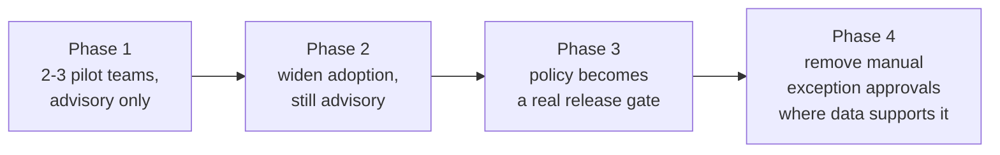

# Availability Monitoring — Professional

<!-- level-focus -->
At professional level, focus on this question:

> How do you operate error-budget policy as a durable, evidence-based governance mechanism across many independently-owned teams and services, without a central authority enforcing every decision?

Use the smallest realistic scenario that exposes the decision and its failure behavior.

## 1. From a number to an operating model

Everything at junior through senior level produces a *correct number*: an availability percentage, a composite across dependencies, a burn rate. The professional-level problem is different in kind: **how does that number change what forty independently-owned teams actually do, on an ordinary Tuesday, without a central team reviewing every decision?** A number nobody acts on is a report. A number that automatically constrains a specific decision — "can we ship this risky change today" — is a governance mechanism. The job is building the latter without building a bureaucracy that has to approve it.

The standard mechanism for this is **error-budget policy**: a pre-agreed, written rule that converts "remaining error budget" into a concrete constraint on team behavior — most commonly, "when the error budget for a service is exhausted, that team's release velocity for risky changes is throttled until the budget recovers, until an agreed exception is granted." The policy only works as governance if it is agreed *before* anyone's budget is at stake, applies mechanically rather than by negotiation in the moment, and has a legitimate, pre-defined exception path — otherwise it either gets ignored under pressure or becomes a political fight every time it matters.

## 2. Ownership boundaries and where cognitive load actually sits

Aligning the architecture with team ownership means being explicit about who owns what part of the pipeline, because availability monitoring spans a boundary that is easy to get wrong:

| Responsibility | Owner | Why |
|---|---|---|
| Defining "down" and the SLO target for a service | The service team | They understand the failure modes and user impact of their own service |
| Health-check / synthetic-check execution | The service team (or a shared library they adopt) | Local to the service's own runtime and dependencies |
| Aggregation pipeline, composite rollup, burn-rate computation | A platform/observability team | Shared infrastructure; duplicating this per team is waste and produces inconsistent math across the org |
| Error-budget policy (the throttling rule itself) | Jointly agreed, org-level, applied per-team | Must be consistent enough to be fair across teams, but the *target values* still belong to each team |
| Incident response and remediation | The service team | They are the only ones who can actually fix their own service |

The recurring mistake is putting the platform team in charge of the *targets* (SLOs) rather than only the *tooling* (rollup, burn-rate math, dashboards). A platform team that sets other teams' availability targets has taken on accountability for outcomes it cannot control, and the service teams lose the ownership that makes the number meaningful to them in the first place. The platform team should own the pipe; each service team should own the target flowing through it.

## 3. Decomposing the rollout into reversible, observable increments

Rolling out org-wide error-budget policy in one step — mandating it for all services simultaneously with real consequences from day one — reliably fails, because the first team to hit an exhausted budget under a brand-new, untested policy becomes a fight about whether the policy is legitimate, not about their reliability. A workable phased sequence:

- **Phase 1 — pilot, advisory only.** Two or three volunteer teams define SLOs, get the rollup pipeline wired up, and the burn-rate policy *reports* what it would have done, without actually blocking anything. This phase's exit condition is evidence the pipeline's numbers are trustworthy (senior-level reconciliation against an independent source) and that the pilot teams understand and endorse the policy's mechanics.
- **Phase 2 — widen, still advisory.** More teams onboard using the pilot's playbook; the policy still doesn't block releases, but its "would have throttled you" signal is now visible in retros. Exit condition: a measurable number of near-miss or actual incidents where the policy's signal would have caught the problem in advance, reviewed and endorsed by the teams who experienced them.
- **Phase 3 — real gate.** The policy becomes an actual constraint — exhausted budget throttles risky deploys — starting with the teams who went through phases 1–2 and already trust the numbers. Exit condition: at least one full quarter where the gate fired, teams followed it without needing a manual override, and no team disputes the underlying number.
- **Phase 4 — reduce manual overhead.** Where data from phase 3 shows the exception path is rarely needed and the underlying numbers hold up under audit, streamline or automate what previously required a human approval step.

Each phase is reversible — if a phase reveals the numbers are not trustworthy, or the policy causes more disruption than the incidents it prevents, the org can roll back to the previous phase without having bet the whole rollout on the outcome.

## 4. Migration, governance, and compliance risk specific to this domain

- **Legacy services with no defined SLI at all.** Before an old service can participate in org-wide policy, someone has to retrofit a "down" definition onto a system that was never built with one. Treat this as its own tracked migration item per legacy service, not an assumption that "it'll get the same treatment as everything else."
- **Contractual SLAs with financial consequences.** A customer-facing SLA that carries service credits or penalties is a *legal* commitment, not just an engineering target. Any internal error-budget policy must be checked against the SLA's actual wording — an internal policy that is looser than the contractual SLA creates real financial exposure, and one dramatically tighter than necessary can throttle releases for no contractual benefit. Reconciling the two is a cross-functional exercise with legal/commercial stakeholders, not a purely engineering decision.
- **Cross-team dependency chains and budget attribution.** When Team A's error budget burns because Team B's shared dependency degraded, a naive policy throttles Team A for a problem it didn't cause and can't fix. The governance mechanism needs an explicit **attribution and escalation path**: when a burn event is traced to an upstream dependency, the throttle (and the incident accountability) should transfer to the owning team, not stay pinned to whoever happened to be measured. Without this, teams downstream of unreliable shared infrastructure learn to distrust the whole policy.
- **Coordination cost of a shared rollup pipeline.** A single platform-owned aggregation pipeline serving every team's SLOs is a single point of organizational dependency — if it goes down or its schema changes, every team's policy enforcement is affected simultaneously. Treat changes to the shared pipeline itself with the same change-management rigor as any other shared production dependency, including its own availability target.

## 5. Outcome measures and evidence-based exit conditions

The rollout is not "done" because a milestone date passed; it is done when the following are true and demonstrated, not asserted:

| Measure | What it demonstrates |
|---|---|
| % of production services with a defined SLI/SLO | Coverage of the governance mechanism |
| % of services whose composite/rollup number reconciles with an independent source within an agreed tolerance | Trustworthiness of the underlying data (senior-level reconciliation, applied at scale) |
| Number of incidents where burn-rate alerting fired before, not after, customer-visible impact | The mechanism is catching real problems, not just reporting after the fact |
| Number of times the release-gate policy fired and was followed without a dispute over the underlying number | Legitimacy — teams trust the number enough to act on it without litigating it each time |
| Frequency and resolution time of cross-team budget-attribution escalations | Whether the attribution path (section 4) is actually working, not just documented |

The exit condition for calling any phase complete should be stated as one of these measured outcomes crossing an agreed threshold — never as a calendar date alone. A rollout that hits its target date but has never once had its numbers reconciled against an independent source has not actually earned trust; it has just consumed time.

## 6. Cross-team contracts and accountability

Two written contracts make the system operable at scale without a central approver in every loop:

- **The team-to-platform contract**: what the shared aggregation pipeline guarantees (data freshness, its own availability target, how definition changes are versioned and communicated) and what each service team is responsible for supplying (correctly instrumented checks, a defined "down" threshold, an on-call path). This is the interface that lets the platform team scale to many consumers without becoming a bottleneck for every team's onboarding.
- **The team-to-team dependency contract**: when Team A depends on Team B's service inside a composite flow, both teams agree in advance what availability Team B's dependency is expected to sustain, and what happens to Team A's own error-budget policy when Team B's degrades. This is what makes the attribution and escalation path in section 4 executable instead of theoretical — it exists as an agreed document before the first dispute, not improvised during one.

Accountability follows the same split as ownership in section 2: a service team is accountable for its own SLO and incident response; the platform team is accountable for the correctness and availability of the shared pipeline; nobody is accountable for a number they don't control, and the contracts are what make that boundary explicit and enforceable rather than assumed.

## 7. A sustained-delivery scenario, not a static target

Consider a platform team tasked with rolling standardized availability monitoring out to 40 services over two quarters, replacing a patchwork of ad hoc dashboards. The static-target framing — "all 40 services have an SLO by end of Q2" — invites teams to satisfy the letter of the mandate with a copy-pasted, unexamined SLO that nobody trusts or acts on. The sustained-delivery framing instead tracks, every few weeks, the outcome measures in section 5 across the growing set of onboarded services: is the reconciliation rate holding as more (and more heterogeneous, more legacy) services join; is the number of cross-team attribution disputes rising or falling as more dependency contracts get written; is burn-rate alerting catching real incidents early on the newly onboarded services, or is it silent because their thresholds were copy-pasted without thought.

That ongoing measurement — not the one-time milestone of "40/40 onboarded" — is what tells the platform team whether the initiative is actually working, and it is what lets the rollout continue to adapt (tightening a threshold here, renegotiating a dependency contract there, pausing onboarding of a batch of legacy services until their "down" definitions are retrofitted properly) without needing to restart the whole program from a plan written on day one.

## Apply it

1. Draft an error-budget policy document for a hypothetical org: the throttling rule, the exception path, and who has authority to grant an exception — before naming any specific team it applies to.
2. Design the four-phase rollout (pilot/advisory, widen/advisory, real gate, reduced overhead) for a specific set of 4-6 services, with a named, measurable exit condition for each phase.
3. Write the team-to-platform contract: what the shared rollup pipeline guarantees, and what each onboarding service team must supply before its SLO participates in the policy.
4. Design the cross-team budget-attribution escalation path for a case where Team A's error budget burns because of Team B's shared dependency, including who re-assigns the throttle.
5. Define the five outcome measures from section 5 for your specific rollout, with the actual threshold value that would make you call each phase complete.

## Verify your work

- Each phase of the rollout has a named owner, a stated rollback path if the numbers prove untrustworthy, and an exit condition tied to a measured outcome, not a date.
- The team-to-platform and team-to-team contracts exist as written documents that predate the first real dispute they would need to resolve.
- The budget-attribution escalation path has been exercised at least once (in a game day or a real incident) and produced the correct throttle reassignment.
- The five outcome measures are being tracked continuously, not calculated once at the end of the initiative, so the rollout's health is visible before its final deadline.

## Review questions

- Why does an error-budget policy fail to function as governance if it is negotiated case-by-case rather than agreed in advance?
- Why should a platform team own the rollup pipeline but not the SLO targets flowing through it?
- What happens to trust in the policy if a team's error budget is throttled for an outage caused by an upstream dependency it doesn't own?
- Why is "all services onboarded by the deadline" an insufficient exit condition for a monitoring rollout, and what should replace it?
