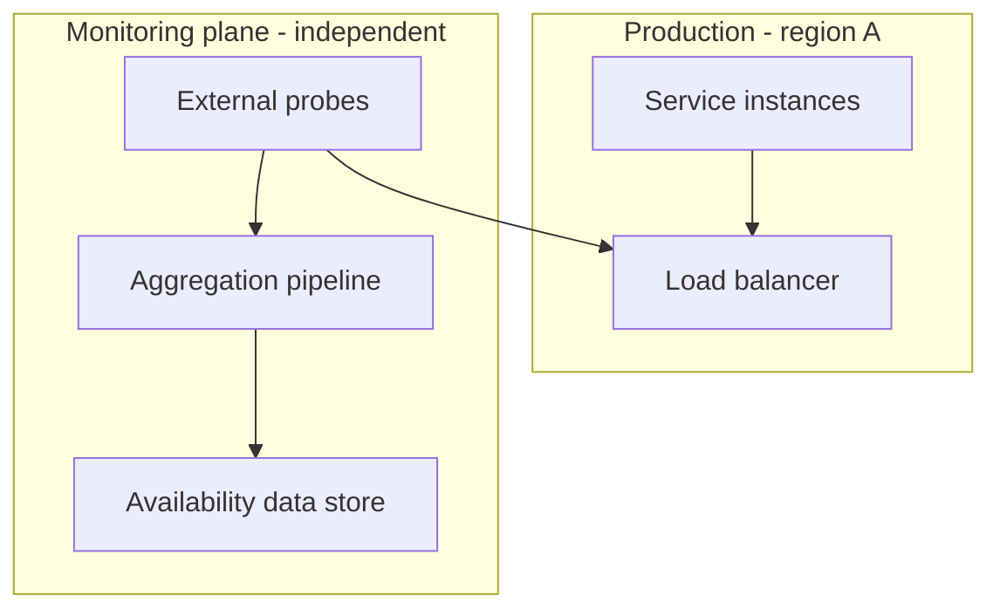
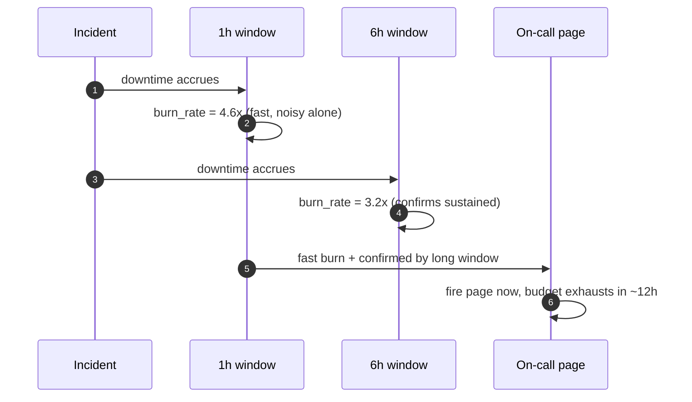

# Availability Monitoring — Senior

<!-- level-focus -->
At senior level, focus on this question:

> How do you design an availability-monitoring architecture so that a failure in the monitoring pipeline itself, or a regional outage hidden inside a global composite, does not get silently reported as normal?

Use the smallest realistic scenario that exposes the decision and its failure behavior.

## 1. The invariant that matters more than the formula

The middle-level composition formulas (series/parallel) are correct arithmetic, but they assume the *inputs* to the formula are trustworthy. A senior engineer's job is to design the system that produces those inputs so that its own failure modes do not corrupt the number it reports. The invariant to hold above all others:

> **Missing data must never be interpreted as "available."** A gap must be reported as *unknown*, propagated as *unknown* through every aggregation, and never silently defaulted to "up."

This sounds obvious stated directly, but it is routinely violated by the most natural implementation: a rollup job that computes `availability = (checks_passed) / (checks_expected)` and simply skips periods with zero recorded checks, because `0/0` is undefined and gets filtered out of the denominator. The result is a system that reports a *higher* availability the more completely its own monitoring pipeline failed — the worst possible failure mode, because it is invisible to everyone who only looks at the reported number.

## 2. System boundary: the monitoring plane must be an independent failure domain

The second invariant follows directly from the first: **the availability-monitoring pipeline must not share a failure domain with the service it measures.** If the health-check aggregator, the metrics store, and the alerting path run in the same region, on the same cluster, behind the same load balancer as the production service, then the exact outage you most need visibility into is the one most likely to take your visibility down with it.



The design question this raises in practice: where do probes originate, where does the aggregation pipeline run, and where is the resulting availability data stored, relative to every failure domain of the thing being measured? A probe that originates inside the same region as the service under a region-wide network partition will report "can't reach anything," which is at least honest (an outage is visible as missing/failing data) — but only if the aggregation and storage of that signal survive the same partition. If the aggregator itself lives in the affected region, the last thing recorded before the gap may be "100% healthy," and the gap that follows may get treated as recoverable noise rather than an ongoing incident.

## 3. Composite masking: a regional outage disappearing inside a global number

This is the sharpest version of the "hidden gap" problem, and it is specific to availability monitoring (as opposed to health monitoring): a global composite computed as a **traffic-weighted average** across regions can look fine while one region is fully down, if that region carries a small enough share of total traffic.

Concrete case: three regions carry 70% / 20% / 10% of global traffic respectively, each normally at 99.9%. Region C (10% of traffic) goes fully to 0% availability for the whole month while A and B stay at 99.9%.

```
Global_weighted = 0.70×0.999 + 0.20×0.999 + 0.10×0.000
                = 0.6993 + 0.1998 + 0.0
                = 0.8991  →  89.91%
```

That drop is visible — good — but consider the more dangerous version: Region C is only 2% of traffic and goes fully down for a week (roughly a quarter of the month), while the rest of the month it is healthy:

```
Region_C_month_avg  = 0.75×0.999 + 0.25×0.000 ≈ 0.749
Global_weighted      = 0.70×0.999 + 0.28×0.999 + 0.02×0.749
                    ≈ 0.6993 + 0.27972 + 0.01498
                    ≈ 0.9940  →  99.40%
```

A global weighted number of 99.40% looks like an ordinary, unremarkable month — nowhere near alarming — while an entire region was completely dark for a week. **A single traffic-weighted composite is a real number, correctly computed, and the wrong number to alert on by itself.** The architectural conclusion: publish per-region availability alongside any global composite, and alert on the worst-performing segment, not only the blended average. A composite is a reporting artifact for stakeholders, not a substitute for per-segment visibility for the people who operate the system.

## 4. Burn-rate alerting: turning a monthly budget into an actionable signal

An error budget (junior/middle level) tells you, at the end of the window, whether you passed or failed. On its own it is a poor *alerting* signal — by the time the month is over, it's too late to act. The senior-level refinement is **burn-rate alerting**: measuring how fast the budget is being consumed *relative to a sustainable pace*, so you can page someone while there is still budget left to save.

Define burn rate over a short window as:

```
burn_rate = (fraction of monthly budget consumed in window)
          / (fraction of month elapsed in window)
```

A burn rate of `1.0` means "consuming budget exactly on pace to land at 0% remaining right at month end" — sustainable. A burn rate of `10` means "consuming budget ten times faster than sustainable," i.e., if it continued at that rate the entire month's budget would be gone in a tenth of the month.

Worked example: SLO is 99.9%, monthly budget is 43.2 minutes (from the junior-level nines table). Three days into the month (10% of the month elapsed), an incident has already consumed 20 minutes of downtime — 46% of the *entire month's* budget.

```
burn_rate = 0.46 / 0.10 = 4.6
```

At a sustained burn rate of 4.6x, the remaining 54% of budget would be exhausted in `0.54 / 4.6 ≈ 0.117` — another 11.7% of the month, meaning total budget exhaustion by roughly day 15, halfway through the month. That is exactly the kind of signal you want firing *now*, not a "you breached the SLO" notice on day 31.

The refinement production systems actually use is **multi-window, multi-burn-rate alerting**: pair a short window (e.g., 1 hour) with a long window (e.g., 6 hours or the whole remaining month), and require both to agree before paging, because a short window alone is noisy (a two-minute blip produces a huge short-window burn rate that self-resolves) while a long window alone is slow to fire. Requiring agreement across both windows is what makes burn-rate alerting trustworthy enough to page a human at 3am instead of just logging a data point.



## 5. Recovery and evolution: reconciliation and definition changes

Two failure modes are specific to the *system* rather than any single incident:

- **Reconciliation after a pipeline outage.** When the monitoring plane itself goes down (section 2), the correct recovery is not to leave a permanent gap in the historical record — it is to backfill the gap from an independent secondary source (raw application logs, load-balancer access logs, real-user-monitoring events) once the pipeline recovers, and to mark the backfilled segment as reconstructed rather than directly observed. A design that cannot reconcile after its own outage will have a growing set of "unknown" months that quietly erode confidence in every reported number.
- **Definition changes must not be applied retroactively without a note.** If the team tightens the "down" threshold (say, from 3 consecutive failed checks to 2) partway through a quarter, recomputing prior months under the new definition and presenting them as directly comparable to future months, without disclosure, manufactures a trend that isn't real. Any change to the down-definition, threshold, or measurement window should be versioned and dated, and historical comparisons across a definition change should be flagged as such.

## 6. Evidence that validates the design, not preference

A senior engineer justifies the monitoring architecture with evidence, not intuition:

- **Postmortem cross-reference.** For every real incident in the last few quarters, confirm the availability-monitoring system actually detected it, within an acceptable delay, and that the burn-rate alert (if one should have fired) did fire. An incident the monitoring system missed is direct evidence the design has a blind spot — not a hypothetical one.
- **Independent-source reconciliation.** Periodically compare the computed availability number against a source that does not share the monitoring pipeline's dependencies — support-ticket volume, real-user-monitoring success rate, or a synthetic check run from a completely separate provider. Persistent disagreement is evidence of a design flaw, not noise to be dismissed.
- **Chaos or game-day exercises against the monitoring plane itself.** Deliberately take down the monitoring pipeline's own dependencies (its message queue, its data store, its own network path) and confirm the result is a visible "unknown" state and an alert about the monitoring system, not a silent green dashboard.

## 7. Questions that expose weak assumptions before you build

- If the monitoring pipeline's own data store is unavailable for two hours, what does the dashboard show during that gap — and does anyone get paged about the *monitoring* outage itself?
- Which regions, on their own, could go fully dark without moving the global composite past any alert threshold, given current traffic weighting? Has anyone actually computed that number?
- If the "down" threshold changes next quarter, is there a versioned record of exactly when, and will historical comparisons across that boundary be flagged?
- For the last three real incidents, did the burn-rate alert fire before, during, or only after the fact — and if late or never, why?

## Apply it

1. Take one production service's availability-monitoring setup (or design one for a service you know) and diagram where the probes, aggregation, and storage physically run relative to every failure domain of the monitored service.
2. Compute a traffic-weighted global composite for a hypothetical three-region deployment where one low-traffic region goes fully down for a week, and check whether the resulting number would have crossed any alerting threshold your team currently uses.
3. Implement (or specify precisely, if implementation isn't available to you) a two-window burn-rate check (e.g., 1-hour and 6-hour) against a real or synthetic SLO, and identify the burn-rate multiplier at which it should page.
4. Find, or construct, one past incident and check whether it would have been detected by the current monitoring design within an acceptable delay, and whether any gap in the record was backfilled or left as a silent hole.
5. Write down the one assumption in your current design (independence of regions, monitoring-plane isolation, or definition stability) that has never actually been tested, and design the smallest exercise that would test it.

## Verify your work

- The monitoring-plane failure-domain diagram shows no shared dependency between the probes/aggregator/store and the service under measurement, or every shared dependency is explicitly listed as an accepted risk.
- The traffic-weighted composite calculation for a masked regional outage produces a number you can compare directly against your team's real alert thresholds.
- The two-window burn-rate check pages on a sustained fast burn and does not page on a short, self-resolving blip — verified against at least one synthetic or historical incident in each category.
- At least one real or constructed gap in monitoring data is reconciled from an independent source and explicitly marked as reconstructed, not silently merged into the normal record.

## Review questions

- Why is "missing data treated as available" the single most dangerous failure mode in an availability-monitoring pipeline?
- What traffic-weighting scenario would let a fully-down region hide inside a global composite that still looks healthy?
- Why does a single-window burn-rate alert tend to be either too noisy or too slow, and how does a two-window design fix that?
- What evidence would convince you that your monitoring architecture has a blind spot, as opposed to just an unlucky quarter?
