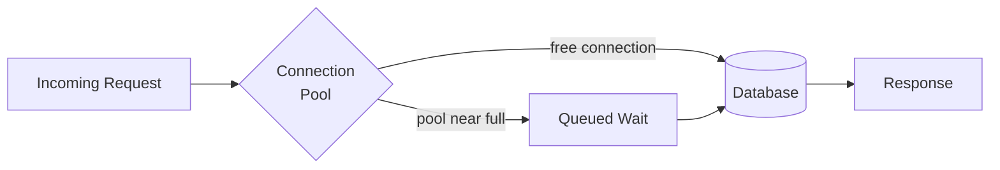

# Performance Monitoring — Junior

<!-- level-focus -->
At junior level, focus on this question:

> For one endpoint, can you measure p50/p95/p99 latency, throughput, and error rate correctly, and explain what each number tells you that an average would hide?

Use the smallest realistic scenario that exposes the decision and its failure behavior.

---

## Core Concept 1 — Vocabulary: Latency, Throughput, Saturation

Performance monitoring answers one question — "is this running service fast enough, right now, under its current load?" — using three families of signal:

- **Latency** — how long one request takes, from the caller's point of view. Never a single number for a service; it's a *distribution*, because some requests are fast and some are slow, and the shape of that distribution is the whole story.
- **Throughput** — how many requests (or events, or jobs) the service handles per unit time, usually written as QPS (queries per second) or RPS (requests per second).
- **Saturation** — how close a resource (CPU, memory, connection pool, queue depth, disk I/O) is to its limit. Saturation is a *leading* indicator: it tends to rise before latency visibly degrades, which is what makes it worth watching separately from latency itself.

These three, together with error rate, form the **RED method** (Rate, Errors, Duration) — a widely used, citable pattern for what to monitor on any request-driven service. Performance monitoring is really "Rate and Duration, read together with Saturation" — errors belong more to correctness/availability monitoring, but you can't interpret latency sensibly without knowing whether requests are also failing.

## Core Concept 2 — Why Percentiles, Not Averages

A percentile answers: "what value does X% of the data fall below?" **p50** (median) is the typical request. **p95** means 95% of requests were faster than this value — the slowest 5% were worse. **p99** is the slowest 1%.

The average (mean) latency is the wrong tool for judging user experience, for one specific reason: it gets pulled toward the bulk of fast requests and hides a bad tail. Take ten requests with latencies (in ms): `10, 12, 11, 9, 13, 10, 11, 12, 10, 400`. The average is 50ms — it looks fine. The p50 is 11ms (accurate for the typical request), and the p99 (effectively the slowest of ten, here the 400ms outlier) shows the actual worst experience anyone had. Nine out of ten users had a great experience; the average blends in the one bad one and reports a number nobody actually experienced.

**A second, easier mistake: averaging percentiles.** If service A reports p99=100ms this minute and p99=300ms next minute, the "average p99 over two minutes" is *not* 200ms — you cannot average an already-aggregated statistic like that and get a meaningful number, because a percentile is derived from an underlying distribution that no longer exists once you've collapsed it to one point. The correct way to combine percentile data across time or across instances is to re-aggregate from the underlying histogram buckets (Core Concept 3), never by averaging the percentile values themselves.

## Core Concept 3 — Histograms Are How Percentiles Get Computed

To compute a percentile after the fact (rather than per-request), a metrics system needs the underlying distribution, not just a rolled-up number. This is what a **histogram** metric type is for: it buckets observed values (for example, `<=10ms`, `<=25ms`, `<=50ms`, `<=100ms`, `<=250ms`, `<=500ms`, `<=1s`, `+Inf`) and counts how many observations fall at or under each bucket boundary. A query engine like Prometheus can then estimate any percentile from those bucket counts using `histogram_quantile`:

```promql
histogram_quantile(
  0.99,
  sum(rate(http_request_duration_seconds_bucket{job="checkout-api"}[5m])) by (le)
)
```

This computes an estimated p99 latency for the `checkout-api` job over a trailing 5-minute window. `le` ("less than or equal") is the bucket-boundary label Prometheus histograms use; summing `rate(...)` by `le` combines counts across all instances of the service before computing the percentile — which is exactly the correct way to combine distributions across replicas, as opposed to averaging each replica's own p99.

## Core Concept 4 — A Repeatable Method

For any one service or endpoint you're asked to monitor for performance:

1. **Pick the unit of work.** One HTTP request, one queue job, one gRPC call — be specific; "the service" is too vague to measure.
2. **Instrument duration as a histogram**, not a single running average, so percentiles can be computed later.
3. **Choose the percentiles that matter for this service.** p50 for "typical," p95 or p99 for "the tail users actually complain about." Very latency-sensitive paths (checkout, login) usually track p99; background batch jobs might only need p50.
4. **Add throughput** (requests per second) alongside latency — a p99 of 200ms at 5,000 QPS and a p99 of 200ms at 5 QPS mean very different things about how much headroom the service has.
5. **Add one saturation signal** for the resource most likely to bottleneck this service — CPU for compute-bound work, connection-pool usage for I/O-bound work, queue depth for async workers.
6. **Define "slow" as a number**, not a feeling — a specific latency threshold at a specific percentile that this service is expected to stay under.

## Core Concept 5 — Worked Example: an Order-Lookup Endpoint

A single endpoint, `GET /orders/:id`, backed by a database read. Over a five-minute window, monitoring reports:

| Metric | Value |
|---|---|
| p50 latency | 18ms |
| p95 latency | 85ms |
| p99 latency | 420ms |
| Throughput | 240 requests/sec |
| Error rate | 0.1% |
| DB connection pool usage | 92% |

Reading this correctly, in order: throughput (240 rps) tells you this endpoint is genuinely busy, not idle. p50 (18ms) says the typical request is fast. p95 (85ms) says one in twenty requests is noticeably slower — still probably fine. p99 (420ms) says one in a hundred requests is 20x slower than typical — worth investigating. The connection-pool usage at 92% is the saturation signal that likely *explains* the p99 tail: when the pool is nearly full, some requests queue waiting for a free connection, and those are exactly the ones landing in the p99 bucket. Error rate stays low, so this isn't a correctness problem — it's a capacity problem showing up first in the tail latency, exactly what saturation-as-leading-indicator predicts.



The fix here isn't "make the query faster" (p50 is already fine) — it's pool capacity, which is a saturation problem, not a latency problem in the query itself. Junior-level judgment is exactly this: reading three or four numbers together instead of reacting to any single one in isolation.

## Common Mistakes

- **Reporting only the average.** As shown above, an average latency can look healthy while a real tail-latency problem exists.
- **Picking one percentile and ignoring the others.** p50 alone hides tail problems; p99 alone can be so noisy (based on very few samples) that it obscures whether the *typical* request is healthy.
- **Reading latency without throughput.** A latency number without traffic volume next to it can't tell you if a service is under real load or nearly idle.
- **Averaging percentiles across instances or time windows.** As shown in Core Concept 2, this produces a number that doesn't correspond to any real distribution.
- **Treating "slow" as a vibe instead of a number.** Without an explicit threshold at an explicit percentile, nobody can agree on when a service has actually crossed into "too slow."
- **Ignoring saturation until latency has already degraded.** By the time p99 latency visibly spikes, a saturating resource has usually been climbing for a while — the earlier signal was there to see.

---

## Apply it

1. Pick one real or practice HTTP endpoint you can generate traffic against (a local service, a sample app, or a public test API with a load-testing tool).
2. Instrument or simulate request duration as a histogram with realistic bucket boundaries (for example `10ms, 25ms, 50ms, 100ms, 250ms, 500ms, 1s`).
3. Generate at least 200 requests with a deliberately skewed distribution (mostly fast, a handful artificially slow) and compute p50, p95, and p99 from the histogram — by hand or with a query like the `histogram_quantile` example above.
4. Compute the average latency for the same data and write one sentence comparing what the average shows versus what p99 shows.
5. Identify one saturation signal for your endpoint (connection pool, thread pool, queue depth) and record its value alongside the latency numbers.

## Verify your work

- Your p50, p95, and p99 values are all different from each other and from the average, proving your test data actually has a tail.
- You can point to the specific request(s) that fall into the p99 bucket and explain, in one sentence, why they were slow.
- Your written comparison correctly states that the average understates the worst experienced latency.
- You have one saturation number recorded (not just latency and throughput) and can state whether it's currently a risk.
- You can state, as a single number at a single percentile, what "slow" means for your endpoint.

## Review questions

- Why does an average latency number hide a real tail-latency problem that percentiles reveal?
- What is wrong with averaging two p99 values from two different time windows?
- Why is saturation described as a leading indicator relative to latency?
- What does a histogram metric type store that a simple running average does not?
