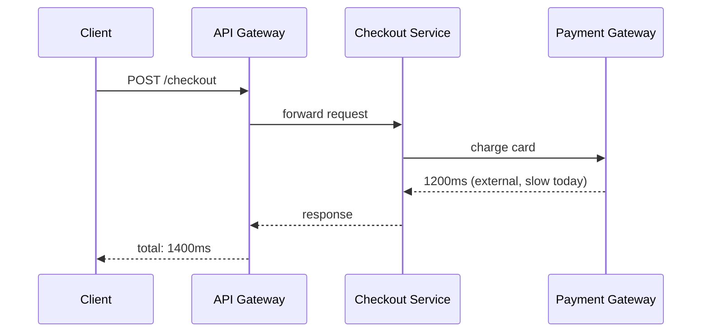

# Performance Monitoring — Middle

<!-- level-focus -->
At middle level, focus on this question:

> Given a service made of several components, which percentile and which time window should you alert on for each one, and how do you keep that choice from either crying wolf or missing a real regression?

Use the smallest realistic scenario that exposes the decision and its failure behavior.

---

## Core Concept 1 — Choosing a Percentile Is a Trade-off, Not a Default

Junior-level work treats "track p99" as a fixed rule. Middle-level work treats the choice of percentile as something to justify per service, because each one trades off differently:

| Choice | Sensitivity | Noise | Best fit |
|---|---|---|---|
| p50 | Reflects the typical request only | Low noise, very stable | Background jobs, internal tools where tail pain is tolerable |
| p90 | Catches a meaningfully wide slice of bad experiences | Moderate | General-purpose default for most user-facing endpoints |
| p95 | Catches the tail without being dominated by rare outliers | Moderate-high | Latency-sensitive user flows (search, checkout) |
| p99 | Catches the true worst case | High — noisy at low request volume, since few samples land in the tail | High-value or high-traffic paths where the last 1% still matters (payments, auth) |

The traffic-volume detail matters more than it looks: a p99 computed over 20 requests a minute is close to meaningless — it's tracking one or two samples, and it will swing wildly minute to minute for no real reason. A p99 computed over 50,000 requests a minute is a stable, trustworthy signal. Before choosing p99 for a low-traffic internal service, check whether there's enough volume in the aggregation window to make it a real percentile rather than statistical noise.

## Core Concept 2 — Choosing a Time Window

The aggregation window (`rate(...)[5m]` vs `[1m]` vs `[15m]`) trades responsiveness against stability the same way the percentile choice does:

- **Short windows** (1m) react fast to real regressions but amplify noise, especially at low traffic — a brief burst of three slow requests can spike the computed percentile even though nothing is systemically wrong.
- **Long windows** (15m, 1h) smooth out noise but delay detection — a real regression that started 10 minutes ago might not yet be visible in a 15-minute rolling average.

A useful middle-level habit: use a shorter window for the number you alert on (so paging is timely) and a longer window for the number you use to judge whether something is a real trend versus a blip on a dashboard. Alerting logic itself should require the threshold to be breached for a sustained period (for example, "p99 > 500ms for 5 consecutive minutes") rather than firing on a single noisy sample.

## Core Concept 3 — Under- and Over-Application Signals

**Under-monitoring performance** shows up as:

- Only one aggregate metric exists for a component that actually serves several very different request shapes (a `/search` endpoint that handles both a one-word query and a twenty-filter query under the same latency metric) — the aggregate hides which shape is actually slow.
- No per-dependency breakdown — a service's own handler latency is indistinguishable from time spent waiting on a downstream call, so a downstream regression looks identical to "our code got slower."
- Saturation isn't tracked at all, so the team only learns about a capacity problem once it's already visible as latency pain.

**Over-monitoring performance** shows up as:

- A percentile metric and an alert defined for every possible label combination (every route × every HTTP method × every status code), producing thousands of low-value time series that make dashboards slow and alerts noisy without adding real signal.
- Alerting on p99 for every internal, low-traffic endpoint where the metric is mostly noise (Core Concept 1), generating pages that get ignored and trained-around.
- Tracking histogram buckets far finer than any decision will ever use — a 50-bucket histogram with boundaries a millisecond apart adds cardinality and storage cost with no corresponding gain in decision quality over an 8-10 bucket histogram.

The signal in both directions is the same: does the metric change what someone would do? If a metric's absence would leave a real regression invisible, that's under-monitoring; if a metric never once changes a decision or triggers an action worth taking, that's over-monitoring.

## Core Concept 4 — Cross-Component Scenario: a Slow Checkout Flow

A checkout flow spans an API gateway, a checkout service, a payment-gateway client, and a database. Latency complaints come in; the dashboard for the checkout service alone shows p99 = 300ms, which looks acceptable. The gap: the *end-to-end* request, as experienced by the caller, includes time in the gateway and the external payment-gateway call, neither of which is visible in the checkout service's own metric.

The checkout service's *own* handler time is genuinely 300ms at p99 — its internal dashboard isn't lying. But the client experiences 1400ms, because 1200ms of that is a slow call to an external payment gateway that the checkout service's own latency metric never separates out from its own processing time. The fix at middle level is instrumenting latency **per hop**, not just per service: the checkout service needs its own handler-only duration metric *and* a separate metric for time spent waiting on the payment-gateway client, so "is it us or a downstream dependency" is answerable from metrics alone instead of a guess.

| Metric | What it isolates |
|---|---|
| Gateway-to-client total latency | The full user-experienced number — what actually gets complained about |
| Checkout service handler-only duration | Time genuinely spent in this team's own code |
| Checkout service → payment gateway call duration | Time spent waiting on a specific downstream dependency |
| Payment gateway's own reported latency (if available) | Confirms whether the slowness originates there or in the network hop to reach it |

## Core Concept 5 — Verification: Unit and Integrated-Flow Levels

Verifying that performance monitoring is actually correct, not just present, happens at two levels:

**Unit level** — for one metric in isolation:
- Confirm the histogram bucket boundaries actually bracket the real observed range (a service with real latencies from 5ms to 2s but buckets that stop at 250ms will silently clip its own tail into one giant "+Inf" bucket, making p99 meaningless).
- Confirm the `histogram_quantile` query correctly aggregates across every replica of the service (summing `rate(...)` by `le` across instances) rather than accidentally scoping to a single pod.
- Load-test the endpoint with a known, deliberately skewed latency distribution and confirm the computed p50/p95/p99 match what was injected within a reasonable margin.

**Integrated-flow level** — for the whole request path:
- Trigger an artificial slowdown in one downstream dependency (a feature flag that adds sleep to the payment-gateway client, in a staging environment) and confirm that both the downstream-specific metric *and* the end-to-end metric move — if only one does, the instrumentation has a gap.
- Confirm the alert that's supposed to fire on this path actually fires within the expected time window under the injected slowdown, not just that the metric exists on a dashboard.
- Check that whichever team gets paged has, from the metrics alone, enough to distinguish "our own handler got slower" from "a downstream dependency got slower" without needing to ask another team first.

## Common Mistakes

- **Judging end-to-end user experience from one component's own metric.** As in Core Concept 4, a healthy-looking component metric can coexist with a genuinely bad user-experienced latency.
- **Picking p99 everywhere regardless of traffic volume.** Low-traffic p99 is noise dressed up as signal, and alerting on it trains people to ignore pages.
- **Alerting on a single noisy sample instead of a sustained breach.** A five-minute blip shouldn't page anyone if it self-resolves before a human could act.
- **Never separating handler time from downstream-wait time.** Without this split, every latency regression looks like "our code," even when it's someone else's dependency.
- **Adding metrics and alerts without ever removing ones that don't inform a decision.** Cardinality and alert fatigue compound quietly until every page gets muted.

---

## Apply it

1. Take a request flow you know that crosses at least two services or one external dependency, and list every hop the request actually takes.
2. For one hop, define separate metrics for "time spent here" versus "time spent waiting on the next hop," and state which one currently exists and which is missing.
3. Choose a percentile and aggregation window for the end-to-end metric, justified by its real traffic volume (state the approximate requests-per-minute you're assuming).
4. Design an alert condition that requires a sustained breach (state the threshold, percentile, and minimum duration) rather than a single sample.
5. Describe an injected-slowdown test (a flag, a delay, a throttle) you could run in a non-production environment to confirm the end-to-end and per-hop metrics both move together.

## Verify your work

- You can name, for your chosen flow, which specific hop is currently invisible to metrics and which team would need to add instrumentation to close that gap.
- Your percentile choice is justified by an explicit traffic-volume estimate, not just "p99 because that's standard."
- Your alert condition includes both a threshold and a minimum sustained duration, not a single-sample trigger.
- You can state, in one sentence, how someone paged by your alert would distinguish "our code is slow" from "a downstream dependency is slow" using only the metrics you defined.
- Your injected-slowdown test targets a real, specific hop, not a vague "simulate high load" description.

## Review questions

- Why can a p99 computed from a low-traffic endpoint be misleading even though the calculation itself is correct?
- Why does a healthy-looking latency metric on one service not guarantee a healthy end-to-end user experience?
- What is the risk of alerting on a single sample instead of requiring a sustained breach over a time window?
- What does splitting handler-only duration from downstream-wait duration let a team determine that a single combined metric cannot?
