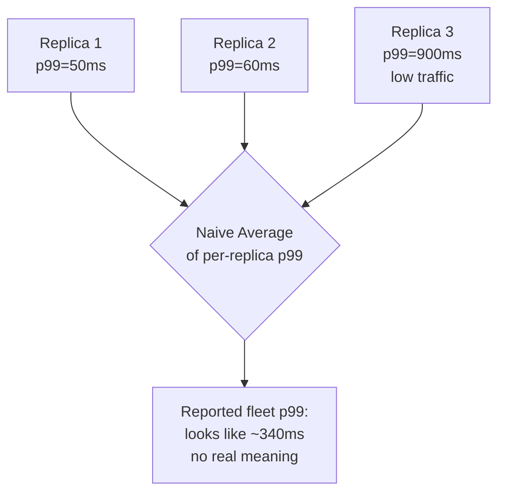

# Performance Monitoring — Senior

<!-- level-focus -->
At senior level, focus on this question:

> What invariant guarantees that your performance-monitoring architecture keeps telling the truth as the system scales, shards, and adds dependencies — and what evidence proves that invariant holds today, not just at design time?

Use the smallest realistic scenario that exposes the decision and its failure behavior.

---

## Core Concept 1 — Anchor Performance Monitoring to Invariants, Not to Dashboards

A middle-level performance-monitoring setup is organized around metrics: this endpoint has a p99, that dependency has a duration histogram. At senior level, the organizing question changes: **which invariant does the monitoring architecture actually guarantee, regardless of which team adds the next service or the next shard?** An invariant is a property that must hold no matter how the system grows — not "endpoint X has a p99 dashboard" but "no meaningful fraction of real request latency can be currently invisible to the metrics that page someone."

Three invariants worth naming explicitly for a performance-monitoring system:

| Invariant | What it rules out |
|---|---|
| Every percentile reported is computed from a distribution with enough real samples to be statistically meaningful | A p99 alert firing (or staying silent) based on two or three noisy data points, mistaken for a real signal |
| Aggregation across instances, shards, or regions never silently averages already-aggregated percentiles | A fleet-wide "p99" that is actually the average of per-instance p99s — a number with no honest interpretation |
| Every hop a request can take has an owner who could, right now, produce that hop's own duration metric | A request path with a component whose latency is structurally invisible because nobody instrumented it and nobody is accountable for noticing |

A dashboard-level setup is *done* when every service has graphs. An invariant-level setup is *done* when every invariant has a *mechanism* enforcing it — a metrics pipeline that rejects sample-starved percentile queries, an aggregation library that only ever combines raw histogram buckets, an ownership map that names who's accountable for every hop.

## Core Concept 2 — Correlated Failure: Metrics That Lie Under Scale

The performance-monitoring failures that cause real incidents rarely come from one engineer forgetting to add a metric. They come from **aggregation math that was correct at one scale and silently wrong at another**:

- **Averaging pre-computed percentiles across replicas.** A fleet of 50 instances each reporting their own p99; a dashboard that averages those 50 p99 values produces a number that corresponds to no real percentile of the actual combined request distribution — it systematically understates the true fleet-wide tail, and gets worse as the fleet grows and instance-level traffic gets thinner.
- **A single low-traffic shard poisoning a fleet-wide percentile.** If one shard receives a tenth of the traffic of the others but its samples are weighted equally in a naive aggregation, a handful of genuinely slow requests on that shard can swing the reported fleet p99 out of proportion to how many real users it affects.
- **Histogram bucket boundaries chosen for yesterday's latency profile.** A service that used to run at 20ms p99 and now runs at 20s p99 (after a dependency was added) still reporting through buckets that top out at 250ms means every slow request past that point collapses into one "+Inf" bucket — the percentile calculation becomes structurally blind to exactly the tail it exists to describe.

None of the individual replicas reported anything false. The failure is in the aggregation step: **averaging percentiles is not a valid operation**, and it degrades quietly — it looks like a number, it moves when something changes, and it will pass a casual review, right up until someone tries to correlate it against an actual user complaint and finds the math never corresponded to reality.

## Core Concept 3 — The Hard Category: the Metric That's Technically There but Practically Useless

A monitoring gray failure here is a metric that exists, is queried by a dashboard, and shows a number — but the number cannot answer the question it's meant to answer:

- A p99 alert on an endpoint that gets four requests a minute: technically computed correctly, practically noise, and either silent when it should page or paging when nothing is wrong.
- A "total request latency" metric on a service that fans out to six downstream calls in parallel: the number is real, but without a per-downstream breakdown it cannot tell an on-call engineer which of the six is responsible for a regression.
- A saturation metric (CPU, queue depth) sampled once every 60 seconds on a resource that can exhaust and recover within 10 seconds: the metric exists, updates, and is simply too coarse in time to ever catch the transient saturation that's actually causing the tail latency.

The senior-level habit is naming not just "does this metric exist" but "**at the granularity, sample rate, and traffic volume this component actually has, can this metric answer the question it's supposed to answer?**" If the honest answer is no, the metric is decorative, and that gap should be named as a finding — the same way an invisible failure mode gets named in availability monitoring — rather than left implicit because a dashboard panel technically renders.

## Core Concept 4 — Evidence Over Assumption

A performance-monitoring architecture validated only by "the dashboards look reasonable" reflects what's easy to graph, not what's actually true about the system. Validate it instead with:

- **Load-test injection with a known ground truth.** Generate synthetic traffic with a deliberately constructed latency distribution (a known p50, p95, p99) against a staging replica of the aggregation pipeline, and confirm the reported percentiles match the injected ground truth within a stated margin — this is the only way to catch an aggregation-math bug like averaged percentiles before it reaches production data nobody can independently verify.
- **Cross-checking against an independent measurement.** Compare the service's self-reported server-side latency against a client-side or edge-measured latency for the same request window; a persistent, unexplained gap between the two usually reveals either a missing hop (Core Concept 2 of the middle guide) or a clock/sampling artifact in one of the two measurement points.
- **Reconciliation against real incidents.** Every performance incident (a user-reported slowdown, a capacity page) should map back to either confirming that the monitoring caught it in time, or exposing a specific gap — a missing per-hop metric, a too-coarse sample rate, a naively aggregated percentile. A performance-monitoring setup with zero incidents ever traced back to a gap in it either belongs to a very young system or hasn't been checked against reality.

Treat every percentile dashboard as a claim with a confidence level: "validated against injected ground truth," "cross-checked against an independent measurement," or "never independently verified, just assumed correct because the query ran." Prioritize verifying the ones the paging policy depends on before trusting them under a real incident.

## Core Concept 5 — Cross-Component Scenario: Choosing an Aggregation Architecture for a Sharded Service

A search service is sharded across 40 instances behind a load balancer, with traffic unevenly distributed (some shards serve popular categories, some serve long-tail ones). Two plausible designs for computing the service's fleet-wide latency percentile:

| Design | Behavior | Trade-off |
|---|---|---|
| **A: Per-instance percentile, then average** | Each instance computes and exports its own p99; a dashboard averages the 40 values | Cheap to compute and simple to reason about at a glance; but mathematically invalid (Core Concept 2) — the result systematically misrepresents the true fleet-wide tail, worse the more uneven the traffic distribution across shards |
| **B: Central histogram aggregation** | Each instance exports raw histogram bucket counts; a central query engine sums buckets across all instances before computing any percentile | Produces a mathematically correct fleet-wide percentile regardless of how unevenly traffic is distributed; costs more at query time (summing high-cardinality bucket series) and requires every instance to export consistent bucket boundaries |

Design A is not simply "wrong but convenient" — the failure grows with the system rather than staying constant, which is exactly what makes it dangerous: it will look adequate during early testing on a small, evenly loaded fleet and only reveal its inaccuracy once traffic becomes genuinely uneven across shards, by which point it's load-bearing in dashboards and alert thresholds that were tuned against its wrong numbers. Design B costs more upfront (consistent bucket boundaries must be a contract every instance honors, and the query engine must scale to sum higher-cardinality series) but the correctness doesn't degrade as the fleet grows or the traffic distribution shifts. The senior-level resolution is to standardize on Design B's raw-histogram-aggregation pattern for anything the fleet will ever alert on, reserving simpler per-instance summaries for local-only debugging views where the imprecision is explicit and never feeds a paging decision.

## Core Concept 6 — Questions That Expose Weak Assumptions

Before trusting a performance-monitoring architecture, ask the questions that surface what hasn't actually been tested:

- "If I fed this pipeline a known, synthetic latency distribution, would the reported percentiles match it?" — most performance-monitoring setups are validated only by "the number looks plausible," never against a ground truth.
- "Is any percentile in this system computed by averaging other percentiles, anywhere in the pipeline?" — this bug hides easily inside a dashboard tool's default aggregation behavior and often isn't a deliberate choice anyone made.
- "At this endpoint's actual traffic volume, does a p99 mean anything, or is it a coin flip on a handful of samples?" — an unexamined answer here means an alert threshold was probably tuned against noise.
- "Which hop in this request's path has no owner who could produce its duration metric today?" — surfaces the invisible-component category from Core Concept 1 before an incident does.
- "Are our histogram bucket boundaries still shaped like this system's *current* latency profile, or like the profile it had a year ago?" — a system that's grown slower or added dependencies often outgrows its own buckets silently.

## Core Concept 7 — Recovery and Evolution

A performance-monitoring architecture is never finished; it needs explicit triggers for revisiting it: sharding or resharding a service (changes what "fleet-wide" aggregation has to handle correctly), adding a new downstream dependency (adds a hop that needs its own duration metric), a sustained multi-fold change in traffic volume (can flip a percentile from "meaningful" to "noise" or vice versa), or an incident where a real user-reported slowdown wasn't visible in any dashboard before the report came in. Treat each of these as a scheduled re-evaluation point, and treat "our dashboards didn't show anything wrong, but users were clearly affected" as a finding to record and act on — usually pointing at exactly one of the gray-failure categories in Core Concept 3 — not an embarrassment to quietly patch and forget.

---

## Real-World Examples

- **A naive average hides a resharding problem.** A service reshards from 10 evenly loaded instances to 40 unevenly loaded ones; the per-instance-average p99 dashboard (Design A) keeps reporting a stable number for weeks while real user-experienced tail latency on the long-tail shards climbs, because the average smooths exactly the imbalance that matters.
- **A ground-truth load test catches an aggregation bug before production does.** Injecting a synthetic distribution with a known p99 of 800ms into a staging copy of the metrics pipeline returns a computed p99 of 340ms — the discrepancy traces to a dashboard tool's default behavior of averaging per-instance percentiles instead of summing raw histogram buckets, caught and fixed before it ever influenced a real alert threshold.
- **A too-coarse sample rate misses transient saturation.** A queue-depth metric sampled once a minute never shows the ten-second saturation spikes that are actually causing periodic p99 latency jumps; only after cross-checking against a client-side latency measurement does the gap surface, prompting a switch to a finer-grained saturation sample.

## Common Mistakes

- **Averaging per-instance or per-shard percentiles instead of aggregating raw histograms.** This is mathematically invalid and the error grows exactly as the fleet becomes less evenly loaded, which is precisely when trustworthy numbers matter most.
- **Trusting a percentile's face value without checking whether the traffic volume behind it makes it meaningful.** A p99 built from a handful of samples is noise wearing the shape of a signal.
- **Leaving hops in a request path with no owner and no duration metric.** These are invisible right up until an incident forces someone to trace the path by hand.
- **Never validating the aggregation pipeline against a known synthetic ground truth.** Without this, an aggregation bug can sit undetected in production dashboards indefinitely.
- **Treating a performance-monitoring architecture as done once dashboards exist**, instead of revisiting it on every reshard, new dependency, or major traffic shift.

---

## Apply it

1. Take a sharded or multi-replica service you know, and determine whether its fleet-wide percentile is computed by aggregating raw histogram buckets or by averaging per-instance percentiles — state which, and if you're not sure, name how you'd find out.
2. Design a synthetic load-test injection with a known target p50/p95/p99 and describe how you'd feed it through the real aggregation pipeline to check the reported numbers against that ground truth.
3. For one request path you know, identify the hop most likely to have no named owner for its duration metric, and name who should own it.
4. Run the five weak-assumption questions from Core Concept 6 against a monitoring setup you know and write down which question exposed the shakiest assumption.
5. Define the re-evaluation trigger (a reshard, a new dependency, a traffic-volume shift) that should force this service's percentile choices and bucket boundaries to be reconsidered.

## Verify your work

- You can state definitively, with evidence rather than a guess, whether your chosen service's aggregation is mathematically valid.
- Your synthetic load-test design specifies an exact target distribution, not just "generate some traffic."
- The hop you identified as unowned is a real, specific hop in a real path — not a hypothetical one.
- At least one weak-assumption question surfaced a genuine, previously unexamined gap in a system you actually know.
- Your re-evaluation trigger is tied to a concrete, recurring event (a reshard, a dependency addition, a traffic shift), not a calendar reminder.

## Review questions

- Why is averaging per-instance or per-shard percentiles mathematically invalid, and why does the resulting error grow as a fleet becomes less evenly loaded?
- What makes a metric "technically present but practically useless," and why is that harder to catch than a metric that's simply missing?
- Why does validating a percentile pipeline against a known synthetic ground truth catch bugs that "the dashboard looks reasonable" cannot?
- What kind of system change should force a service's histogram bucket boundaries and percentile choices to be reconsidered?
