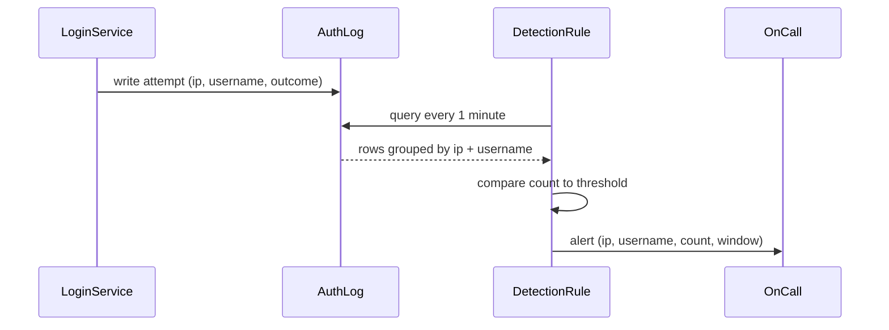

# Security Monitoring — Junior

<!-- level-focus -->
At junior level, focus on this question:

> Given a stream of authentication log lines, can you write a rule that flags a brute-force login attempt without drowning the on-call channel in noise?

Use the smallest realistic scenario that exposes the decision and its failure behavior.

## What security monitoring means (and what it isn't)

**Security monitoring** is the practice of watching a running system's telemetry — logs, auth events, network traffic — for signs that someone is attacking it, has already gotten in, or is misusing legitimate access. It answers a different question than the rest of the monitoring toolkit: health monitoring asks "is the system working?"; security monitoring asks **"is someone doing something to the system it wasn't meant to allow?"** A service can be perfectly healthy — no errors, low latency — while an attacker quietly tries ten thousand password combinations against it.

Security monitoring is also not the same thing as the security *controls* it watches. Rate limiting, account lockout, encryption, and secrets management are controls — they prevent or contain an attack. Security monitoring is the detection layer that notices the attack is happening (or happened) and turns it into a signal a human can act on. You can have strong controls and no monitoring (an attack is blocked but nobody ever sees the attempt), or monitoring with weak controls (you see the attack clearly, but it still gets through). Both matter; this topic is only about the second half — detection.

Get the vocabulary straight, because every rule below is built from it:

| Term | Meaning |
|---|---|
| Signature-based detection | Flags events that match a known bad pattern exactly (a specific attack string, a known-malicious IP) |
| Anomaly-based detection | Flags events that deviate from a normal baseline, even if no specific pattern is known in advance |
| Brute force | Repeatedly guessing passwords for one account (or a small set), usually from one source |
| Credential stuffing | Trying many *different* stolen username/password pairs, usually to see which ones happen to work |
| IOC (indicator of compromise) | A concrete, observable artifact — an IP, a hash, a username pattern — associated with malicious activity |
| SIEM | Security Information and Event Management — a system category that ingests logs from many sources and evaluates detection rules against them |
| Alert fatigue | The well-documented failure mode where too many low-value alerts cause real ones to get ignored |

A brute-force rule you write today is a signature/threshold-based detection: a fixed, explicit condition ("10 failures in 5 minutes from one IP"). It is the right starting point because it is easy to reason about, easy to test, and easy to explain to whoever reads the alert.

## A repeatable method

Follow the same steps every time you build a detection rule from a log source:

1. **Identify the log source and the field that signals the event you care about.** For login attempts, that is an `outcome` field on each authentication event (`SUCCESS` or `FAILURE`), plus the actor (`username`) and origin (`ip_address`).
2. **Define the attack pattern in plain language first.** "Many failed logins against the same account, from the same place, in a short window" — write the sentence before you write the query.
3. **Translate the sentence into a threshold: a count, a window, and a grouping key.** This is the part that turns a description into something a machine can evaluate.
4. **Test the rule against both an attack sample and normal traffic**, not just the attack sample — a rule that only ever sees attacks looks perfect and then floods you with false positives in production.
5. **Route the alert somewhere a human will actually see it**, with enough context (which account, which IP, how many attempts) to act without re-running the query.

## Worked example: detecting a brute-force login

A login service writes one row per attempt to an `auth_log` table:

| occurred_at | ip_address | username | outcome |
|---|---|---|---|
| 09:14:01 | 203.0.113.45 | jsmith | FAILURE |
| 09:14:03 | 203.0.113.45 | jsmith | FAILURE |
| 09:14:05 | 203.0.113.45 | jsmith | FAILURE |
| 09:14:07 | 203.0.113.45 | jsmith | FAILURE |
| 09:14:09 | 203.0.113.45 | jsmith | FAILURE |
| 09:14:11 | 203.0.113.45 | jsmith | FAILURE |
| 09:14:14 | 203.0.113.45 | jsmith | FAILURE |
| 09:14:16 | 203.0.113.45 | jsmith | FAILURE |
| 09:14:18 | 203.0.113.45 | jsmith | FAILURE |
| 09:14:20 | 203.0.113.45 | jsmith | SUCCESS |
| 09:15:02 | 198.51.100.9 | agoncalves | SUCCESS |

The last row is a single, ordinary login from a different user — this is what normal traffic looks like mixed in with the attack, and your rule must not flag it.

The plain-language pattern: "10 or more failed logins against the same account from the same IP within 5 minutes." Translated into a query:

```sql
SELECT ip_address, username, COUNT(*) AS failed_attempts
FROM auth_log
WHERE outcome = 'FAILURE'
  AND occurred_at > NOW() - INTERVAL '5 minutes'
GROUP BY ip_address, username
HAVING COUNT(*) >= 10;
```

Run against the sample above, this returns exactly one row: `203.0.113.45, jsmith, 9`. (Nine failures is just under the threshold in this particular slice — widen the window slightly or lower the bar to `>= 9` and it fires; the point of the exercise is tuning the threshold against real data, not hitting a magic number on the first try.) The single successful `agoncalves` login and the final successful `jsmith` login after nine failures do not trigger the rule, because neither the IP nor the username individually crosses the failure-count threshold.

That final successful login is worth a second look on its own: nine failures followed by a success from the same IP against the same account is a stronger signal than the failures alone — it may mean the tenth guess was the right password. A junior rule can flag this pattern explicitly as a separate, higher-severity case.

The flow from raw log line to an alert a human sees:



## Common junior mistakes

- **Grouping by IP alone, ignoring the account.** A shared corporate NAT gateway or VPN exit node can produce dozens of legitimate failed logins per hour from one IP as different employees mistype passwords. Grouping by IP *and* username avoids flagging that normal noise.
- **Setting the threshold from a guess instead of real traffic.** A threshold of "3 failures" fires on ordinary users who mistype their password twice, producing alert fatigue almost immediately. Look at real failure-rate data before picking a number.
- **Only counting failures, never checking whether one eventually succeeds.** A burst of failures followed by a success is a much stronger signal than failures alone — treat it as a separate, higher-priority case, not the same alert.
- **Confusing signature/threshold detection with the underlying control.** A detection rule that fires after 10 failed attempts is not the same thing as an account lockout policy that blocks the 11th attempt. You can (and often should) have both, but writing the alert does not mean you've added the control, and adding the control does not mean you no longer need the alert.
- **Sending every alert to the same channel with no context.** An alert that says only "brute force detected" forces the reader to go re-run your query. Include the IP, the account, the count, and the window in the alert itself.

## How to verify your work

- The rule fires on a synthetic dataset built to look like a brute-force attempt (many failures, one account, one IP, short window).
- The rule does **not** fire on a synthetic dataset of normal traffic (occasional single failures spread across many accounts and IPs).
- The alert, when it fires, contains enough detail (IP, username, count, window) for someone to act without re-running the query.

## Apply it

1. Build a small `auth_log` table (or a CSV you can query) with at least 20 rows: mostly normal single-attempt logins, plus one clear brute-force burst against a single account from a single IP.
2. Write the plain-language sentence describing the attack pattern before writing any query.
3. Write the SQL (or equivalent) query that groups by IP and username and applies a count-and-window threshold.
4. Run the query against your test data and confirm it returns only the injected attack, not any of the normal rows.
5. Add a second check for "failures followed by a success from the same IP and account," and confirm it flags the burst-then-success case separately.

## Verify your work

- Your query returns exactly the injected brute-force burst and no normal-traffic rows.
- Changing the threshold up or down changes whether the rule fires, and you can explain why the number you picked is reasonable given your test data.
- The burst-then-success check flags a case your first rule alone would have missed the significance of.
- You can describe, in one sentence, what a false positive from this rule would look like and why it would happen.

## Review questions

- Why must a brute-force rule group by both IP and username instead of either one alone?
- What is the difference between a security control (like account lockout) and security monitoring (the alert rule), and why do you usually want both?
- Why is a failed-then-succeeded login sequence a stronger signal than failures alone?
- What real-world event would make your rule fire when nothing malicious is actually happening?
