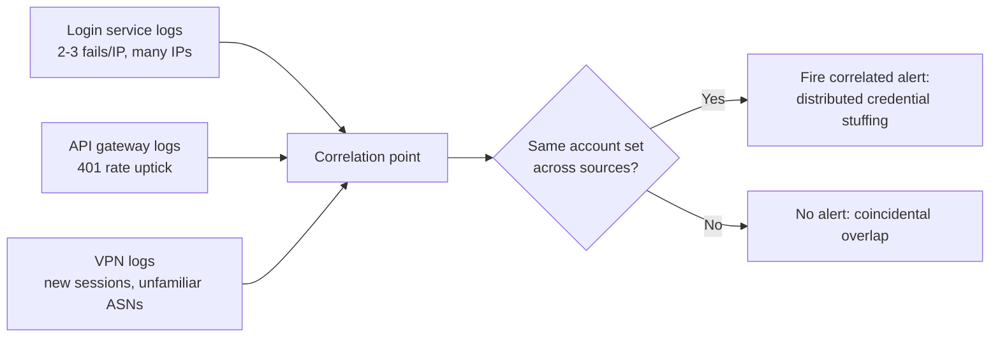

# Security Monitoring — Middle

<!-- level-focus -->
At middle level, focus on this question:

> When failed-login signal comes from three different systems — the login service, the API gateway, and the VPN — where should the correlation that turns three quiet anomalies into one loud alert actually live?

Use the smallest realistic scenario that exposes the decision and its failure behavior.

## The placement question

At junior level, a detection rule reads one log source and applies one threshold. At middle level, the honest problem is that a real attack rarely announces itself in a single log source. A credential-stuffing attempt might show up as: a handful of failed logins per minute at the login service (below any sane per-IP threshold), a spike in 401 responses at the API gateway that fronts several services, and a burst of new VPN sessions from unfamiliar geographies — each individually unremarkable, together an obvious pattern. If each system only evaluates its own logs against its own threshold, no single component ever sees enough to fire.

The middle-level decision is **where the correlation across sources lives**, and it shapes how fast you detect real attacks and how much noise you generate finding them. There are a few realistic placements:

| Placement | How it works | Strength | Weakness |
|---|---|---|---|
| **Per-service local rule** | Each service (login, gateway, VPN) runs its own threshold against its own logs | Fast, simple, no dependency on a shared platform | Blind to attacks that spread thin across services; each service only sees its own slice |
| **Central SIEM ingesting all logs** | All services ship logs to one platform that runs cross-source correlation rules | Sees the whole picture; one place to write and tune correlation logic | Ingestion latency adds detection delay; requires every service to actually ship logs in a compatible format |
| **Streaming correlation pipeline** | Logs flow through a stream processor (e.g., a windowed join) that computes correlated signals in near-real-time | Lower latency than batch SIEM ingestion; can compute rich cross-source features | More operationally complex to build and run than a SIEM query; requires careful window and state management |
| **Identity-provider-level signal** | The system users authenticate through (SSO/IdP) sees cross-service login attempts natively, since every service delegates to it | Correlation is nearly free if most services already delegate auth to one IdP | Only covers attacks that go through the IdP; a service with its own local auth path is invisible to it |

None of these is universally correct. If most of your services already delegate authentication to a single identity provider, that IdP's own login-attempt signal is often the cheapest correlation point — you get cross-service visibility without building anything new. If authentication is fragmented across services with their own local user tables (a common state for an organization mid-migration), a central SIEM or streaming pipeline is the only placement that actually sees the full picture, at the cost of the plumbing to get every log source shipping consistently.

## Evaluating the trade-off with real criteria

Pick a placement against the properties that actually matter for detection, not by whichever is fastest to stand up this sprint:

- **Detection latency.** How long between the actual attack traffic and an alert firing? A batch SIEM query running every 10 minutes adds up to 10 minutes of blindness on top of ingestion lag. A streaming pipeline can get this down to seconds, at real engineering cost.
- **Coverage.** Which access paths actually feed this correlation point? A central SIEM only correlates what ships logs to it — a service that logs locally and never forwards is invisible no matter how good the correlation rule is.
- **Change cost.** How much work is it to add a new signal (a new service, a new log field) to the correlation? A streaming pipeline with hand-built joins often needs code changes per new source; a SIEM with a declarative query language can sometimes add a source by pointing it at the same ingestion pipe.
- **Testability.** Can you feed synthetic multi-source events through the correlation logic and assert it fires, without waiting for real traffic or standing up every real service? Rules that only can be tested against production traffic are rules nobody actually tests before shipping.

## Under- and over-application signals

**Under-application** looks like: three teams each ship a local, per-service threshold rule, declare "we have brute-force detection," and nobody ever builds the cross-source view. Six months later a slow, distributed credential-stuffing attempt spread across the login service, the gateway, and a partner API sails through undetected, because no single component's local threshold was ever crossed. The signal to watch for: an incident retrospective where the evidence of the attack existed in three separate log stores and nobody had a query that joined them.

**Over-application** looks like: every team routes every log line into the central SIEM and writes a correlation rule for every conceivable multi-source combination "to be thorough." The SIEM's alert queue fills with pattern matches that are statistically inevitable at scale (two unrelated services both seeing a failed login from the same large ISP's IP range within the same hour) and real cross-source attacks get lost in the noise, which is alert fatigue at the correlation layer instead of the single-rule layer. The signal to watch for: analysts routinely closing correlation alerts as "not related" without deep investigation, because the base rate of coincidental correlation is high relative to real attacks.

The corrective in both directions is the same: correlate signals that share a real entity (the same account, the same source IP, the same session) across sources, not signals that merely co-occur in time.

## Incremental adoption

You rarely build this cleanly from scratch — you retrofit correlation onto services that already ship logs somewhere:

1. **Get every relevant source shipping structured logs to one place first.** Correlation is impossible if the login service's logs are unstructured text and the gateway's are JSON with different field names. Standardize the shape (account identifier, source IP, timestamp, outcome) before writing correlation rules.
2. **Start with the two sources most likely to see the same attack.** Login service and API gateway usually see the same credential-based attack from two angles; VPN and partner-API logs can come later.
3. **Write one correlation rule that joins on a shared entity** — same source IP or same account across both sources within a time window — and validate it against a synthetic multi-source attack before trusting it on real traffic.
4. **Add sources incrementally**, re-validating that the added source doesn't just add noise (see the over-application signal above) before calling it done.
5. **Track false-positive rate per rule, not just per source**, so a noisy correlation rule gets tuned or retired instead of silently trained-around by the on-call rotation.

## Scenario: the same attack visible in three log stores

A credential-stuffing attempt is spread across many IPs, each making only 2-3 attempts per account — below any single-IP threshold at the login service. The gateway sees a mild uptick in 401s. The VPN sees a handful of new sessions from unfamiliar ASNs. None of this trips a per-service rule.

The correlation rule that actually catches this joins on **the set of targeted usernames**, not on IP: if the same list of accounts is being attempted across login, gateway, and VPN within a short window, regardless of which IPs are involved, that is the distributed-attack signature. A rule that instead joins only on IP overlap would miss it entirely, because the whole point of spreading the attack across many IPs is to defeat exactly that kind of matching.

## Verification at two levels

**Unit level:** test the correlation logic in isolation, with fabricated events from each source. Feed it a synthetic set where the same five usernames appear in login-service failures, gateway 401s, and VPN session logs within a 10-minute window, and assert the rule fires with those five usernames listed. Feed it a second synthetic set where the overlap is coincidental (different usernames in each source) and assert it does not fire.

**Integrated-flow level:** exercise the real ingestion path. Emit real-shaped log lines into each service's actual logging pipeline, let them flow through real shipping and ingestion, and confirm the correlation rule fires within your expected latency budget (not just that the logic is correct, but that it runs against real ingestion lag) and that the resulting alert carries the shared entity (the username list) that a responder needs to act.

## Common middle-level mistakes

- **Joining on IP when the attack is specifically designed to defeat IP-based matching.** Distributed attacks spread across IPs precisely because IP-based thresholds and joins are the most common detection approach. Join on the entity the attacker can't easily change — the target account.
- **Treating "we ship logs to the SIEM" as equivalent to "we have correlation."** Ingestion without a correlation rule that actually joins sources is just more raw data sitting in one place.
- **Not accounting for ingestion latency in the alert's usefulness.** A correlation rule that is logically correct but runs against logs that are 20 minutes stale may fire after the attack has already succeeded or moved on — evaluate detection latency as part of the design, not as an afterthought.
- **Building a correlation rule nobody can test without production traffic.** If the only way to validate the rule is to wait for a real attack, you will not find out it's broken until it already missed one.

## Apply it

1. Pick two real log sources in your system that could both see the same class of attack (for example, an app-level login log and an API gateway's 401 log).
2. Standardize both to carry a shared entity field (account identifier) with the same meaning in both sources.
3. Write a correlation rule that joins on that shared entity across both sources within a time window, and choose the placement (local, SIEM, streaming) that fits your actual log-shipping setup.
4. Write a unit test with fabricated multi-source events proving the rule fires on a real overlap and not on a coincidental one.
5. Run an integrated test that pushes real-shaped events through your actual ingestion path and measure the end-to-end detection latency.

## Verify your work

- The unit test proves the correlation logic fires on a genuine cross-source overlap and stays silent on a coincidental one.
- The integrated test measures real detection latency from event to alert, not just logical correctness.
- The alert, when it fires, names the shared entity (the account or account list) that ties the sources together.
- You can state, for your chosen placement, which access paths it does *not* cover, and why that gap is acceptable for now.

## Review questions

- Why does joining a cross-source correlation rule on IP address fail against a distributed, low-per-IP attack?
- What is the concrete cost of choosing a central SIEM over a per-service local rule, beyond "it's more work to set up"?
- How would you unit test a correlation rule without waiting for a real multi-source attack to occur?
- What does it mean for a correlation rule to be over-applied, and how would that show up in an analyst's daily queue?
