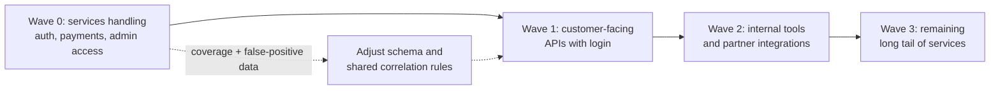

# Security Monitoring — Professional

<!-- level-focus -->
At professional level, focus on this question:

> How do you grow security-detection coverage across a fleet of independently-owned services without either bottlenecking on a central security team or drowning every service's on-call in false positives?

Use the smallest realistic scenario that exposes the decision and its failure behavior.

## The organizational problem, not the technical one

A handful of services can be covered by a security team hand-writing rules against each one's logs. Past a few dozen services owned by teams that ship on independent schedules, that model breaks in both directions at once: the central team becomes the bottleneck every new service waits on before launch, and — because they can't deeply know every service's normal traffic pattern — the rules they write generalize poorly and generate noise that lands on teams who didn't ask for it and don't know how to tune it. The professional-level problem is building an operating model where detection coverage grows with the number of services, without either constraint, and where the coordination cost lives in a contract and a platform, not in a person reviewing every service's launch.

## Ownership split: platform detects the shape, teams own the noise floor

The architecture that scales matches responsibility to who can actually verify each part:

| Responsibility | Owner | Why this owner |
|---|---|---|
| Security-relevant event schema (the contract) | Central security/platform team | A shared schema only stays coherent if one team evolves it, not every service independently |
| Correlation platform (SIEM/streaming pipeline), retention, cross-source rules | Central security team | Cross-service correlation requires seeing across services — no individual team has that view |
| Emitting security-relevant events correctly from their own service | Service-owning team | Only the team that owns the code knows every access path that needs an event |
| Tuning thresholds and triage for their own service's alerts | Service-owning team, with a shared playbook from the security team | The team closest to its own traffic pattern is best placed to say what's actually anomalous for them |
| Detection coverage measurement and false-positive rate monitoring | Central security team | A cross-cutting quality signal — coverage gaps and noise trends — that no single team's view can produce |

This is the same paved-road pattern used for other cross-cutting platform concerns: a central team builds the shared contract and the shared infrastructure once; service teams adopt it against a stable interface instead of waiting for a person to review their specific case.

## The contract that makes limited coordination possible

The artifact that lets dozens of teams move independently is a **versioned security-event schema published as a contract**, backed by a runnable conformance check rather than a review meeting:

- The schema defines the required fields for any authentication or access-control-relevant event (actor, target account, source, outcome, timestamp) and is additive-only — existing fields don't change meaning, new ones get added as new attack patterns require new signal.
- A conformance test suite, published as a library any team pulls into CI, asserts that a service's security-relevant events match the schema and that a sample failed-auth attempt actually produces one. This turns "did we wire up security event emission correctly" into a CI gate a team can self-check before merge, not a design review.
- The security team owns backward compatibility as an obligation to the rest of the org: they can add detection capability and new optional fields, but a service on last year's required fields must keep passing conformance, or the paved road stops being something teams can adopt on their own schedule.

## Decomposing the rollout into reversible, observable increments

Fleet-wide coverage cannot be a single migration; it has to be sequenced so each step produces evidence before the next is funded:

Each wave is reversible — a team adopts the shared event library and, if it misbehaves, can roll back their own instrumentation without blocking any other team, because coupling lives at the schema level, not at deploy time. Each wave is observable because coverage is a tracked percentage ("22 of 60 services emitting conformant security events and passing the shared correlation smoke test") rather than a qualitative claim that teams have "been asked to add it."

## Governance: connecting detection to risk and compliance obligations

An auditor or a risk review doesn't ask "do you monitor for attacks" — they ask for evidence against a specific control expectation. Maintain that mapping explicitly:

| Risk/compliance expectation | Technical control | Evidence produced |
|---|---|---|
| Unauthorized access attempts are detected in a bounded time | Conformant event emission + correlation rules across auth-adjacent services | Time-to-detect measurements from scheduled purple-team exercises |
| Detection coverage is known, not assumed | Coverage mapped against a recognized adversary-technique framework (e.g., MITRE ATT&CK categories) | A coverage report showing which technique categories have active detection and which don't |
| Alerting doesn't degrade into ignored noise | Per-service false-positive tracking with a review trigger | A trend report per service; any service crossing an agreed noise threshold gets a tuning review, not a silent ignore |
| Detection blind spots are themselves tracked as risk | Pipeline health SLOs with tiered escalation by data sensitivity | Incident record for any period where the correlation pipeline missed its ingestion/evaluation SLA |

This table is a governance artifact in its own right — it's what you hand a risk reviewer, and it's also what tells the security team which piece of the program actually matters this quarter versus which is nice-to-have.

## Operational risk: alert fatigue as an organization-level failure, not a per-team one

Once dozens of services emit alerts into a shared or federated on-call structure, a noisy rule in one service degrades trust in the whole program, not just that service's queue. This needs the same operational rigor as any shared production dependency:

- **A defined SLA for the correlation platform** (ingestion latency, evaluation latency) owned by the security team, with on-call ownership like any other production service.
- **A published, tiered incident playbook** for "the correlation pipeline is degraded," specifying whether that state pages someone immediately (high-sensitivity systems) or is logged for reconciliation (lower-sensitivity systems) — decided in advance, not during the incident.
- **A standing false-positive review process**, because alert fatigue is a well-documented failure mode with a known cause (volume of low-value signal) and a known remedy (tuning and retiring rules) — treating it as an ongoing operational responsibility, not a one-time tuning pass at rollout.
- **Escalation paths to incident response** defined once, centrally, so every service's on-call knows exactly how a confirmed security alert gets handed to the people who run the actual incident, instead of each team improvising that handoff under pressure.

## Outcome measures and exit conditions

The program is judged by measures tracked continuously, because new services launch every quarter and a coverage number that was true once and never rechecked is not evidence of anything current:

| Measure | What it tells you | Target used as an exit condition |
|---|---|---|
| Conformance coverage | % of security-relevant services passing the shared event conformance suite | 100% for Wave 0/1 services before Wave 2 is funded |
| Detection technique coverage | % of a recognized adversary-technique framework's relevant categories with an active rule | Tracked and reviewed quarterly; gaps are prioritized, not just noted |
| Mean time to detect | Time from simulated or real attack traffic to a fired, actionable alert | Measured via scheduled exercises; trending down or stable, not silently growing as the fleet scales |
| False-positive rate per service | % of alerts closed as not-actionable | Below an agreed threshold sustained over a trailing window; services above it get a tuning review |

The program's exit condition isn't a single "coverage complete" milestone — it's these measures holding over a sustained trailing window, since a fleet that hits full coverage once and then silently regresses as new services launch without conformance checks has not solved the actual organizational problem.

## Cross-team accountability without a central bottleneck

The mechanism that avoids a human gatekeeper on every launch is making the conformance check a **CI-enforced release gate**: a service cannot ship a new authentication or access-control path without its pipeline passing the shared conformance suite. This puts accountability on the team that can fix a gap, at the point it's cheapest to fix — before merge — while the security team's role shifts from reviewing every service to maintaining the gate and watching the aggregate coverage, detection-latency, and noise numbers.

When a team pushes back under deadline pressure, the escalation path should already exist: a service handling authentication or access control that fails the conformance gate is tracked as a risk item with an owner and a review cadence, the same way an unpatched vulnerability would be — not an informal request that quietly expires.

## Scenario: sustained delivery across a growing fleet

An organization has 60 services touching authentication or access-control-sensitive data, with detection coverage concentrated in a handful the security team built by hand years ago.

1. **Quarter 1, Wave 0-1:** the security team publishes the event schema and conformance library, and pairs directly with the 10 highest-risk teams (identity, payments, admin tooling) to onboard them — surfacing real gaps in the schema itself, which get added additively rather than redesigned mid-flight.
2. **Between waves:** coverage, false-positive rate, and mean-time-to-detect from Wave 0/1 are reviewed before Wave 2 is funded. A high false-positive rate here is treated as evidence the shared correlation rules need another tuning pass before asking 20 more teams to adopt them.
3. **Quarter 2, Wave 2-3:** the remaining teams self-serve against a now-proven paved road; the security team's effort shifts to monitoring gate metrics, running scheduled purple-team exercises, and handling the exceptions that don't fit the standard pattern.
4. **Ongoing:** all four outcome measures are reviewed quarterly indefinitely, because services launch continuously, threat techniques evolve, and the exit condition is sustained coverage and detection speed, not a finish line that was crossed once.

## Apply it

1. Define the measurable outcome this program improves for your organization (e.g., mean time to detect, or conformance coverage across authentication-relevant services).
2. Assign one owner for the event schema and correlation platform, and one owner per service for correct event emission and first-line triage.
3. Sequence the rollout into waves by risk, starting with the services most likely to be targeted (authentication, payments, admin access), and define what evidence each wave must produce before the next is funded.
4. Publish the conformance test suite, the risk/compliance-control mapping table, and the escalation path for a service that fails the gate.
5. Decide, in advance and per data-sensitivity tier, what happens when the shared correlation pipeline degrades — who gets paged, and who is only informed after the fact.

## Verify your work

- Each wave has a named owner, a rollback path if the shared event library misbehaves for a service, and a measurable exit condition before the next wave is funded.
- Conformance coverage, detection technique coverage, mean time to detect, and false-positive rate are tracked on a recurring cadence, not measured once at rollout.
- A simulated distributed attack and a simulated correlation-pipeline outage both exercise the documented playbooks and produce the expected, pre-agreed outcome.
- A service that fails the conformance gate is blocked from shipping the offending change automatically, without requiring a person to notice and intervene.

## Review questions

- Which measurable outcome would tell you this security-monitoring program is actually detecting attacks faster, versus merely covering more services on paper?
- What decision moved from "a security engineer reviews this" to "CI enforces this," and why does that matter once the fleet passes a few dozen services?
- Which reversible increment in the rollout would surface a bad schema or correlation-rule decision before it was forced onto 60 services?
- How does treating alert fatigue as an organization-level operational risk change who is accountable for a noisy rule, compared to leaving it as each team's private problem?
