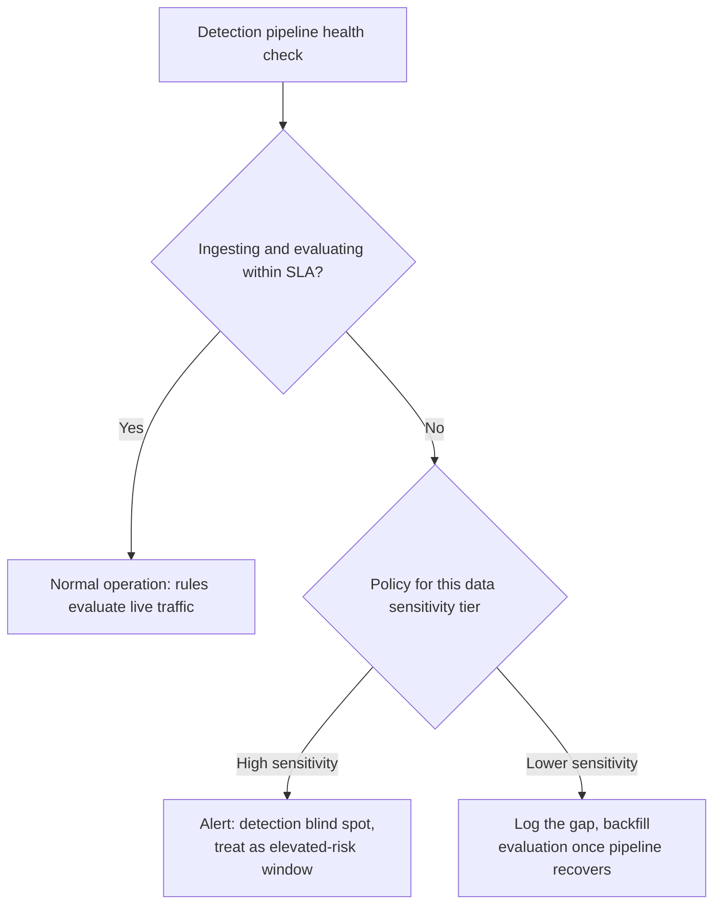

# Security Monitoring — Senior

<!-- level-focus -->
At senior level, focus on this question:

> If an attacker spreads a credential-stuffing attempt across thousands of IPs at a rate below any single-IP threshold, what invariant is your detection system actually protecting, and does it still hold?

Use the smallest realistic scenario that exposes the decision and its failure behavior.

## The invariant detection is actually protecting

Strip away individual rules and the real question a security monitoring system exists to answer is:

> Within a bounded, known time budget, an attempt to access an account or system without authorization produces a signal a human or automated response can act on — regardless of how the attacker structures the attempt to avoid any single detection rule.

Everything interesting at senior level is either defending that invariant directly, or deciding what happens when an adversary — who reads the same detection literature you do — deliberately shapes their behavior to sit just under whatever threshold you published. Junior and middle-level rules assume a static attacker. Senior-level design assumes an adaptive one.

## Failure mode 1: distributed, low-and-slow attacks evade per-entity thresholds

The clearest way to break a threshold-based rule is to attack across enough distinct entities that no single one crosses the bar. Credential stuffing spread across thousands of residential-proxy IPs, each making one or two attempts, defeats any per-IP threshold by construction — the attacker read the same "10 failures per IP" rule you wrote and simply used 10,000 IPs at one attempt each.

The senior response is not "lower the threshold" (that increases false positives on ordinary shared-NAT traffic without meaningfully raising the bar for an attacker who can trivially add more IPs). The response is to **detect on the invariant the attacker cannot cheaply vary**: the *set of targeted accounts*, the *velocity of distinct-account attempts system-wide*, or *behavioral fingerprints* that don't depend on network origin at all — request timing patterns, credential-list reuse across otherwise unrelated services, or a spike in system-wide failed-login volume even when no single source is anomalous.

This is the real distinction between signature/threshold detection and behavioral (anomaly, UEBA — user and entity behavior analytics) detection: a threshold rule asks "did this one entity cross a line?"; a behavioral baseline asks "does the aggregate shape of activity look like the population it's drawn from?" An attacker can trivially stay under any single-entity line by adding more entities; an attacker cannot as easily make ten thousand credential attempts *look like* the login-time and account-selection distribution of real users, because real user behavior isn't optimizing to defeat your detector.

| Detection approach | What it catches | What defeats it |
|---|---|---|
| Per-IP threshold | Concentrated brute force from one source | Spreading attempts across many IPs |
| Per-account threshold | Repeated guesses against one account | Spreading attempts across many accounts (credential stuffing) |
| System-wide failed-login volume baseline | Any large-scale attempt, regardless of distribution | An attacker who stays within normal system-wide noise (rare at real attack scale, but possible against a low baseline) |
| Behavioral/velocity fingerprint (e.g., account-selection pattern, request timing) | Attacks shaped to evade count-based thresholds entirely | An attacker with deep knowledge of your specific baseline, or one who is willing to attack far more slowly than is usually economical |

No single row in that table is sufficient alone — layering them, so that evading one raises the cost of the attack enough to trip another, is the actual senior-level design, not a search for one perfect rule.

## Failure mode 2: the detection pipeline itself degrades

The second failure mode is not the attack — it's your own visibility going dark. Log ingestion lags, a correlation job silently stops running, or the SIEM is unreachable. This forces a fail-open/fail-closed decision structurally identical to the one in audit logging, but with a different consequence: here, failing closed doesn't mean denying access, it means **treating the absence of a clean signal as itself a signal**.

A degraded detection pipeline is an operational incident in its own right — an outage doesn't just mean "no alerts," it means "we do not currently know whether we are being attacked." For high-sensitivity systems (anything guarding financial transactions, admin access, or regulated data) that gap should page someone directly, on the theory that an attacker capable of causing detection blind spots (accidentally, via load, or deliberately) is exactly the scenario detection exists to catch.

## Recovery: backfilling detection over history

A related and easily missed failure: a new detection rule is deployed today, and a retrospective question comes up — "was this pattern present before we started looking for it?" Unlike a live alert, this needs the rule re-evaluated against historical log data, not just going forward.

This only works if raw logs are retained long enough, in a queryable form, independent of whether any rule existed to evaluate them at the time. A design that only keeps *alerts* and discards the *raw events* that didn't trigger anything at the time cannot answer "would this new rule have caught last month's incident?" — which is exactly the question asked after almost every real investigation. Treat raw security-relevant log retention as a distinct requirement from alerting, with its own retention window justified by how far back a plausible investigation would need to look.

## Evolution: signatures rot, baselines drift

A signature-based rule (a specific known-bad IP, a specific attack string) has a shelf life — attackers rotate infrastructure and vary payloads, and a rule tuned to last quarter's attack infrastructure quietly stops matching this quarter's, while still consuming review time and giving false confidence that coverage exists. A behavioral baseline has the opposite failure: it can **drift with the population it's measuring**, so a baseline built during a quiet period gradually normalizes activity that would have looked anomalous when the baseline was first built, or a genuinely new pattern of legitimate usage (a product launch that changes login patterns) gets misread as an attack.

The senior-level discipline for both is to treat detection rules as a fleet with individual health, not a write-once artifact: track each rule's fire rate and true/false-positive rate over time, and require a periodic review (quarterly is a common, reasonable cadence) rather than assuming a rule that shipped correctly stays correct.

## Evidence used to validate a design, not preference

The way to know whether a detection design actually works is not "it looks thorough" — it's testing it against realistic adversary behavior and measuring the result:

- **Purple-team or red-team exercises**, where a cooperating team deliberately attempts the attack patterns your design claims to catch (including distributed, low-and-slow variants) and you measure whether detection actually fires, and how long it takes.
- **False-positive and false-negative rates measured against labeled data**, not estimated. If you cannot state your rule's false-positive rate on a recent sample of real traffic, you do not actually know whether it will cause alert fatigue in production.
- **Coverage mapped against a known adversary-technique framework** (MITRE ATT&CK is the standard reference here) to identify which technique categories have no detection at all, rather than assuming coverage because *some* rules exist.
- **Time-to-detect measured on the exercises above**, not assumed from the rule's logical design — a correlation rule that is logically sound but runs on a 30-minute batch cycle has a 30-minute best-case detection time no matter how well it's written.

## Trade-offs among plausible approaches, summarized

| Decision | Option A | Option B | What tips the choice |
|---|---|---|---|
| Detecting distributed attacks | Lower per-entity thresholds | Add a behavioral/velocity signal independent of entity count | Whether the threshold is already at a level that would false-positive on legitimate shared-network traffic |
| Detection pipeline degrades | Silently continue with a gap | Alert on the gap itself, tiered by data sensitivity | Whether the protected system is high-value enough that an undetected blind spot is itself a serious risk |
| Signature vs behavioral rules | Signature-only (cheap, precise, decays) | Behavioral baseline (adapts, but can drift and needs tuning) | Whether the threat model includes adversaries who specifically evade published thresholds |
| Validating the design | Trust the rule because it's logically sound | Run adversary-simulation exercises and measure fire rate | Whether you can afford to discover gaps during a real incident instead of a planned exercise |

## Questions that expose weak assumptions before implementation

- "If an attacker used 1,000 IPs instead of 1, would any rule we have still fire?" If the honest answer is no, every current rule assumes a static, unsophisticated attacker.
- "How would we know if the detection pipeline silently stopped evaluating rules for an hour?" If the answer relies on someone noticing the alert queue looks quiet, that's not a control.
- "Can we re-evaluate a brand-new rule against last quarter's logs?" If raw events weren't retained independent of alerting, the answer is no, and that gap won't be visible until an investigation needs it.
- "When did we last measure this rule's false-positive rate against real traffic, rather than assume it from when it was written?" A rule nobody has re-measured in a year is a rule whose current accuracy nobody actually knows.

## Apply it

1. Take a per-IP or per-account threshold rule from your system (or the middle-level exercise) and describe, concretely, how an attacker with access to unlimited IPs or accounts would defeat it.
2. Design one behavioral or velocity-based signal that does not depend on the entity the attacker can cheaply multiply, and state what it measures instead.
3. Decide, per data-sensitivity tier, whether a detection-pipeline outage should page someone immediately or be logged for later reconciliation — and write down the reasoning, not just the decision.
4. Check whether your raw security-relevant logs are retained independent of which rules exist today, and confirm (by actually querying) whether you could evaluate a brand-new rule against last month's data.
5. If you can arrange it, run or simulate a small purple-team exercise: have a colleague attempt a distributed, low-per-entity version of an attack your rules claim to catch, and measure whether and how fast it's detected.

## Verify your work

- You can state precisely which of your current rules a sufficiently distributed attacker would defeat, and why.
- The behavioral signal you designed does not depend on IP or account count individually, and you can explain what population it's being compared against.
- The pipeline-outage policy is written down per sensitivity tier, not left to be decided during the next actual incident.
- A test query against historical raw logs confirms whether a new rule could be backfilled, rather than assuming it could.

## Review questions

- What invariant does your detection system protect, and what happens to it when the attacker's entity count is unbounded?
- Why does a per-IP or per-account threshold rule have a defeat condition built into its own design?
- What is the practical difference between a detection-pipeline outage that fails silently and one that pages someone, and which should apply to a system handling financial transactions?
- Why does raw log retention need to be a separate requirement from alerting, rather than something alerting already covers?
