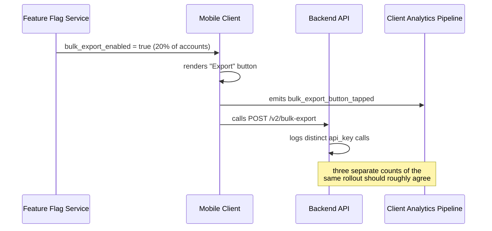

# Usage Monitoring — Middle

<!-- level-focus -->
At middle level, focus on this question:

> When a mobile client's feature flag reports a feature enabled for 20% of accounts but the backend endpoint behind it shows real calls from only 2% of accounts, which signal do you trust, and what do you check before concluding the feature is simply unwanted?

Use the smallest realistic scenario that exposes the decision and its failure behavior.

---

## Core Concept 1 — Choosing the Active-User Window

A junior-level pass counts distinct actors per day. The middle-level problem is that DAU, WAU, and MAU answer different questions, and picking the wrong one produces a defensible-looking number that supports the wrong decision:

| Window | What it captures | Where it misleads |
|---|---|---|
| **DAU** (daily) | Actors active on a given day | Punishes features used weekly or monthly — a payroll-export feature used once a month looks "dead" every day it isn't called |
| **WAU** (rolling 7 days) | Smooths day-to-day noise | Still too short for quarterly or billing-cycle-driven usage patterns |
| **MAU** (rolling 30 days) | Captures monthly-cadence usage | Can hide a feature that's actually declining fast, since a 30-day window absorbs a sharp recent drop into a still-reasonable-looking total |

There is no single correct window — the right one matches the natural calling cadence of the feature. A rule of thumb: pick the window to be at least as long as the *longest realistic gap* between legitimate uses by a single actor, and use a shorter window only for features you already know are called far more often than that.

## Core Concept 2 — Choosing the Actor Unit Has Real Trade-offs

| Actor unit | Pros | Cons |
|---|---|---|
| **User account** | Matches "how many humans use this" intuitively | One human with two devices, or two employees sharing a login, skews the count either way |
| **Device / session** | Captures real distinct usage sessions, useful for UX-focused features | Inflates counts for power users with multiple devices; deflates for shared kiosks |
| **API key / service credential** | Right unit for machine-to-machine and B2B integrations | Hides how many actual humans or downstream systems sit behind one shared key |
| **Tenant / customer account** | Right unit for "is this customer still paying for and using this" questions | Can hide that only one person out of five hundred at that customer ever touches the feature |

Under-application shows up as picking whichever unit is easiest to query (usually raw session or IP) without checking whether it matches the actual business question. Over-application shows up as tracking usage at every possible granularity (user, device, session, key, tenant) for every feature, producing five dashboards nobody reconciles and no single number anyone trusts.

## Core Concept 3 — Enablement Is Not Usage

A feature flag rollout percentage tells you how many accounts are *eligible* to see a feature. It tells you nothing about whether they used it. Treating "20% flag rollout" as "20% adoption" is one of the most common middle-level usage-monitoring mistakes, and it's exactly the trap in this level's scenario.

## Core Concept 4 — Cross-Component Scenario: the Flag/Client/Backend Mismatch

A "Bulk Export" feature is flag-gated to 20% of mobile accounts. Three independently-derived numbers exist for the same rollout:



- Flag service: 20% of accounts enabled.
- Client analytics event `bulk_export_button_tapped`: fired by roughly 18% of enabled accounts — close to the rollout percentage, meaning the button is visible and people are tapping it.
- Backend `/v2/bulk-export` call logs: only 2% of accounts show a completed backend call in the same window.

The naive read is "adoption is 2%, the feature is unwanted, deprecate it." The actual diagnosis requires reconciling the three numbers:

1. **If the tap-event count were also ~2%**, that confirms the feature genuinely isn't wanted — the button is visible and rarely pressed. Low usage would be a real finding.
2. **Because the tap-event count is ~18%**, close to the rollout, the mismatch is between "tapped" and "reached the backend" — something between the client and the backend is failing silently: a client bug swallowing an error, a network timeout that never surfaces to the user, an auth token expiring on that code path specifically.

The correct next step is not "deprecate," it's "file a bug in the client-to-backend call path" — the usage numbers, read together instead of individually, pointed at an engineering defect rather than a product decision.

## Core Concept 5 — Testability: Prove the Query Before You Trust the Dashboard

A usage query that has never been tested against known data is a guess with a nice chart around it. Two checks make it trustworthy:

```python
# Unit-level: run the usage query against a fixture with a known answer.
def test_distinct_active_accounts_query():
    fixture_logs = [
        {"api_key": "k1", "endpoint": "/v2/bulk-export", "status": 200},
        {"api_key": "k1", "endpoint": "/v2/bulk-export", "status": 200},  # same actor twice
        {"api_key": "k2", "endpoint": "/v2/bulk-export", "status": 200},
        {"api_key": "internal", "endpoint": "/v2/bulk-export", "status": 200},  # excluded
    ]
    result = run_usage_query(fixture_logs, endpoint="/v2/bulk-export", exclude={"internal"})
    assert result == 2  # k1 and k2, not 4 rows and not internal
```

```sql
-- Integrated-flow check: two independently derived signals for the
-- same rollout should stay within an expected tolerance of each other.
-- A large, unexplained gap is a pipeline bug, not a usage insight.
SELECT
  e.day,
  e.tapped_accounts,
  b.called_accounts,
  ROUND(b.called_accounts * 1.0 / NULLIF(e.tapped_accounts, 0), 2) AS backend_completion_rate
FROM daily_tap_events e
JOIN daily_backend_calls b USING (day)
WHERE e.day >= CURRENT_DATE - INTERVAL '7 days';
```

The unit test proves the query itself does what you think it does on data with a known right answer. The integrated check proves the two independent measurement paths (client events, backend logs) agree closely enough to be trusted as the same underlying reality — and flags the gap in this scenario as something to investigate, not as this quarter's adoption number.

## Core Concept 6 — Incremental Adoption

Instrumenting usage tracking for every feature and every granularity on day one is unrealistic and produces noise nobody reviews. A workable order:

1. Instrument the highest-value or most expensive-to-maintain features first — the ones where a wrong "still needed" or "safe to remove" call has real cost.
2. Start with one actor unit and one window per feature, chosen deliberately (Core Concepts 1–2), rather than tracking every combination speculatively.
3. Add the second, independently-derived signal (client event vs. backend log) only for features where a mismatch would materially change a decision — not for every feature by default.
4. Expand to more features once the query, the fixture test, and the reconciliation check have survived contact with the first one.

## Common Mistakes

- **Treating feature-flag rollout percentage as adoption.** They measure different things; conflating them produces confident, wrong conclusions.
- **Picking a DAU window for a feature with a monthly or quarterly calling cadence.** The feature will look artificially dead most days.
- **Trusting a single usage signal when a second, independent one is cheap to check.** A mismatch between two independently-derived numbers is often the most useful signal you get — don't throw it away by only ever looking at one.
- **Shipping a usage dashboard without a fixture-based test of the underlying query.** A silently wrong `COUNT(DISTINCT ...)` — say, missing a filter — produces a wrong number that looks exactly like a right one.
- **Instrumenting every feature at every granularity at once.** This produces more dashboards than anyone reconciles, and the org ends up trusting none of them.

## Apply it

1. Pick a real (or realistic) feature in a system you know that is gated behind a flag, has a client-side interaction event, and has a backend endpoint it eventually calls.
2. Write down the actor unit and window you'd use for each of the three signals (flag rollout, client event, backend call), and justify the window choice using the feature's expected calling cadence.
3. Write a fixture-based unit test for your backend usage query, with a known input and a known expected distinct-actor count, including at least one actor to exclude.
4. Write the reconciliation query that compares the client-event count to the backend-call count over the same window, and define what gap size you'd treat as "investigate a bug" versus "this is genuinely low adoption."
5. Using invented but realistic numbers (a flag rollout %, a tap-event %, a backend-call %), walk through which of the two diagnoses in Core Concept 4 applies, and state your next action.

## Verify your work

- Your fixture-based test fails when you deliberately break the query (remove the `DISTINCT`, or drop the exclusion filter), proving it actually tests something.
- Your window justification names the feature's realistic calling cadence, not just "we always use 30 days here."
- Your reconciliation query runs against two genuinely separate data sources (client events, backend logs), not two views of the same table.
- You can state a concrete gap threshold between the two signals that would trigger "investigate the pipeline" rather than "record this as the adoption number."

## Review questions

- Why can a feature-flag rollout percentage and a real adoption percentage be two completely different, equally valid numbers?
- What determines whether DAU, WAU, or MAU is the right window for a specific feature?
- Why is a large gap between two independently-derived usage signals often more useful than either signal alone?
- What does a fixture-based test on a usage query actually protect you against that a dashboard alone does not?
