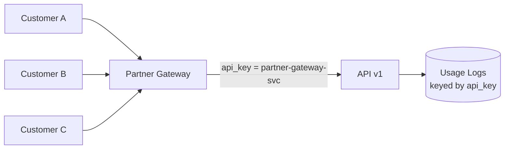

# Usage Monitoring — Senior

<!-- level-focus -->
At senior level, focus on this question:

> Before you can safely deprecate an old API version for every customer — including one who might legitimately call it only once a quarter — what evidence has to hold, and what usage-monitoring architecture lets you re-verify that evidence is still true the day before you turn the endpoint off?

Use the smallest realistic scenario that exposes the decision and its failure behavior.

---

## Core Concept 1 — The Invariant Usage Monitoring Actually Needs to Guarantee

A middle-level usage pipeline is organized around getting one feature's numbers right. At senior level, the organizing question changes: **what invariant does the usage-monitoring system guarantee, across every consumer of its data, before someone makes an irreversible decision on top of it?** For a deprecation decision specifically, the invariant that matters is:

> Absence of recorded usage in the pipeline's output must mean absence of real usage — not absence of a working pipeline.

A dashboard showing "zero calls in 30 days" is not evidence of zero usage unless something has verified the pipeline itself was alive and correctly attributing calls for that entire window. Without that verification, "zero calls" and "the logging path silently broke three weeks ago" produce the exact same chart.

## Core Concept 2 — Failure Modes That Look Like Low Usage But Aren't

| Failure mode | What it looks like | Why it's dangerous |
|---|---|---|
| **Silent pipeline death** | Usage count drops to zero and stays there | Identical on a dashboard to a feature that genuinely stopped being used — nothing distinguishes "no one calls this" from "we stopped counting" |
| **Long-tail / low-frequency callers** | A customer who calls once a quarter looks inactive in any window shorter than a quarter | A 30-day lookback window systematically misclassifies real, legitimate, infrequent usage as "unused" |
| **Sampling bias at high volume** | Usage tracking samples a fraction of traffic for cost reasons | A rare but real caller can fall entirely outside the sample, especially if sampling is uniform-random rather than actor-aware |
| **Identity masking through an intermediary** | A partner, reseller, or shared gateway proxies calls under its own credential | Usage data attributes an entire long tail of real end customers to one caller identity, hiding exactly who depends on the endpoint |

None of these require anyone to make an obviously wrong decision. Each component along the way — the sampler, the gateway, the logging library — does exactly what it was built to do. The risk is that nobody asked whether "zero recorded usage" and "zero real usage" are still the same statement once these components are in the path.

## Core Concept 3 — Cross-Component Scenario: the Partner Gateway Masking the Long Tail

A platform team wants to deprecate API v1 in favor of v2. The naive usage query, grouped by API key, shows a single caller: `partner-gateway-svc`, making a modest, steady volume of calls.

Every call the usage logs attribute to `partner-gateway-svc` is actually dozens of downstream businesses' real traffic, proxied through one shared credential. A naive read of the usage logs says "one low-volume caller, safe to deprecate with a short notice period." The real situation is "an unknown number of real businesses depend on this, and the usage pipeline cannot currently tell you who they are or how many." Deprecating on the naive read risks breaking every one of those downstream businesses simultaneously, with the platform team having no way to notify them individually because the pipeline never resolved past the gateway's identity.

The fix is not a bigger dashboard — it's recognizing, before trusting any usage number, that **the usage pipeline's attribution boundary and the real business's identity boundary are not the same thing**, and that the gap between them is invisible until someone asks the gateway's owning team to trace the real caller identity through, or until the gateway itself is instrumented to forward the original caller's identity rather than swallowing it.

## Core Concept 4 — Competing Approaches, and Their Trade-offs

| Approach | Behavior | Trade-off |
|---|---|---|
| **Exact counting at full volume** | Every request contributes to the usage count with no sampling | Accurate for deprecation-grade decisions, but can be expensive to store and query at very high request volumes |
| **Uniform sampling** | Only a percentage of requests are logged for usage purposes | Cheap at scale, but a low-volume real customer can fall entirely outside the sample — exactly wrong for a deprecation decision, which needs to catch the rare caller, not just the typical one |
| **Actor-aware sampling** | Sampling decisions are made per-actor (e.g., always log at least one request per distinct API key per day) rather than per-request | Preserves the "did this actor call at all" signal even at high volume, at a modest additional bookkeeping cost |
| **Real-time streaming aggregation** | Usage counts update continuously | Good for operational dashboards; adds complexity that a deprecation decision, which is not time-urgent, usually doesn't need |
| **Daily batch rollup with a long lookback window** | Usage computed once a day, checked over 90+ days | Simpler to build and verify; the right default for deprecation decisions specifically, provided the window is chosen to exceed the longest realistic legitimate calling interval |

For a deprecation decision, exact counting (or actor-aware sampling, if volume truly requires sampling) with a long batch-rollup window is usually the right choice — the decision isn't time-sensitive, but it is extremely sensitive to false negatives (missing a real, infrequent caller). Real-time streaming buys latency the decision doesn't need at the cost of complexity it can't afford to get wrong.

## Core Concept 5 — Evidence Over Preference: Validating the Design Before You Trust It

Don't validate a deprecation-usage pipeline by asking whether the query "looks right." Validate it with evidence:

- **A pipeline heartbeat / synthetic canary.** Send a small number of known synthetic calls through the exact same path real usage would take, on a fixed schedule, and confirm they show up in the usage logs. If the canary stops appearing, the pipeline is broken — independent of whatever the real usage count says.
- **A soft-deprecation window before the hard cutover.** Return a deprecation warning (a response header, a logged warning) for a period, and monitor both the usage numbers *and* whether any customer opens a support ticket in response. A customer complaint during the soft window is strong evidence the "zero recent usage" read was wrong — often because of exactly the identity-masking or sampling problems in Core Concepts 2–3.
- **A lookback window matched to the longest realistic legitimate calling interval**, not the shortest convenient one. If any customer segment plausibly calls quarterly (a batch reconciliation job, a compliance export), the lookback window has to exceed a quarter, or that segment is systematically invisible to the deprecation decision.
- **An explicit trace of every intermediary between real caller and usage log** — proxies, gateways, CDNs, partner integrations — asking specifically whether each one preserves or discards the original caller's identity.

## Core Concept 6 — Questions That Expose Weak Assumptions Before You Deprecate Anything

- "If our usage pipeline died silently three weeks ago, would this dashboard look any different than it does right now?"
- "Does our usage data reflect the real end caller, or does it stop at the first gateway, proxy, or partner integration in the path?"
- "What's the longest realistic interval between legitimate calls for any customer segment we serve — and does our lookback window actually exceed it?"
- "If we're sampling, does the sample rate still reliably catch an actor who calls once a month, or only actors who call daily?"
- "Have we run a soft-deprecation window and watched for a support escalation, or are we relying entirely on the absence of logged calls?"

## Core Concept 7 — Recovery and Evolution

Treat every one of the following as a mandatory re-check of a usage-monitoring architecture, not a one-time setup task: onboarding a new partner or gateway integration that could mask caller identity; a change to sampling strategy or rate; a discovery, during any deprecation, that a customer segment was invisible to the pipeline; and any incident where "the usage dashboard said zero" turned out to be wrong. Each of these is direct evidence about where the architecture's invariant (Core Concept 1) currently doesn't hold, and each should feed back into either the pipeline's attribution logic, its lookback window, or its canary coverage — not just into a one-off apology to the affected customer.

## Common Mistakes

- **Reading "zero recorded calls" as proof of zero real usage**, without a canary or heartbeat verifying the pipeline was alive for the entire window being judged.
- **Choosing a lookback window based on typical usage rather than the longest realistic legitimate usage interval**, systematically hiding quarterly or annual callers.
- **Trusting per-API-key usage numbers without checking whether any intermediary (gateway, proxy, partner) collapses many real callers into one recorded identity.**
- **Sampling uniformly at high volume for a decision that specifically needs to catch rare, low-volume callers.**
- **Skipping a soft-deprecation window** and going straight from "usage looks low" to a hard cutover, losing the cheapest available signal that the read was wrong.

## Apply it

1. Take a real or realistic deprecation candidate (an old API version, an unused-looking internal endpoint) and identify every intermediary — gateway, proxy, partner, CDN — between the real caller and your usage logs.
2. For each intermediary, determine whether it preserves the original caller's identity or collapses it into its own; note which is true today, not which you assume is true.
3. Design a pipeline heartbeat or synthetic canary for this usage pipeline: what synthetic call would you send, how often, and what would "the canary stopped appearing" mean operationally.
4. Choose a lookback window by naming the longest realistic legitimate calling interval for any customer segment, and justify why your chosen window exceeds it.
5. Design a soft-deprecation step (a warning header, a logged notice) you would run before any hard cutover, and state what evidence during that window would make you halt the deprecation.

## Verify your work

- You can name, for each intermediary in the path, whether it preserves or masks caller identity — not "probably fine."
- Your canary design would detect a silently dead usage pipeline within a bounded, stated amount of time, not "eventually, hopefully."
- Your chosen lookback window is justified by a named customer segment's realistic calling cadence, not by convention or convenience.
- You can state the specific evidence (a canary failure, a support ticket during the soft window, a newly-discovered masked caller) that would make you stop a deprecation already in progress.

## Review questions

- Why is "zero calls recorded in the usage logs" not, by itself, evidence of zero real usage?
- How can a partner gateway or shared proxy cause a usage-monitoring pipeline to systematically undercount real, distinct customers?
- Why is uniform sampling a poor fit for a usage pipeline that specifically needs to catch rare, low-volume callers?
- What does a soft-deprecation window give you that a purely usage-data-driven decision does not?
