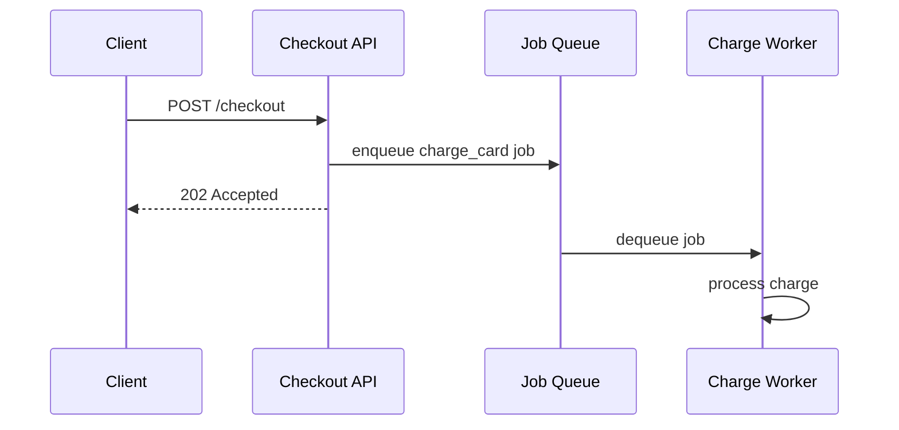

# Instrumentation — Middle

<!-- level-focus -->
At middle level, focus on this question:

> Across a handful of endpoints and a background worker, where should instrumentation live so it stays cheap to maintain and doesn't blow up cardinality as the system grows?

Use the smallest realistic scenario that exposes the decision and its failure behavior.

---

## Core Concept 1 — From "Add a Metric" to "Design an Instrumentation Layer"

At junior level, the question was "which metric type for this one number." At middle level, the question shifts to composition: a real service has dozens of endpoints, a background worker, an outbound HTTP client, and a database layer — and each is a candidate for instrumentation. The job now is choosing *where* instrumentation lives so it's consistent, cheap to add to, and doesn't quietly duplicate work or explode cardinality as more endpoints get added. This is a codebase-design problem, not a metric-type problem.

## Core Concept 2 — Per-Call-Site vs. Middleware Instrumentation

The first real trade-off: instrument each handler individually, or instrument once at a shared boundary (middleware, a decorator, a base client class).

| Approach | Consistency | Effort per new endpoint | Risk |
|---|---|---|---|
| **Per-call-site** (each handler calls the client library itself) | Low — easy to drift between handlers | High — someone must remember to add it every time | Endpoints silently ship uninstrumented; label naming drifts |
| **Middleware / decorator** (framework wraps every request automatically) | High — every request gets the same treatment | Near zero — new endpoints get it for free | One misconfigured wrapper affects every endpoint at once |

A middleware-based approach is almost always the better default for the common RED-style metrics (requests, errors, duration) — it removes the "did anyone remember to instrument this" question entirely. Example using a WSGI/ASGI-style middleware wrapping a Prometheus client library:

```python
class MetricsMiddleware:
    def __init__(self, app):
        self.app = app

    async def __call__(self, request, call_next):
        route = request.scope.get("route_template", "unmatched")
        method = request.method
        start = time.perf_counter()
        status = "500"
        try:
            response = await call_next(request)
            status = str(response.status_code)
            return response
        finally:
            duration = time.perf_counter() - start
            REQUEST_DURATION.labels(method=method, route=route).observe(duration)
            REQUESTS.labels(method=method, route=route, status=status).inc()
```

Per-call-site instrumentation still has a place for business-specific metrics that only make sense inside one handler (`orders_refunded_total`, `checkout_abandoned_total`) — those aren't generic HTTP concerns and shouldn't be forced into shared middleware. The trade-off is genuinely local: generic cross-cutting signal goes in middleware; domain-specific signal goes at the call site that knows the domain.

## Core Concept 3 — Under- and Over-Instrumentation Signals

**Under-instrumentation** shows up as: an incident where the team has to add debug logging or ship a hotfix just to answer "how often does this happen," because no metric already existed; a dashboard with gaps where a component silently has no signal at all; an on-call engineer guessing at request volume from log line counts.

**Over-instrumentation** shows up as: dozens of near-duplicate histograms per handler that nobody queries; a metrics backend whose active series count keeps climbing without a matching increase in genuinely new endpoints (a strong cardinality-creep signal); engineers avoiding adding new metrics because "the dashboard is already unreadable." Both failure directions are real, and the fix for either is the same discipline: instrument the RED signals (Rate, Errors, Duration) or USE signals (Utilization, Saturation, Errors) that map to a concrete question someone will actually ask, and stop there for anything else until a real need appears.

## Core Concept 4 — Testability and Change Cost

Instrumentation code that's tangled into business logic makes both harder to change independently. A handler that inlines metric calls directly among its business logic is harder to unit-test for business logic in isolation (you either have to stub the metrics client or accept test noise), and harder to change instrumentation without touching business code. Preferred pattern: keep instrumentation calls at clear boundaries (middleware, a thin decorator, or a small wrapper function) so:

- Business logic can be unit-tested without a metrics client in scope at all.
- Instrumentation itself can be tested separately — assert that calling the wrapped function increments the counter and observes the histogram, without asserting anything about the business result.
- Changing a metric's name or labels touches one place, not every call site.

```python
def instrumented(metric_name, route):
    def decorator(fn):
        @functools.wraps(fn)
        def wrapper(*args, **kwargs):
            start = time.perf_counter()
            status = "success"
            try:
                return fn(*args, **kwargs)
            except Exception:
                status = "error"
                raise
            finally:
                REQUESTS.labels(route=route, status=status).inc()
                REQUEST_DURATION.labels(route=route).observe(time.perf_counter() - start)
        return wrapper
    return decorator

@instrumented(metric_name="orders", route="/orders/:id")
def get_order(order_id):
    return lookup_order(order_id)
```

## Core Concept 5 — Scenario: Instrumenting Across a Request Path and a Worker

A checkout service has an HTTP API, a Redis-backed job queue, and a background worker that processes `charge_card` jobs. The naive approach instruments the HTTP layer well (via middleware) but leaves the worker completely dark — a common incremental-adoption trap, since the worker was added later and nobody revisited the instrumentation story.



The API already emits `http_requests_total` and `http_request_duration_seconds` via middleware. The worker needs its own, parallel set, because a "202 Accepted" from the API tells you nothing about whether the charge actually succeeded:

```python
JOBS_PROCESSED = Counter(
    "charge_jobs_total", "Charge jobs processed", ["outcome"]
)
JOB_DURATION = Histogram(
    "charge_job_duration_seconds", "Charge job processing duration",
    buckets=[0.1, 0.25, 0.5, 1, 2.5, 5, 10],
)
QUEUE_DEPTH = Gauge(
    "charge_queue_depth", "Jobs currently waiting in the charge queue"
)

def process_charge_job(job):
    QUEUE_DEPTH.dec()
    start = time.perf_counter()
    outcome = "success"
    try:
        charge_card(job.order_id, job.amount)
    except PaymentDeclined:
        outcome = "declined"
    except Exception:
        outcome = "error"
        raise
    finally:
        JOB_DURATION.observe(time.perf_counter() - start)
        JOBS_PROCESSED.labels(outcome=outcome).inc()
```

Note `outcome` distinguishes `declined` (a normal business outcome, expected to happen regularly) from `error` (an actual fault) — collapsing both into one `failure` label would make it impossible to alert on real errors without also paging on routine card declines. `QUEUE_DEPTH` is a gauge, incremented on enqueue and decremented here on dequeue, giving visibility into backlog that the HTTP-only view never could.

## Common Mistakes at This Level

- **Instrumenting the entry point but not the async continuation** — an API that returns 202 immediately, with no corresponding worker-side metric, creates a blind spot exactly where failures (a declined card, a timeout) actually happen.
- **Collapsing distinct outcomes into one generic label value** (`success`/`failure` when `declined` vs `error` are operationally different).
- **Duplicating instrumentation logic across handlers** instead of factoring it into middleware or a decorator, so a naming or bucket-boundary fix has to be repeated N times.
- **Adding a new histogram for every function** without checking whether an existing one, sliced with a label, already answers the question.
- **Not distinguishing gauges that need explicit increment/decrement pairs** — a `QUEUE_DEPTH.inc()` without a matching `.dec()` on every exit path (including error paths) silently drifts from reality over time.

## Apply it

1. Take a two-component system you can run locally (an API plus a background worker, or an API plus a scheduled job) and instrument the API layer using middleware-style instrumentation for requests/errors/duration.
2. Separately instrument the worker/job side with its own counter (labeled by outcome, distinguishing at least one expected business outcome from one true error outcome), a duration histogram, and a gauge for queue or backlog depth.
3. Deliberately introduce a scenario where the worker fails for one job (simulate a declined payment or a thrown exception) and confirm the outcome label correctly reflects it, separately from a successful run.
4. Write a short PromQL-style query (or equivalent) that answers "what fraction of charge jobs are failing right now" using only the worker-side metrics — confirming the API-side 202 response alone could not have answered this.
5. Refactor one duplicated piece of per-call-site instrumentation into a shared decorator or middleware, and confirm the metric output is identical before and after the refactor.

## Verify your work

- The API's metrics and the worker's metrics are visibly separate series, and you can explain why a 202-Accepted rate alone would have hidden the job failures.
- Your outcome label distinguishes at least one expected business result from one true error, and you can point to why collapsing them would break an alert.
- The queue-depth gauge correctly returns to its prior value after a burst of jobs completes, proving increment/decrement is paired on every code path including errors.
- After refactoring duplicated instrumentation into a shared decorator or middleware, the metric names, labels, and observed values are unchanged — proving the refactor didn't alter behavior.
- You can name one over-instrumentation smell and one under-instrumentation smell you specifically avoided or fixed in this exercise.

## Review questions

- What is the concrete trade-off between per-call-site instrumentation and shared middleware instrumentation?
- Why does a "202 Accepted" response from an API make worker-side instrumentation necessary rather than optional?
- What operational difference justifies separating a "declined" outcome from an "error" outcome instead of collapsing both into "failure"?
- What signal would tell you a service has drifted into over-instrumentation rather than under-instrumentation?
