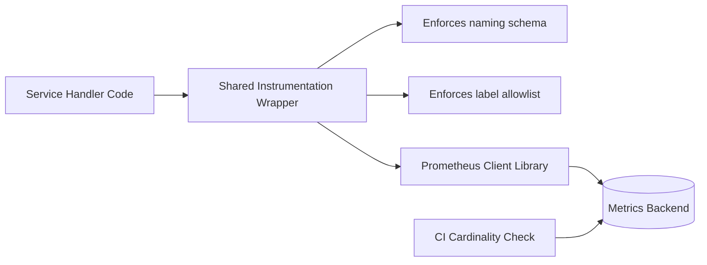

# Instrumentation — Senior

<!-- level-focus -->
At senior level, focus on this question:

> What invariants should an instrumentation layer guarantee platform-wide so that cardinality, naming, and coverage stay under control as dozens of services and hundreds of engineers add metrics independently?

Use the smallest realistic scenario that exposes the decision and its failure behavior.

---

## Core Concept 1 — Instrumentation as a System Boundary, Not a Per-Service Choice

At middle level, the unit of design was one service: where does instrumentation live inside its handlers and workers. At senior level, the unit of design is the *organization's instrumentation surface* — the shared library, conventions, and guardrails that every service's instrumentation flows through. The central architectural question isn't "is this metric correct" but "what happens when 200 engineers across 30 services each make their own local, individually-reasonable instrumentation decision, with no coordination between them." Left unmanaged, that produces a metrics backend with unpredictable cardinality growth, inconsistent naming that makes cross-service dashboards impossible to build, and blind spots that only surface during an incident.

## Core Concept 2 — Invariants Worth Enforcing

A senior-level instrumentation design states, and mechanically enforces, a small set of invariants rather than relying on every engineer independently remembering best practice:

- **Label value sets must be closed and bounded at instrumentation time**, not just "usually small in practice." An enum, a fixed route-template list, a fixed status-class list — never a value pulled from user input, a database row, or an external caller's request unless it has been validated against an allowlist.
- **Every metric name follows one naming schema** — `<namespace>_<subject>_<unit>_<suffix?>` — enforced by a shared client-library wrapper or a linter, not a style guide nobody rereads.
- **A cardinality budget exists per service and is measured**, not assumed. Track active time-series count per service over time; a metric that adds label combinations proportional to a growing user base or growing catalog is a design defect to catch before it ships, not after the backend degrades.
- **Every network boundary a service crosses (inbound HTTP, outbound HTTP, queue consume/produce, database calls) gets RED-style coverage from a shared client**, so coverage doesn't depend on any one engineer remembering to add it per service.
- **Coverage is itself measured** — a registry or convention that lets you ask "which of our N services currently have zero request-duration histograms" rather than discovering the gap only during an incident.

## Core Concept 3 — Failure Modes and Recovery

| Failure mode | How it manifests | Recovery |
|---|---|---|
| **Cardinality explosion** | A single unbounded label (user ID, order ID, raw path) silently multiplies time series until query latency or ingestion cost spikes, often weeks after the offending code shipped | Drop or relabel the offending series at the scrape/ingestion layer as an immediate mitigation; fix the instrumentation at the source; add a cardinality budget check to prevent recurrence |
| **Naming drift** | Two teams emit semantically identical metrics under different names (`http_requests_total` vs `api_requests_count`), making cross-service dashboards and org-wide alerting rules unreliable | Standardize via a shared client-library wrapper that only exposes pre-named helper functions, not raw `Counter()`/`Histogram()` constructors, for the common cross-cutting cases |
| **Silent coverage gaps** | A newly added component (a new worker, a new outbound integration) ships with zero instrumentation because instrumentation was never a required part of the service template | Bake the common metrics into the service scaffold/framework itself, so a new service is instrumented by default rather than by remembering |
| **Metric/reality divergence** | A gauge's increment and decrement calls fall out of sync after a refactor (an early-return path skips the decrement), so the gauge slowly drifts from ground truth and nobody notices until a postmortem | Prefer gauges computed by periodically re-deriving from the real backing store (query actual queue depth) over gauges maintained purely by paired inc/dec calls scattered across code paths |

The unifying lesson: individually-reasonable decisions at the per-service level (label choice, naming, whether to instrument a new component) compose into system-level risk that no single service owner is positioned to see. The architectural answer is to move the invariant into shared infrastructure — a wrapper library, a service template, a cardinality check in CI — so correctness doesn't depend on every engineer independently getting it right every time.

## Core Concept 4 — Scenario: A Shared Instrumentation Library Across Services

An organization has 40 services, each historically free to import the Prometheus client library directly and name metrics however the owning team preferred. A senior engineer is asked to design the shared instrumentation library that all services should migrate to.

Design decisions worth stating explicitly, with the evidence behind each:

- **Expose helper functions (`track_http_request(route, status, duration)`), not raw metric constructors**, for the common RED cases. Evidence: naming drift and label mistakes across the existing 40 services are the observed problem being solved; a wrapper that hides the raw API removes the decision points where drift happens, rather than trusting individual engineers to follow a style guide.
- **Validate label values against an allowlist at call time in non-production environments**, raising loudly on an unexpected value, while degrading to a fixed sentinel (`"other"`) in production rather than crashing the request path. Evidence: cardinality explosions are a well-documented, real failure mode; catching an unbounded label in a test or staging environment is far cheaper than discovering it after a production cardinality spike.
- **Make the wrapper own bucket-boundary defaults for histograms**, with per-call override only when a service has a genuinely different latency profile (a batch job's duration buckets should not default to values tuned for sub-100ms HTTP calls). Evidence: inconsistent bucket boundaries across services are a known cause of `histogram_quantile` results that can't be meaningfully compared or combined across services.
- **Do not attempt to force every service to migrate atomically.** A phased opt-in (new services default to the wrapper; existing services migrate on their own schedule, with a dashboard tracking migration percentage) matches how large migrations actually succeed, and avoids a big-bang cutover that risks losing metrics data during transition.

## Core Concept 5 — Questions That Expose Weak Assumptions

Before committing to a shared instrumentation design, a senior engineer should be able to answer:

- What happens, concretely, the first time a service needs a label value the allowlist doesn't yet contain — is there a fast, safe path to add it, or does the wrapper become a bottleneck that teams route around?
- Who owns the cardinality budget when it's exceeded — is it the platform team, or the service team, and is that ownership written down anywhere before the first incident forces the question?
- If the shared wrapper library itself has a bug (wrong bucket boundaries, a broken label), how many services does that affect simultaneously, and what's the rollback path?
- Does the design assume every future service looks like today's services (HTTP request/response), or does it also have an answer for queue consumers, streaming jobs, and scheduled batch work, which don't fit the RED shape as cleanly?

## Apply it

1. Design a shared instrumentation wrapper (a small library, in any language) that exposes named helper functions for HTTP request tracking and job/worker tracking, without exposing raw metric-constructor calls to consumers.
2. Add label-value validation that raises in a "dev/test" mode when a value isn't in a declared allowlist, but substitutes a sentinel value and only logs a warning in "production" mode — implement and test both branches.
3. Add a lightweight cardinality check: a function or script that, given a metric's currently observed label combinations, reports the count and flags if it exceeds a configured budget (e.g., more than 200 combinations for a single metric).
4. Write down, as a short design note, the ownership and rollback answers to the four questions in Core Concept 5 for your specific design.
5. Simulate a phased migration: instrument two "old" call sites using the previous, unwrapped pattern and two "new" ones using your wrapper, and produce a one-line report showing migration coverage (2 of 4, or 50%).

## Verify your work

- Your wrapper's public API has no path by which a caller can pass an arbitrary, unbounded label value straight through to the metrics client in dev/test mode without it being caught.
- The cardinality check correctly flags a metric you deliberately push over its configured budget, and stays silent for one that stays under it.
- Your design note gives a concrete, specific answer (not "TBD") to each of the four weak-assumption questions, including a named owner for the cardinality budget.
- The migration-coverage report accurately reflects the ratio of wrapped to unwrapped call sites in your simulation.
- You can explain, for at least one failure mode in the Core Concept 3 table, why the recovery step addresses the root cause rather than only the symptom.

## Review questions

- Why does moving a naming or label invariant into shared infrastructure produce more reliable outcomes than documenting the same invariant in a style guide?
- What is the specific risk of forcing a big-bang migration of all services onto a new instrumentation wrapper at once, versus a phased opt-in?
- Why should a gauge that's error-prone to maintain via scattered inc/dec calls be redesigned to periodically re-derive its value from the real backing store instead?
- Who should own a cardinality budget when it's exceeded, and what breaks if that ownership is left undecided until an incident forces the question?
