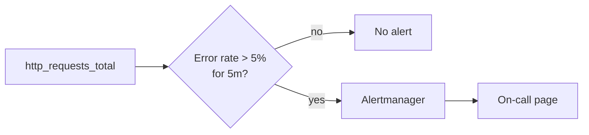

# Visualization and Alerts — Junior

<!-- level-focus -->
At junior level, focus on this question:

> For one service, can you build a dashboard panel that shows the right number and an alert rule that fires only when a real symptom is happening, without flapping on every blip?

Use the smallest realistic scenario that exposes the decision and its failure behavior.

---

## Core Concept 1 — Vocabulary: Dashboards, Panels, and Alerts

Visualization and alerting is the layer that sits on top of metrics: it takes numbers a service already emits (see Instrumentation) and turns them into something a human can look at or get woken up by.

- **Dashboard** — a page made of **panels**, each showing one query's result over time, usually as a graph, single number ("stat"), or table.
- **Panel query** — the actual query (in Prometheus this is PromQL) that a panel runs against the metrics backend to produce the numbers it draws.
- **Alert rule** — a query plus a threshold: "if this expression is true for this long, fire an alert."
- **`for:` duration** — how long the condition must stay true before the alert actually fires. This is the single most important knob for avoiding **flapping** — an alert that fires and resolves repeatedly because it reacts to a single noisy sample instead of a sustained condition.
- **Routing** — which human or team receives a given alert, and through which channel (page, Slack message, email, ticket).
- **Alert fatigue** — the state where so many low-value alerts fire that people stop trusting or reacting to them, including the ones that matter. It is a well-documented failure mode in on-call practice, not a hypothetical.
- **Severity** — a label on the alert (for example `page`, `warning`, `ticket`) that Alertmanager's routing configuration uses to decide how urgently, and to whom, it should be delivered. Not every true condition deserves the same severity: a genuinely broken checkout flow is a `page`; a slow background report job finishing late might only be a `ticket`.

A dashboard and an alert are built from the same underlying idea — a query over time-series metrics — but they answer different questions. A dashboard answers "what does this look like right now, and how did it get here," for someone actively looking. An alert answers "should someone be interrupted about this right now," for a query nobody is actively watching. Junior-level work is learning to build both from the same query so they never disagree about what's actually happening.

## Core Concept 2 — Symptom-Based vs Cause-Based Alerting

A **symptom** is something a user or an SLO would notice: requests failing, pages loading slowly, checkout not completing. A **cause** is something happening inside the system that might, or might not, turn into a symptom: CPU running hot, a disk filling up, one replica out of twenty being unhealthy.

Junior-level alerting should be built symptom-first, because a cause-based alert without a symptom check pages someone for things that were never actually a problem.

| | Symptom-based | Cause-based |
|---|---|---|
| Example | Error rate > 5% for 5 minutes | CPU > 80% for 5 minutes |
| What it tells you | Users are affected right now | Something looks abnormal, may or may not matter |
| Risk if used alone | Can miss slow-building problems until users notice | Fires on things that self-correct or don't affect users, causing noise |
| Best role | Primary page-worthy alert | Supporting signal on a dashboard, or a lower-severity notification |

The practical rule for a junior engineer: **every alert that pages a human should be symptom-based.** Cause-based signals belong on dashboards, where a human can glance at them while investigating a symptom-based page — not as independent pages of their own.

## Core Concept 3 — A Repeatable Method

For one service, building a first dashboard panel and alert:

1. **Pick the symptom that matters to users.** For an API, that's usually error rate or latency, not an internal resource metric.
2. **Write the panel query** that shows that symptom as a time series, using the same metric the alert will use — so what you see on the dashboard is exactly what the alert is reacting to.
3. **Set a threshold that maps to a real consequence**, not a round number picked at random ("5% errors" because that's roughly the point users start complaining, not "5%" because it's tidy).
4. **Add a `for:` duration** long enough to ride out a single bad scrape or a brief blip, short enough that a genuine incident still pages promptly.
5. **Route the alert to the team that can actually act on it**, with a severity that matches the real urgency (page vs. Slack message vs. next-business-day ticket).
6. **Write one sentence of runbook text** in the alert itself — what this means and the first thing to check — so whoever receives it isn't starting from zero.

## Core Concept 4 — Worked Example: Checkout API Error Rate

Service: `checkout-api`, a request-driven HTTP service. It already emits a `http_requests_total` counter labeled by `status`.

**Grafana panel query** (PromQL), shown as a percentage over a 5-minute window:

```promql
100 * (
  sum(rate(http_requests_total{job="checkout-api", status=~"5.."}[5m]))
  /
  sum(rate(http_requests_total{job="checkout-api"}[5m]))
)
```

This panel, titled "Checkout API Error Rate (%)," draws one line: the percentage of requests in the last 5 minutes that returned a 5xx status. It is symptom-based — it directly reflects what users experience, not an internal cause.

**Prometheus alert rule** built on the same expression, with a `for:` duration to avoid flapping:

```yaml
groups:
  - name: checkout-api-alerts
    rules:
      - alert: CheckoutAPIHighErrorRate
        expr: |
          100 * (
            sum(rate(http_requests_total{job="checkout-api", status=~"5.."}[5m]))
            /
            sum(rate(http_requests_total{job="checkout-api"}[5m]))
          ) > 5
        for: 5m
        labels:
          severity: page
        annotations:
          summary: "Checkout API error rate above 5% for 5 minutes"
          runbook: "Check checkout-api dashboard for a spike aligned with a deploy; if none, check the payment gateway dependency."
```

Walking through it: the expression is identical to the dashboard panel, so an on-call engineer sees the exact number that caused the page as soon as they open the dashboard. The threshold (5%) is chosen because below that, checkout has historically self-recovered; above it, it hasn't. The `for: 5m` means a single bad 30-second window — a deploy blip, one slow database query — will not page anyone; only a *sustained* 5-minute breach does. `severity: page` plus the `runbook` annotation is what Alertmanager uses to route this to the on-call phone and gives the receiving human a first step instead of a bare number.



## Common Mistakes

- **Alerting on a cause instead of a symptom.** Paging on "CPU > 80%" pages people for CPU spikes that never affected a single user request.
- **No `for:` duration, or one that's too short.** A rule with `for: 0` (or none at all) fires on the first bad scrape, producing pages for blips that resolve themselves a moment later.
- **Threshold picked for tidiness, not consequence.** Round numbers ("10%", "100ms") chosen because they look clean, rather than because they map to a real point where things start going wrong for users.
- **Dashboard panel and alert query don't match.** If the panel shows a differently-scoped or differently-windowed query than the alert, the on-call engineer opens the dashboard during an incident and doesn't see the number that paged them.
- **No routing thought given.** An alert that pages the wrong team, or pages at all for something that could wait until morning, trains people to ignore pages.
- **No runbook text.** A bare "CheckoutAPIHighErrorRate fired" with no next step wastes the first several minutes of every incident on orientation instead of action.

---

## Apply it

1. Pick one metric your service (or a practice service) already emits that reflects a user-facing symptom — error rate, request latency, or failed job count.
2. Write a dashboard panel query for it in PromQL (or your metrics system's query language) that aggregates over a 5-minute rolling window.
3. Write an alert rule using the same expression, with a threshold that maps to a specific consequence you can name, and a `for:` duration of at least a few minutes.
4. Add a one-sentence runbook annotation to the alert describing the first thing an on-call engineer should check.
5. Simulate a brief spike (a short burst of errors, or a manual test) that crosses the threshold for under a minute, and confirm the alert does *not* fire because it didn't sustain past `for:`.

## Verify your work

- The dashboard panel and the alert rule use the identical underlying expression, so what you see on the panel is exactly what would trigger the alert.
- You can state, in one sentence, the real-world consequence that justifies your chosen threshold value.
- A brief sub-`for:`-duration spike does not fire the alert; a sustained breach does.
- The alert has a runbook annotation that gives a concrete first step, not just a restated metric name.
- You can explain why the alert is symptom-based rather than cause-based.

## Review questions

- Why should an alert that pages a human be symptom-based rather than cause-based?
- What problem does the `for:` duration solve, and what happens if it is set to zero?
- Why should a dashboard panel and its corresponding alert rule use the same query?
- What is alert fatigue, and how does a threshold picked "for tidiness" contribute to it?
