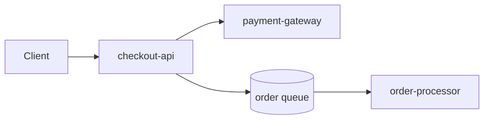

# Visualization and Alerts — Middle

<!-- level-focus -->
At middle level, focus on this question:

> Across a chain of dependent services, where should an alert actually live so that one real failure produces one meaningful page instead of five overlapping ones?

Use the smallest realistic scenario that exposes the decision and its failure behavior.

---

## Core Concept 1 — The Boundary Question: Where Does an Alert Live?

A junior engineer builds one alert for one service. A middle engineer has to decide, across several services that call each other, which layer owns the alert for a given failure — because if every layer alerts independently on the same underlying problem, one incident produces a pile of pages instead of one.

Take a chain: `checkout-api` calls `payment-gateway`, which calls a `queue` consumed by `order-processor`. If the payment gateway starts timing out, naive alerting produces four separate pages: payment-gateway's own error-rate alert, checkout-api's error-rate alert (because it's now failing too), a queue-depth alert (because unprocessed orders back up), and order-processor's lag alert. All four are "true," and all four are the *same incident*.

The design question is: which of these is the alert that should actually page someone, and which should be dashboard-only context? The general answer is to alert **at the boundary closest to the user-facing symptom**, and treat the others as supporting signals visible on the same dashboard, reached by drilling down from the page.

| | Alert at the edge (checkout-api) | Alert at every hop |
|---|---|---|
| Pages per incident | One | Several, all about the same root cause |
| On-call cognitive load | Low — one page, dashboard shows the chain | High — must correlate multiple pages manually |
| Risk | Might miss a problem that hasn't yet surfaced at the edge | Alert fatigue; real edge-cases get lost in noise |
| Best use | Primary paging strategy | Secondary alerts at *lower* severity, for on-call context only |

This is not "never alert on payment-gateway" — it's "payment-gateway's own alert should be lower severity or routed to a dashboard/ticket, while checkout-api's user-facing symptom is what pages."

## Core Concept 2 — Composing Dashboards That Support This Boundary

A dashboard should mirror the same boundary logic: an **overview** panel row showing the golden signals (rate, errors, duration) for the user-facing service, and **drill-down** rows underneath for each dependency, so that when the edge alert pages someone, the same dashboard already shows whether payment-gateway or the queue is the actual cause.



Practically, this means one dashboard, not four separate per-service dashboards that the on-call engineer has to know to open. The top row answers "is checkout broken right now" (the same query as the page). The rows below answer "why" without needing a second alert to tell you where to look.

## Core Concept 3 — SLO-Based Alerting: A More Mature Threshold Model

A flat threshold ("5% errors for 5 minutes") is a reasonable junior-level start, but it doesn't distinguish a slow, sustained problem from a brief, tolerable blip in a way that respects an actual reliability target. **Multi-window burn-rate alerting** improves on this: define an error budget from an SLO (say, 99.9% of requests succeed over 30 days), and alert when the service is burning that budget fast enough that, left unchecked, it would exhaust the budget too soon — checked over both a short window (catches fast, severe burn) and a long window (catches slow, sustained burn), which avoids paging on a five-minute blip that would only cost a trivial sliver of the monthly budget.

```yaml
- alert: CheckoutAPIErrorBudgetBurnFast
  expr: |
    (
      sum(rate(http_requests_total{job="checkout-api", status=~"5.."}[5m]))
      /
      sum(rate(http_requests_total{job="checkout-api"}[5m]))
    ) > (14.4 * 0.001)
    and
    (
      sum(rate(http_requests_total{job="checkout-api", status=~"5.."}[1h]))
      /
      sum(rate(http_requests_total{job="checkout-api"}[1h]))
    ) > (14.4 * 0.001)
  for: 2m
  labels:
    severity: page
  annotations:
    summary: "checkout-api burning error budget fast enough to exhaust it within hours"
```

The `14.4x` multiplier here is a standard burn-rate constant for a fast-burn window against a 99.9% monthly SLO — it means "burning budget 14.4 times faster than sustainable." The point for a middle-level engineer isn't memorizing the constant; it's understanding *why* two windows are checked together: the short window makes it react quickly to a severe outage, and the long window prevents a single short spike from tripping the fast-window check on its own.

Adopting this incrementally matters: don't rewrite every alert to burn-rate math in one pass. Start with the one or two services that have an actual SLO commitment (usually the most business-critical, user-facing ones), keep simple threshold alerts everywhere else, and expand burn-rate alerting only where the extra rigor earns its complexity.

## Core Concept 4 — Testability: Alert Rules Are Code, Test Them Like Code

Alert rules can be wrong in ways that are invisible until the incident that should have paged doesn't. Prometheus's `promtool test rules` lets you write unit tests against alert rules using synthetic time series, so a broken threshold or a typo'd label selector is caught in review instead of during an outage.

```yaml
# checkout_alert_test.yml
rule_files:
  - checkout_alerts.yml
tests:
  - interval: 1m
    input_series:
      - series: 'http_requests_total{job="checkout-api", status="500"}'
        values: '0+10x10'
      - series: 'http_requests_total{job="checkout-api", status="200"}'
        values: '0+90x10'
    alert_rule_test:
      - eval_time: 10m
        alertname: CheckoutAPIHighErrorRate
        exp_alerts:
          - exp_labels:
              severity: page
```

This is the same discipline as unit testing application code: it verifies the rule fires under the exact condition it's meant to catch (here, a synthetic series where 10% of requests are 500s, above the 5% threshold), and it can equally verify a rule does *not* fire on a series that stays under threshold. Running this in CI on every change to alerting rules catches regressions the same way a broken test catches a code regression — before it reaches production.

## Core Concept 5 — Under- and Over-Application Signals

Both directions are real failure modes, and the signals differ:

- **Under-applied** looks like: incidents where users complained before any alert fired; dashboards that only show infrastructure metrics (CPU, memory) with no panel answering "are users affected"; on-call engineers who say "I found out from a customer ticket."
- **Over-applied** looks like: on-call engineers muting entire alert channels; a rising ratio of alerts acknowledged-and-ignored versus acted-on; multiple pages firing for the same incident with no attempt at correlation or lower-severity routing for the non-primary ones.

The corrective move for over-application is exactly Core Concept 1 and 2: consolidate to edge alerts, demote internal-cause alerts to dashboard-only or ticket-severity, and only add a new page-worthy alert when a genuinely new failure mode is discovered that the existing edge alert wouldn't have caught.

## Core Concept 6 — Worked Scenario: Adding order-processor to an Existing Setup

`checkout-api` already has the edge alert from the junior level. The team adds `order-processor`, a queue consumer that finalizes orders asynchronously after checkout returns success to the user. A naive approach adds a symmetric error-rate alert on `order-processor` and pages on it the same way.

The better boundary decision: order-processor failures don't fail the user's checkout request (it already returned success) — they show up as a **symptom one hop removed**: orders stuck unprocessed. The correct user-facing signal isn't order-processor's internal error rate, it's queue lag/age — how long the oldest unprocessed message has been waiting:

```promql
max(time() - kafka_consumer_group_oldest_unacked_message_timestamp{group="order-processor"})
```

Alert on this (paging, with a `for:` long enough to tolerate normal processing jitter) rather than on order-processor's internal error counter (dashboard-only). This keeps the page count at one per real incident while still catching the specific way this component fails silently from the user's perspective — orders appearing to succeed but never actually completing.

## Verification at Two Levels

- **Unit level:** each alert rule has a `promtool` test (or equivalent) proving it fires on a synthetic breach and stays silent on synthetic normal traffic, including a case near the threshold boundary.
- **Integrated-flow level:** trigger a real (staging) failure at the payment-gateway layer and confirm exactly one page fires (checkout-api's edge alert), while the dashboard's drill-down rows for payment-gateway and the queue show the actual cause without a second page.

---

## Apply it

1. Take a chain of at least two dependent services (or design one for a practice exercise) and identify the current alert placement on each.
2. Redesign so exactly one paging alert exists per user-facing incident type, placed at the boundary closest to the user, with internal-cause alerts demoted to dashboard-only or ticket severity.
3. Build one dashboard with an overview row (the paging alert's own query) and drill-down rows for each dependency underneath it.
4. Write a `promtool`-style unit test (or your metrics system's equivalent) for the edge alert, covering both a breaching case and a non-breaching case.
5. Simulate a failure in the deepest dependency and confirm only the edge alert fires, while the dashboard drill-down correctly points at the real cause.

## Verify your work

- Exactly one alert fires when you simulate a failure at any single point in the chain, not one per affected service.
- The dashboard's overview row uses the same query as the paging alert, and its drill-down rows let you identify the failing dependency without a second page.
- Your alert rule unit test fails if you deliberately break the threshold (e.g., set it absurdly high) and passes once fixed.
- You can name, for each demoted (non-paging) alert, which specific new failure mode would justify promoting it to a page.
- You can explain, in the order-processor case, why queue lag is the correct symptom to alert on instead of the consumer's internal error rate.

## Review questions

- Why does alerting independently at every layer of a dependency chain increase on-call cognitive load rather than improve coverage?
- What problem does checking a burn-rate alert across two windows (short and long) solve that a single-window threshold does not?
- How does a `promtool`-style rule test catch a regression that manual review of the YAML might miss?
- What observable signals indicate that a team's alerting has become over-applied rather than under-applied?
