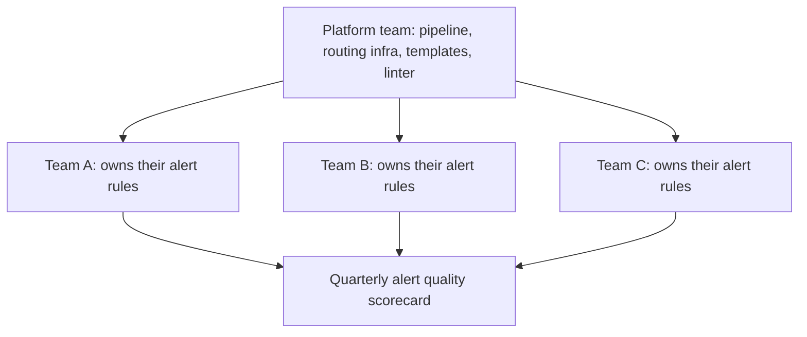

# Visualization and Alerts — Professional

<!-- level-focus -->
At professional level, focus on this question:

> How do you migrate forty teams from scattered, ad hoc alerting onto a shared platform without becoming the bottleneck every team has to queue behind, and how do you prove the new setup is actually better before you switch off the old one?

Use the smallest realistic scenario that exposes the decision and its failure behavior.

---

## Core Concept 1 — The Organizational Problem, Not the Technical One

Everything at junior through senior level assumes one team building one alerting setup well. At professional level, the same techniques (symptom-based thresholds, `for:` durations, dead man's switches, burn-rate alerting) already exist somewhere in the organization — the problem is that forty teams each arrived at them differently, or didn't. Some route pages through PagerDuty, some through a Slack channel nobody mutes carefully, some have no alerting at all and rely on customer tickets. A platform team is asked to bring this to a consistent, trustworthy baseline.

The temptation is to build one perfect centralized Alertmanager/Grafana platform and require every team to migrate onto it. This fails for a specific, predictable reason: a small platform team cannot review, configure, and support alert rules for forty teams' worth of services without becoming a queue every other team is blocked behind. The professional-level design question is not "what does the ideal alerting platform look like" — it's "what operating model lets forty teams each own their own alert quality with minimal coordination through the platform team."

## Core Concept 2 — Architecture Aligned to Ownership: Paved Road, Not Gatekeeper

The shape that solves this is a **paved road**: the platform team owns the shared pipeline (Prometheus federation, Alertmanager routing infrastructure, Grafana as the dashboard host, the dead man's switch that watches the whole pipeline) and publishes **self-service primitives** — alert rule templates, a linter, a review checklist — that let each service team write and own their own alert rules without the platform team reviewing every one by hand.



This is a cognitive-load decision as much as a technical one: a team that owns its own service already understands which of its failures are user-facing symptoms; a central platform team does not, and re-deriving that context for forty services doesn't scale. What the platform team *should* centralize is exactly the parts that are genuinely shared infrastructure and genuinely dangerous if duplicated badly: the notification-delivery path, the heartbeat/dead-man's-switch guarantee, and the linting rules that catch the well-known failure patterns (no `for:` duration, cause-based paging alerts, missing runbook annotations) before they ship.

```yaml
# CI lint check every team's alert rules must pass before merge
# (conceptual — enforced via promtool + a small custom linter)
rules:
  - require: "for" duration >= 2m on any rule with severity: page
  - require: "runbook" annotation present on any rule with severity: page
  - warn: alert expression references a *_cpu_* or *_memory_* metric with severity: page
      # cause-based signal at page severity — likely should be dashboard-only or lower severity
```

## Core Concept 3 — Governance: Ownership, Accountability, and the Audit Trail

Centralizing the notification pipeline creates an operational and compliance responsibility that didn't exist when each team ran its own scattered setup: a single place now knows who was paged, when, for what, and whether they acknowledged it. This is genuinely useful — it's the evidence base for the post-incident reviews described at senior level, aggregated across the whole org — but it also means the platform team now owns:

- **Retention policy** for alert and notification history, long enough to support post-incident review and any compliance obligation the organization has around incident response evidence, without keeping it indefinitely for no reason.
- **A clear ownership contract per alert**: every alert rule in the shared system has a named owning team, visible in its annotations, so an on-call engineer receiving an unfamiliar page (or an auditor reviewing incident response) can immediately identify who is accountable for it.
- **An escalation policy standard**: what happens if the named owning team doesn't acknowledge within a set window — a documented secondary escalation, not silence.

None of this requires the platform team to approve each team's individual thresholds; it requires the platform team to make ownership, escalation, and retention structurally impossible to skip — enforced by the linter and the routing configuration, not by review meetings.

## Core Concept 4 — Outcome Measures and Evidence-Based Exit Conditions

A migration of this scope needs explicit, measurable outcomes defined before it starts, and an exit condition for retiring the old, scattered setup that is evidence-based rather than calendar-based ("we'll turn off the old PagerDuty integrations six months from kickoff" is a schedule, not evidence that it's safe).

| Outcome measure | Baseline (scattered state) | Target on new platform |
|---|---|---|
| Teams with a dead man's switch covering their alert path | Near zero | 100% of migrated teams |
| Median time-to-acknowledge, page-severity alerts | Measured per team, often inconsistent or untracked | Tracked centrally, trending down or stable |
| Fraction of page-severity alerts that are cause-based rather than symptom-based | Unmeasured | Below an agreed threshold, caught by the linter |
| Fraction of real incidents (from post-incident reviews) with no alert that would have caught them | Unmeasured | Tracked, reviewed quarterly, driving new alert coverage |

Exit condition for decommissioning a team's legacy alerting path: that team has migrated its page-severity alerts to the shared platform, has a passing lint result, has been through at least one real or drilled incident on the new path with an acceptable time-to-acknowledge, and has explicitly signed off — not simply "it's been N weeks since they were told to migrate."

## Core Concept 5 — Decomposing the Migration Into Reversible, Observable Increments

Migrating forty teams at once is neither reversible nor observable — if something is subtly wrong with the shared pipeline's routing, forty teams discover it simultaneously, likely during a real incident. The migration is decomposed instead:

1. **Pilot with two or three teams** who already have relatively mature alerting, chosen specifically because a mistake in their migration is easy to diagnose and cheap to reverse — route both old and new paths in parallel for a period so nothing is lost if the new path has a gap.
2. **Validate the pilot against the outcome measures above** before expanding — not "the pilot teams didn't complain," but the measured precision/recall/time-to-acknowledge data compares favorably to their prior setup.
3. **Expand by cohort**, not by broadcast announcement to all forty teams at once — each cohort's migration includes running old and new paths in parallel briefly, so a failure in the new path during that cohort's transition is caught by the still-live old path rather than by a missed page.
4. **Only decommission a cohort's old path once its exit condition (Core Concept 4) is met**, and keep the dead man's switch on the new path running throughout, since it is exactly the mechanism that catches a shared-pipeline failure the whole migration depends on not having.
5. **Treat each cohort as reversible**: if a cohort's migration surfaces a real gap in the shared platform (a routing bug, a template that produces bad thresholds for a service shape the platform team hadn't seen), that cohort can fall back to its old path without blocking or rolling back any other cohort.

This decomposition is what keeps the platform team from becoming the bottleneck: each cohort moves largely independently, using self-service templates and the linter rather than requiring platform-team review of every rule, while the platform team's attention goes to the shared pipeline and the aggregate outcome measures.

## Core Concept 6 — Cross-Team Contracts

The arrangement between the platform team and every service team needs to be explicit, not tribal knowledge, because it's what lets both sides work independently with confidence:

- **Platform team provides**: the notification pipeline's uptime and its own dead man's switch, alert rule templates and a linter with a documented rule set, a shared Grafana instance with a dashboard-composition convention (overview row + drill-down rows, from the middle-level pattern), and a quarterly aggregate alert-quality report.
- **Service team provides**: ownership of their own alert rules and thresholds, a named on-call rotation and escalation path for their alerts, a passing lint result before any page-severity rule ships, and participation in the quarterly scorecard review for their own alerts.
- **Shared and jointly reviewed**: the exit criteria for any given team's migration, and any incident where the shared pipeline itself was implicated — reviewed jointly rather than attributed unilaterally to either side, since a shared-infrastructure incident is exactly the kind of failure this operating model exists to make rare and quickly diagnosable.

## Sustained Delivery, Not a Static Target

The scorecard and lint rules are not a one-time gate at migration time — they're the mechanism that keeps forty independently-owned teams' alerting from drifting back into the scattered state over the following years, as services are rewritten, teams reorganize, and on-call rotations turn over. The quarterly review is where the organization catches the slow decay: a team whose alert precision has quietly dropped, a dead man's switch that stopped reporting months ago and nobody noticed, an escalation policy that still names someone who left the team. Treating this as sustained delivery, reviewed on a cadence, is what distinguishes a durable operating model from a migration that succeeds once and quietly rots.

---

## Apply it

1. For an organization (real or a realistic practice scenario) with multiple teams and inconsistent alerting, draft the paved-road split: what the platform team centralizes versus what each service team owns.
2. Write the lint rule set a CI check would enforce on every team's alert rules before merge (at minimum: `for:` duration present, runbook annotation present, owning team labeled).
3. Define the outcome measures table (like Core Concept 4) with a real or estimated baseline and a target for at least three metrics.
4. Decompose a rollout to three cohorts of teams, specifying for each cohort: the parallel-run period, the exit condition to decommission their old path, and what triggers a fallback for that cohort specifically.
5. Draft the cross-team contract as a short document: what the platform team commits to provide, what each service team commits to own, and what gets jointly reviewed.

## Verify your work

- Your lint rule set would have caught at least one of the failure patterns described at junior/middle level (missing `for:`, cause-based paging alert, missing runbook) if applied retroactively to a real example.
- Your outcome measures table has a baseline and target that are each independently verifiable from data, not stated as an impression.
- Each cohort in your rollout plan has an explicit, evidence-based exit condition, and you can state what specific event would trigger a fallback for that cohort without affecting the others.
- Your cross-team contract assigns every one of the four commitments (pipeline uptime, templates/linter, alert ownership, escalation path) to exactly one side, with no commitment left ambiguous.
- You can name the specific quarterly review mechanism that would catch a team's alert quality quietly decaying a year after migration, rather than relying on the migration itself as a one-time fix.

## Review questions

- Why does requiring platform-team review of every team's alert rules fail to scale past a handful of teams?
- What distinguishes an evidence-based exit condition for decommissioning a legacy alerting path from a calendar-based one, and why does the difference matter?
- Why is each migration cohort designed to be independently reversible rather than migrating all teams together?
- What ongoing mechanism prevents alert quality from decaying after the migration is declared complete?
