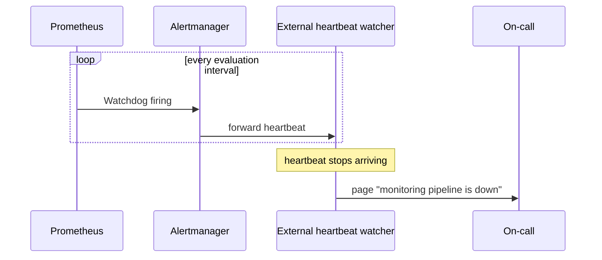

# Visualization and Alerts — Senior

<!-- level-focus -->
At senior level, focus on this question:

> What happens when the alerting pipeline itself fails silently, and what invariant guarantees someone still finds out?

Use the smallest realistic scenario that exposes the decision and its failure behavior.

---

## Core Concept 1 — The Alerting Pipeline Is Itself a System With Failure Modes

Everything up to this level treats "the alert fires" as a given, once the rule and threshold are right. At senior level, the alerting pipeline itself — the metrics scrape, the rule evaluator, Alertmanager, the notification channel (PagerDuty, Slack, SMS gateway) — is infrastructure that can fail independently of the service it's meant to protect, and its failure is uniquely dangerous because it's *silent by default*: nothing pages to tell you that paging is broken.

Concretely, any of these can happen without any visible symptom in the service being monitored:

- The Prometheus server evaluating the rule crashes or loses its target.
- Alertmanager loses quorum in a clustered deployment and stops routing.
- A notification integration (an expired API token, a renamed Slack channel, a phone-carrier outage) silently drops outbound pages.
- A misconfigured **silence** or **inhibition rule**, left over from a past maintenance window, is quietly suppressing a real alert months later.

The system boundary a senior engineer has to draw is not just "service A alerts on symptom B" — it's "the whole path from metric to human notification, and what detects a break anywhere along it."

## Core Concept 2 — The Invariant: Something Independent Watches the Watcher

The standard answer to "how do you know the alerting pipeline itself is alive" is a **dead man's switch** (also called a heartbeat alert): a rule that is *supposed* to fire continuously at a low severity, and an external system, outside the monitored path, that pages if that heartbeat ever stops arriving.

```yaml
- alert: Watchdog
  expr: vector(1)
  labels:
    severity: none
  annotations:
    summary: "This is a continuously firing heartbeat used to verify the alerting pipeline is functioning."
```

`vector(1)` is always true, so this alert is always firing, by design. It is routed through Alertmanager to an external dead-man's-switch service (or a receiver configured to page if it *stops* receiving this alert within an expected interval). The invariant this protects: **if the entire pipeline — Prometheus, the rule evaluator, Alertmanager, and the outbound notification channel — goes down, the absence of the heartbeat is itself the alert**, delivered through a path that does not depend on any of the components that just failed.



This is the same principle as a building's fire alarm having its own battery backup, independent of the building's main power — the alarm has to survive the failure it's meant to detect.

## Core Concept 3 — A Second Invariant: Silences and Inhibitions Expire

A **silence** (temporarily mute an alert, e.g., during a known deploy) and an **inhibition rule** (suppress a lower-severity alert when a related higher-severity one is already firing, to avoid duplicate pages for the same root cause) are both legitimate and necessary — without them, planned maintenance would page on-call constantly, and cascading failures would produce alert storms. But both are also a real, recurring source of the worst kind of incident: a genuine alert that should have paged, silently swallowed by leftover configuration from an unrelated event weeks earlier.

The invariant a senior engineer enforces: **every silence has an expiry, and every inhibition rule is reviewed as production configuration, not a one-off Slack command someone typed during an incident and forgot about.** Practically, this means silences created ad hoc during an incident get a hard TTL (Alertmanager silences do expire, but the discipline is setting a *short* one, not accepting whatever default), and inhibition rules live in version control, get code review, and are periodically audited for ones whose trigger condition can no longer occur.

## Core Concept 4 — Evidence, Not Preference: Measuring Whether the Design Actually Works

A senior-level alerting design has to be validated against evidence, not defended by intuition. The standard evidence sources:

- **Precision** — of alerts that fired, what fraction corresponded to a real, actionable incident (as opposed to something that self-resolved or required no action)? Low precision is the direct, measurable form of alert fatigue.
- **Recall** — of real incidents (found via customer reports, post-incident reviews, or synthetic checks), what fraction were caught by an alert *before* a human noticed some other way? Low recall means the alerting surface has a real gap.
- **Time-to-acknowledge and time-to-mitigate**, tracked per alert, to see whether pages are being acted on promptly or routinely snoozed — a rising time-to-acknowledge on a specific alert is itself a signal that alert has lost the team's trust.
- **Post-incident review data**: for every incident with customer impact, whether an alert fired, and if not, why not — this is the single most reliable source for finding real gaps, because it starts from a confirmed real failure rather than a hypothesis about one.

These are the same categories used to evaluate a classifier (precision/recall), applied to an alerting system deciding "is this worth waking someone up for." A design choice — a new threshold, a new burn-rate window, a new routing tier — should be justified by moving one of these numbers, not by "this feels more correct."

## Core Concept 5 — Worked Scenario: Multi-Region Alertmanager and a Missed Incident

A company runs `checkout-api` across two regions, each with its own Prometheus and a clustered Alertmanager pair meant to provide HA within the region. During a routine network partition between the two Alertmanager replicas in the primary region, the cluster loses quorum silently — it keeps accepting alerts locally but stops forwarding notifications, because the notification-dispatch logic is gated on cluster consensus in this deployment. Checkout-api's error-rate alert *does* fire internally, but no page reaches on-call. Customers eventually report the outage 40 minutes in.

The post-incident review surfaces the actual gap using the evidence categories above: recall failed (a real incident was caught internally but not delivered), and the root cause is a single point of correlated failure in the Alertmanager cluster that the design had implicitly assumed would only ever fail as a whole, not partially. Two plausible fixes are on the table:

| Approach | What it fixes | Trade-off |
|---|---|---|
| Federate to a second, independent Alertmanager in a different region, fed by both regions' Prometheus servers | Removes single point of correlated failure in the notification path | More config to keep in sync; risk of duplicate pages if not paired with dedup/inhibition |
| Add a dead man's switch heartbeat routed through a path independent of the region's own Alertmanager cluster | Catches *any* pipeline failure, including this one, without needing to anticipate every specific failure mode | Detects that something is broken, but not what — still requires a human to investigate which layer failed |

Given evidence that the failure mode was "partial, silent degradation" rather than "clean total outage," the dead man's switch is the design that catches this class of failure *and* future unanticipated ones, whereas federation only fixes the specific mechanism seen this time. The team adopts both, in this priority: heartbeat first (closes the blind spot immediately, regardless of cause), federation second (reduces how often the heartbeat needs to catch anything at all).

## Questions That Expose Weak Assumptions Before Implementation

Before committing to an alerting architecture, a senior engineer should be able to answer:

- If Alertmanager itself is down, does anyone find out, and how fast, through a path that does not depend on Alertmanager?
- Does every active silence have an expiry, and is there a periodic audit of who created each one and why?
- For the last several real incidents, would the current alert set have caught them — checked against the actual post-incident record, not assumed?
- If a notification channel's credentials silently expire (an API token, a webhook URL), what detects that within minutes rather than at the next real incident?

---

## Apply it

1. For an alerting setup you maintain (or a practice Prometheus/Alertmanager stack), add a `Watchdog`-style heartbeat alert and route it through a receiver or external service distinct from your normal paging path.
2. Deliberately break the normal notification path (revoke a webhook, misconfigure a receiver) and confirm the heartbeat's absence is detected and reported through the independent path.
3. Audit all active silences and inhibition rules; for each one, record its creator, its original reason, and whether its expiry (or lack of one) is appropriate.
4. Pull the last three real incidents (or simulate three plausible ones) and check, for each, whether an existing alert would have fired — record precision/recall style: did it fire, was it actionable, and if it didn't fire, why not.
5. Write a one-page decision record comparing at least two plausible fixes for the biggest gap found in step 4, using the evidence from step 4 to justify the choice.

## Verify your work

- Breaking the normal notification path produces a detected, escalated failure through the independent heartbeat path within the expected interval, not silence.
- Every active silence in your audit has a documented owner, reason, and expiry — or you've flagged and removed the ones that don't.
- You have a written precision/recall-style tally for your last three incidents, not just a verbal impression of "alerting is fine."
- Your decision record names the specific evidence (not preference) that justified choosing one fix over the alternative.
- You can state, for your current design, what specific failure would still go undetected today.

## Review questions

- Why is the failure of the alerting pipeline itself uniquely dangerous compared to the failure of a monitored service?
- What does a dead man's switch guarantee that a normal threshold-based alert cannot?
- Why should inhibition rules and silences be treated as version-controlled configuration rather than one-off incident actions?
- What evidence would tell you that an alerting design has a recall problem rather than a precision problem?
