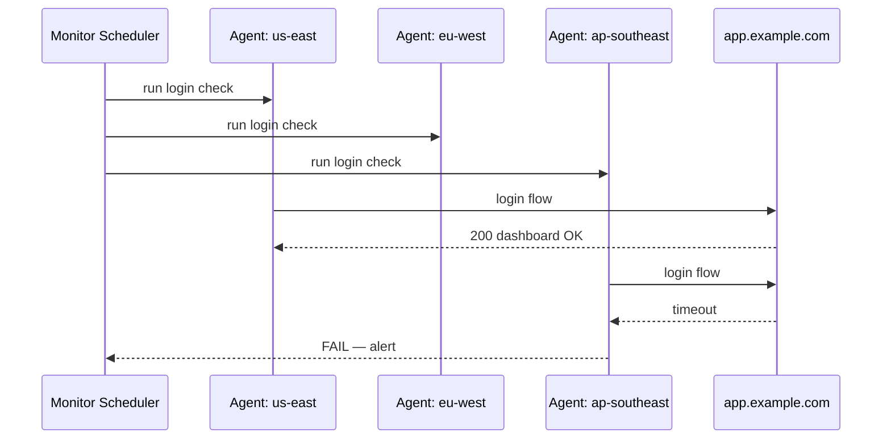

# Synthetic Monitoring and RUM — Junior

<!-- level-focus -->
At junior level, focus on this question:

> For one critical user flow, can you write a synthetic check that correctly detects a break, and read one Core Web Vitals number from real user data, without confusing what each data source is actually telling you?

Use the smallest realistic scenario that exposes the decision and its failure behavior.

## Core concept 1 — Two ways to look at a system from the outside

Health, availability, performance, security, and usage monitoring all watch a system from the *inside* — the process, the host, the logs and metrics it emits about itself. Synthetic monitoring and RUM are different: they watch what a user's browser or an external caller actually experiences, from *outside* the system, with no privileged access to internals.

- **Synthetic monitoring** — a script, running on a schedule from one or more locations you choose, that pretends to be a user: it loads a page, submits a form, calls an API, and checks whether the result is correct and how long it took. Nobody real is involved, so it runs whether or not any customer is currently using the product — including at 3am when real traffic is near zero.
- **Real User Monitoring (RUM)** — a small piece of JavaScript (or a mobile SDK) that runs inside real users' actual sessions and reports what really happened: how long the page took to become usable, whether anything visually jumped around, whether a click felt instant or sluggish. RUM has no opinion about a page nobody visited — no visitor, no data.

The framing worth memorizing: **synthetic tells you it's broken; RUM tells you who's affected.** A synthetic check failing means "this specific scripted path is down or wrong, right now" — narrow but immediately actionable. RUM data shifting means "real users are having a different experience" — broad and representative, but it can't run before you have real traffic, and it can't isolate a cause the way a controlled, repeatable script can.

## Core concept 2 — Lab data vs field data

Core Web Vitals — a real, named set of user-experience metrics — draws exactly this line and gives it vocabulary worth reusing:

- **Lab data** — measured in a controlled, repeatable environment (a synthetic run, a local Lighthouse audit). Same script, same conditions, every time — comparable run-to-run, and good for catching a regression the moment it's introduced.
- **Field data** — measured from real users in real conditions (RUM). Different devices, networks, and locations every time — representative of the real experience, but noisy to compare run-to-run because the mix of who showed up also changes.

The three Core Web Vitals metrics, using the current (INP-based) definitions:

| Metric | Measures | Good threshold (field, p75) |
|---|---|---|
| **LCP** (Largest Contentful Paint) | How long until the main content is visible | ≤ 2.5s |
| **INP** (Interaction to Next Paint) | How responsive the page is to clicks/taps/keys | ≤ 200ms |
| **CLS** (Cumulative Layout Shift) | How much visible content unexpectedly moves | ≤ 0.1 |

These thresholds are conventionally judged at the 75th percentile of real (field) sessions — not the average, and not a single lab run — because a page can look fine in one controlled test and still fail a meaningful share of real users on slow networks or low-end phones.

## Core concept 3 — A repeatable method

For one user-facing flow you've been asked to monitor from the outside:

1. **Pick one concrete flow**, not "the website" — for example, "log in, then load the account dashboard."
2. **Write a synthetic script** that performs the real steps (not just `GET /` — that proves the homepage loads, not that login works) and asserts on the *result*, not just the HTTP status: does the dashboard actually show the account name?
3. **Run it from more than one location.** A single vantage point can't tell a global outage from a regional network problem between that one place and your target.
4. **Add RUM to the same flow** so you see what real users on real devices experience, not just what your script — probably on a fast, wired connection — experiences.
5. **Read the two together, not either alone.** Synthetic red with RUM fine usually means your script or its test data is stale. Synthetic green with RUM degrading usually means a real-world condition your script never exercises — a slow network, a specific device, a specific region.

## Worked example — a login-flow synthetic check

A small Node.js script using Playwright, the kind a tool like Checkly or a scheduled job would run every few minutes from several regions:

```javascript
const { chromium } = require('playwright');

async function checkLogin(region) {
  const browser = await chromium.launch();
  const page = await browser.newPage();
  const start = Date.now();

  await page.goto('https://app.example.com/login');
  await page.fill('#email', 'synthetic-monitor@example.com');
  await page.fill('#password', process.env.SYNTHETIC_PASSWORD);
  await page.click('#submit');

  await page.waitForSelector('#dashboard-welcome', { timeout: 5000 });
  const text = await page.textContent('#dashboard-welcome');

  const durationMs = Date.now() - start;
  const ok = text.includes('Welcome back');

  console.log(JSON.stringify({ region, ok, durationMs }));
  if (!ok) throw new Error(`Login flow failed in ${region}: unexpected dashboard content`);

  await browser.close();
}

checkLogin(process.env.CHECK_REGION);
```

Run identically from `us-east`, `eu-west`, and `ap-southeast` every 5 minutes. A realistic result set:

| Region | Result | Duration |
|---|---|---|
| us-east | OK | 620ms |
| eu-west | OK | 640ms |
| ap-southeast | **FAIL** — timeout waiting for `#dashboard-welcome` | 5000ms (timed out) |

Read correctly: two regions pass, one fails identically at the same step, at the same time. That pattern — one region only — points toward something regional (a CDN edge node, a DNS resolution issue, a network path) rather than a global application bug, because a real code defect would normally fail everywhere at once.



## Worked example — Core Web Vitals RUM snippet

The `web-vitals` library — the reference implementation published for exactly this purpose — reports each metric as it becomes available in a real visitor's browser:

```javascript
import { onLCP, onINP, onCLS } from 'web-vitals';

function sendToAnalytics(metric) {
  const body = JSON.stringify({
    name: metric.name,       // 'LCP' | 'INP' | 'CLS'
    value: metric.value,
    id: metric.id,
    page: location.pathname,
  });
  // sendBeacon survives the page being closed or navigated away from
  navigator.sendBeacon('/rum-collector', body);
}

onLCP(sendToAnalytics);
onINP(sendToAnalytics);
onCLS(sendToAnalytics);
```

A single real session might report `LCP=1.9s, INP=140ms, CLS=0.02` — all within the "good" thresholds. That is one data point, not the answer; the number you actually act on is the **p75 across many real sessions**, aggregated by your collector over a trailing window (commonly 28 days for public reporting, but any stable window works internally).

## Common mistakes

- **Treating a synthetic "200 OK" as proof the page is fast for real users.** Synthetic checks usually run from a good network on a fast machine; they can stay green while real users on 3G phones sit well outside the LCP/INP/CLS thresholds.
- **Checking only the homepage.** A synthetic check on `GET /` doesn't exercise login, checkout, or search — the flows that actually carry business risk usually involve state and multiple steps.
- **Running from a single location.** One vantage point cannot distinguish "the whole app is down" from "the network path from this one place is broken."
- **Reading one RUM session as if it represents everyone.** Field data has to be aggregated — p75 is the Core Web Vitals convention — before it means anything about the real experience.
- **Confusing lab and field data.** A green Lighthouse (lab) score and a red field CLS number are not a contradiction — they're two different sampling conditions telling you different things.
- **Letting the synthetic account's test data go stale.** A hardcoded test password or a test account whose data changed shape can make a script fail for reasons that have nothing to do with a real outage.

## Apply it

1. Pick one real or practice login (or signup) flow you can run against — a demo app, a staging environment, or a public test site.
2. Write a synthetic script (Playwright, Puppeteer, or a multi-step `curl` sequence) that logs in and asserts on the resulting page content, not just the HTTP status code.
3. Run the script from at least two different network vantage points (a local machine and a cloud VM in a different region, or two different CI runners) and record pass/fail and duration for each.
4. Add the `web-vitals` snippet above to a real or test page you control, trigger a few page loads yourself, and capture the reported LCP, INP, and CLS values from your browser console.
5. Write two sentences: one explaining what your synthetic result tells you, one explaining what your RUM values tell you, and why they are not the same kind of evidence.

## Verify your work

- Your synthetic script fails loudly (non-zero exit code, clear error message) when you deliberately break the flow (wrong selector, wrong password) — proving it checks the result, not just that a page loaded.
- You have recorded pass/fail and duration from at least two distinct locations for the same check.
- You can read your own LCP/INP/CLS console output and correctly label each as "good," "needs improvement," or "poor" against the thresholds above.
- You can explain, in your own words, one thing RUM would catch that your synthetic script would miss, and one thing your synthetic script would catch that RUM never would.

## Review questions

- What is the difference between what a synthetic check proves and what a RUM metric proves?
- Why does Core Web Vitals distinguish "lab" data from "field" data?
- Why should a synthetic check run from more than one location?
- Why is a single RUM session not enough evidence to judge real-user performance?
