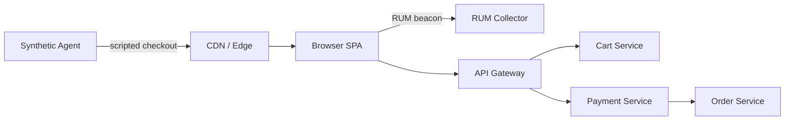

# Synthetic Monitoring and RUM — Middle

<!-- level-focus -->
At middle level, focus on this question:

> For a checkout flow spanning a CDN-fronted SPA and several backend services, how do you decide which parts get a synthetic check, which get RUM instrumentation, and how do you keep the resulting alerts from paging on-call twice for one incident?

Use the smallest realistic scenario that exposes the decision and its failure behavior.

## 1. The boundary decision: what to script vs what to observe

Both synthetic checks and RUM cost something ongoing — a synthetic script is test code someone maintains; a RUM event is a line item in a billing dashboard and a payload someone has to keep meaningful. The middle-level skill is choosing where each one earns its keep, not reaching for both everywhere.

**Script it (synthetic) when:**
- The flow is revenue- or trust-critical and needs to be verified even at zero real traffic (3am, a newly-deployed region, a low-traffic enterprise-only feature).
- The correctness question is binary and checkable by assertion — "did the order confirmation page show an order number?" — not a matter of degree.
- You want detection latency bounded by a fixed interval, independent of how much real traffic is flowing.

**Observe it (RUM) when:**
- The question is about *distribution* across real devices, networks, and geographies — "how slow is checkout for mobile users in Southeast Asia?" — which no single scripted run, however carefully placed, can answer.
- The signal only matters in aggregate (Core Web Vitals, error rates by segment) and doesn't need a pass/fail verdict on any one session.
- The cost of maintaining a script that keeps pace with UI changes would exceed the value of catching issues a moment sooner than real users would surface them.

| Dimension | Synthetic | RUM |
|---|---|---|
| Coverage | Only the paths you scripted, from vantage points you chose | Every real page and flow real users touch, across whatever devices/networks/browsers show up |
| Requires real traffic | No — runs on schedule regardless of load | Yes — silent on pages or times with no visitors |
| Cost driver | Compute for scheduled runs + agent locations; roughly fixed | Grows with visitor volume (SDK overhead, ingestion, storage) plus instrumentation upkeep |
| Consistency | High — same script, same assertions, comparable run-to-run (lab data) | Low run-to-run, meaningful only in aggregate (field data) |
| Catches zero-traffic outages | Yes | No |
| Catches real device/network variance | No — fixed environment | Yes — this is its core strength |
| Detection latency | Bounded by check interval, independent of traffic | Bounded by real traffic volume; can lag on low-traffic pages |
| Best for | Deploy gates, uptime of critical flows, alerting before users notice | Prioritizing UX work, segment-specific pain (device, region, network) |

Most real systems need both on the same flow, applied to different questions — not one chosen over the other.

## 2. A cross-component scenario: instrumenting checkout

Take a checkout flow: an SPA served from a CDN, calling an API gateway that fronts a cart service, a payment service, and an order service.

The synthetic check exercises the whole path — add to cart, submit payment against a sandboxed test card, confirm an order number appears — from three regions every three minutes. It proves the *entire chain* still works end to end, including the CDN and the gateway, which server-side APM on any one service can't see (each service only sees requests that already made it past the edge).

RUM, instrumented once in the SPA, reports Core Web Vitals for every real checkout session plus a couple of custom timing marks the team cares about specifically — `time_to_cart_response` and `time_to_payment_confirmation` — measured with the Navigation/User Timing APIs and sent alongside the standard vitals.

A real gap this setup catches that server-side dashboards alone would miss: a CDN misconfiguration serves a stale JavaScript bundle to the `eu-west` edge only. Every backend service's own metrics look perfectly healthy — the requests that do arrive succeed. But the stale bundle contains a broken checkout button handler, so EU users can't submit payment at all. Synthetic checks from `eu-west` catch it within minutes (assertion on "order confirmed" fails); RUM from real EU sessions shows a spike in JS errors and a collapse in completed-checkout events, with the region tag pointing straight at the cause. No server-side metric ever moves, because the failure lives entirely in the browser and the edge.

## 3. Under-application and over-application signals

**Under-application** looks like this: the team has excellent server-side APM and dashboards, and concludes that's sufficient — then discovers, only from a customer complaint, that a CDN edge has been serving broken assets to one region for two days. The tell: nobody can answer "how do we know the checkout button actually works from a real browser in every region we serve?" without saying "we'd find out when someone complains."

**Over-application** looks like the opposite failure: fifteen synthetic checks per flow, each asserting on an exact CSS selector or a specific button label, running every 60 seconds from six regions against a live payment sandbox. Every UI copy change or button re-styling breaks two or three checks; on-call learns to ignore synthetic alerts because they're usually a stale selector, not a real outage — the same alert fatigue that under-alerting on the server side produces. A second concrete sign: the payment provider's sandbox starts rate-limiting or flagging the account, because "one checkout per minute per region, forever" looks like abuse traffic, not monitoring.

The fix in both directions is the same: match the check's assertion to what would actually constitute a customer-visible failure (an order number appearing, not a specific pixel), and match its frequency and region count to the actual blast-radius cost of a slow detection versus the actual cost (rate limits, review burden, flakiness) of running it.

## 4. Incremental adoption

Don't instrument everything on day one. A workable sequence:

1. **One synthetic check on the single most revenue-critical flow** (checkout, or login if there's no checkout), from two regions, asserting on real content.
2. **Sitewide Core Web Vitals RUM**, via the shared `web-vitals` snippet — cheap to add, no ongoing script maintenance, and it immediately gives a baseline for every page, not just the one flow you scripted.
3. **Custom RUM timing marks** on the two or three business events that matter most (`time_to_cart_response`, `time_to_payment_confirmation`), once the baseline vitals prove the instrumentation pipeline itself works.
4. **Expand synthetic coverage** to the next few critical flows and additional regions, informed by what RUM segment data actually shows is slow or broken — not instrumenting flows nobody complains about.
5. **Tie both into alerting and on-call**, only once the signal-to-noise ratio has been checked (step 5 below) — an untested alert path is worse than no alert.

## 5. Correlating alerts instead of duplicating them

A predictable failure mode: the synthetic check for checkout fires an alert the moment the CDN issue starts. Ninety seconds later, the RUM error-rate anomaly detector also fires, because real EU sessions are now failing too. On-call gets paged twice, for the same incident, from two different systems, with no indication they're the same event.

The fix is correlation, not duplication:

- **Tag both signals with the same identifiers** — `flow=checkout`, `region=eu-west`, `service=payment` — so an alerting or incident tool can group them into one incident instead of two.
- **Pick a primary trigger.** For a scripted, binary flow, the synthetic failure is usually the crisper signal (it's asserting on the exact outcome that matters) — let it open the incident, and attach the RUM anomaly as corroborating context inside the same alert rather than a second page.
- **Suppress the corroborating alert** for a short window once the primary has fired for the same tags, rather than routing both independently to the pager.

## 6. Verification: unit-level and integrated-flow level

Treat a synthetic check like the test code it is, and verify it at two levels.

**Unit level — does the check itself work?** Deliberately break the thing it asserts on (rename the confirmation element's ID in a staging deploy, or point the script at a build with a known-broken payment step) and confirm the check fails with a clear error, not a false pass and not a flaky timeout that could mean anything.

**Integrated-flow level — does the whole pipeline work end to end?** Confirm that a failing check actually reaches a human: check runs → failure recorded → alert fires → routes to the right on-call rotation → page is received, within the expected detection-latency budget. Do this by intentionally breaking a staging or canary endpoint and timing how long it takes for a real page to land — this is the only way to know the pipeline works, as opposed to assuming it does because the dashboard has a green checkmark on it.

## Common mistakes

- **Scripting every UI detail instead of the outcome.** Asserting on exact selectors and copy text couples the check to presentation, not correctness, and turns every redesign into a wave of false failures.
- **Adding RUM and synthetic to the same flow with no shared tagging**, making later correlation of a single incident's two alerts a manual, error-prone job during an actual outage.
- **Instrumenting everything before validating the pipeline works at all.** A synthetic check nobody has verified actually pages anyone is a false sense of coverage.
- **Skipping the "why did we choose this boundary" note.** Six months later, nobody remembers whether a given flow was scripted because it's revenue-critical or just because it was easy, and the check either gets deleted by someone unsure if it matters, or kept forever unmaintained.
- **Treating RUM sampling as free.** 100% RUM capture on a high-traffic page can meaningfully add to page weight and ingestion cost; sampling below some threshold, in turn, starves your p99 calculations of enough data points to be trustworthy.

## Apply it

1. Take a flow in a real or practice system that spans at least two services or a frontend + backend boundary (a checkout, a search, or a signup flow).
2. Write down, for that flow, one thing worth scripting as a synthetic check and one thing better left to RUM, and justify each choice using the boundary criteria in Section 1.
3. Implement both: a synthetic check with a content assertion, and a RUM snippet reporting at least one custom timing mark alongside Core Web Vitals.
4. Tag both with the same `flow` identifier, then deliberately break the flow in a way visible to both (block a network call in a staging environment) and confirm both signals fire and are traceable to the same root cause.
5. Write the incremental adoption plan you would follow next (Section 4) if this were the first flow instrumented for a whole product.

## Verify your work

- You can state, in one sentence each, why the scripted piece needed a synthetic check and why the observed piece was left to RUM.
- Breaking the flow produces both a synthetic failure and a RUM anomaly that share a common tag, provably traceable to one incident rather than two independent unrelated alerts.
- The synthetic check fails clearly (not a flaky timeout) when you break the specific thing it's meant to catch, and stays green when you make an unrelated cosmetic change.
- Your incremental adoption plan names a concrete first step, a concrete validation step before expanding, and a concrete criterion for when to add the next flow.

## Review questions

- What criteria decide whether a given check belongs as a synthetic script versus RUM instrumentation?
- What does the CDN-stale-bundle scenario show about the limits of server-side-only monitoring?
- What is a concrete sign that a team has over-applied synthetic checks to a flow?
- How do you prevent one real incident from paging on-call twice through two separate monitoring signals?
