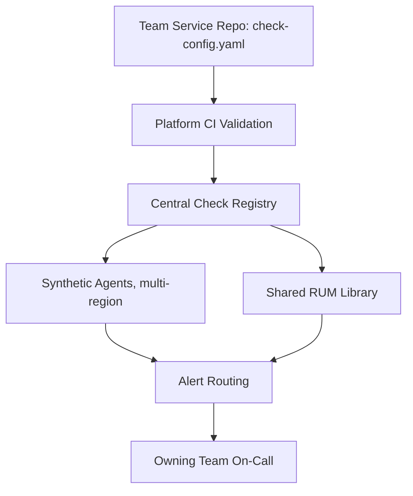

# Synthetic Monitoring and RUM — Professional

<!-- level-focus -->
At professional level, focus on this question:

> How do you operate synthetic monitoring and RUM as a self-service platform capability across many product teams — with clear ownership, cost accountability, and evidence-based rollout — without the observability team becoming a queue everyone must wait behind?

Use the smallest realistic scenario that exposes the decision and its failure behavior.

## 1. The organizational problem this creates

Synthetic monitoring and RUM look like a small technical addition per team — a script, a snippet — but at organization scale they become an operating-model question. If one central observability team hand-writes every synthetic check and builds every RUM dashboard for every product team, that team becomes the bottleneck every launch must queue behind, and the checks it writes for flows it doesn't own inevitably go stale the first time the owning team changes the flow without telling anyone. The professional-level goal is a platform other teams use themselves, not a service the platform team performs on their behalf.

That reframes the job: instead of "build checks for teams," the deliverable is a paved road — a template, a shared library, a validation pipeline, and a set of conventions — that a team can adopt with a pull request to its own repository and no ticket to anyone else.

## 2. Ownership aligned with cognitive load

The login-flow synthetic check should be owned by the team that owns the login service, living in that team's repository, reviewed in that team's normal code review — not owned by a separate SRE or observability org. A check owned elsewhere becomes a hidden coordination tax: the owning team changes the flow, doesn't know a check exists, and the check either goes stale (asserting on content that no longer appears) or the observability team becomes an unplanned reviewer on every frontend change, which is exactly the cognitive-load transfer a platform model is meant to avoid.

The platform team's job is the shared substrate — the check-running infrastructure, the RUM ingestion pipeline, the alerting conventions, the library that reports Core Web Vitals correctly — not any single team's business logic about what "checkout succeeded" means for their flow.

## 3. Decomposing rollout into reversible, observable increments

A big-bang mandate ("every team instruments everything by Q3") produces poor templates nobody tested and low real adoption. A staged rollout keeps each step reversible and each step's success independently checkable:

1. **Pilot with one team, one flow.** Build the first synthetic check and RUM instrumentation together with a single team on their highest-value flow, treating their feedback as the input to the template — not treating them as the first customer of a finished product.
2. **Publish the paved road.** A starter library (wrapping `web-vitals` and standard tagging), a synthetic check template with CI validation, and a default Core Web Vitals dashboard any team can fork.
3. **Gate new launches, don't retrofit everything at once.** Require new customer-facing flows to include a synthetic check and RUM tagging before GA, as a launch checklist item — a small, forward-looking increment that doesn't require touching any existing flow.
4. **Retrofit existing flows by priority**, ranked by revenue or traffic, once the template has survived contact with more than one team.

Each stage is reversible on its own: a flawed template gets revised without redoing every team's checks; a bad default alert threshold gets tuned without re-architecting the pipeline; a gate that turns out to slow launches too much gets relaxed without unwinding adoption that already happened.

## 4. Migration, governance, and compliance risk

**Privacy and PII in RUM payloads.** A RUM snippet capturing full URLs, form field values, or unredacted identifiers can leak personal data into an analytics pipeline never designed to hold it — a real compliance exposure, not a hypothetical one. Payloads should be reviewed for what they carry before rollout, and consent requirements (many jurisdictions require consent before non-essential tracking, which RUM can fall under) mean a meaningful share of real sessions may never report at all — a selection-bias risk the platform must document, not just the individual team.

**Synthetic credential governance.** A shared "synthetic-monitor" account with production-adjacent access to run login and payment flows is a security review item, not an implementation detail — it needs least-privilege scoping, a rotation schedule, and isolation so a compromised synthetic credential can't reach real customer data or move money for real.

**Cost governance.** Vendor synthetic and RUM products commonly price per check-run or per session. Without a named budget owner and a visibility mechanism (cost per team, cost per check), uncoordinated growth — every team adding checks in every region for every flow — can silently make the observability line item one of the larger recurring costs in the budget, discovered only at the next vendor invoice.

## 5. Cross-team contracts

- **A shared tagging taxonomy** — every team's synthetic checks and RUM events carry the same `flow`, `team`, `service`, and `region` labels — so an org-wide adoption dashboard, or an incident correlating multiple teams' signals, doesn't require bespoke per-team translation.
- **An SLO-shaped contract per flow**, owned by the team that owns the flow: "customer-facing flow X maintains p75 LCP under 2.5s and a synthetic check with detection latency under 5 minutes, reviewed quarterly by the owning team" — the number and its review cadence belong to the owning team, not the platform team.
- **An escalation contract**: when a check fails, the page goes to the owning team's on-call first, not the platform team's — the platform team owns the pipe, not the pager for content flowing through it.

## 6. Outcome measures and evidence-based exit conditions

Adoption of a platform capability should be tracked the same way any initiative is — with a number, not a feeling:

- **Coverage**: percentage of GA customer-facing flows with an owned synthetic check; percentage of pages reporting Core Web Vitals via the shared RUM library.
- **Detection quality**: mean time to detect for synthetic-catchable outages, before and after rollout, and the count of incidents a customer reported before internal monitoring did — a number that should trend down as coverage grows.
- **Self-service proof, not assumption**: the exit condition for calling the template genuinely self-service is that at least three independent teams adopted it without platform-team hand-holding — not that the platform team believes it's easy to use.

Each of these should have an accountable owner reviewing it on a recurring cadence, not a one-time launch announcement followed by silence.

## 7. Sustained delivery: this is a program, not a project

The work doesn't end at rollout, because the ground underneath it keeps moving:

- **Threshold rot.** Traffic mix shifts (more mobile, new markets) change what a stable threshold means, the same way it does for any one team's flow (see the Senior level) — at organization scale this needs a recurring review process, not a one-off fix, because every team's thresholds decay on their own schedule.
- **Deprecation policy.** A check nobody has touched or reviewed in twelve months is a liability, not free coverage — it may be asserting on a flow that no longer exists in the shape it checks. A platform needs an explicit policy for flagging and retiring stale checks, not just a policy for adding new ones.
- **Library and spec evolution.** The underlying standards move — Core Web Vitals itself replaced FID with INP as its responsiveness metric, a real, citable precedent for exactly this kind of change. A shared library upgrade that changes what gets measured needs a versioned rollout and a deprecation window, not a silent update that changes every team's dashboard on the same day with no announcement.
- **Onboarding at scale.** As the organization adds teams, the platform's job is staying self-service under growth — documentation, templates, and validation tooling that scale with headcount, rather than a platform team whose support load grows linearly with every new adopter.

## Apply it

1. Sketch the operating model for rolling out synthetic monitoring and RUM across at least three teams that don't currently have either: who owns the check code, who owns the alert routing, who owns the cost.
2. Design the staged rollout (pilot, paved road, launch gate, retrofit) with a concrete, checkable exit condition for each stage before moving to the next.
3. Identify one compliance or security risk specific to your own organization's data (PII in RUM payloads, synthetic credential scope) and write the concrete mitigation, not just the general principle.
4. Define the tagging taxonomy (flow, team, service, region, or your own equivalents) that every team's checks and events must use, and write one query or dashboard that only works because that taxonomy is consistent.
5. Define the two or three outcome measures you'd report to leadership quarterly, and the specific evidence (not opinion) that would justify saying the rollout succeeded.

## Verify your work

- You can name, for any given check or RUM event in your design, exactly which team is paged when it fails — with no ambiguity or shared ownership.
- Your staged rollout plan has an exit condition for each stage that is checkable by someone outside the team that wrote it (a count, a percentage, an independent adoption, not a subjective judgment).
- Your tagging taxonomy, applied consistently, lets you produce one cross-team dashboard without writing per-team translation logic.
- Your outcome measures are numbers that could, in principle, go the wrong direction and be caught — not measures that can only ever look good.

## Review questions

- Why does centralizing all synthetic-check authorship in one observability team create a bottleneck rather than solve one?
- What exit condition proves a monitoring template is genuinely self-service rather than merely believed to be easy?
- What compliance risk does RUM introduce that a purely server-side monitoring approach does not?
- How should threshold rot and library/spec evolution be handled differently at organization scale than for a single team's flow?
