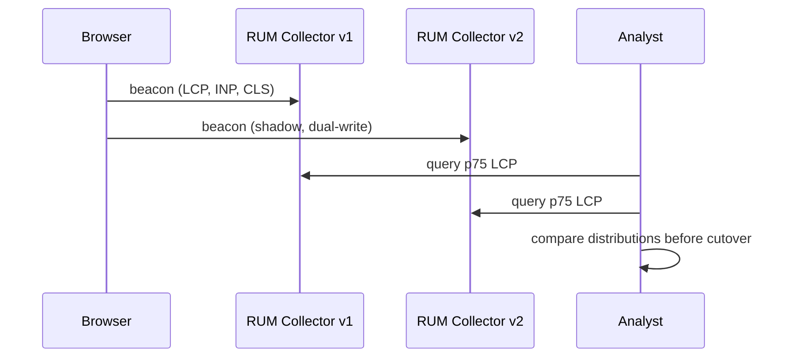

# Synthetic Monitoring and RUM — Senior

<!-- level-focus -->
At senior level, focus on this question:

> When the frontend architecture changes — a new CDN, a new rendering strategy, a new SPA framework — what invariant must synthetic monitoring and RUM preserve so historical trends and alert thresholds stay trustworthy, and how would you detect that the invariant had silently broken?

Use the smallest realistic scenario that exposes the decision and its failure behavior.

## 1. The boundary that makes the data mean anything

Synthetic monitoring and RUM only have value because they sit genuinely *outside* the deploy boundary — they measure what a real network path, a real CDN edge, and a real browser produce, not what an internal process believes about itself. That boundary is easy to erode by accident: a synthetic agent configured to hit an internal load balancer directly, bypassing the CDN "to make the check more reliable," is no longer testing what a customer experiences — it has quietly moved to the wrong side of the boundary it exists to observe. The same erosion happens to RUM when an ad blocker, a corporate proxy, or a privacy setting strips the beacon before it leaves the browser: the sessions that report data stop being a random sample of real users and become a biased sample of users whose environment permits reporting.

The core invariant to protect, stated precisely: **the measured population and the measurement method must stay stable enough, across time and across changes, that a difference in the numbers can be attributed to a real difference in user experience rather than to a change in who or what was being measured.** Everything below is about the ways that invariant breaks and how to notice.

## 2. Failure modes that invalidate historical comparison

**Silent instrumentation loss.** A framework migration (for example, adopting a streaming SSR framework or a new client-side router) can change how the browser fires the events the `web-vitals` library listens for. If the library isn't updated in lockstep, LCP or INP silently stops being reported for some or all sessions — not because the experience got better, but because there is no longer any data. A dashboard trending toward zero real user complaints and a metric quietly trending toward zero *samples* look identical on a line chart unless someone is also watching sample count.

**Non-representative vantage points.** A synthetic agent's own network path resolves to one CDN edge location, consistently. If that edge is healthy while three other edges serving real traffic are degraded, the synthetic check stays green throughout an incident that is very real for a meaningful share of customers — the vantage point was never representative of the whole edge network to begin with, and nothing in the check's green status reveals that limitation.

**Sampling bias through survivorship.** RUM only reports from sessions that succeed well enough to load the reporting script and successfully send a beacon. A user on a failing connection who abandons the page before either happens is invisible to RUM — which means the users most likely to be having the worst experience are systematically under-represented in exactly the data meant to describe user experience. This is not a tuning problem; it is a structural limit of the measurement method that no amount of sampling-rate adjustment fixes.

**Threshold rot from mix shift.** A p75 LCP threshold set when desktop traffic was 70% of sessions can start failing not because anything got slower, but because mobile traffic — inherently slower on average — grew to 50% of sessions. The aggregate number moved for a real reason, but not the reason an alert titled "LCP regression" implies. The invariant broken here is subtler: "the same threshold means the same experience" silently stopped being true once the underlying population changed shape.

## 3. Recovery: version the measurement, don't just trust it

Because these failures are silent by nature, recovery is mostly about designing so the failure can't stay silent, rather than reacting after the fact.

- **Dark-launch instrumentation changes.** Before cutting a new RUM collector or a new `web-vitals` library version over, dual-write to both the old and new pipeline for real traffic and compare distributions on a stable population before trusting the new one — the sequence above. A metric that moves the moment you switch collectors, with no corresponding product change, tells you the two pipelines measure differently, not that reality changed.
- **Version the metric definition, not just the value.** Tag stored RUM and synthetic data with the schema/library version that produced it. A historical comparison that spans a redefinition (say, the field's own move from FID to INP) should be an explicit, visible seam on the chart — never silently blended into one continuous line as if nothing changed.
- **Monitor the monitor.** Keep a small, independent check whose only job is confirming that both the synthetic and RUM pipelines are still receiving fresh data at all — a sample-count-per-minute floor, alerted on its own. A metric with zero data and a metric with excellent data can render as the same "no active alert" state; a pipeline can be broken for weeks while every dashboard implies nothing is wrong, because nothing is wrong is indistinguishable from nothing is arriving unless sample volume itself is watched.
- **Segment thresholds instead of one global number**, so a legitimate mix shift (more mobile, more of a slower market) doesn't masquerade as a regression, and a real regression in one segment doesn't get diluted into invisibility by a healthy majority segment.

## 4. Evidence over preference

A senior design decision here should be validated the same way any other production change is: with evidence gathered before trusting it, not with an architect's confidence.

- **Fault-inject after every pipeline change.** After upgrading a collector, a library, or a CDN configuration, deliberately break a known flow in a controlled environment and confirm the synthetic check still fails and the alert still fires within the expected latency — a pipeline that silently stopped alerting is worse than no pipeline, because it removes the incentive to build a second safety net.
- **Shadow-compare distributions**, not single numbers, when validating a new instrumentation path — a matching p50 with a diverging p95 tells you the new path handles the common case fine but has changed something about how it captures the tail, which is usually where the real risk lives.
- **Chaos-test the observability itself.** Disable one region's synthetic agent and RUM collection path in a controlled way and confirm the system correctly reports reduced coverage for that region — rather than quietly reporting "all healthy" because the absence of a data source and the absence of a problem look the same to a naive dashboard.

## 5. A cross-component scenario: migrating rendering strategy

Consider migrating checkout's frontend from a client-rendered SPA to an edge-rendered, streaming SSR framework, to improve initial load performance.

For synthetic checks: the script's "page ready" signal likely needs to change. A check waiting on a DOM element that used to appear only after a client-side render completes may now need to account for progressive/streamed HTML, where content arrives in pieces — the old `waitForSelector` logic might now report success far earlier (before the interactive parts are ready) or fail entirely (if the element's insertion point changed). The check has to be re-validated against the new architecture's actual completion signal, not assumed to still mean the same thing.

For RUM: LCP's "largest contentful paint" element might now be delivered by the server rather than painted after a client-side fetch, changing *when* and *how* the metric is captured relative to what used to trigger it. Before trusting the post-migration LCP numbers, confirm the `web-vitals` library version in use explicitly supports the new rendering path's markers — an outdated library can keep reporting a number that no longer corresponds to what a real user experiences as "the page appeared."

The trade-off a senior engineer must resolve explicitly here: ship the migration and accept a visible discontinuity in the trend line (clearly annotated, versioned, and explained) versus attempt to keep the metric perfectly continuous by patching the old measurement method onto the new architecture — which risks quietly measuring the wrong thing just to preserve the appearance of a smooth chart. The first option is more honest and more debuggable; the second is more comfortable and more dangerous.

## 6. Trade-offs among plausible approaches

| Approach | Control | Cost | Coverage | Risk |
|---|---|---|---|---|
| Vendor SaaS (synthetic + RUM combined) | Low — vendor's regions, vendor's metric definitions | Predictable, usage-based | Broad out of the box | Vendor's instrumentation choices become your invariant to trust |
| Self-hosted synthetic + open RUM library | High — you choose regions, versions, definitions | Engineering time to build and maintain | As broad as you build it | You own every silent-failure mode described above |
| Hybrid — vendor synthetic, self-hosted RUM (or vice versa) | Mixed | Mixed | Depends on the split | Two systems' metric definitions must be reconciled, not assumed compatible |
| 100% RUM sampling | N/A | Highest ingestion cost | Best tail (p99) confidence | Cost scales with traffic, unbounded |
| Sampled RUM (e.g., 10%) | N/A | Lower, bounded | Weaker tail confidence at low traffic volumes | p99 becomes noisy exactly where it matters most |

None of these is universally correct; the decision depends on how much you need to trust the tail of the distribution (favoring higher sampling and more control) versus how much engineering time you can spend maintaining the pipeline yourself (favoring vendor SaaS).

## 7. Questions that expose weak assumptions before implementation

- If a new CDN edge location comes online in a region we've never had traffic from, do our existing alert thresholds still mean what we think they mean, or were they implicitly calibrated to the regions we already had?
- If our RUM beacon endpoint silently returned 200 while dropping every payload, would sample-count monitoring catch it within an hour — or would we only find out from a customer complaint weeks later?
- Does our synthetic check exercise the actual CDN and edge path a real user takes, or has it been quietly reconfigured, for convenience or reliability, to bypass part of that path?
- When we last changed the RUM library or collector version, did we compare distributions on a stable population before trusting the new numbers, or did we just assume continuity?

## Apply it

1. State the invariant that your synthetic and RUM pipelines must protect for a specific flow (for example: "p75 LCP for checkout on mobile is comparable week over week").
2. Identify one architectural change (a CDN swap, a framework migration, a new region) that would plausibly break that invariant, and explain the mechanism by which it breaks it — not just that it might.
3. Design a dark-launch or shadow-comparison plan that would catch the break before it silently corrupts historical trends.
4. Add a "monitor the monitor" check — a sample-count floor — for at least one of your existing synthetic or RUM pipelines, and verify it fires when you simulate the data source going silent.
5. Write the two or three questions from Section 7 (or your own analogues) into your team's pre-migration checklist for the next frontend architecture change.

## Verify your work

- You can name, precisely, what population or measurement property would have to stay stable for a before/after comparison to be valid — not just "the metric should stay similar."
- Your dark-launch plan specifies what evidence (which distributions, compared how) would justify cutting over, not just "it looked fine."
- Your sample-count-floor check fires correctly when you simulate the underlying pipeline going silent, and stays quiet during normal operation.
- Someone unfamiliar with the migration can read your pre-migration checklist and understand what could silently break, and how you'd know.

## Review questions

- What invariant must synthetic and RUM measurement preserve for historical comparisons to remain valid?
- Why can survivorship bias make RUM systematically blind to the worst real experiences?
- How does threshold rot from traffic mix shift differ from an actual performance regression, and why does that distinction matter for alerting?
- What evidence would justify trusting a new RUM collector or library version before fully cutting traffic over to it?
