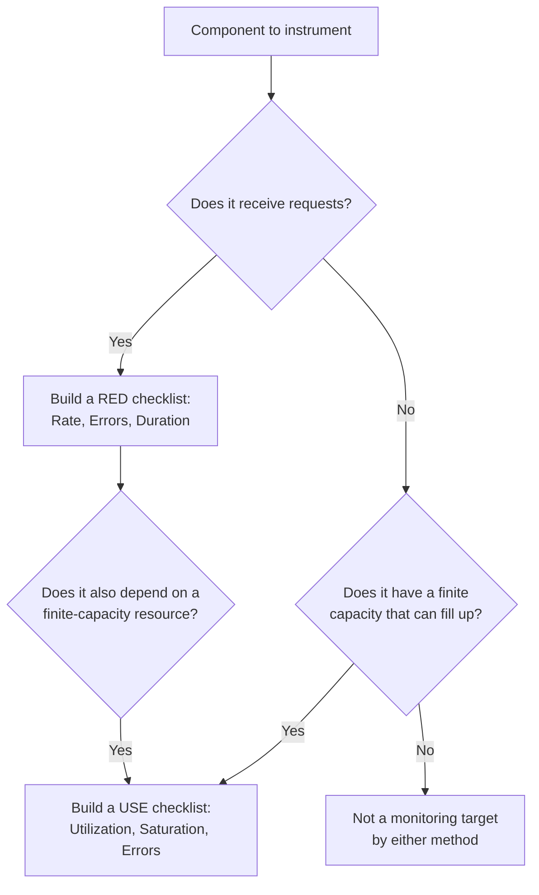

# RED and USE Methods — Junior

<!-- level-focus -->
At junior level, focus on this question:

> Given a single HTTP service and the database connection pool it depends on, can you build a RED-style checklist for the service and a USE-style checklist for the pool, and use both to say whether each one is healthy right now?

Use the smallest realistic scenario that exposes the decision and its failure behavior.

---

## Core Concept 1 — Two Checklists for Two Kinds of Thing

Once a system has more than a couple of moving parts, "check if it's healthy" stops being a single question. It splits into two different questions depending on what you're looking at:

- **RED** — for anything that *serves requests*: an HTTP API, a gRPC service, a queue consumer processing one message at a time. Coined by Tom Wilkie at Weaveworks as a distillation of what to graph for microservices.
- **USE** — for anything with a *finite capacity that can run out*: CPU, disk, memory, a connection pool, a thread pool. Coined by Brendan Gregg as a systematic method for finding resource bottlenecks.

| | RED (Rate, Errors, Duration) | USE (Utilization, Saturation, Errors) |
|---|---|---|
| **Applies to** | Request-driven services | Finite-capacity resources |
| **Rate / Utilization** | Requests per second | % of capacity busy (CPU busy time, pool connections in use) |
| **Errors / Saturation** | Errors: failed requests per second (or as a ratio) | Saturation: work queued waiting for the resource (run queue, wait queue) |
| **Duration / Errors** | Duration: how long requests take (usually a percentile) | Errors: resource-level errors (disk I/O errors, dropped packets) |
| **Answers** | "Is this service serving traffic correctly and fast enough?" | "Is this resource close to running out of capacity?" |
| **Example question it answers** | "Are checkout requests succeeding and fast?" | "Is the Postgres connection pool about to be exhausted?" |

Notice the third column swaps position between the two acronyms — RED's third letter is Duration, USE's third letter is Errors. That's a common beginner mix-up worth memorizing explicitly rather than guessing from the acronym shape.

The one-line rule for choosing which applies: **if it receives requests, use RED; if it has a capacity that can be used up, use USE.** Some things are both (a database process both serves queries *and* has a connection pool with finite capacity) — that's normal, and you'd build both checklists for it.

## Core Concept 2 — Building the RED Checklist for a Service

Take `checkout-api`, a stateless HTTP service. For each of Rate, Errors, and Duration, you need one metric and one query.

Assume `checkout-api` emits a Prometheus histogram named `http_request_duration_seconds` with labels `method`, `route`, and `status_code` — a common instrumentation pattern.

```promql
# Rate — requests per second, last 5 minutes
sum(rate(http_request_duration_seconds_count{job="checkout-api"}[5m]))

# Errors — ratio of 5xx responses to all responses, last 5 minutes
sum(rate(http_request_duration_seconds_count{job="checkout-api", status_code=~"5.."}[5m]))
/
sum(rate(http_request_duration_seconds_count{job="checkout-api"}[5m]))

# Duration — p99 latency, last 5 minutes
histogram_quantile(0.99,
  sum(rate(http_request_duration_seconds_bucket{job="checkout-api"}[5m])) by (le)
)
```

Worked numbers from a real 5-minute window: 240 requests/sec, 3 of them failing with a 5xx, p99 latency at 180ms.

```
Rate:     240 req/s
Errors:   (3/300 sec) / 240 req/s ≈ 0.004%  (well under a 1% threshold)
Duration: p99 = 180ms                        (under a 300ms threshold)
```

All three numbers, read together, say "checkout-api is healthy right now." Any one of them alone would be an incomplete answer — a service can have zero errors and still be unacceptably slow, or be fast with error rate quietly climbing.

## Core Concept 3 — Building the USE Checklist for a Resource

Now take the Postgres connection pool that `checkout-api` uses, configured with a maximum of 100 connections (via PgBouncer or a client-side pool like HikariCP).

```promql
# Utilization — connections currently checked out, as a fraction of the max
pool_connections_in_use{pool="checkout-api-db"} / pool_connections_max{pool="checkout-api-db"}

# Saturation — requests waiting for a connection because the pool is full
pool_connections_waiting{pool="checkout-api-db"}

# Errors — connection acquisition failures or timeouts
rate(pool_connection_errors_total{pool="checkout-api-db"}[5m])
```

Worked numbers: 62 of 100 connections in use, 0 requests waiting, 0 connection errors in the last 5 minutes.

```
Utilization: 62%     (comfortably under a 90% caution threshold)
Saturation:  0       (nobody is queued waiting for a connection)
Errors:      0/s     (no acquisition failures)
```

The important detail for a junior engineer: **saturation and utilization are different numbers, and saturation is the earlier warning.** Utilization can sit at 95% with saturation still at zero (everyone who needs a connection gets one immediately, just barely). Saturation appearing at all — even one request waiting — is the first sign the pool is genuinely too small for current demand, and it can appear before utilization visibly reads 100% if connections are held briefly and released quickly.

## Core Concept 4 — Deciding Which Checklist Applies



Reading this against the worked example: `checkout-api` receives requests, so it gets a RED checklist. It also depends on a connection pool, a finite-capacity resource, so that pool gets its own separate USE checklist. Neither checklist substitutes for the other — a healthy RED reading on `checkout-api` and a healthy USE reading on its connection pool are two separate facts that both need to be true.

## Core Concept 5 — Simple Success Criteria

For this exercise, "healthy" means all six numbers read acceptable at the same time:

1. **RED — Rate** is non-zero and roughly matches expected traffic (a rate of 0 on a service that should be receiving traffic is itself a symptom, not a quiet success).
2. **RED — Errors** stays under an agreed ratio (a common starting point is under 1%, tightened later against a real SLO).
3. **RED — Duration** (p99, not just average) stays under an agreed threshold.
4. **USE — Utilization** stays comfortably under the pool's max, not brushing against it.
5. **USE — Saturation** is at or near zero; any sustained non-zero value is worth investigating immediately, not waiting for utilization to also read high.
6. **USE — Errors** (connection failures, timeouts) stay at zero in normal operation.

## Common Mistakes

1. **Measuring Rate as a raw count instead of per-second.** "1,200 requests" means nothing without a time window; always express Rate as requests/second (or /minute, consistently) so it can be compared over time and across services.
2. **Measuring Errors as an absolute count instead of a ratio.** 12 errors out of 12 requests and 12 errors out of 12,000 requests are wildly different situations; always divide by total requests in the same window.
3. **Using only average (mean) for Duration.** A mean can look fine while a meaningful fraction of requests are slow — a p99 or p95 exposes tail latency that averages hide. Always graph a percentile, not just the mean.
4. **Applying USE to something without a real capacity ceiling.** A stateless container that autoscales doesn't have a meaningful "utilization" the same way a fixed-size connection pool does — forcing a USE checklist onto it just produces a number nobody can interpret. RED is the right lens for that container instead.
5. **Treating utilization and saturation as the same signal.** As shown in Core Concept 3, a resource can be highly utilized with zero saturation (fine) or start showing saturation before utilization even looks alarming (an earlier warning). Reading only one of the two misses half the picture.
6. **Skipping the "Errors" letter in USE.** It's easy to build Utilization and Saturation dashboards and forget resource-level errors (disk I/O errors, dropped network packets, connection resets) — these can be the first sign of a failing resource even while utilization and saturation both look normal.

## Apply it

1. Pick one HTTP service you have access to (or use `checkout-api` from this guide as a stand-in) and identify the metric names it already emits for request count, status code, and duration.
2. Write the three PromQL (or equivalent) queries for its Rate, Errors, and Duration, following the format in Core Concept 2.
3. Identify one finite-capacity resource that service depends on (a database connection pool, a thread pool, disk space) and write the three queries for its Utilization, Saturation, and Errors.
4. Run all six queries against a real or test window and record the six numbers side by side in a single table.
5. For each of the six numbers, write one sentence stating whether it's acceptable and what threshold you compared it against.

## Verify your work

- You can point to a specific metric name (not a guess) backing each of the six numbers.
- Your Errors number for the service is expressed as a ratio (errors ÷ total requests), not a raw count.
- Your Duration number is a percentile (p95 or p99), not a plain average.
- Your Saturation number for the resource is checked independently of its Utilization number, and you can explain in one sentence why they're not interchangeable.
- Given the six numbers you collected, you can state a one-sentence verdict — "healthy" or "needs attention, specifically because of X" — for both the service and the resource.

## Review questions

- What distinguishes a component that should get a RED checklist from one that should get a USE checklist?
- Why does the third letter of RED (Duration) and the third letter of USE (Errors) sit in different positions in each method's focus, and what does each actually measure?
- Why can a resource show saturation before its utilization reads anywhere near 100%?
- Why is a raw error count on its own not enough to judge whether a service's error rate is a problem?
