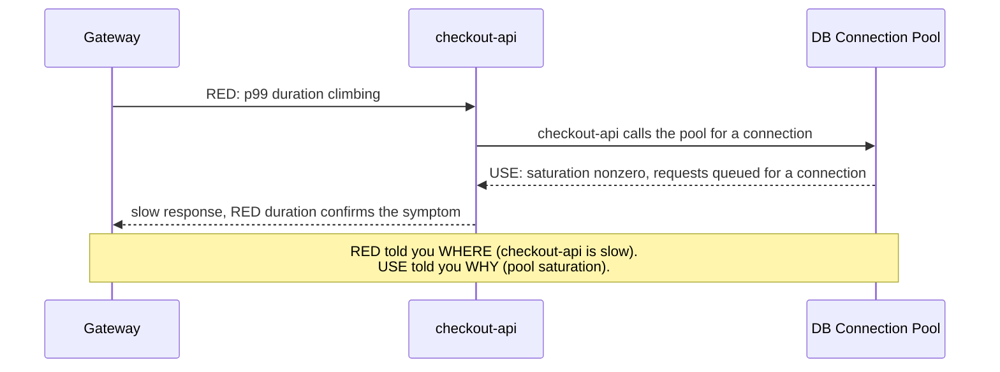

# RED and USE Methods — Middle

<!-- level-focus -->
At middle level, focus on this question:

> When a checkout flow spans an API gateway, an application service, a Postgres connection pool, and a message broker, how do you decide which components get RED coverage, which get USE coverage, and where the two must be cross-checked together to catch a bottleneck that neither method alone would show?

Use the smallest realistic scenario that exposes the decision and its failure behavior.

---

## Core Concept 1 — Mapping a System, Not Just a Service

A junior-level pass builds one RED checklist and one USE checklist for one service and one resource. The middle-level move is doing this systematically across every component in a real flow, so nothing load-bearing is left uninstrumented:

| Component | Nature | Method | What it would catch |
|---|---|---|---|
| API gateway | Request-driven (routes all inbound traffic) | RED | A misconfigured route, a downstream timeout surfacing as gateway errors |
| `checkout-api` | Request-driven | RED | Elevated latency or error rate in checkout logic itself |
| Postgres connection pool | Finite-capacity resource | USE | Pool exhaustion before it becomes visible as request errors |
| Postgres disk | Finite-capacity resource | USE | Disk I/O saturation slowing every query on the instance |
| RabbitMQ broker | Finite-capacity resource (queue depth, memory) | USE | Broker running low on memory or disk before messages start being rejected |
| `order-worker` (queue consumer) | Request-driven (one "request" per message) | RED | Slow or failing message processing, separate from the broker's own health |

The pattern: **request-driven components get RED, capacity-bound components get USE, and some components (the database process itself, a cache) are genuinely both** — they serve queries (RED) and hold finite connection/memory capacity (USE). Treating a dual-nature component with only one method leaves half its failure modes invisible.

Building this table for a real flow is itself the deliverable at middle level — not a diagram for its own sake, but a coverage map you can point to and ask "which of these rows doesn't have a dashboard yet?"

## Core Concept 2 — Why the Two Methods Have to Be Cross-Checked

RED tells you *which service* is behaving badly. USE tells you *which resource* is running out of room. Neither tells you the other's answer, and a real incident usually requires both:



Without the USE side, an on-call engineer sees "checkout-api's p99 duration went from 180ms to 2s" and has to guess why. Without the RED side, an on-call engineer sees "the connection pool is saturated" but doesn't know whether it's actually causing customer-visible slowness right now, or just running hot with no user impact yet. The two methods answer different halves of the same question, and triage moves fastest when both are already on the same dashboard, not assembled from separate tools mid-incident.

## Core Concept 3 — Under- and Over-Application Signals

**Under-application** shows up as:
- A connection pool, thread pool, or queue with no USE dashboard at all — the first anyone learns about its capacity is an incident where `checkout-api`'s RED errors spike and nobody can say why for twenty minutes.
- A queue consumer instrumented only as "part of the broker's health," with no RED metrics of its own — so a consumer that's alive but stuck retrying the same message looks identical, from the broker's side, to one processing normally.

**Over-application** shows up as:
- Building a USE checklist for something with no real capacity ceiling — a stateless, autoscaled service instance doesn't have a meaningful "utilization" the same way a fixed-size pool does; forcing Utilization/Saturation/Errors onto it produces numbers nobody can act on, when a RED checklist was already the right fit.
- Instrumenting RED on a component that never receives independent requests — a background cron job that runs once and exits doesn't have a meaningful "rate," and trying to force one onto it (partly to satisfy "we use RED everywhere") produces noise instead of signal.

The discipline in both directions is the same: apply the method that matches the component's actual nature, not the method that's already familiar or the one a dashboard template defaults to.

## Core Concept 4 — Incremental Adoption Across a System

Instrumenting every component with both methods on day one is rarely how this actually gets built. A workable sequence:

1. **RED first, on every public-facing and internal request-driven service**, since it's the cheapest to add (most frameworks emit request count, status code, and duration with minimal extra code) and covers the symptoms customers actually notice.
2. **USE next, on the resource that has already caused an incident or a near-miss** — don't try to enumerate every finite-capacity resource in the system up front; let real pain point at the first one (commonly a connection pool or disk).
3. **Extend USE to resources structurally similar to the first one** — once the connection pool has a USE dashboard, the thread pool and the message broker are usually next, because they share the same utilization/saturation/errors shape.
4. **Cross-link RED and USE dashboards for components in the same request path**, so a duration spike on `checkout-api` and a saturation spike on its connection pool show up on the same screen, not in two different tools an engineer has to remember to check separately.

Skipping straight to "instrument every resource in the system with USE" up front usually produces dashboards nobody looks at, because most of them were never near a real bottleneck; letting incidents point at which resource needs USE coverage keeps the investment proportional to actual risk.

## Core Concept 5 — Worked Scenario: Duration Spike Traced to Pool Saturation

`checkout-api`'s RED dashboard shows p99 duration rising from 180ms to 1.4s over ten minutes, with error rate still near zero — requests are slow, not failing, so this isn't yet a customer-facing outage but is heading toward one.

```promql
# RED: duration spike visible here
histogram_quantile(0.99,
  sum(rate(http_request_duration_seconds_bucket{job="checkout-api"}[5m])) by (le)
)
# -> 180ms baseline, climbing to 1.4s

# USE: cross-check the connection pool in the same window
pool_connections_waiting{pool="checkout-api-db"}
# -> 0 five minutes ago, now sustained at 15-20
```

Reading both together: the pool's saturation metric started climbing about ninety seconds before the RED duration metric did. That lead time is the practical value of tracking USE alongside RED — checkout-api's own metrics only show the symptom (slow requests) once requests are already queued behind an exhausted pool, but the pool's saturation number moved first. A dashboard built with RED alone would have shown the same incident about ninety seconds later, and without any hint at the cause.

The fix in this scenario is a capacity change (a larger pool, or an upstream rate limit protecting it), not a code change to `checkout-api` — which is only knowable because the USE side of the coverage map, not just the RED side, was in place before the incident.

## Core Concept 6 — Verifying at Two Levels

- **Unit level** — for each individual RED or USE metric, confirm it means what it claims to. Does the Rate metric visibly track known traffic (compare it against a load generator's configured request rate)? Does the pool's Saturation metric actually reach nonzero only when connections are genuinely being queued (verified by deliberately holding connections open in a test and watching the number move)? A metric that doesn't react to a known, deliberate change in the thing it claims to measure isn't trustworthy yet.
- **Integrated-flow level** — run a load test across the entire path (gateway through checkout-api through the connection pool), at a volume high enough to approach the pool's configured maximum, and confirm the RED dashboard's duration metric and the USE dashboard's saturation metric move together the way Core Concept 5 describes. This is the only way to catch a coverage gap — a dual-nature component instrumented with only one method, or a resource whose USE metrics were added but never validated against real saturation — before a real incident does it for you.

---

## Common Mistakes

- **Leaving a shared, finite-capacity resource with no USE dashboard until an incident forces one.** The connection-pool scenario above is this mistake in its most common form — RED metrics on the service degrade with no immediately visible cause.
- **Forcing RED onto components with no real request rate, or USE onto components with no real capacity ceiling**, usually to satisfy "we instrument everything the same way" rather than matching the method to the component's actual nature.
- **Treating a dual-nature component (a database, a cache) as covered by only one method.** Its request-serving side and its capacity side fail independently and need independent coverage.
- **Building RED and USE dashboards for the same request path in separate tools that nobody cross-references during an incident.** The value shown in Core Concept 5 depends on both being visible together, not just both existing somewhere.
- **Instrumenting every resource in the system with USE up front, before any of them has caused real pain.** This produces dashboards that don't get looked at and doesn't reflect the incremental-adoption sequence that keeps coverage proportional to actual risk.

---

## Apply it

1. For one real request flow you know (or the gateway → checkout-api → connection pool → broker flow above), build the coverage-map table from Core Concept 1: list every component, its nature (request-driven, capacity-bound, or both), and which method applies.
2. Identify one component in that table currently missing coverage, and state whether that's an under-application gap (a resource with no USE dashboard) or something that was over-applied (a method forced onto a component whose nature doesn't fit it).
3. For one request-driven component and the finite-capacity resource it depends on, write the RED queries and the USE queries, then place them on paper (or an actual dashboard) side by side.
4. Run or simulate a load increase against that flow, and record whether the resource's Saturation metric moves before, at the same time as, or after the service's Duration metric — following the format in Core Concept 5.
5. Write one sentence stating what the lead or lag time between the two metrics would let an on-call engineer do differently during a real incident.

## Verify your work

- Your coverage-map table assigns a method to every component based on its actual nature (request-driven vs. capacity-bound vs. both), not a default choice applied uniformly.
- You can name one specific component in your system currently missing RED or USE coverage, not a general statement that "coverage could be better."
- Your load test shows the resource's Saturation metric and the service's Duration metric moving in the same window, and you can state which one moved first.
- You can explain in one sentence why RED alone or USE alone would have shown an incomplete picture of the same incident.

## Review questions

- Why do some components need both a RED checklist and a USE checklist rather than just one?
- What does a resource's Saturation metric tell an on-call engineer that a dependent service's RED Duration metric does not?
- What's the difference between under-applying and over-applying these methods, and what does each look like in practice?
- Why is instrumenting RED across all services before extending USE to specific resources usually the more workable adoption order?
