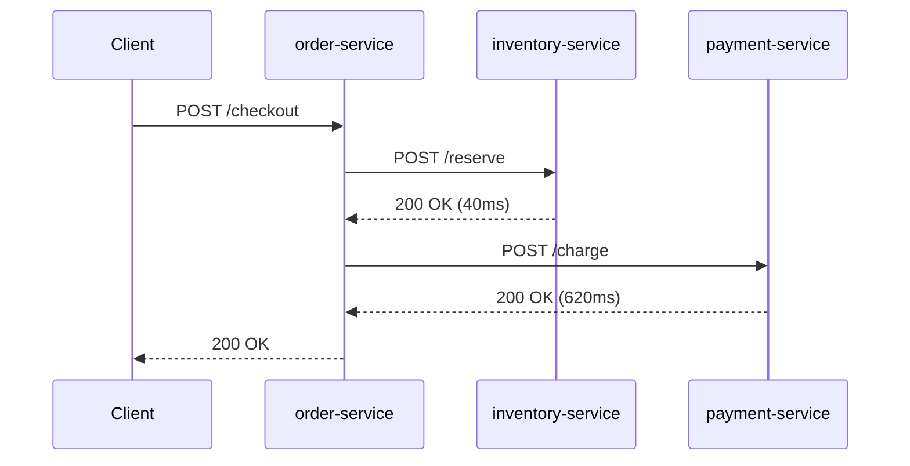

# Distributed Tracing — Junior

<!-- level-focus -->
At junior level, focus on this question:

> Given one request that crosses two or three services over HTTP, can you follow it end to end using its trace ID and name the single hop that took the most time?

Use the smallest realistic scenario that exposes the decision and its failure behavior.

> **Roadmap:** [Observability](../README.md) → Distributed Tracing

*A trace is what lets you answer "why was this one request slow" without guessing from three separate services' logs. Producing your first clean, connected trace is the whole job at this level.*

---

## Core Concept 1 — Trace, Span, and the Three IDs

A **trace** is one request's full journey through however many services it touched. A **span** is one unit of work inside that journey — one service doing one operation. A trace is made of one or more spans, and the spans form a tree: one **root span** (the first service to receive the request) with zero or more **child spans** underneath it.

Three IDs make the tree possible:

| ID | What it identifies | Shared across the whole trace? |
|---|---|---|
| **Trace ID** | The entire request, end to end | Yes — every span in the trace carries the same trace ID |
| **Span ID** | This one specific span | No — every span has its own, unique ID |
| **Parent span ID** | The span this one happened inside of | No — points at a different span's ID (empty for the root) |

That is the entire mechanism. No central process watches the request live and assembles the tree as it goes — each span just reports its own trace ID, its own span ID, and its parent's span ID, and a backend reconstructs the tree afterward by matching those numbers up.

## Core Concept 2 — A Repeatable Method

For any request that crosses more than one service, follow the same four steps:

1. **Start a span at the entry point.** The first service to receive the request creates the root span and generates a fresh trace ID.
2. **Propagate the trace context on every outbound call.** When that service calls another service, it attaches its trace ID and its own span ID (as the next hop's parent) to the outbound request.
3. **Start a child span on the receiving side.** The next service reads the propagated context, creates its own span, and records the trace ID and parent span ID it received.
4. **Repeat for every hop, then view the assembled result.** Once every span has reported in, a tracing backend groups them by trace ID and renders the tree as a waterfall (a list of bars) or a flame graph (nested bars), ordered by start time and indented by parent-child relationship.

## Core Concept 3 — Worked Example: order → inventory → payment

Take an `order-service` that receives a checkout request, calls `inventory-service` to reserve stock, then calls `payment-service` to charge the customer — both over plain HTTP.



The propagation mechanism is a single HTTP header, standardized by the W3C as **`traceparent`**:

```text
traceparent: 00-4bf92f3577b34da6a3ce929d0e0e4736-00f067aa0ba902b7-01
             │  └─────────── trace ID ─────────┘ └─ parent span ID ─┘ │
          version                                                  flags
```

`order-service` generates the trace ID `4bf92f...` and its own span ID. When it calls `inventory-service`, it sends this header. `inventory-service` reads it, creates its own span with parent span ID equal to `order-service`'s span ID, and — this is the step beginners skip — sends its **own** fresh `traceparent` (same trace ID, its own span ID) onward if it calls anything else.

Once all three services report their spans, the backend renders this waterfall:

```text
trace 4bf92f3577b34da6a3ce929d0e0e4736
└─ order-service     "POST /checkout"  [0ms ─────────────────────── 670ms]
   ├─ inventory-service "POST /reserve" [10ms ── 50ms]
   └─ payment-service   "POST /charge"  [55ms ───────────────────── 675ms]  ← slow hop
```

Reading a waterfall is mechanical: **the widest bar is where the time went.** Here, `payment-service` accounts for roughly 620 of the request's 670 milliseconds. `inventory-service` is not the problem, even though it ran first — position in the call chain and cost are unrelated, which is exactly what a raw application log cannot show you at a glance.

## Core Concept 4 — What "Done" Looks Like at This Level

A junior-level trace is good enough when all four are true:

1. Every span in the trace shares the same trace ID.
2. Every non-root span has a parent span ID that matches a real span in the same trace — no orphans.
3. You can point at one span and correctly say "this is where most of the time went."
4. For a failed request, you can point at the span whose status shows the failure, not just note that "something downstream failed."

If any of these isn't true, the instrumentation isn't finished — go back to Core Concept 2 and check which hop dropped the context.

## Core Concept 5 — Where the Spans Come From

You rarely hand-write every span. A framework's HTTP server and HTTP client libraries are usually **auto-instrumented** by a tracing agent or SDK — most commonly **OpenTelemetry**, the vendor-neutral API most languages standardize on — so incoming requests and outgoing calls get spans without you writing code for them. You add **manual spans** only around business logic worth seeing as its own bar, such as `reserve_stock` or `charge_card`. At this level, trust the auto-instrumented spans for "did the header travel" and focus your own code on naming the operations that matter.

---

## Real-World Examples

- **The header that never left the building.** `order-service` starts its own span correctly but calls `inventory-service` with a bare HTTP client that doesn't attach `traceparent`. `inventory-service`'s span shows up in the backend as its own, brand-new trace, with no relationship to `order-service`'s. Two traces exist where one should — the request is invisible as a whole.
- **A slow hop hiding behind "checkout was slow."** A support ticket says "checkout was slow around 2pm." Without a trace, that means grepping three services' logs by timestamp and guessing. With a trace, the waterfall shows `payment-service` at 620ms out of 670ms in one glance — no guessing required.
- **A span with the wrong parent.** A retry inside `order-service` accidentally reuses a stale, previous request's context. The retry's span appears nested under the wrong trace entirely, and the real trace has a gap where the retry should be.

## Common Mistakes

- **Treating a span like a fancy log line.** A span has a start time, an end time, and a place in a tree; a log line is a point-in-time message. Don't create a new span for every line you'd otherwise log.
- **Forgetting to propagate the header on outbound calls.** This is the single most common beginner error: the local span is created correctly, but the call to the next service goes out "naked," and the chain breaks there.
- **Reading the waterfall top-to-bottom as if it were "slowest first."** It's ordered by start time, not duration. Compare bar *widths*, not row position, to find the slow hop.
- **Baking a variable value into the span name** — naming a span `POST /orders/482` instead of `POST /orders/:id`. The ID belongs as an attribute on the span, not in the name; this matters once you have real traffic volume, but the habit should start now.
- **Assuming a broken-looking trace means the request stopped.** More often it means propagation was lost at one hop, and the rest of the request's spans exist, just disconnected from the trace you're looking at.

---

## Apply it

1. Pick or build three small HTTP services that call each other in a chain, similar to `order-service → inventory-service → payment-service`.
2. Instrument each one to create a span for the request it handles, using any tracing library for your language (OpenTelemetry's SDK is the common default, but the mechanism matters more here than the specific library).
3. Confirm each outbound HTTP call carries a `traceparent` header — print it or inspect it with a proxy before trusting the backend's view.
4. Send one request through the whole chain, open the resulting trace, and identify from the waterfall alone which single span consumed the most wall-clock time.
5. Deliberately remove the header propagation on one hop, send another request, observe how the trace looks broken, then restore propagation and confirm the trace is whole again.

## Verify your work

- All spans from one request share one trace ID, visible in the backend's trace view.
- Every non-root span's parent span ID matches an actual span in the same trace — no unexplained orphans.
- You can name the slowest span by its bar width, not by guessing from call order.
- The deliberately broken hop produced two separate traces (or an orphaned span), and you can explain why in terms of the missing header.

## Review questions

- What is the difference between a trace ID and a span ID, and why must every span in a trace share one but not the other?
- How does a request-carried header let a backend reconstruct a tree with no central process watching the request live?
- Why can the widest bar in a waterfall belong to a span that started last, not first?
- What observable evidence tells you that context propagation broke between two specific services?
