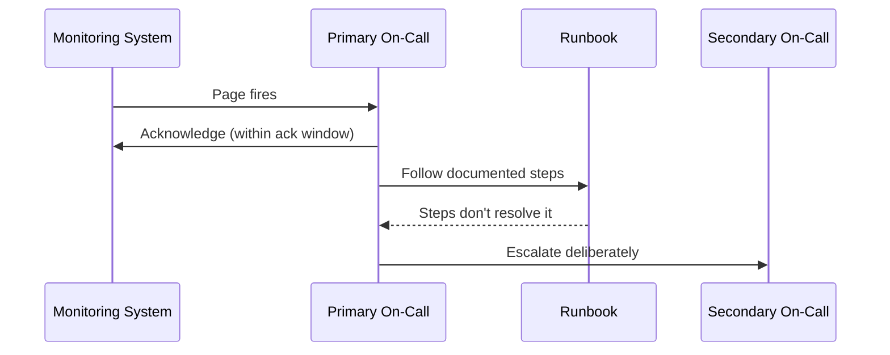

# Alerting and On-Call — Junior

<!-- level-focus -->
At junior level, focus on this question:

> When a page fires for a service you're on call for, can you acknowledge it within the expected window, work through the runbook step by step, and hand off with clear context if you can't resolve it before your shift ends?

Use the smallest realistic scenario that exposes the decision and its failure behavior.

---

## Core Concept 1 — Vocabulary: Pages, Rotations, and Escalation

On-call vocabulary gets used loosely. Keep these separate:

- **On-call rotation** — the schedule that says who is responsible for responding to production alerts during a given period (a day, a week). Being "on-call" means carrying a pager (literally or via an app) for that period, not just being generally reachable.
- **Page (or alert)** — an automated notification sent to whoever is on-call, demanding action. A page interrupts you — phone call, SMS, a push notification with sound — because someone decided it can't wait until business hours. This topic assumes the page already fired; deciding *what* should page and at what threshold is a separate skill, covered elsewhere.
- **Acknowledge (ack)** — the on-call engineer's confirmation, sent back through the paging tool, that they've seen the page and are working it. Acking is not resolving; it tells the system "a human has this, stop escalating," nothing more.
- **Escalation** — what happens when a page isn't acknowledged, or isn't resolved, within a set time window: the paging system automatically notifies the next person or tier in the chain.
- **Runbook** — a written, step-by-step document tied to a specific alert, telling the on-call engineer what to check and what to do, so the response doesn't depend on one person's memory of how the system works.
- **Handoff** — the deliberate transfer of on-call responsibility from one person or shift to the next, including a summary of anything still open.

The two beginners most often conflate: **acknowledging** a page is not the same as **resolving** the problem behind it, and a **runbook** is not a **postmortem** — a runbook tells you what to do right now, before you understand everything; the full story, if anyone writes it up, comes later in a separate process.

## Core Concept 2 — The On-Call Lifecycle

Every page goes through the same shape, regardless of what tripped it:

1. **Page fires.** The monitoring system detects a condition and pages whoever is primary on-call.
2. **Acknowledge.** You confirm receipt inside the paging tool, within the expected window (Core Concept 3), which stops the page escalating to the next person.
3. **Triage using the runbook.** You open the runbook tied to that specific alert, if one exists, and follow it instead of starting from a blank page.
4. **Resolve or escalate.** Either the runbook's steps fix or contain the problem, or you hit a point that needs another person — you escalate deliberately, rather than silently struggling past where a second opinion would help.
5. **Log and hand off.** You record what happened, even briefly, and if your shift ends before it's fully resolved, you hand off with enough context that the next person doesn't start from zero.



The step worth noticing is the last arrow: escalating is a normal, expected branch of the lifecycle, not a failure of the person who escalates. A rotation where nobody ever escalates usually means people are quietly struggling alone past the point they should have asked for help — not that everyone is unusually capable.

## Core Concept 3 — Escalation Timing

An escalation policy is a table, not a vague expectation. A small but realistic example for one service:

| Tier | Who | Ack window | If not acked in time |
|---|---|---|---|
| 1 | Primary on-call | 5 minutes | Escalates to secondary |
| 2 | Secondary on-call | 5 minutes | Escalates to team lead |
| 3 | Team lead | 10 minutes | Declares a wider incident, pulls in more people |

The exact minutes vary by team and by how urgent the alert is, but the shape doesn't: every tier has a **named person or role**, a **fixed time window**, and a **defined next step** if that window passes without an ack. If any of the three is missing — nobody named at tier 2, no time limit, or "escalates to... someone" — the policy isn't actually a policy, it's a hope.

## Core Concept 4 — Worked Example: a 2 a.m. Page for checkout-service

You are primary on-call. At 2:14 a.m. your phone rings: `checkout-service error rate > 5% for 5 minutes`.

1. **Acknowledge within 5 minutes.** You tap "ack" in the paging app at 2:16 a.m. The page stops escalating to secondary.
2. **Open the runbook** tied to this specific alert (Core Concept 5 shows the full text). It tells you to first confirm the graph, then check for a recent deploy.
3. **Check the deploy log.** A deploy to `checkout-service` went out at 2:05 a.m. — nine minutes before the alert fired. That's the branch the runbook calls out explicitly.
4. **Follow the branch:** roll back the deploy. You run `deploy rollback checkout-service` at 2:19 a.m.
5. **Confirm recovery.** By 2:24 a.m. the error rate graph is back under 1%. You post a one-line update in the team's incident channel: what fired, what you did, when it recovered.
6. **Log it.** You add a short entry to the on-call log: alert, cause (bad deploy), action (rollback), time to recovery (~10 minutes from page to resolution).

Nothing here required guessing at unfamiliar code at 2 a.m. — the runbook's branches did the diagnostic thinking in advance, and your job was to follow them and confirm each step's result before moving to the next.

## Core Concept 5 — Reading and Following a Runbook

A runbook that's actually usable at 2 a.m. looks like this, not like a wall of prose:

```
# Runbook: checkout-service — Elevated 5xx Error Rate

## Symptom
Alert: "checkout-service error rate > 5% for 5 minutes"

## First response (do this first, every time)
1. Acknowledge the page in the paging tool.
2. Open the checkout-service dashboard and confirm the error rate
   graph is actually elevated right now (not a blip that already
   recovered before you looked).
3. Check the deploy log for checkout-service: was there a deploy
   in the last 30 minutes?

## If a recent deploy exists
- Roll back with `deploy rollback checkout-service`.
- Confirm the error rate returns to baseline within 5 minutes.
- Post a one-line update in #incidents: what fired, what you did.

## If no recent deploy
- Check the payments-gateway dashboard (linked below); checkout-service
  depends on it directly.
- If payments-gateway is degraded, this is a dependency issue —
  escalate to the payments-gateway on-call instead of continuing
  to investigate checkout-service.
- If payments-gateway looks healthy, escalate to secondary on-call;
  this needs a second set of eyes.

## Escalate immediately, skip the steps above, if
- Error rate is above 25%.
- This exact alert has already fired twice in the last hour.
```

Three things make this runbook usable under pressure: it names the **exact symptom** it applies to, it gives you a **branch for each likely cause** instead of one linear script, and it states a **concrete, checkable "escalate immediately if" condition** — a number and a fact you can verify, not a feeling of being stuck.

## Core Concept 6 — Handoff: Ending Your Shift Cleanly

If your shift ends while something is still open, a handoff note needs four things, every time:

1. **What fired** — the exact alert name and when.
2. **What you did** — the concrete actions taken, in order.
3. **What's still unresolved** — the honest current state, not "should be fine now."
4. **What the next person should check first** — a specific next step, not "keep an eye on it."

A weak handoff — "checkout-service acted up overnight, seems okay now" — gives the next on-call nothing to act on if it recurs. A usable one: *"checkout-service 5xx alert fired at 2:14, rolled back the 2:05 deploy, recovered by 2:24. Error rate has stayed flat since. If it fires again, check whether the same deploy got re-pushed before doing anything else."*

## Common Mistakes

- **Not acknowledging promptly.** Silence isn't neutral — it either triggers an unnecessary escalation to someone else, or worse, leaves the system unsure whether anyone is responding at all.
- **Skipping the runbook because you're confident.** Confidence at 2 a.m. is not the same as accuracy; the runbook exists precisely because tired, half-awake judgment is worse than a written checklist.
- **Treating "the alert cleared" as "the problem is understood."** A graph returning to baseline after a rollback tells you the rollback helped; it doesn't tell you why the deploy broke things, and that gap belongs in the log, not in your memory.
- **Not escalating when stuck, out of a sense that asking for help looks bad.** The escalation tiers in Core Concept 3 exist to be used — an unused tier 2 during a real incident is a sign the policy failed, not a sign of individual heroism.
- **Writing a handoff note with no specifics.** "Looked into it, seems fine" wastes the next person's time the moment it recurs.

## Apply it

1. Take a service you use or maintain (or the `checkout-service` example above) and write a one-page runbook for one specific alert it could fire, following the symptom / first-response / branches / "escalate immediately if" structure from Core Concept 5.
2. Build a two-person weekly primary/secondary rotation table covering the next 4 weeks, alternating who is primary each week.
3. Walk through the 2 a.m. scenario in Core Concept 4 step by step, on paper, noting the exact time you'd acknowledge and the exact condition that would make you escalate instead of continuing to investigate alone.
4. Write the handoff note you'd leave for the next on-call if your shift ended before the issue in step 3 was fully resolved.
5. Check your own runbook's "escalate immediately if" condition — confirm it names a concrete, checkable number or fact, not a vague feeling like "if it seems bad."

## Verify your work

- Your runbook names a specific symptom, has at least one branching first-response path, and states a concrete "escalate immediately if" condition with a number or checkable fact in it.
- Your rotation table has no gaps — every week has a named, distinct primary and secondary.
- Your handoff note names what fired, what you did, what's still unresolved, and what the next person should check first.
- You can state, without looking it up, how long you have to acknowledge a page in your walked-through scenario before it escalates.

## Review questions

- What is the difference between acknowledging a page and resolving the problem behind it?
- Why does an escalation policy need a fixed time window instead of relying on someone eventually noticing?
- What four things should a handoff note always include, even when the problem isn't fully solved?
- Why should a runbook state a concrete "escalate immediately if" condition instead of leaving that judgment call to the on-call engineer alone?
