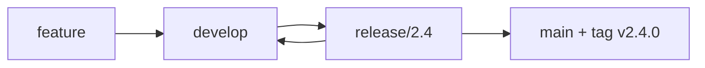

# Release Branching & Trains — Junior

<!-- level-focus -->
At junior level, focus on this question:

> How can I apply **Release Branching & Trains** in one small example and prove the result?

Use the smallest realistic scenario that exposes the decision and its failure behavior.
> **Roadmap:** [Release Engineering](../README.md) → Release Branching & Trains

*How code travels from "merged" to "shipped" — and the branches and schedules that carry it there.*

---

## Core Concept 1 — What a release branch is

A **release branch** is a branch you create from `main` to prepare one specific version for shipping. Once it exists, you stop adding new features to it — you only allow stabilizing changes (bug fixes). Meanwhile, `main` keeps moving forward with new feature work.

```
main:    A───B───C───D───E───F      (new features keep landing)
                  \
release/2.4:       C───C1───C2       (only fixes for 2.4)
```

Why bother? Because you need a *stable target* to test and ship. If the release were just "whatever is on `main` today," every new merge could break your release at the worst moment. The release branch **freezes** the feature set so testers and users get a moving-but-controlled target.

```bash
# Cut a release branch from main at the current commit
git switch main
git pull
git switch -c release/2.4
git push -u origin release/2.4
```

---

## Core Concept 2 — Two common strategies: GitFlow vs trunk-based

There are two families of branching strategies you will hear about constantly.

**GitFlow** (older, heavier): long-lived branches for everything. There is `main`, a permanent `develop` branch, plus `feature/*`, `release/*`, and `hotfix/*` branches. Features merge into `develop`; when ready, a `release/*` branch is cut; when shipped, it merges into both `main` and `develop`.



**Trunk-based development** (modern, lightweight): everyone integrates into `main` with very short-lived branches. A release is usually just a **tag on `main`**, or a short-lived `release/*` branch cut from `main` right before shipping. There is no permanent `develop`.

```
trunk-based:   main ──●──●──●──●──●──●   (tag v2.4.0 here)
```

**Why most high-velocity teams moved to trunk-based:** long-lived branches drift apart from `main`, and merging them back becomes painful and risky ("merge debt"). Trunk-based keeps everyone on one line, catches integration problems early, and pairs naturally with continuous delivery. You will go deeper into the trade-offs in the middle tier.

---

## Core Concept 3 — Tags and release candidates

A **tag** is a permanent, human-readable label pinned to one exact commit. It answers "what code is `v2.4.0`?" forever.

```bash
# Annotated tag (preferred — carries author, date, message)
git tag -a v2.4.0 -m "Release 2.4.0"
git push origin v2.4.0
```

Before a final release, teams cut **release candidates**: builds that are *proposed* releases. They get tested; if a candidate is clean, it becomes GA. If not, you fix and cut the next candidate.

```bash
git tag -a v2.4.0-rc.1 -m "Release candidate 1 for 2.4.0"
# ... testing finds a bug, fix it, then:
git tag -a v2.4.0-rc.2 -m "Release candidate 2 for 2.4.0"
# ... rc.2 is clean -> it becomes 2.4.0
```

**The golden rule you'll meet later:** *promote the exact artifact you tested — don't rebuild it.* The binary that passed RC testing is the binary you ship. Rebuilding risks shipping something subtly different from what you verified.

---

## Core Concept 4 — Cherry-picking a fix onto a release

Suppose `release/2.4` is frozen, but a tester finds a real bug. You fix it on `main` first (so future versions also get the fix), then **cherry-pick** that one commit onto the release branch.

```bash
# 1. Fix on main, get the commit hash
git switch main
# ... commit the fix ...   -> commit abc123

# 2. Bring just that commit onto the release branch
git switch release/2.4
git cherry-pick abc123
git push
```

The rule of thumb: **only fixes go onto a release branch after it's cut — never new features.** New features wait for the next release. The reason is simple: each new change is risk, and a release branch's whole job is to *reduce* risk before shipping.

---

## Core Concept 5 — Release trains and cadence

A **release train** is the idea that releases leave the station **on a fixed schedule**, like a train timetable. If your feature is ready, it's on the train. If it's not ready, it waits for the next one — the train doesn't wait for you.

```
Train every 4 weeks:
  ┌────────┐   ┌────────┐   ┌────────┐
  │  v120  │   │  v121  │   │  v122  │
  └────────┘   └────────┘   └────────┘
   Week 0       Week 4       Week 8
```

This sounds rigid, but it's freeing: nobody has to negotiate "should we hold the release for feature X?" The calendar decides. "Miss the train, catch the next one" removes pressure to rush half-finished work into a release.

Two key dates define a train:
- **Feature freeze** — stop merging *new features* for this release; only polish and fixes.
- **Code freeze** — stop merging *anything* except critical fixes; the build is locked for final testing.

---

## Real-World Examples

- **Google Chrome** ships on a roughly **4-week release train**. Each cycle a release branch (a "milestone") is cut from trunk; if a feature isn't stable by branch point, it simply rides the next milestone.
- **Ubuntu Linux** ships on a **6-month cadence** (April and October), with a feature-freeze date weeks before release. Long-Term Support (LTS) versions come every 2 years.
- **Kubernetes** releases roughly **3 times a year**, with a published schedule: enhancement freeze, code freeze, then RC builds, then GA.
- A typical web startup: no release branch at all — every merge to `main` that passes CI deploys to production (trunk-based continuous deployment). The "release" is just a deploy.

---

## Common Mistakes

- **Treating "merged to main" as "released."** Merging is integration; releasing is a separate, deliberate step.
- **Adding new features to a frozen release branch.** This defeats the purpose of freezing and reintroduces risk.
- **Rebuilding the artifact between RC and GA.** Ship the exact thing you tested.
- **Forgetting to put the fix on `main` too.** If you only fix the release branch, the bug comes back in the next version (a "regression").
- **Letting a release branch live forever.** The longer it lives apart from `main`, the harder the next merge gets.

---

## Apply it

1. Choose one small, known input for **Release Branching & Trains**.
2. Predict the output or observable behavior.
3. Run the smallest example or probe that exercises the concept.
4. Change one input to trigger a failure or boundary case.
5. Explain the evidence using the guide's vocabulary.

## Verify your work

- Record the exact input, command or code path, and output.
- Repeat the probe and confirm the result is consistent.
- Show one expected success and one expected failure.
- Resolve any difference between the prediction and the evidence.

## Review questions

- What problem does Release Branching & Trains solve in the example?
- Which input changes the observed result, and why?
- What is the smallest useful success check?
- Which beginner mistake would your evidence catch?
