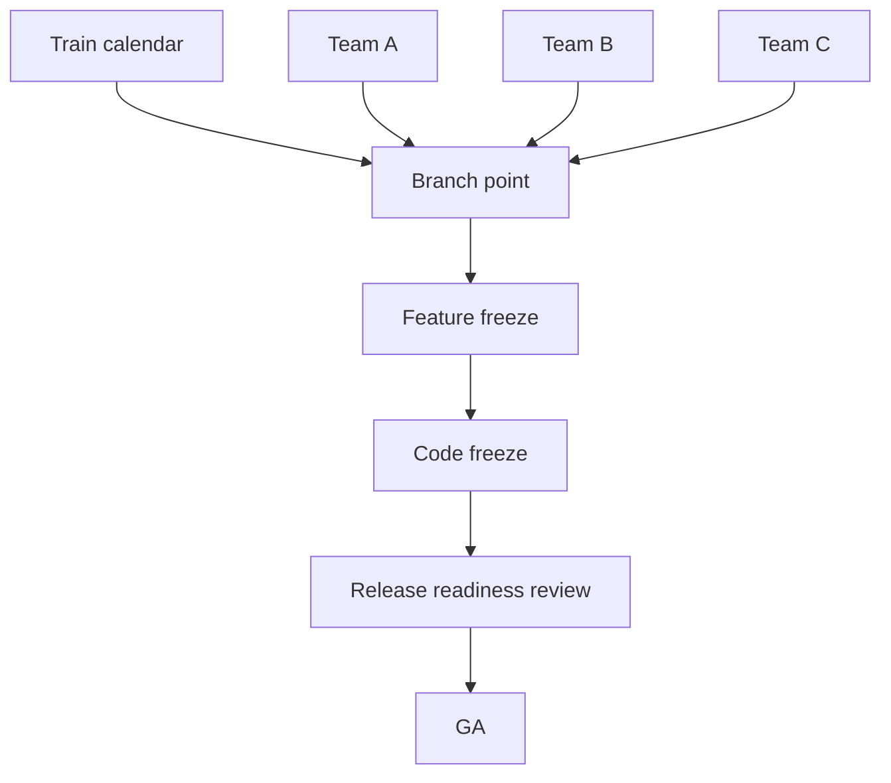

# Release Branching & Trains — Professional

<!-- level-focus -->
At professional level, focus on this question:

> How should teams adopt and operate **Release Branching & Trains** with measurable outcomes and limited coordination?

Use the smallest realistic scenario that exposes the decision and its failure behavior.
> **Roadmap:** [Release Engineering](../README.md) → Release Branching & Trains

*Coordinating a release train across many teams and services: governance, calendars, exception authority, and the organizational machinery that makes shipping boring.*

---

## Core Concept 1 — The org-level model decision and its blast radius

A branching model chosen for one team becomes an *organizational standard* with blast radius across every team that integrates with it. Professionals decide deliberately whether the org runs:

- **One uniform model** (everyone trunk-based + flags): maximal consistency, simplest mental model, but forces it onto teams whose constraints differ (e.g., the on-prem-shipping team).
- **Federated models** (each domain picks within guardrails): respects real differences, but raises integration and audit complexity, and you must define the seams between models.

The professional artifact is a **written branching standard**: the default model, the allowed exceptions, who approves a deviation, and the non-negotiables (e.g., "all production artifacts are immutable and signed regardless of model"). Without it, every team reinvents the policy, and cross-team releases become negotiation rather than process.

Decide explicitly: are releases **atomic** (the whole platform ships as one version — heavy coordination, simple reasoning) or **independent** (each service ships on its own train — high autonomy, hard to reason about combined state)? Most large orgs land on *independent services with contract/version compatibility guarantees*, because atomic release of many services doesn't scale.

---

## Core Concept 2 — Coordinating one train across many teams

When many teams contribute to one train (e.g., a quarterly platform release, a mobile app with many feature teams), coordination *is* the work.



Mechanisms that make this work:
- **A single source-of-truth calendar** with branch point, freeze dates, RC dates, RRR, GA — published far enough ahead that every team plans around it. The calendar is a *commitment*, not a suggestion.
- **A train manifest**: what each team is committing to this train, with an explicit "ready / behind flag / catching next train" status per item by branch point.
- **"Miss the train, catch the next one" enforced uniformly.** The moment one team's incomplete feature can slip the whole GA, the train stops being a forcing function. Incomplete work ships dark behind flags; it does not slip the date.
- **A release readiness review** before GA: cross-functional go/no-go (eng, QA, security, support, docs) against a checklist, with the decision and owner recorded.

The cultural win: predictability. Downstream functions (support, marketing, sales, docs) can plan against the calendar because the date holds and the *content* flexes.

---

## Core Concept 3 — Branching across many services and repos

In a microservices/multi-repo world, "the release branch" multiplies. Two viable patterns:

**Per-service independent trains.** Each service owns its branch model, cadence, and versioning; compatibility is guaranteed by API/contract versioning, not by shipping together. This is the default at scale — it preserves team autonomy and avoids a global freeze. The cost is that "what's in production" is a *set* of versions, requiring strong observability and contract testing (see the `api-versioning` and `ci-cd-pipeline-design` skills, and contract testing under integration testing).

**Coordinated platform train.** A subset of services that must ship together (a tightly coupled platform release) shares a synchronized branch point and freeze. Reserve this for genuinely coupled components — it's expensive and should be the exception.

```
Independent (default):  svc-a v3.2   svc-b v1.9   svc-c v5.0   (contracts hold)
Coordinated (rare):     platform-2024.Q3 = {svc-x, svc-y, svc-z} branched together
```

Professional guidance: **minimize coordinated trains**. Each one couples teams' schedules and reintroduces the global-freeze pain trunk-based was meant to escape. Push compatibility into contracts and flags so services can ship independently; coordinate only the irreducibly coupled core.

---

## Core Concept 4 — Freeze governance and the exception org chart

At org scale, a freeze affects many teams, so its governance must be unambiguous *before* the pressure hits.

| Question | Must be answered in advance |
|----------|----------------------------|
| Who can declare a freeze? | Named role (RM / release council) |
| Who can grant an exception? | Same or escalation chain, by severity |
| What evidence is required? | Severity, blast radius, rollback plan, tests |
| What does an exception cost? | Re-soak, extra review, recorded justification |
| How is break-glass logged? | Auto-ticketed, post-incident review mandatory |

The principle: **freeze friction proportional to risk, authority proportional to blast radius.** A one-line typo fix during code freeze needs a light, fast exception; a schema change needs the full council. A **deploy freeze** during a peak business window (Black Friday, tax deadline) may have *higher* authority than a normal code freeze because the blast radius is revenue.

**Break-glass** is the non-negotiable escape hatch: a pre-authorized emergency path that lets the right person ship a critical fix during any freeze, while *automatically* recording who, what, when, and why for mandatory post-hoc review. Safety and auditability must survive the emergency — speed cannot delete the paper trail. This mirrors break-glass in quality gates: the override exists, but it is loud and logged.

---

## Core Concept 5 — The release manager role and runbook

Predictable trains need an accountable owner. The **release manager (RM)** — often a rotation, not a person — owns one train end to end.

RM responsibilities:
- Owns the calendar and communicates branch point / freeze / GA to all teams.
- Maintains the train manifest and chases "ready" status before branch point.
- Chairs the release readiness review and records the go/no-go.
- Holds (or escalates) freeze-exception authority.
- Owns the rollback decision if GA goes wrong (with [Rollback & Roll-Forward](../07-rollback-and-roll-forward/) procedures).
- Runs the post-release retro feeding back into the model.

The **runbook** turns the RM role into something a rotation can execute without tribal knowledge: a step-by-step for cutting the branch, building/promoting RCs, the RRR checklist, the exception procedure, the GA steps, and the rollback procedure. A good runbook means a new RM can run a train competently from the document — which is the whole point of professionalizing release engineering. Automate every step the runbook describes that doesn't require judgment ([Release Automation](../08-release-automation/)).

---

## Core Concept 6 — Support matrix as a business commitment

How many versions you support is not an engineering preference at this level — it's a **business and legal commitment** with cost, and you own publishing and honoring it.

```
Version   Status        Fixes provided        EOL
4.x       Current       all qualifying        active
3.x       Maintenance   security + critical   2025-12-31
2.x       LTS           security only         2026-06-30
1.x       EOL           none                  (ended)
```

Professional considerations:
- **The matrix is a contract.** Enterprise customers buy against it; legal and finance must approve the window because backport effort is real, ongoing cost.
- **Budget the backport burden explicitly.** Each security advisory must be applied to *every* in-support line; older lines mean conflicting, hand-adapted backports. Model the engineering headcount this consumes when committing to a window.
- **EOL is a process, not a date.** Customers need lead time, migration paths, and sometimes paid extended support. Communicate EOL far ahead.
- **Fewer, longer LTS lines** beat many short ones; per-line fixed cost (CI, security triage, release machinery) dominates.

Study published matrices (Ubuntu LTS 5-year support, Node.js active/maintenance LTS, Kubernetes latest-3-minors) as templates, then size yours to your actual backport capacity — overcommitting here is a slow, compounding tax.

---

## Core Concept 7 — Flags as org policy, not a team hack

Once the org standardizes on trunk-based, **feature flags become infrastructure with policy**, because they now carry the decoupling that branches used to.

Org-level policy elements:
- **A standard flag platform** with audit, targeting, and kill-switch — not per-team ad-hoc booleans. Flag changes are production changes and must be observable.
- **A flag lifecycle mandate.** Flags are debt; require an owner and a removal date at creation, and report on stale flags. Unmanaged flags become a worse mess than the branches they replaced.
- **Flags as the rollback primitive.** Org-wide, "disable the feature" should be a flag flip (instant, no redeploy) rather than a revert-and-ship. This makes the release model and the rollback model one system.
- **Clear boundary between flags and config.** Release flags (temporary, decouple deploy from release) differ from ops flags (permanent, operational levers); conflating them rots both.

The strategic point: in a mature org the *long-lived release branch is largely replaced by runtime flag control*, which is why flag governance is now part of release engineering, not a separate concern. (See [Feature Flags & Progressive Delivery](../06-feature-flags-and-progressive-delivery/).)

---

## Core Concept 8 — Measuring and evolving the model

A professional treats the release model as a product to be measured and improved, not a fixed ritual.

Signals to track:
- **Train adherence:** % of trains that ship on the scheduled GA date (slips are expensive and should be rare and explained).
- **Integration latency / merge debt:** time from merge to integration; rising values predict painful releases and warn that branches are living too long.
- **Cherry-pick / backport volume and conflict rate:** high or rising = divergence problems or too many supported lines.
- **Exception frequency:** many freeze exceptions means the freeze is mistimed or the date unrealistic — fix the calendar, not the people.
- **Lead time for changes and change-failure rate** (DORA): the ultimate test of whether the model serves delivery or obstructs it.

Run a **retro after each major train** and feed findings back: shorten a freeze that's too long, drop an LTS line you can't afford, automate a step that caused a slip. The model that fit at 5 teams will not fit at 50; evolving it deliberately is the job.

---

## Real-World Examples

- **Chrome at scale:** a fully automated 4-week train across thousands of engineers; the date is sacrosanct, content flexes via flags, channels (Canary/Dev/Beta/Stable) are promotion stages, and a release-management function owns the calendar and exceptions. The org-level lesson: make the date immovable and the content negotiable.
- **Kubernetes:** a release team (a rotating, documented role set — release lead, enhancements, CI signal, docs, comms) runs each cycle from a public runbook with a published calendar and support matrix — a textbook professional release-engineering org for a multi-org project.
- **Ubuntu:** a 6-month train with a strict, publicly governed freeze schedule and a 5-year LTS support commitment — the support matrix as a business contract.
- **A large bank:** independent per-service trains with a coordinated quarterly platform train for the irreducibly coupled core, deploy freezes around financial close, and a fully logged break-glass path approved by an SRE/compliance pair.

---

## Common Mistakes

- **No written branching standard**, so every team's model is different and cross-team releases are negotiations.
- **Letting one team's slip slip the whole train**, destroying the train as a forcing function — flag it, ship dark, hold the date.
- **Over-coordinating** — synchronizing services that aren't actually coupled, reimporting global-freeze pain.
- **Freeze authority undefined under pressure**, so emergencies become chaos or paralysis.
- **Break-glass without logging**, trading auditability for speed — the worst trade in regulated contexts.
- **Overcommitting the support matrix** to versions you can't afford to backport to.
- **Flags without governance**, replacing branch debt with worse, invisible flag debt.
- **Treating the model as immutable** while the org grows past it.

---

## Apply it

1. Define the user or business outcome that **Release Branching & Trains** should improve.
2. Assign one owner for code, contracts, operations, and incidents.
3. Split delivery into reversible increments that produce evidence early.
4. Publish responsibilities, escalation paths, and compatibility windows.
5. Stop or expand only when the agreed measures support that decision.

## Verify your work

- Each increment has an owner, rollback path, and observable exit condition.
- Adoption, reliability, delivery time, and coordination cost are measured.
- Incident and migration exercises prove that responsibility is executable.
- The old path is removed only after telemetry proves it is unused.

## Review questions

- Which measurable outcome justifies investing in Release Branching & Trains?
- Which team owns the full lifecycle and incident response?
- What reversible increment produces the earliest useful evidence?
- Which exit condition proves that migration or adoption is complete?
