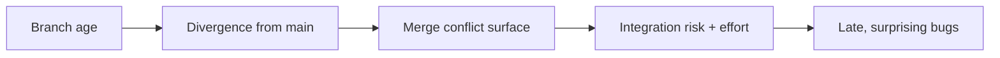

# Release Branching & Trains — Senior

<!-- level-focus -->
At senior level, focus on this question:

> Which system invariant is affected by **Release Branching & Trains** under failure, load, and change?

Use the smallest realistic scenario that exposes the decision and its failure behavior.
> **Roadmap:** [Release Engineering](../README.md) → Release Branching & Trains

*Choosing and defending a branching model under real constraints — velocity, regulation, team size — and paying down the costs it creates.*

---

## Core Concept 1 — Picking a model from first principles

Don't start from "GitFlow vs trunk-based." Start from constraints and derive the model.

| Constraint | Pushes you toward |
|------------|-------------------|
| Deploy many times/day | Trunk-based, release = tag; flags for incomplete work |
| One production version (SaaS) | Trunk-based; little or no release branch |
| Many customer-installed versions | Per-version maintenance branches + LTS |
| Strong regulatory/audit needs | Explicit release branch + signed artifacts + change records |
| Large team, high parallel WIP | Trunk-based + flags (NOT more long-lived branches) |
| Hardware/firmware long cycle | Longer-lived stabilization branches are acceptable |

The single best predictor is **deploy frequency relative to how long features take**. If you deploy faster than features complete, you *cannot* gate releases on feature completion — you must decouple deploy from release using flags, and your branch model collapses toward trunk-based. If you ship infrequently to many fixed installations, isolation matters more and explicit release/maintenance branches earn their keep.

A common senior mistake is importing a model from a previous company whose constraints differed. Re-derive it.

---

## Core Concept 2 — The true cost of long-lived branches

Long-lived branches are seductive — they feel like clean isolation — but their cost is **non-linear in branch lifetime**.



The mechanism: while the branch lives, `main` changes underneath it. Every change on either side is a potential conflict at merge time — semantic, not just textual (the famous case where neither side conflicts in `git` but the combined behavior is wrong). Worse, the *testing* you did on the branch was against a stale `main`, so you re-test from scratch after merge. This is **merge debt**, and like financial debt it compounds.

Concrete senior heuristics:
- **Cap branch lifetime.** A release branch should live from branch point to GA + hotfix window — weeks, not quarters.
- **Measure integration latency** as a release-health metric; rising latency predicts painful merges.
- **Prefer many small integrations** over one big one. The cost of `N` small merges is far below one merge of `N` changes.

---

## Core Concept 3 — Feature flags as a branch replacement

The reason trunk-based works at scale is that **feature flags replace long-lived feature branches**. Instead of isolating incomplete work on a branch, you merge it to `main` *disabled* and integrate continuously.

```
Old way:  feature/big-thing lives 6 weeks ──► giant risky merge
Flag way: merge daily to main, code OFF behind flag, flip on when ready
```

This converts a *branch-management* problem (divergence, merge debt) into a *runtime-configuration* problem (flag lifecycle, flag debt) — generally a better trade because flags are observable, reversible at runtime, and don't block others' integration. Key senior considerations:

- **Branch by abstraction** for changes too invasive for a simple boolean: introduce an interface, build the new implementation behind it on `main`, switch over, delete the old path.
- **Dark launches**: ship code to production off, then enable per-cohort — this is also your rollback mechanism (flip the flag, not the deploy).
- **Flags are debt too.** Stale flags rot; you need a flag-retirement discipline. (See [Feature Flags & Progressive Delivery](../06-feature-flags-and-progressive-delivery/).)

The strategic insight: in a flag-driven org, the *release branch shrinks or disappears*, because the thing it used to provide — a way to ship a stable subset while risky work continues elsewhere — is now provided at runtime by flags.

---

## Core Concept 4 — Designing the promotion pipeline

The promotion pipeline is where "the exact artifact" rule becomes architecture. Design it so rebuilding is *impossible by construction*.

```
   ┌────────┐   gate    ┌─────────┐  gate   ┌────────┐  gate  ┌─────┐
   │ build  │ ───────►  │ staging │ ──────► │ canary │ ─────► │ GA  │
   │ once   │  by digest │ (soak)  │ by dig. │ (1-5%) │ by dig.│     │
   └────────┘            └─────────┘         └────────┘        └─────┘
```

Principles:
- **Immutable, content-addressed artifacts.** Promote `app@sha256:...`, never a mutable tag like `:latest`. The digest *is* the identity.
- **Gates are evidence, not vibes.** A gate passes on signals: soak error rate, canary SLO compliance, manual sign-off recorded with who/when. (See [Quality Gates] concepts and the `ci-cd-pipeline-design` skill.)
- **Environments differ only in config, not in build.** If staging and prod run different binaries, your soak validated nothing.
- **Promotion is auditable.** Each transition records the digest, the gate evidence, and the approver — this is also your provenance trail ([Artifact Signing & Provenance](../04-artifact-signing-and-provenance/)).

The payoff: GA is "flip the pointer to the already-soaked digest," a near-zero-risk operation, instead of "build the release," a high-variance one.

---

## Core Concept 5 — Cherry-pick governance at scale

On a small repo, cherry-pick policy is a convention. On a large/regulated repo it's **governance**: a documented, enforced, auditable process.

```bash
# Common pattern: PRs labeled for backport, automation opens the cherry-pick PR
git switch main
# fix merges to main as abc123, PR labeled "cherry-pick/release-2.4"
# bot creates branch + PR:
git switch -c cp-2.4-abc123 release/2.4
git cherry-pick -x abc123     # bot resolves trivial cases, escalates conflicts
```

Governance elements a senior should put in place:
- **An eligibility rule, written down:** what may be cherry-picked (sev1/2, security, data-loss, regressions) and what may not (features, dependency bumps, refactors).
- **Direction is enforced:** fix lands on `main` first; backport PRs are generated *from* the `main` commit. Reverse flow (release-only fix) requires an explicit forward-port ticket so `main` never silently lacks a fix.
- **Every release-branch commit traces to a `main` SHA** (the `-x` trail), so an auditor can answer "is this fix in the next version?" mechanically.
- **A divergence report**: periodically diff `release/X` against its branch point and flag any commit with no `main` ancestor — those are your regression risks.

---

## Core Concept 6 — Supporting many release lines

Deciding *how many* lines to support is a strategic, costed decision — each line is recurring backport burden plus CI cost plus cognitive load.

```
main (4.x) ──────────────────────────────►
   \           \              \
    3.x (full)  2.x (security) 1.x-LTS (security, sunset Q4)
```

Senior framing:
- **Define a support matrix and publish it.** Customers and your team must know which versions get fixes and for how long.
- **Tier the support level.** Newest line: all qualifying fixes. Older lines: security/data-loss only. LTS: security only, with a published end-of-life date.
- **Budget the backport burden.** Each security advisory must be applied to *every* in-support line; the older the line, the likelier a conflicting, hand-adapted backport. Model this as ongoing engineering cost when you commit to a support window.
- **Prefer fewer, longer LTS lines** over many short ones; the per-line fixed cost dominates.

Kubernetes (latest 3 minors) and Node.js (active + maintenance LTS) are good reference matrices to study and adapt.

---

## Core Concept 7 — Freeze policy and the exception process

A freeze is a deliberate restriction on what can change, and a senior owns both the freeze *and* the escape hatch.

| Freeze type | Restricts | Typical trigger |
|-------------|-----------|-----------------|
| Feature freeze | New features into the release | Branch point reached |
| Code freeze | All but critical fixes | Final validation window |
| Deploy freeze | Production deploys | High-risk window (peak sales, holidays) |

A freeze without an **exception process** is either ignored or paralyzing. Design the exception path explicitly:
- **Who can grant an exception** (release manager / on-call lead), and on what evidence (severity, blast radius, rollback plan).
- **What an exception costs**: extra review, re-soak, a recorded justification — friction proportional to risk, so exceptions stay rare.
- **Break-glass** for emergencies: a pre-authorized fast path that *still* logs everything, so safety and auditability survive even when speed is essential. (This mirrors break-glass in quality gates — the override must be observable.)

The goal is a freeze that's a real constraint but not a brick wall: predictable by default, overridable with accountability.

---

## Core Concept 8 — Automating the release branch

Manual release branching is where tribal knowledge and 2 a.m. mistakes live. Senior teams automate the mechanics so humans only make *decisions*.

```yaml
# Conceptual: a scheduled job cuts the train branch every cadence
on:
  schedule: [cron: "0 9 */28 * *"]   # every 4 weeks
jobs:
  cut-release:
    steps:
      - cut release/$(next_version) from main at last-green SHA
      - open the "RC tracking" issue with the milestone checklist
      - notify all contributing teams of branch point + freeze dates
```

What to automate:
- **Branch cut at last-known-green**, not blind HEAD.
- **RC tagging and artifact build** triggered by the tag; digest recorded.
- **Backport PR creation** from labeled `main` PRs.
- **Changelog/release-note assembly** from merged PRs ([02](../02-changelogs-and-release-notes/)).
- **Freeze enforcement** as branch-protection rules, not Slack reminders.

Leave to humans: go/no-go on gates, exception decisions, and "is this the release we want to ship." Automate the toil, not the judgment. (See [Release Automation](../08-release-automation/) and the `ci-cd-pipeline-design` skill.)

---

## Real-World Examples

- **Chrome:** a milestone branch is cut from trunk on the 4-week beat; the cut is automated, features not green by branch point ride the next milestone, and most risky work lives behind flags rather than branches — a near-pure trunk-based-plus-flags model at enormous scale.
- **Kubernetes:** explicit support matrix (latest 3 minors), a published freeze calendar, and a documented cherry-pick approval process with shepherds — governance, not convention.
- **A regulated fintech:** keeps an explicit release branch and signed artifacts because auditors need a frozen, attributable artifact per release; here the "heavier" model is a feature, not a smell.
- **A high-growth SaaS:** no release branch at all — trunk-based, deploy-on-merge, everything risky behind flags; "release" and "deploy" are decoupled entirely, and rollback is a flag flip.

---

## Common Mistakes

- **Cargo-culting GitFlow** into a deploy-many-times-a-day SaaS, manufacturing merge debt for isolation you don't need.
- **Trunk-based without flags or discipline**, so `main` is frequently un-releasable.
- **Letting release branches outlive their purpose**, turning each into a divergence liability.
- **Freeze with no exception process** — teams route around it, killing its credibility.
- **Unbounded support matrix** — committing to versions you can't afford to backport to.
- **Rebuildable promotion** — any pipeline step that can recompile breaks the "exact artifact" guarantee.
- **Automating judgment** (auto-promoting to GA with no human go/no-go) before the gates are trustworthy.

---

## Apply it

1. State the system invariant that **Release Branching & Trains** must protect.
2. Mark ownership, state, and failure propagation at each boundary.
3. Compare two designs under load, dependency failure, and future change.
4. Define recovery and compatibility behavior before implementation.
5. Test the riskiest assumption with a focused experiment.

## Verify your work

- The experiment supports the design with evidence, not preference.
- Failure injection shows the blast radius and recovery path.
- Compatibility checks cover old and new callers or data.
- Operational signals reveal invariant violations and recovery progress.

## Review questions

- Which invariant must remain true when Release Branching & Trains fails?
- Where should recovery responsibility live, and why?
- Which assumption deserves an experiment before implementation?
- How can the design evolve without changing every consumer at once?
