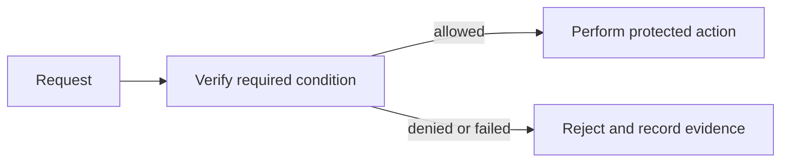

# Authentication — Professional

<!-- level-focus -->
At professional level, focus on this capability:

> How do teams deliver this control as an operating model rather than a one-time project?

## Mental model

lead organization-scale adoption of prove the caller’s identity before granting access. In this module, the important vocabulary is **credentials, sessions, and multifactor verification**. Security work is useful only when the system makes the intended decision reliably and produces evidence that it did so.

Treat Authentication as a product: publish a supported interface, default-safe templates, ownership boundaries, service objectives, and a path for exceptions with expiry.

## Method and trade-offs

Deliver in reversible slices: inventory the current state, protect the highest-risk path, run in observe-only mode where safe, enforce for a small cohort, and expand only when evidence meets exit criteria.

Coordinate application, platform, security, compliance, and incident teams through written contracts. The owning team operates the control; consuming teams own correct integration; security governance owns accepted-risk decisions.

## Scenario

For an account service, write a one-page decision record: asset, actor, trust boundary, rule, failure behavior, owner, and evidence source. Use that record to keep implementation and operations aligned.

## Apply it

Use a sustained scenario: onboard three services to the standard, rotate or change the control during a release, and conduct an incident review that measures time to detect, contain, and recover.

## Verify your work

Exit criteria include adoption of the supported path, measurable reduction in unsafe exceptions, tested rollback, and named incident escalation.
- Exceptions have owners, compensating controls, and expiry dates.
- Quarterly evidence includes control coverage, failure drills, and audit findings.
- Roadmaps reduce cognitive load rather than require every team to become a security specialist.

## Review questions

- What outcome measure proves adoption is improving security rather than only adding process?
- Which team can authorize an exception, and when does it expire?
- What reversible increment would expose the highest-risk assumption first?
