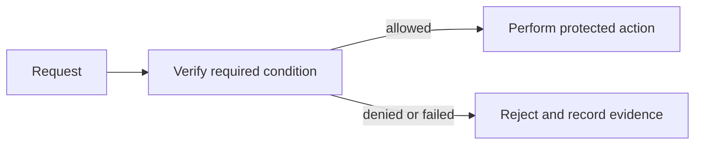

# Authentication — Senior

<!-- level-focus -->
At senior level, focus on this capability:

> Which invariants, trust boundaries, and recovery paths keep this control effective at scale?

## Mental model

design prove the caller’s identity before granting access across components under failure and change. In this module, the important vocabulary is **credentials, sessions, and multifactor verification**. Security work is useful only when the system makes the intended decision reliably and produces evidence that it did so.

Write invariants before choosing products: protected data is never released without a verified decision; sensitive material is not exposed in telemetry; and failures have an intentional security posture.

## Method and trade-offs

Map the request path across client, edge, service, and data store. Assign ownership for identity, policy, key material, and audit evidence. Design idempotency, timeouts, and compatibility before rollout.

A plausible design may favor central consistency, local availability, or lower latency. Choose explicitly: high-risk actions usually favor fresh centralized decisions; low-risk reads may use short-lived, auditable cache entries.

## Scenario

For an account service, write a one-page decision record: asset, actor, trust boundary, rule, failure behavior, owner, and evidence source. Use that record to keep implementation and operations aligned.

## Apply it

Run a cross-component failure exercise: make the identity or policy dependency slow, replay a stale request, and verify the system follows the written invariant rather than an accidental default.

## Verify your work

Architecture records identify trust boundaries and owners.
- Failure tests cover unavailable dependencies, stale credentials, and replay or retry behavior.
- Dashboards expose deny rates, decision latency, and unexpected bypass signals.
- Compatibility tests protect old clients during a policy migration.

## Review questions

- Which invariant would be violated by a stale decision?
- Who owns recovery when the security dependency fails?
- What evidence distinguishes an attack from a configuration regression?
