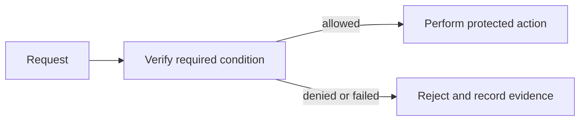

# JWT and Tokens — Middle

<!-- level-focus -->
At middle level, focus on this capability:

> Where should the decision live so it is testable and hard to bypass?

## Mental model

choose maintainable boundaries for issue and validate bearer credentials with bounded lifetime and audience in a real codebase. In this module, the important vocabulary is **claims, signatures, expiry, and revocation**. Security work is useful only when the system makes the intended decision reliably and produces evidence that it did so.

Separate request handling, policy evaluation, and infrastructure integration. The application should ask one focused interface for a decision rather than scatter checks across handlers.

## Method and trade-offs

Compare a local library, a shared service, and an edge control. Prefer the smallest boundary that owns the policy and can be integration-tested. Keep credentials and provider details behind an adapter.

Under-application appears as duplicated checks and inconsistent errors. Over-application appears as a remote call for every simple rule, adding latency and failure coupling.

## Scenario

For a service API, write a one-page decision record: asset, actor, trust boundary, rule, failure behavior, owner, and evidence source. Use that record to keep implementation and operations aligned.

## Apply it

Refactor one existing endpoint: introduce a policy interface, add unit tests for its decisions, then add an integration test that exercises the endpoint with real request metadata.

## Verify your work

Unit tests cover each decision branch.
- An integration test proves the endpoint cannot skip the policy.
- Timeouts and dependency errors have a defined fail-closed or fail-safe behavior.
- A new engineer can find the rule in one place.

## Review questions

- What data must cross the policy boundary?
- Which decision can remain local, and which needs a shared authority?
- What is the safe response if the policy dependency is unavailable?
