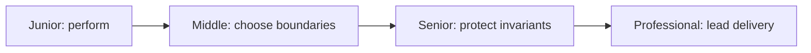

# WAF and API Security

> Build practical capability in WAF and API Security through four levels of increasing scope, ambiguity, and responsibility.

| Level | Guide | You are done when |
|---|---|---|
| Junior | [Start with a bounded exercise](junior.md) | You can apply the control and observe its expected result. |
| Middle | [Choose a local design](middle.md) | You can explain boundaries and test an integrated flow. |
| Senior | [Shape the system](senior.md) | You can protect invariants through failure and change. |
| Professional | [Lead durable delivery](professional.md) | You can align ownership, rollout, evidence, and incident response. |

Start at the first level where the work is unfamiliar. Keep evidence from every exercise: configuration, test output, telemetry, and the decision that explains the trade-off.
