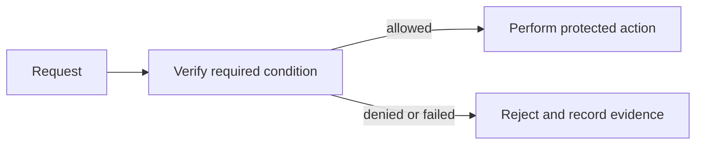

# PKI and Certificate Management — Junior

<!-- level-focus -->
At junior level, focus on this capability:

> What is the smallest safe way to operate certificates as expiring production dependencies?

## Mental model

perform operate certificates as expiring production dependencies in a small, defined system. In this module, the important vocabulary is **certificate authorities, issuance, renewal, and trust stores**. Security work is useful only when the system makes the intended decision reliably and produces evidence that it did so.

Implement one explicit control for a TLS-enabled service. Name the protected asset, the trusted input, and the expected deny behavior.

## Method and trade-offs

1. Identify the asset and the caller.
2. Write the one rule that must hold.
3. Configure the narrowest control that enforces it.
4. Test one allowed request and one denied request.
5. Record the result and remove any temporary access.

A common mistake is treating a successful request as proof of security. Test the negative case deliberately; a control that never denies is not a control.

## Scenario

For a TLS-enabled service, write a one-page decision record: asset, actor, trust boundary, rule, failure behavior, owner, and evidence source. Use that record to keep implementation and operations aligned.

## Apply it

Create a small a TLS-enabled service with a test identity. Apply the rule, then capture the HTTP status, audit event, or command output for both the allowed and denied cases.

## Verify your work

The allowed case succeeds only for the intended identity or condition.
- The denied case fails closed with no protected data in the response.
- Logs reveal the decision without recording credentials or secret values.
- The control has an explicit owner and configuration location.

## Review questions

- Which asset does this control protect?
- What condition must be true before access is allowed?
- How would you prove that a denied request cannot bypass the control?
