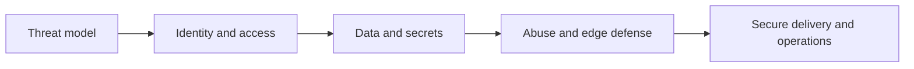

# Security at Scale

> Design, operate, and improve the controls that keep a distributed system trustworthy under real traffic, failures, and organizational change.

Security at scale is not a single gateway or a compliance checklist. It is a set of explicit decisions about identity, authority, cryptography, abuse resistance, software provenance, and incident ownership. The modules below progress from applying one control correctly to establishing a durable operating model across teams.

## Topics

| # | Topic | What you'll learn |
|---|---|---|
| 01 | [Authentication](authentication/README.md) | Establish and verify a caller's identity. |
| 02 | [Authorization](authorization/README.md) | Make and enforce permission decisions. |
| 03 | [OAuth 2.0 and OpenID Connect](oauth2-and-oidc/README.md) | Delegate access and obtain identity claims safely. |
| 04 | [JWT and Tokens](jwt-and-tokens/README.md) | Validate bounded bearer credentials. |
| 05 | [Encryption at Rest and Transit](encryption-at-rest-and-transit/README.md) | Protect stored and moving data. |
| 06 | [Secrets Management](secrets-management/README.md) | Store, deliver, and rotate sensitive values. |
| 07 | [DDoS Mitigation](ddos-mitigation/README.md) | Preserve service for legitimate users under attack. |
| 08 | [WAF and API Security](waf-and-api-security/README.md) | Apply edge controls and secure API behavior. |
| 09 | [Rate Limiting for Abuse](rate-limiting-for-abuse/README.md) | Bound abusive demand fairly. |
| 10 | [DevSecOps and Supply Chain Security](devsecops-and-supply-chain-security/README.md) | Deliver trustworthy software artifacts. |
| 11 | [Zero Trust Architecture](zero-trust-architecture/README.md) | Remove implicit network trust. |
| 12 | [PKI and Certificate Management](pki-and-certificate-management/README.md) | Operate certificates and trust chains. |
| 13 | [Threat Modeling with STRIDE](threat-modeling-stride/README.md) | Discover and prioritize threats before delivery. |
| 14 | [Envelope Encryption and KMS](envelope-encryption-and-kms/README.md) | Protect data keys with managed root keys. |

## How to use this section

Start with Threat Modeling to identify assets and trust boundaries, then build the access-control and cryptographic foundations. Add abuse controls at the edge and make secure delivery repeatable. Every topic has four levels—**junior → middle → senior → professional**—with an applied exercise and evidence you can keep.

---

> Part of the [On Production](../README.md) roadmap.
