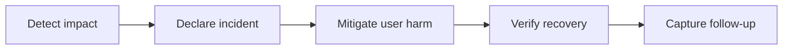

# Incident Management — Junior

<!-- level-focus -->
At junior level, focus on this question:

> Can you recognize a user-impacting incident, communicate useful facts, and work safely under an incident commander?

---

## What an incident is

An incident is an unplanned event that materially threatens users or a service objective. It is not necessarily a bug ticket. Incident management gives responders a shared way to reduce impact first, then understand cause.

## First ten minutes

1. Confirm the symptom with an SLI, synthetic check, or customer evidence.
2. Open the incident channel and state impact, start time, and scope.
3. Assign or join the incident commander; follow their priorities.
4. Stop risky concurrent changes and identify recent deploys.
5. Propose a reversible mitigation: rollback, disable a feature, shed nonessential load, or increase safe capacity.
6. Update the timeline whenever evidence changes.

Use observations, not certainty: “Checkout 5xx rose from 0.2% to 18% at 10:14 UTC after release `r42`” is better than “the release broke payments.”

## Scenario

An API latency alert fires. You verify p95 latency is above the SLO threshold in two regions. The commander asks you to compare pre- and post-deploy error rates. You publish the query, result, and timestamp; you do not restart pods on your own, because that might remove evidence or worsen capacity.

## Mistakes to avoid

- Debugging privately while users continue to fail.
- Making irreversible changes without the commander's agreement.
- Mixing assumptions with confirmed facts.
- Declaring recovery before the SLI has stayed healthy long enough.

## Apply it

1. Write an incident opening message for a 12% checkout failure rate.
2. List two safe mitigations and one risky action to avoid.
3. Create a five-event timeline from detection through verification.

## Verify your work

- The opening message includes impact, scope, time, and responder route.
- Every timeline entry has a timestamp and source.
- Your recovery check uses the same user-facing signal that detected impact.

## Review questions

- Why does mitigation come before root-cause certainty?
- What distinguishes an observation from a hypothesis?
- When is it safe to declare an incident recovered?
