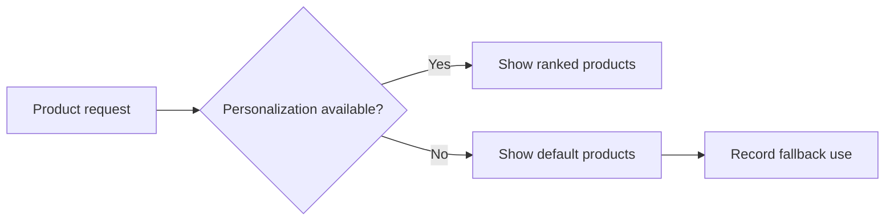

# Graceful Degradation — Junior

<!-- level-focus -->
At junior level, focus on this question:

> Can you define a reduced but honest user experience when a noncritical dependency is unavailable?

---

## Degrade intentionally

Graceful degradation keeps a useful core journey working when an optional capability fails. It is different from pretending nothing is wrong. The product must remain truthful about freshness, completion, and limits.

For an online store, checkout can work while recommendations are hidden; product pages can show a cached inventory message when the personalization service fails. Charging a customer while hiding that order creation failed is not graceful degradation.

## Method

1. Map the user journey into core and optional dependencies.
2. Define a safe fallback for each optional dependency: cache, default, queued work, or clear unavailable state.
3. Set a timeout and circuit-breaking condition so calls fail quickly.
4. Preserve correctness invariants: no duplicate charge, no false confirmation, no silent data loss.
5. Measure fallback use and restore normal behavior deliberately.

## Example

The recommendation API exceeds a 150 ms timeout. The page returns catalog defaults and records `recommendation_fallback_total`; it does not wait five seconds for an optional panel. A banner is only needed if the missing feature changes a promise the user relies on.

## Common mistakes

- Falling back to stale data without a freshness bound.
- Applying a fallback to a payment or authorization decision that requires strong correctness.
- Leaving timeouts so long that the fallback never protects latency.
- Forgetting to observe when the fallback becomes the normal path.

## Apply it

1. Choose a journey with one optional dependency.
2. Write its normal result, fallback result, timeout, and invariant.
3. Simulate the dependency timeout locally.

## Verify your work

- The core journey completes within its latency target when the dependency fails.
- The fallback does not claim a result it cannot guarantee.
- A metric or log records every fallback activation.

## Review questions

- What distinguishes graceful degradation from hidden failure?
- Which invariants must never be weakened by a fallback?
- Why are timeout values part of the design?
