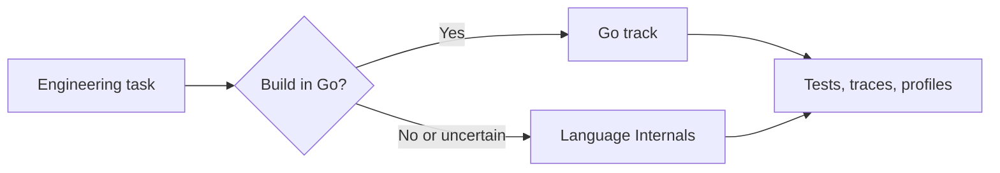

# Programming Languages

> Learn a language well enough to deliver software, then use runtime knowledge to explain what the program actually does under load and failure.

Choose a track from the problem in front of you. Use **Go** when you need to build or operate a Go program. Use **Language Internals** when a type, allocation, compiler, runtime, numeric, security, or interoperability decision is unclear.

The destination is evidence: a test, compiler diagnostic, benchmark, profile, trace, or production measure that confirms the mental model.

## Tracks

| Track | Start here | Use it to |
|---|---|---|
| [Go](golang/README.md) | Set up, write, organize, and operate Go software. | Deliver services and tools with explicit concurrency, error, API, data, and debugging decisions. |
| [Language Internals](language-internals/README.md) | Study concepts shared across languages and runtimes. | Predict behavior, compare language choices, and diagnose problems below source syntax. |

## A practical study loop

1. Pick one behavior you cannot yet predict.
2. Write the expected result before running the program.
3. Build the smallest example that can disprove the expectation.
4. Inspect the relevant compiler, runtime, memory, or protocol evidence.
5. Change one variable and repeat.
6. Record the rule and its limit in your own words.

## Level progression

| Level | Responsibility |
|---|---|
| Junior | Make a small program behave correctly and explain the result. |
| Middle | Choose maintainable boundaries and verify component integration. |
| Senior | Protect system invariants across performance, failure, and evolution. |
| Professional | Govern adoption, ownership, migration, and measurable outcomes. |

Move to the next level when you can reproduce the current level's evidence without copying the example.
