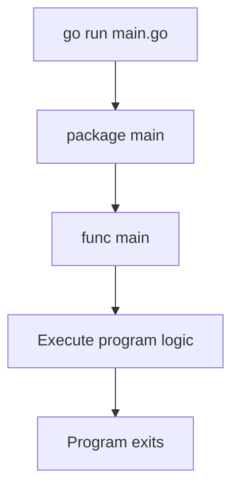
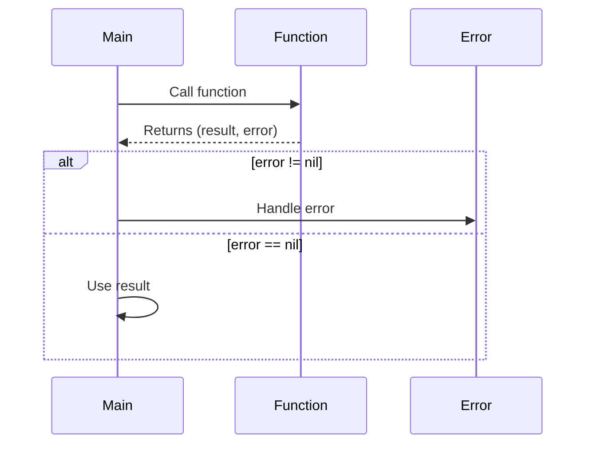

# Why Use Go — Junior

<!-- level-focus -->
At junior level, focus on this question:

> How can I apply **Why Use Go** in one small example and prove the result?

Use the smallest realistic scenario that exposes the decision and its failure behavior.
## Core Concepts

### Concept 1: Simplicity by Design

Go was created to be simple. Unlike languages that add features over time (C++, Java), Go deliberately removed features like inheritance, generics (added later in Go 1.18 in a minimal form), and operator overloading. The result is a language where there is usually **one obvious way** to do things, making code easier to read and maintain.

### Concept 2: Built-in Concurrency

Go was designed for the modern era of multi-core processors. Instead of using OS threads (which are expensive), Go provides **goroutines** — lightweight concurrent functions that cost only a few kilobytes of memory. You can run thousands of goroutines on a single machine with minimal overhead.

### Concept 3: Fast Compilation

One of Go's original design goals was to compile large codebases quickly. Google engineers were frustrated by C++ builds that took minutes or even hours. Go compiles entire projects in seconds, even for millions of lines of code. This enables a fast development cycle.

### Concept 4: Single Binary Deployment

Go compiles your entire program — including all dependencies — into a single executable binary. There is no need to install a runtime (like Java's JVM or Python's interpreter) on the target machine. Just copy the binary and run it.

### Concept 5: Strong Standard Library

Go ships with a powerful standard library that covers HTTP servers, JSON handling, cryptography, testing, and more. For many tasks, you do not need any third-party packages.

---

## Code Examples

### Example 1: Hello World — Your First Go Program

```go
package main

import "fmt"

func main() {
    // Print a greeting to the console
    fmt.Println("Hello, Go!")
    fmt.Println("Go was created at Google in 2009")
    fmt.Println("It compiles to a single binary!")
}
```

**What it does:** Prints three lines to the console, demonstrating Go's simple syntax. Every Go program starts with `package main` and a `func main()` entry point.
**How to run:** `go run main.go`

### Example 2: Simple HTTP Server — Why Go Shines

```go
package main

import (
    "fmt"
    "net/http"
)

func handler(w http.ResponseWriter, r *http.Request) {
    // Write a response to the HTTP client
    fmt.Fprintf(w, "Hello from Go! You requested: %s", r.URL.Path)
}

func main() {
    // Register the handler function for the root path
    http.HandleFunc("/", handler)

    fmt.Println("Server starting on :8080...")
    // Start the HTTP server — no framework needed!
    if err := http.ListenAndServe(":8080", nil); err != nil {
        fmt.Println("Error:", err)
    }
}
```

**What it does:** Creates a working HTTP server in ~15 lines using only the standard library. This demonstrates one of Go's biggest strengths — you can build production-ready servers without any third-party dependencies.
**How to run:** `go run main.go` then visit `http://localhost:8080` in your browser.

### Example 3: Concurrency with Goroutines — Go's Superpower

```go
package main

import (
    "fmt"
    "sync"
    "time"
)

func fetchData(source string, wg *sync.WaitGroup) {
    defer wg.Done() // Signal that this goroutine is done

    // Simulate a network request
    time.Sleep(1 * time.Second)
    fmt.Printf("Fetched data from %s\n", source)
}

func main() {
    start := time.Now()

    var wg sync.WaitGroup
    sources := []string{"Database", "Cache", "API", "FileSystem"}

    for _, source := range sources {
        wg.Add(1)
        go fetchData(source, &wg) // Launch goroutine — the "go" keyword!
    }

    wg.Wait() // Wait for all goroutines to finish
    fmt.Printf("All done in %v\n", time.Since(start))
    // Takes ~1 second total, not 4 seconds!
}
```

**What it does:** Fetches data from 4 sources concurrently. Instead of waiting 4 seconds (1 second each sequentially), all 4 goroutines run in parallel and finish in about 1 second total.
**How to run:** `go run main.go`

---

## Coding Patterns

### Pattern 1: The Main Package Pattern

**Intent:** Every Go executable starts with `package main` and `func main()` — this is the entry point of your program.
**When to use:** Every time you write a runnable Go program.

```go
package main

import "fmt"

func main() {
    // Your program logic starts here
    result := add(3, 5)
    fmt.Println("3 + 5 =", result)
}

func add(a, b int) int {
    return a + b
}
```

**Diagram:**



**Remember:** If your file has `package main` and `func main()`, it can be compiled into an executable.

---

### Pattern 2: Error Checking Pattern

**Intent:** Go does not have exceptions. Instead, functions return errors as values, and you must check them immediately.
**When to use:** Every time you call a function that can fail.

```go
package main

import (
    "fmt"
    "os"
)

func main() {
    // Open a file — this can fail
    file, err := os.Open("config.txt")
    if err != nil {
        // Handle the error — do not ignore it!
        fmt.Println("Could not open file:", err)
        return
    }
    defer file.Close()

    fmt.Println("File opened successfully:", file.Name())
}
```

**Diagram:**



**Remember:** In Go, always check `err != nil` immediately after calling a function that returns an error. Never ignore errors.

---

## Best Practices

- **Do this:** Always run `go fmt` before committing code — Go has a single official formatting style
- **Do this:** Use `go vet` to catch suspicious code — it finds bugs that compile but are likely wrong
- **Do this:** Keep your `go.mod` file updated with `go mod tidy` — removes unused dependencies
- **Do this:** Write tests from the start using Go's built-in `testing` package — no external test framework needed
- **Do this:** Use `defer` for cleanup (closing files, connections) — ensures cleanup happens even if the function returns early

---

## Edge Cases & Pitfalls

### Pitfall 1: Nil pointer dereference

```go
package main

import "fmt"

type User struct {
    Name string
}

func findUser(name string) *User {
    if name == "admin" {
        return &User{Name: "Admin"}
    }
    return nil // No user found
}

func main() {
    user := findUser("guest")
    // This will PANIC — user is nil!
    // fmt.Println(user.Name)

    // Always check for nil first
    if user != nil {
        fmt.Println(user.Name)
    } else {
        fmt.Println("User not found")
    }
}
```

**What happens:** Accessing a field on a nil pointer causes a runtime panic.
**How to fix:** Always check if a pointer is nil before using it.

### Pitfall 2: Unused imports cause compilation errors

```go
package main

import (
    "fmt"
    // "os" // Uncommenting this without using os will fail to compile
)

func main() {
    fmt.Println("Go does not allow unused imports")
}
```

**What happens:** Go refuses to compile if you import a package but do not use it.
**How to fix:** Remove unused imports, or use `_` as a blank identifier if you need the side effect: `import _ "net/http/pprof"`.

---

## Common Mistakes

### Mistake 1: Using := outside of functions

```go
package main

import "fmt"

// Wrong — := can only be used inside functions
// name := "Go"  // This will not compile

// Correct — use var at package level
var name = "Go"

func main() {
    // := works inside functions
    greeting := "Hello, " + name
    fmt.Println(greeting)
}
```

### Mistake 2: Forgetting to handle the error return value

```go
package main

import (
    "fmt"
    "strconv"
)

func main() {
    // Wrong — ignoring the error
    // num, _ := strconv.Atoi("abc")
    // fmt.Println(num) // prints 0, but silently hides the error

    // Correct — handle the error
    num, err := strconv.Atoi("abc")
    if err != nil {
        fmt.Println("Conversion failed:", err)
        return
    }
    fmt.Println("Converted:", num)
}
```

### Mistake 3: Modifying a slice while iterating

```go
package main

import "fmt"

func main() {
    // Be careful: range uses a copy of the value
    nums := []int{1, 2, 3, 4, 5}

    // Wrong — modifying the loop variable does not change the slice
    for _, v := range nums {
        v *= 2 // This does nothing to the original slice
        _ = v
    }
    fmt.Println("After wrong attempt:", nums) // Still [1 2 3 4 5]

    // Correct — use the index to modify
    for i := range nums {
        nums[i] *= 2
    }
    fmt.Println("After correct modification:", nums) // [2 4 6 8 10]
}
```

---

## Common Misconceptions

### Misconception 1: "Go is only for backend/server programming"

**Reality:** While Go excels at servers and infrastructure, it is also used for CLI tools (kubectl, gh), DevOps (Terraform, Packer), data processing pipelines, embedded systems, and even game development.

**Why people think this:** Go became famous through Docker and Kubernetes, which are both backend infrastructure tools.

### Misconception 2: "Go is too simple for serious projects"

**Reality:** Go's simplicity is its strength, not a weakness. Companies like Google, Uber, Twitch, and Cloudflare use Go for their most critical systems handling millions of requests per second.

**Why people think this:** Go lacks features like generics (now partially available), inheritance, and pattern matching that other languages have. But fewer features means fewer ways to write confusing code.

### Misconception 3: "Go does not support object-oriented programming"

**Reality:** Go supports OOP through structs and methods, and interface-based polymorphism. It simply does not use class-based inheritance. Go favors composition over inheritance.

**Why people think this:** Go does not have the `class` keyword, so developers from Java or Python assume OOP is not possible.

---

## Tricky Points

### Tricky Point 1: Exported vs unexported names

```go
package main

import "fmt"

type user struct {   // lowercase = unexported (private to package)
    name string      // lowercase = unexported
    Age  int         // uppercase = exported (visible outside package)
}

func main() {
    u := user{name: "Alice", Age: 30}
    fmt.Println(u.name, u.Age)
    // Within the same package, both work fine
    // But from another package, only u.Age would be accessible
}
```

**Why it's tricky:** Unlike other languages that use `public`/`private` keywords, Go uses capitalization to determine visibility.
**Key takeaway:** Uppercase first letter = exported (public). Lowercase = unexported (private to the package).

### Tricky Point 2: Zero values

```go
package main

import "fmt"

func main() {
    var i int       // zero value: 0
    var f float64   // zero value: 0.0
    var b bool      // zero value: false
    var s string    // zero value: "" (empty string)
    var p *int      // zero value: nil

    fmt.Println(i, f, b, s, p)
    // Output: 0 0 false  <nil>
}
```

**Why it's tricky:** In Go, variables are always initialized — there are no "uninitialized" variables. Each type has a well-defined zero value. This is different from languages like C where uninitialized variables contain garbage data.
**Key takeaway:** Every Go type has a zero value. Know them: `0` for numbers, `false` for bools, `""` for strings, `nil` for pointers/slices/maps.

---

## "What If?" Scenarios

**What if you try to run a Go program without `package main`?**
- **You might think:** It will still run since it has a `main()` function
- **But actually:** Go requires `package main` for executable programs. Without it, the code is treated as a library package and cannot be run directly.

**What if you declare a variable but never use it?**
- **You might think:** It is fine, the compiler will just ignore it
- **But actually:** Go will refuse to compile your program. Unused variables are compilation errors in Go. This prevents dead code from accumulating.

---

## Apply it

1. Choose one small, known input for **Why Use Go**.
2. Predict the output or observable behavior.
3. Run the smallest example or probe that exercises the concept.
4. Change one input to trigger a failure or boundary case.
5. Explain the evidence using the guide's vocabulary.

## Verify your work

- Record the exact input, command or code path, and output.
- Repeat the probe and confirm the result is consistent.
- Show one expected success and one expected failure.
- Resolve any difference between the prediction and the evidence.

## Review questions

- What problem does Why Use Go solve in the example?
- Which input changes the observed result, and why?
- What is the smallest useful success check?
- Which beginner mistake would your evidence catch?
