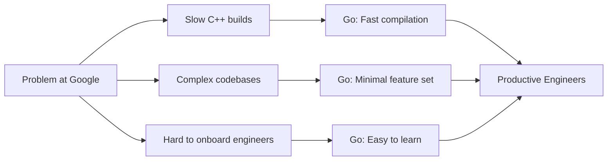
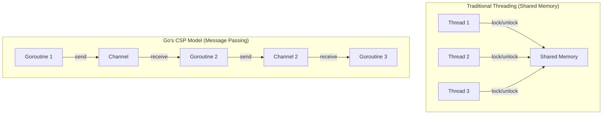
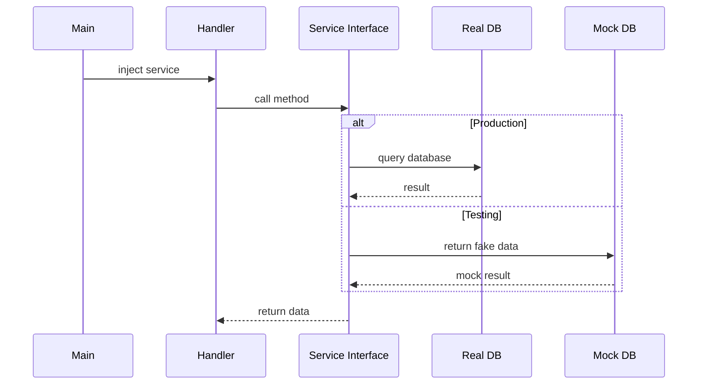
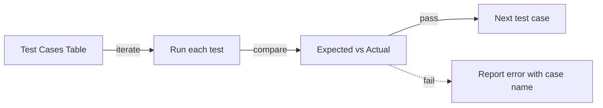

# Why Use Go — Middle

<!-- level-focus -->
At middle level, focus on this question:

> Where does **Why Use Go** belong in a maintainable component, and which trade-off selects the design?

Use the smallest realistic scenario that exposes the decision and its failure behavior.
## Core Concepts

### Concept 1: Go's Design Philosophy — Less is More

Go's creators deliberately chose to leave out many features that other modern languages include. This was not laziness — it was a calculated architectural decision rooted in Google's experience managing large codebases with thousands of engineers.



Key design principles:
- **Orthogonality:** Features should not overlap. Go has only one loop construct (`for`), not `for`, `while`, `do-while`, and `forEach`.
- **Readability over writability:** Code is read 10x more than it is written. Go optimizes for the reader.
- **Composition over inheritance:** Go uses interfaces and struct embedding instead of class hierarchies.

### Concept 2: Go's Concurrency Model — CSP (Communicating Sequential Processes)

Go's concurrency is based on Tony Hoare's CSP model from 1978. Instead of sharing memory and using locks, goroutines communicate by sending messages through channels.



- **Goroutines:** ~2KB initial stack (vs ~1MB for OS threads), dynamically growing
- **Channels:** Typed, synchronized communication conduits
- **Select:** Multiplexing multiple channel operations

### Concept 3: Go's Type System — Structural Typing

Go uses structural typing for interfaces — a type implements an interface by having the right methods, not by declaring `implements`. This enables decoupled, testable code.

```go
// No "implements" keyword needed
type Writer interface {
    Write(p []byte) (n int, err error)
}

// os.File, bytes.Buffer, net.Conn all implement Writer
// without knowing about each other
```

---

## Evolution & Historical Context

**Before Go (2000-2009):**
- Google engineers used C++, Java, and Python for most projects
- C++ builds took 45+ minutes for large projects
- Java required complex build systems and verbose boilerplate
- Python was too slow for performance-critical systems
- Concurrency was hard — threads, locks, and mutexes led to deadlocks and race conditions

**How Go changed things (2009-present):**
- Rob Pike, Robert Griesemer, and Ken Thompson started Go while waiting for a 45-minute C++ build to finish
- Go 1.0 (2012): Stability guarantee — Go 1 code still compiles with the latest Go
- Go 1.11 (2018): Go modules — solved the dependency management problem
- Go 1.18 (2022): Generics — addressed the most requested feature
- Go 1.21+ (2023+): Standard library improvements, enhanced tooling

**The stability promise:** Go guarantees backward compatibility. Code written in Go 1.0 still compiles with Go 1.22. This is a conscious trade-off — slower feature adoption for long-term maintainability.

---

## Alternative Approaches (Plan B)

| Alternative | How it works | When you might be forced to use it |
|-------------|--------------|-------------------------------------|
| **Rust** | Systems language with ownership model, no GC | When you need guaranteed sub-microsecond latency or memory safety without GC |
| **Java/Kotlin** | JVM-based with mature enterprise ecosystem | When integrating with existing Java systems or Android development |
| **Python** | Dynamic typing, huge ML/data ecosystem | When data science, ML, or rapid prototyping is the priority |
| **C++** | Low-level control, templates, zero-overhead abstractions | When you need maximum performance and are willing to accept complexity |

---

## Code Examples

### Example 1: Production-Ready HTTP Server with Graceful Shutdown

```go
package main

import (
    "context"
    "fmt"
    "log"
    "net/http"
    "os"
    "os/signal"
    "syscall"
    "time"
)

func healthHandler(w http.ResponseWriter, r *http.Request) {
    w.WriteHeader(http.StatusOK)
    fmt.Fprintln(w, `{"status": "healthy"}`)
}

func main() {
    mux := http.NewServeMux()
    mux.HandleFunc("/health", healthHandler)

    server := &http.Server{
        Addr:         ":8080",
        Handler:      mux,
        ReadTimeout:  5 * time.Second,
        WriteTimeout: 10 * time.Second,
        IdleTimeout:  120 * time.Second,
    }

    // Start server in a goroutine
    go func() {
        log.Printf("Server starting on %s", server.Addr)
        if err := server.ListenAndServe(); err != http.ErrServerClosed {
            log.Fatalf("Server failed: %v", err)
        }
    }()

    // Wait for interrupt signal
    quit := make(chan os.Signal, 1)
    signal.Notify(quit, syscall.SIGINT, syscall.SIGTERM)
    <-quit

    log.Println("Shutting down gracefully...")
    ctx, cancel := context.WithTimeout(context.Background(), 30*time.Second)
    defer cancel()

    if err := server.Shutdown(ctx); err != nil {
        log.Fatalf("Forced shutdown: %v", err)
    }
    log.Println("Server stopped")
}
```

**Why this pattern:** Production servers must handle graceful shutdown to avoid dropping in-flight requests. This pattern uses `context.WithTimeout` to give existing requests time to complete.
**Trade-offs:** Slightly more complex than a basic `ListenAndServe`, but essential for production deployments behind load balancers.

### Example 2: Comparison — Sequential vs Concurrent Data Fetching

```go
package main

import (
    "fmt"
    "sync"
    "time"
)

// Simulates fetching data from a remote service
func fetchFromService(name string) string {
    time.Sleep(500 * time.Millisecond) // Simulate network latency
    return fmt.Sprintf("data from %s", name)
}

// Approach A: Sequential — simple but slow
func fetchSequential() []string {
    services := []string{"users", "orders", "inventory", "analytics"}
    results := make([]string, 0, len(services))
    for _, svc := range services {
        results = append(results, fetchFromService(svc))
    }
    return results
}

// Approach B: Concurrent — faster, uses goroutines
func fetchConcurrent() []string {
    services := []string{"users", "orders", "inventory", "analytics"}
    results := make([]string, len(services))
    var wg sync.WaitGroup

    for i, svc := range services {
        wg.Add(1)
        go func(idx int, name string) {
            defer wg.Done()
            results[idx] = fetchFromService(name)
        }(i, svc)
    }
    wg.Wait()
    return results
}

func main() {
    start := time.Now()
    seq := fetchSequential()
    fmt.Printf("Sequential: %v (%d results)\n", time.Since(start), len(seq))

    start = time.Now()
    con := fetchConcurrent()
    fmt.Printf("Concurrent: %v (%d results)\n", time.Since(start), len(con))
}
```

**When to use which:** Use sequential when order matters and services depend on each other. Use concurrent when fetches are independent — the total time becomes the slowest single fetch, not the sum.

---

## Coding Patterns

### Pattern 1: Functional Options Pattern

**Category:** Idiomatic Go / API Design
**Intent:** Provide a clean, extensible way to configure structs without breaking API compatibility
**When to use:** When a struct has many optional configuration fields
**When NOT to use:** When the struct has fewer than 3 fields — a simple constructor is clearer

**Structure diagram:**

**Implementation:**

```go
package main

import (
    "fmt"
    "time"
)

type Server struct {
    addr     string
    timeout  time.Duration
    maxConns int
}

type Option func(*Server)

func WithAddr(addr string) Option {
    return func(s *Server) { s.addr = addr }
}

func WithTimeout(d time.Duration) Option {
    return func(s *Server) { s.timeout = d }
}

func WithMaxConns(n int) Option {
    return func(s *Server) { s.maxConns = n }
}

func NewServer(opts ...Option) *Server {
    s := &Server{
        addr:     ":8080",
        timeout:  30 * time.Second,
        maxConns: 100,
    }
    for _, opt := range opts {
        opt(s)
    }
    return s
}

func main() {
    s := NewServer(
        WithAddr(":9090"),
        WithTimeout(60*time.Second),
    )
    fmt.Printf("Server: addr=%s, timeout=%v, maxConns=%d\n",
        s.addr, s.timeout, s.maxConns)
}
```

**Trade-offs:**

| Pros | Cons |
|---------|---------|
| API stays backward compatible | More boilerplate than a config struct |
| Self-documenting option names | Harder to see all options at a glance |
| Defaults are clear in constructor | Options functions need testing too |

---

### Pattern 2: Interface-Based Dependency Injection

**Category:** Structural / Testability
**Intent:** Decouple components by depending on interfaces rather than concrete types, enabling easy testing and swapping implementations

**Flow diagram:**



```go
package main

import "fmt"

// Interface — defines what we need, not how it works
type UserStore interface {
    GetUser(id int) (string, error)
}

// Production implementation
type PostgresStore struct{}

func (p *PostgresStore) GetUser(id int) (string, error) {
    return fmt.Sprintf("User-%d from Postgres", id), nil
}

// Test implementation
type MockStore struct{}

func (m *MockStore) GetUser(id int) (string, error) {
    return fmt.Sprintf("MockUser-%d", id), nil
}

// Handler depends on interface, not concrete type
type Handler struct {
    store UserStore
}

func NewHandler(store UserStore) *Handler {
    return &Handler{store: store}
}

func (h *Handler) HandleRequest(id int) {
    user, err := h.store.GetUser(id)
    if err != nil {
        fmt.Println("Error:", err)
        return
    }
    fmt.Println("Found:", user)
}

func main() {
    // Production: use real database
    handler := NewHandler(&PostgresStore{})
    handler.HandleRequest(42)

    // Testing: use mock
    testHandler := NewHandler(&MockStore{})
    testHandler.HandleRequest(42)
}
```

---

### Pattern 3: Table-Driven Tests

**Category:** Idiomatic Go / Testing
**Intent:** Structure tests as data tables for easy extension and clear test coverage



```go
package main

import (
    "fmt"
    "strings"
)

// Function to test
func capitalize(s string) string {
    if s == "" {
        return ""
    }
    return strings.ToUpper(s[:1]) + s[1:]
}

func main() {
    // Table-driven approach
    tests := []struct {
        name  string
        input string
        want  string
    }{
        {"empty string", "", ""},
        {"single char", "a", "A"},
        {"normal word", "hello", "Hello"},
        {"already capitalized", "Hello", "Hello"},
        {"unicode", "uzbeg", "Uzbeg"},
    }

    for _, tc := range tests {
        got := capitalize(tc.input)
        if got != tc.want {
            fmt.Printf("FAIL %s: capitalize(%q) = %q, want %q\n",
                tc.name, tc.input, got, tc.want)
        } else {
            fmt.Printf("PASS %s\n", tc.name)
        }
    }
}
```

---

## Best Practices

- **Practice 1:** Use `context.Context` for cancellation — every function that does I/O should accept a `ctx context.Context` as the first parameter
- **Practice 2:** Accept interfaces, return concrete types — makes code testable and decoupled
- **Practice 3:** Use `go fmt` and `go vet` in CI — enforces consistent style and catches bugs
- **Practice 4:** Run tests with `-race` flag — catches data races that are invisible during normal testing
- **Practice 5:** Use structured logging (e.g., `slog` in Go 1.21+) — enables log analysis and alerting in production

---

## Edge Cases & Pitfalls

### Pitfall 1: Goroutine Leak from Abandoned Channel

```go
package main

import (
    "fmt"
    "time"
)

func leakyFunction() {
    ch := make(chan int)
    go func() {
        // This goroutine will NEVER exit because nothing reads from ch
        ch <- 42
        fmt.Println("This never prints")
    }()
    // Function returns, but the goroutine is stuck forever
}

func main() {
    for i := 0; i < 1000; i++ {
        leakyFunction()
    }
    time.Sleep(1 * time.Second)
    fmt.Println("Created 1000 leaked goroutines!")
}
```

**Impact:** Memory grows indefinitely. Each leaked goroutine consumes at least 2KB.
**Detection:** Monitor `runtime.NumGoroutine()` over time.
**Fix:** Use buffered channels, context cancellation, or `select` with a timeout.

---

## Common Mistakes

### Mistake 1: Capturing Loop Variable in Goroutine (pre-Go 1.22)

```go
package main

import (
    "fmt"
    "sync"
)

func main() {
    var wg sync.WaitGroup
    names := []string{"Alice", "Bob", "Charlie"}

    // In Go < 1.22, this captures the loop variable by reference
    // All goroutines may print the last value
    // In Go >= 1.22, each iteration gets its own copy (fixed)
    for _, name := range names {
        wg.Add(1)
        go func(n string) {
            defer wg.Done()
            fmt.Println(n) // Pass as parameter to be safe
        }(name) // Pass name as argument
    }
    wg.Wait()
}
```

---

## Common Misconceptions

### Misconception 1: "Goroutines are the same as threads"

**Reality:** Goroutines are userspace green threads managed by the Go runtime scheduler. They are multiplexed onto a small number of OS threads. A goroutine starts at ~2KB stack (vs ~1MB for an OS thread), and Go can run millions of goroutines on a single machine.

**Why people think this:** The word "goroutine" sounds like "routine" or "thread", and they serve a similar conceptual purpose.

### Misconception 2: "Go is slow because it has garbage collection"

**Reality:** Go's GC pauses are typically under 1ms (sub-millisecond) for most workloads. Go programs are typically within 2-3x of C/Rust performance, which is fast enough for 99% of applications. The compilation speed advantage (seconds vs minutes) often matters more for developer productivity.

**Evidence:**
```
# Go 1.22 GC pauses on typical web service:
# p50: 0.1ms, p99: 0.5ms, p99.9: 1.2ms
```

### Misconception 3: "Go does not support generics"

**Reality:** Go 1.18 (March 2022) added generics with type parameters. While more limited than Rust or Haskell generics, they cover the most common use cases (generic data structures, utility functions).

---

## Anti-Patterns

### Anti-Pattern 1: God Package

```go
// The Anti-Pattern — everything in one package
package util // contains: string helpers, DB utils, HTTP middleware, math, logging

// The refactoring — cohesive packages
package stringutil  // only string operations
package middleware  // only HTTP middleware
package dbutil      // only database helpers
```

**Why it's bad:** A `util` or `helpers` package grows forever and becomes impossible to navigate. It violates the Single Responsibility Principle at the package level.
**The refactoring:** Split by domain or responsibility. Each package should have a clear, focused purpose.

### Anti-Pattern 2: Interface Pollution

```go
// The Anti-Pattern — define interfaces before knowing what you need
type UserServiceInterface interface {
    Create(u User) error
    Update(u User) error
    Delete(id int) error
    Get(id int) (User, error)
    List() ([]User, error)
    // ... 20 more methods
}

// Better — define small interfaces at the call site
type UserGetter interface {
    Get(id int) (User, error)
}
```

**Why it's bad:** Large interfaces are hard to implement, hard to mock, and couple consumers to providers.
**The refactoring:** Define small interfaces where they are consumed ("accept interfaces, return concrete types").

---

## Tricky Points

### Tricky Point 1: nil Interface vs nil Pointer

```go
package main

import "fmt"

type MyError struct{ msg string }

func (e *MyError) Error() string { return e.msg }

func doSomething(fail bool) error {
    var err *MyError // nil pointer of type *MyError
    if fail {
        err = &MyError{msg: "failed"}
    }
    return err // WARNING: returns a non-nil interface wrapping a nil pointer!
}

func main() {
    err := doSomething(false)
    if err != nil {
        // This WILL execute even though the pointer is nil!
        // Because the interface has a type (*MyError) but nil value
        fmt.Println("Error:", err) // prints: Error: <nil>
    } else {
        fmt.Println("No error") // This never prints!
    }
}
```

**What actually happens:** An interface in Go is `(type, value)`. When you return a `*MyError(nil)`, the interface is `(*MyError, nil)` which is not equal to `nil`. A `nil` interface is `(nil, nil)`.
**Why:** This is defined in the Go specification. An interface value is nil only when both its type and value are nil.

---

## Comparison with Other Languages

| Aspect | Go | Python | Java | Rust |
|--------|-----|--------|------|------|
| Compilation speed | Seconds | N/A (interpreted) | Minutes | Minutes |
| Binary size | ~10MB (static) | Requires Python runtime | Requires JVM | ~5MB (static) |
| Concurrency model | Goroutines + channels (CSP) | asyncio / threading (GIL) | Threads + ExecutorService | async/await + Tokio |
| Memory management | GC (~0.5ms pauses) | GC (reference counting + cycle collector) | GC (G1/ZGC, tunable) | Ownership (no GC) |
| Error handling | Return values (`error` type) | Exceptions (try/except) | Exceptions (try/catch) | Result type (`Result<T, E>`) |
| Learning curve | Low (2-4 weeks) | Low (1-2 weeks) | Medium (4-8 weeks) | High (8-16 weeks) |
| Ecosystem size | Medium (growing) | Huge | Huge | Small (growing) |

### Key differences:
- **Go vs Python:** Go is 10-100x faster at runtime but has a smaller ecosystem. Choose Go for performance-sensitive services, Python for data science and scripting.
- **Go vs Java:** Go has faster compilation, smaller binaries, and simpler concurrency. Java has a more mature enterprise ecosystem and better tooling for large monolithic applications.
- **Go vs Rust:** Go is simpler to learn and compiles faster. Rust has better performance guarantees and memory safety without GC. Choose Go for web services, Rust for systems programming.

---

## Apply it

1. Find a real component where **Why Use Go** affects an interface or dependency.
2. Write two plausible choices and the constraint that favors each one.
3. Make the smallest reversible change at that boundary.
4. Exercise the component alone, then exercise the integrated flow.
5. Keep the decision note with the evidence that selected the option.

## Verify your work

- A focused check proves the local behavior.
- An integrated check proves callers and dependencies still agree.
- Logs, traces, compiler output, or benchmarks expose the boundary.
- Reverting the change restores the previous behavior without unrelated edits.

## Review questions

- Which boundary is most affected by Why Use Go?
- What constraint would make you choose the alternative design?
- How would you isolate a local defect from an integration defect?
- What evidence shows that the change remains maintainable?
