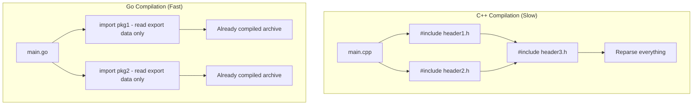
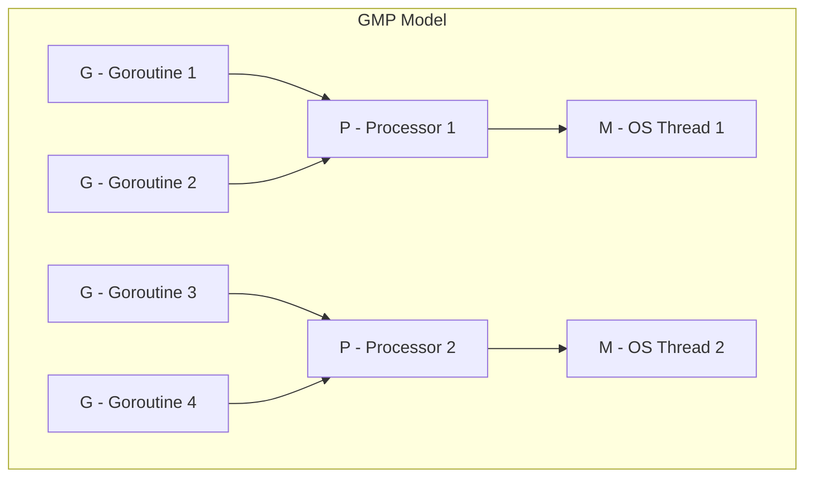

# Why Use Go — Under the Hood

<!-- level-focus -->
At professional level, focus on this question:

> How should teams adopt and operate **Why Use Go — Under the Hood** with measurable outcomes and limited coordination?

Use the smallest realistic scenario that exposes the decision and its failure behavior.
## Fast Compilation: Why Builds Stay Quick

Go's fast compilation is not accidental — it is the result of deliberate design decisions that keep the compiler from re-doing work:

1. **No header files:** Go reads only the source files in the current package plus the *exported* symbols of imported packages (from precompiled archive files). It never reparses a dependency's full source the way C/C++ reparses `#include`d headers.
2. **Import graph is a DAG:** No circular imports are allowed, which enables packages to be compiled in parallel.
3. **Simple grammar:** Only 25 keywords and no ambiguous syntax, so parsing is cheap.
4. **Package-level compilation with caching:** Each package compiles independently, so the build cache can skip anything unchanged.
5. **Unused imports are errors:** The compiler never pulls in code that is not actually needed.



**Why this is a reason to choose Go:** fast builds shorten the edit-compile-run loop. On large codebases where C++ or Rust builds take minutes, comparable Go projects often build in seconds, which keeps developers in flow and makes CI cheaper.

---

## Cheap Goroutines: Why Concurrency Scales

Go's concurrency story rests on two cheap things: the goroutine itself and the way goroutines are scheduled onto threads.

**Tiny, growable stacks.** A goroutine starts with a stack of about 2KB, versus the ~1MB default stack of an OS thread. When a goroutine needs more space, the runtime allocates a larger stack and copies the old one over, adjusting pointers automatically. This means you can have hundreds of thousands of goroutines resident in memory at once — something you simply cannot do with OS threads.

**M:N scheduling (the GMP model).** The runtime multiplexes many goroutines (G) onto a small number of OS threads (M), coordinated by logical processors (P, one per `GOMAXPROCS`). You write straightforward blocking-style code, and the scheduler parks blocked goroutines and runs others on the same thread.



A direct payoff is networking. When a goroutine waits on I/O, the runtime parks it and frees the OS thread to run other goroutines, resuming the parked one when data arrives. So 100K concurrent connections cost ~100K × 2KB of goroutine memory and a handful of threads — not 100K full OS threads.

```go
// Launching ten thousand concurrent tasks is routine in Go.
var wg sync.WaitGroup
for i := 0; i < 10_000; i++ {
    wg.Add(1)
    go func(id int) {
        defer wg.Done()
        // do work, maybe block on I/O — the scheduler handles it
    }(i)
}
wg.Wait()
```

**Why this is a reason to choose Go:** concurrency is cheap enough to use freely. You get scalable, high-concurrency servers with simple sequential-looking code, instead of callback chains or hand-managed thread pools.

---

## Low-Pause GC: Why Latency Stays Predictable

Go ships an automatic garbage collector, so you get memory safety without manual `malloc`/`free`. The reason it is acceptable for latency-sensitive services is that it is designed for short pauses:

- The collector is **concurrent** — most of its work (marking and sweeping) runs alongside your program, not while it is stopped.
- The two stop-the-world phases are brief, typically on the order of tens of microseconds rather than the multi-millisecond pauses associated with older managed runtimes.
- It favors **low pause times** over raw throughput, which is the right trade-off for request-serving systems.

You can observe this directly with `GODEBUG=gctrace=1`:

```
gc 1 @0.020s 2%: 0.024+1.3+0.025 ms clock, 4->4->3 MB, 5 MB goal, 8 P
```

The two clock figures around the concurrent mark (`0.024` and `0.025` ms) are the stop-the-world pauses — well under a millisecond.

**Why this is a reason to choose Go:** you get the safety and productivity of garbage collection while keeping tail latency predictable. That combination is exactly what networked services need, and it is why teams have migrated latency-sensitive systems to Go specifically for its GC behavior.

---

## Single Static Binary: Why Deployment Is Trivial

`go build` produces one self-contained executable. The Go runtime (scheduler, GC, allocator) is statically linked into that binary, and with a pure-Go program there are typically no external shared-library dependencies.

The practical consequences:

1. **Single-binary deployment** — copy one file to the target machine and run it. There is no interpreter or virtual machine to install first.
2. **No version conflicts** — the binary always carries the exact runtime it was built against. There is no equivalent of a mismatched JVM or a broken Python virtualenv.
3. **Easy cross-compilation** — set `GOOS`/`GOARCH` and build a Linux binary from a Mac, or an ARM binary from an x86 host, with no cross-toolchain setup.
4. **Tiny container images** — a static binary can live in a `scratch` or `distroless` image, producing containers measured in megabytes.

```bash
# Build a Linux amd64 binary from any host, then ship just that file.
GOOS=linux GOARCH=amd64 go build -o app .
```

The cost of bundling the runtime is a few megabytes of binary size — a price most teams happily pay for "just copy and run."

**Why this is a reason to choose Go:** deployment and distribution become almost a non-event. This is a major reason Go dominates cloud-native and CLI tooling (Docker, Kubernetes, Terraform, and countless internal tools are written in Go).

---

## Apply it

1. Define the user or business outcome that **Why Use Go — Under the Hood** should improve.
2. Assign one owner for code, contracts, operations, and incidents.
3. Split delivery into reversible increments that produce evidence early.
4. Publish responsibilities, escalation paths, and compatibility windows.
5. Stop or expand only when the agreed measures support that decision.

## Verify your work

- Each increment has an owner, rollback path, and observable exit condition.
- Adoption, reliability, delivery time, and coordination cost are measured.
- Incident and migration exercises prove that responsibility is executable.
- The old path is removed only after telemetry proves it is unused.

## Review questions

- Which measurable outcome justifies investing in Why Use Go — Under the Hood?
- Which team owns the full lifecycle and incident response?
- What reversible increment produces the earliest useful evidence?
- Which exit condition proves that migration or adoption is complete?
