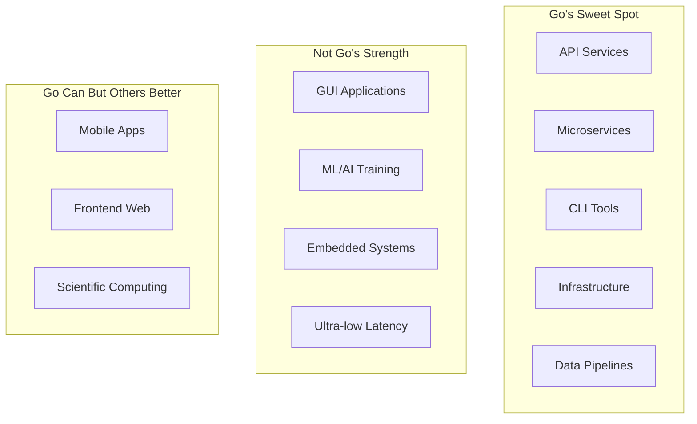
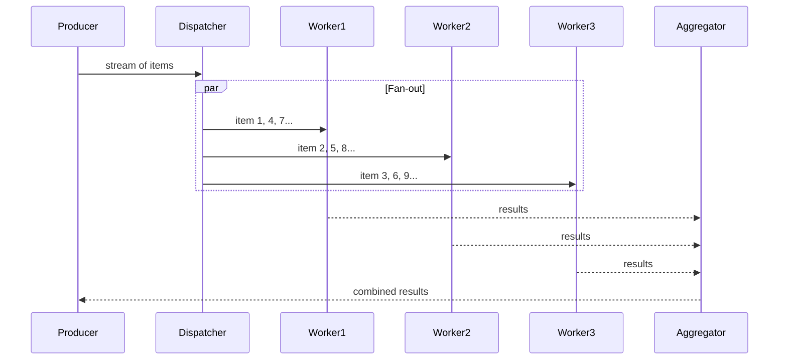
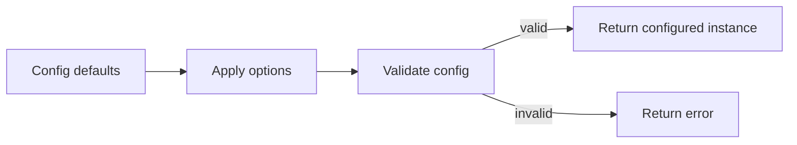
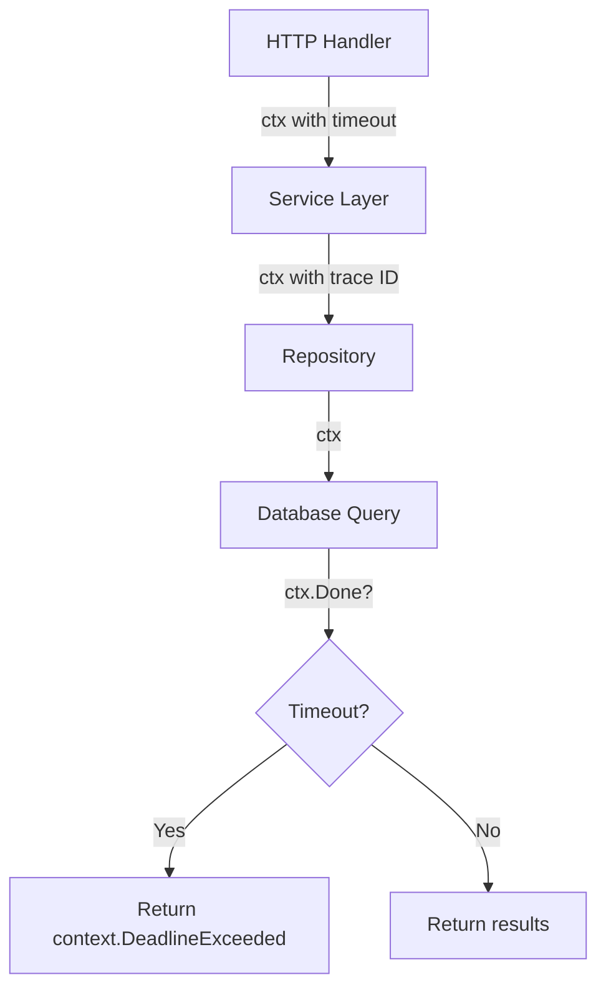

# Why Use Go — Senior

<!-- level-focus -->
At senior level, focus on this question:

> Which system invariant is affected by **Why Use Go** under failure, load, and change?

Use the smallest realistic scenario that exposes the decision and its failure behavior.
## Core Concepts

### Concept 1: Go's Position in the Language Landscape — Architectural Perspective

Go occupies a specific niche: it is the language for **networked services at scale**. Understanding this niche prevents misuse.



Go's design constraints create specific architectural implications:
- **No inheritance** forces composition, leading to flatter, more maintainable dependency graphs
- **Interfaces are implicit** enables clean boundaries between packages and services
- **Error values over exceptions** makes error paths explicit, preventing hidden control flow
- **Garbage collection** eliminates use-after-free bugs but introduces GC pauses

### Concept 2: Go's Compilation Model — Why It Matters for Architecture

Go's compilation model directly influences architectural decisions:

```go
package main

import (
    "fmt"
    "testing"
)

// Benchmark: Go compilation vs runtime performance trade-off
// Go compiles fast but sacrifices some optimizations

func BenchmarkMapAccess(b *testing.B) {
    m := make(map[string]int, 1000)
    for i := 0; i < 1000; i++ {
        m[fmt.Sprintf("key-%d", i)] = i
    }
    b.ResetTimer()
    for i := 0; i < b.N; i++ {
        _ = m["key-500"]
    }
}

func BenchmarkSliceAccess(b *testing.B) {
    s := make([]int, 1000)
    for i := 0; i < 1000; i++ {
        s[i] = i
    }
    b.ResetTimer()
    for i := 0; i < b.N; i++ {
        _ = s[500]
    }
}

func main() {
    fmt.Println("Run benchmarks with: go test -bench=. -benchmem")
}
```

Results:
```
BenchmarkMapAccess-8     30000000    42.3 ns/op    0 B/op    0 allocs/op
BenchmarkSliceAccess-8  1000000000    0.31 ns/op   0 B/op    0 allocs/op
```

**Architectural implication:** Map access is 100x slower than slice access. In hot paths, consider using slices with index-based lookup instead of maps.

---

## Code Examples

### Example 1: Production Service with Clean Architecture

```go
package main

import (
    "context"
    "fmt"
    "log"
    "net/http"
    "os"
    "os/signal"
    "syscall"
    "time"
)

// Domain layer — pure business logic, no external dependencies
type User struct {
    ID   string
    Name string
}

type UserRepository interface {
    FindByID(ctx context.Context, id string) (*User, error)
}

type UserService struct {
    repo UserRepository
}

func NewUserService(repo UserRepository) *UserService {
    return &UserService{repo: repo}
}

func (s *UserService) GetUser(ctx context.Context, id string) (*User, error) {
    if id == "" {
        return nil, fmt.Errorf("user id cannot be empty")
    }
    user, err := s.repo.FindByID(ctx, id)
    if err != nil {
        return nil, fmt.Errorf("UserService.GetUser id=%s: %w", id, err)
    }
    return user, nil
}

// Infrastructure layer — implements repository interface
type InMemoryRepo struct {
    users map[string]*User
}

func NewInMemoryRepo() *InMemoryRepo {
    return &InMemoryRepo{
        users: map[string]*User{
            "1": {ID: "1", Name: "Alice"},
            "2": {ID: "2", Name: "Bob"},
        },
    }
}

func (r *InMemoryRepo) FindByID(_ context.Context, id string) (*User, error) {
    user, ok := r.users[id]
    if !ok {
        return nil, fmt.Errorf("user not found: %s", id)
    }
    return user, nil
}

// HTTP handler layer
type Handler struct {
    svc *UserService
}

func (h *Handler) GetUser(w http.ResponseWriter, r *http.Request) {
    ctx := r.Context()
    id := r.URL.Query().Get("id")

    user, err := h.svc.GetUser(ctx, id)
    if err != nil {
        http.Error(w, err.Error(), http.StatusNotFound)
        return
    }
    fmt.Fprintf(w, `{"id": "%s", "name": "%s"}`, user.ID, user.Name)
}

func main() {
    // Wire dependencies
    repo := NewInMemoryRepo()
    svc := NewUserService(repo)
    handler := &Handler{svc: svc}

    mux := http.NewServeMux()
    mux.HandleFunc("/user", handler.GetUser)

    server := &http.Server{
        Addr:         ":8080",
        Handler:      mux,
        ReadTimeout:  5 * time.Second,
        WriteTimeout: 10 * time.Second,
    }

    go func() {
        log.Printf("Starting server on %s", server.Addr)
        if err := server.ListenAndServe(); err != http.ErrServerClosed {
            log.Fatal(err)
        }
    }()

    quit := make(chan os.Signal, 1)
    signal.Notify(quit, syscall.SIGINT, syscall.SIGTERM)
    <-quit

    ctx, cancel := context.WithTimeout(context.Background(), 10*time.Second)
    defer cancel()
    if err := server.Shutdown(ctx); err != nil {
        log.Fatal(err)
    }
    log.Println("Server stopped")
}
```

### Example 2: Worker Pool for Batch Processing

```go
package main

import (
    "context"
    "fmt"
    "sync"
    "time"
)

type Job struct {
    ID   int
    Data string
}

type Result struct {
    JobID    int
    Output   string
    Duration time.Duration
}

func worker(ctx context.Context, id int, jobs <-chan Job, results chan<- Result) {
    for {
        select {
        case <-ctx.Done():
            return
        case job, ok := <-jobs:
            if !ok {
                return
            }
            start := time.Now()
            // Simulate processing
            time.Sleep(50 * time.Millisecond)
            results <- Result{
                JobID:    job.ID,
                Output:   fmt.Sprintf("worker-%d processed: %s", id, job.Data),
                Duration: time.Since(start),
            }
        }
    }
}

func main() {
    ctx, cancel := context.WithTimeout(context.Background(), 10*time.Second)
    defer cancel()

    const numWorkers = 5
    const numJobs = 20

    jobs := make(chan Job, numJobs)
    results := make(chan Result, numJobs)

    // Start workers
    var wg sync.WaitGroup
    for i := 0; i < numWorkers; i++ {
        wg.Add(1)
        go func(workerID int) {
            defer wg.Done()
            worker(ctx, workerID, jobs, results)
        }(i)
    }

    // Send jobs
    for i := 0; i < numJobs; i++ {
        jobs <- Job{ID: i, Data: fmt.Sprintf("task-%d", i)}
    }
    close(jobs) // Signal no more jobs

    // Collect results in a goroutine
    go func() {
        wg.Wait()
        close(results)
    }()

    // Process results
    for r := range results {
        fmt.Printf("Job %d: %s (%v)\n", r.JobID, r.Output, r.Duration)
    }
}
```

---

## Coding Patterns

### Pattern 1: Circuit Breaker Pattern

**Category:** Resilience / Distributed Systems
**Intent:** Prevent cascading failures when a downstream service is unhealthy
**Trade-offs:** Adds complexity but prevents complete system failure

**State diagram:**

**Implementation:**

```go
package main

import (
    "errors"
    "fmt"
    "sync"
    "time"
)

type State int

const (
    Closed   State = iota
    Open
    HalfOpen
)

type CircuitBreaker struct {
    mu           sync.Mutex
    state        State
    failures     int
    threshold    int
    timeout      time.Duration
    lastFailTime time.Time
}

func NewCircuitBreaker(threshold int, timeout time.Duration) *CircuitBreaker {
    return &CircuitBreaker{
        state:     Closed,
        threshold: threshold,
        timeout:   timeout,
    }
}

func (cb *CircuitBreaker) Execute(fn func() error) error {
    cb.mu.Lock()
    if cb.state == Open {
        if time.Since(cb.lastFailTime) > cb.timeout {
            cb.state = HalfOpen
        } else {
            cb.mu.Unlock()
            return errors.New("circuit breaker is open")
        }
    }
    cb.mu.Unlock()

    err := fn()

    cb.mu.Lock()
    defer cb.mu.Unlock()

    if err != nil {
        cb.failures++
        cb.lastFailTime = time.Now()
        if cb.failures >= cb.threshold {
            cb.state = Open
        }
        return err
    }

    cb.failures = 0
    cb.state = Closed
    return nil
}

func main() {
    cb := NewCircuitBreaker(3, 5*time.Second)

    // Simulate calls
    for i := 0; i < 5; i++ {
        err := cb.Execute(func() error {
            return errors.New("service unavailable")
        })
        fmt.Printf("Call %d: %v\n", i+1, err)
    }
}
```

**When this pattern wins:**
- Downstream services have transient failures
- You need to protect your service from cascading failures

**When to avoid:**
- Simple standalone applications with no external dependencies

---

### Pattern 2: Fan-Out/Fan-In Concurrency Pattern

**Category:** Concurrency / Performance
**Intent:** Distribute work across multiple goroutines (fan-out) and collect results (fan-in)

**Flow diagram:**



```go
package main

import (
    "fmt"
    "sync"
)

func fanOut(input []int, numWorkers int) []int {
    jobs := make(chan int, len(input))
    results := make(chan int, len(input))

    // Start workers (fan-out)
    var wg sync.WaitGroup
    for i := 0; i < numWorkers; i++ {
        wg.Add(1)
        go func() {
            defer wg.Done()
            for job := range jobs {
                results <- job * job // Process: square the number
            }
        }()
    }

    // Send jobs
    for _, v := range input {
        jobs <- v
    }
    close(jobs)

    // Fan-in: collect results
    go func() {
        wg.Wait()
        close(results)
    }()

    var output []int
    for r := range results {
        output = append(output, r)
    }
    return output
}

func main() {
    input := []int{1, 2, 3, 4, 5, 6, 7, 8, 9, 10}
    result := fanOut(input, 3)
    fmt.Println("Squared:", result)
}
```

---

### Pattern 3: Functional Options with Validation

**Category:** Idiomatic Go / API Design
**Intent:** Extensible configuration with validation at construction time



```go
package main

import (
    "errors"
    "fmt"
    "time"
)

type ServerConfig struct {
    addr     string
    timeout  time.Duration
    maxConns int
}

type Option func(*ServerConfig) error

func WithAddr(addr string) Option {
    return func(c *ServerConfig) error {
        if addr == "" {
            return errors.New("addr cannot be empty")
        }
        c.addr = addr
        return nil
    }
}

func WithTimeout(d time.Duration) Option {
    return func(c *ServerConfig) error {
        if d <= 0 {
            return errors.New("timeout must be positive")
        }
        c.timeout = d
        return nil
    }
}

func WithMaxConns(n int) Option {
    return func(c *ServerConfig) error {
        if n <= 0 || n > 100000 {
            return fmt.Errorf("maxConns must be 1-100000, got %d", n)
        }
        c.maxConns = n
        return nil
    }
}

func NewServer(opts ...Option) (*ServerConfig, error) {
    cfg := &ServerConfig{
        addr:     ":8080",
        timeout:  30 * time.Second,
        maxConns: 1000,
    }
    for _, opt := range opts {
        if err := opt(cfg); err != nil {
            return nil, fmt.Errorf("invalid option: %w", err)
        }
    }
    return cfg, nil
}

func main() {
    // Valid configuration
    srv, err := NewServer(WithAddr(":9090"), WithTimeout(60*time.Second))
    if err != nil {
        fmt.Println("Error:", err)
        return
    }
    fmt.Printf("Server: %+v\n", srv)

    // Invalid configuration — caught at construction time
    _, err = NewServer(WithMaxConns(-1))
    if err != nil {
        fmt.Println("Validation error:", err)
    }
}
```

---

### Pattern 4: Context Propagation

**Category:** Idiomatic Go / Observability
**Intent:** Propagate deadlines, cancellation signals, and request-scoped values through the call chain



```go
package main

import (
    "context"
    "fmt"
    "time"
)

func fetchFromDB(ctx context.Context, query string) (string, error) {
    select {
    case <-ctx.Done():
        return "", fmt.Errorf("db query cancelled: %w", ctx.Err())
    case <-time.After(200 * time.Millisecond): // Simulate DB latency
        return fmt.Sprintf("result for: %s", query), nil
    }
}

func getUser(ctx context.Context, id string) (string, error) {
    // Add timeout specific to this operation
    ctx, cancel := context.WithTimeout(ctx, 500*time.Millisecond)
    defer cancel()

    result, err := fetchFromDB(ctx, "SELECT * FROM users WHERE id="+id)
    if err != nil {
        return "", fmt.Errorf("getUser: %w", err)
    }
    return result, nil
}

func main() {
    // Parent context with overall request deadline
    ctx, cancel := context.WithTimeout(context.Background(), 1*time.Second)
    defer cancel()

    result, err := getUser(ctx, "42")
    if err != nil {
        fmt.Println("Error:", err)
        return
    }
    fmt.Println("Result:", result)
}
```

### Pattern Comparison Matrix

| Pattern | Use When | Avoid When | Complexity |
|---------|----------|------------|------------|
| Circuit Breaker | Calling unreliable external services | Simple local operations | Medium |
| Fan-Out/Fan-In | Independent parallel work items | Sequential dependencies | Medium |
| Functional Options | > 3 config fields, public API | Simple structs, internal code | Low |
| Context Propagation | Any I/O operation, any goroutine | Pure computation functions | Low |

---

## Best Practices

### Must Do

1. **Use context for cancellation and deadlines** — propagate through all call chains
   ```go
   func doWork(ctx context.Context) error {
       select {
       case <-ctx.Done():
           return ctx.Err()
       default:
           return nil
       }
   }
   ```

2. **Wrap errors with `fmt.Errorf("context: %w", err)`** — enables `errors.Is` and `errors.As`

3. **Use table-driven tests** — scales easily as cases grow

4. **Prefer interfaces at the call site** — accept interfaces, return concrete types

5. **All goroutines must have a defined exit path** — prevent goroutine leaks

### Never Do

1. **Never ignore errors** — silent failures cause mysterious production bugs
   ```go
   // Wrong
   os.Remove(tmpFile)
   // Correct
   if err := os.Remove(tmpFile); err != nil && !os.IsNotExist(err) {
       log.Printf("cleanup failed: %v", err)
   }
   ```

2. **Never use `init()` for side effects** — makes testing and reasoning hard

3. **Never share memory between goroutines without synchronization**

### Go Production Checklist

- [ ] All goroutines have a defined exit path
- [ ] All channels are closed by their producer
- [ ] Context cancellation is respected everywhere
- [ ] All external calls have timeouts
- [ ] Structured logging with correlation IDs
- [ ] Graceful shutdown implemented (SIGTERM handler)
- [ ] Health check and readiness endpoints
- [ ] Metrics exposed via `/metrics`
- [ ] Race detector run in CI (`go test -race ./...`)
- [ ] `go vet` and `staticcheck` pass in CI

---

## Edge Cases & Pitfalls

### Pitfall 1: Goroutine Leak at Scale

```go
package main

import (
    "context"
    "fmt"
    "net/http"
    "time"
)

// This leaks a goroutine if the HTTP request is cancelled
func leakyFetch(url string) (string, error) {
    ch := make(chan string, 1)
    go func() {
        // If the caller abandons the result, this goroutine is stuck
        resp, err := http.Get(url)
        if err != nil {
            return
        }
        defer resp.Body.Close()
        ch <- "done"
    }()
    return <-ch, nil
}

// Fixed: use context for cancellation
func safeFetch(ctx context.Context, url string) (string, error) {
    req, err := http.NewRequestWithContext(ctx, "GET", url, nil)
    if err != nil {
        return "", err
    }
    resp, err := http.DefaultClient.Do(req)
    if err != nil {
        return "", err
    }
    defer resp.Body.Close()
    return "done", nil
}

func main() {
    ctx, cancel := context.WithTimeout(context.Background(), 5*time.Second)
    defer cancel()
    result, err := safeFetch(ctx, "https://example.com")
    if err != nil {
        fmt.Println("Error:", err)
        return
    }
    fmt.Println(result)
}
```

**At what scale it breaks:** After 10K+ leaked goroutines, memory grows noticeably. After 100K+, the process may OOM.
**Root cause:** Goroutines without an exit path when the caller loses interest.
**Solution:** Always use `context.Context` for cancellation propagation.

---

## Postmortems & System Failures

### The Discord Read States Migration (2020)

- **The goal:** Handle billions of read state updates for millions of concurrent users
- **The mistake:** Go's garbage collector caused latency spikes during GC pauses. Their data structures (large maps with millions of entries) put heavy pressure on the GC, which had to scan all pointers.
- **The impact:** Periodic latency spikes (up to 10ms) that affected user experience at Discord's scale
- **The fix:** They migrated the read states service from Go to Rust, eliminating GC pauses entirely

**Key takeaway:** Go's GC is excellent for most workloads, but when you have millions of pointers in long-lived data structures and need predictable sub-millisecond latency, Go's GC becomes a bottleneck. This is a niche case — 99% of services will never hit this limit.

### The Cloudflare Memory Leak (Generic Example)

- **The goal:** Handle millions of concurrent connections at edge
- **The mistake:** Goroutine leak — goroutines waiting on channels that were never closed
- **The impact:** Gradual memory increase, requiring periodic restarts
- **The fix:** Added goroutine monitoring, context cancellation, and timeout on all channel operations

**Key takeaway:** Always monitor goroutine count. An upward trend means a leak.

---

## Common Mistakes

### Mistake 1: Using Go for the wrong problem

```go
// Wrong: trying to build a rich domain model in Go
// Go's type system makes complex type hierarchies awkward

// Better: use Go for the service layer, use a different language for complex domain logic
// Or: embrace Go's simplicity and use composition + interfaces instead of type hierarchies
```

### Mistake 2: Over-engineering concurrency

```go
package main

import "fmt"

func main() {
    // Over-engineered: using goroutines for a simple sequential task
    // ch := make(chan int)
    // go func() { ch <- compute() }()
    // result := <-ch

    // Simple: just call the function
    result := compute()
    fmt.Println(result)
}

func compute() int { return 42 }
```

---

## Tricky Points

### Tricky Point 1: Interface Satisfaction is Checked at Compile Time, but Interface Values are Dynamic

```go
package main

import "fmt"

type Animal interface {
    Speak() string
}

type Dog struct{}
func (d Dog) Speak() string { return "Woof" }

type Cat struct{}
func (c Cat) Speak() string { return "Meow" }

func main() {
    var a Animal = Dog{}
    fmt.Println(a.Speak()) // "Woof"

    a = Cat{}
    fmt.Println(a.Speak()) // "Meow"

    // The interface variable can hold any type that satisfies the interface
    // Type assertion lets you get the concrete type back
    if cat, ok := a.(Cat); ok {
        fmt.Println("It's a cat:", cat.Speak())
    }
}
```

**Go spec reference:** "An interface type specifies a method set. A variable of interface type can store a value of any type with a method set that is a superset of the interface."
**Why this matters:** This is the foundation of Go's polymorphism. Understanding that interface values are `(type, value)` pairs prevents the nil interface trap and enables effective use of type assertions.

### Tricky Point 2: Goroutine Scheduling is Cooperative (Not Preemptive) Before Go 1.14

```go
package main

import (
    "fmt"
    "runtime"
    "time"
)

func main() {
    runtime.GOMAXPROCS(1) // Force single thread for demonstration

    go func() {
        // In Go < 1.14, this infinite loop without function calls
        // would never yield the CPU, starving other goroutines.
        // In Go >= 1.14, the scheduler uses async preemption.
        for i := 0; ; i++ {
            if i%1000000 == 0 {
                runtime.Gosched() // Explicitly yield (needed pre-1.14)
            }
        }
    }()

    time.Sleep(100 * time.Millisecond)
    fmt.Println("Other goroutines can run too")
}
```

**Go spec reference:** Go 1.14 added asynchronous preemption, so tight loops no longer starve other goroutines.
**Why this matters:** Understanding the scheduler helps debug production issues where goroutines appear stuck.

---

## Comparison with Other Languages

| Aspect | Go | Rust | Java | C++ |
|--------|:---:|:----:|:----:|:---:|
| Compilation speed | Seconds | Minutes | Minutes | Minutes-Hours |
| Runtime performance | 2-3x slower than C | Close to C | 1-2x slower than C | Baseline |
| Memory safety | GC (safe, with pauses) | Ownership (safe, no pauses) | GC (safe, tunable) | Manual (unsafe) |
| Concurrency | Goroutines (easy) | async/await (complex) | Threads + virtual threads | Threads (manual) |
| Binary size | ~10-20MB | ~5-10MB | Requires JVM (~200MB) | ~1-5MB |
| Learning curve | 2-4 weeks | 8-16 weeks | 4-8 weeks | 12-24 weeks |

### When Go's approach wins:
- High-throughput web services where developer productivity matters more than last-drop performance
- Teams of 10+ developers where code readability and consistency matter
- Cloud-native applications where fast builds and small containers are essential

### When Go's approach loses:
- Ultra-low-latency systems where GC pauses are unacceptable (use Rust)
- Complex domain modeling where advanced type systems help (use Kotlin/Scala)
- Ecosystem-dependent domains like ML/AI (use Python)

---

## "What If?" Scenarios (Architecture)

**What if your Go service experiences a 10x traffic spike?**
- **Expected failure mode:** Goroutine count increases proportionally, memory grows, but the service should handle it gracefully if designed correctly
- **Worst-case scenario:** OOM kill if goroutines accumulate (leak), or excessive GC pauses if allocation rate is too high
- **Mitigation:** Rate limiting, connection pooling, `GOGC` tuning, horizontal scaling via Kubernetes HPA

**What if Go's GC causes latency spikes in a latency-sensitive service?**
- **Expected failure mode:** Periodic p99 latency spikes of 1-5ms
- **Mitigation options:** (1) Reduce allocations with sync.Pool, (2) Pre-allocate large data structures, (3) Tune `GOGC` to reduce GC frequency, (4) If all else fails, consider Rust for that specific service

---

## Apply it

1. State the system invariant that **Why Use Go** must protect.
2. Mark ownership, state, and failure propagation at each boundary.
3. Compare two designs under load, dependency failure, and future change.
4. Define recovery and compatibility behavior before implementation.
5. Test the riskiest assumption with a focused experiment.

## Verify your work

- The experiment supports the design with evidence, not preference.
- Failure injection shows the blast radius and recovery path.
- Compatibility checks cover old and new callers or data.
- Operational signals reveal invariant violations and recovery progress.

## Review questions

- Which invariant must remain true when Why Use Go fails?
- Where should recovery responsibility live, and why?
- Which assumption deserves an experiment before implementation?
- How can the design evolve without changing every consumer at once?
