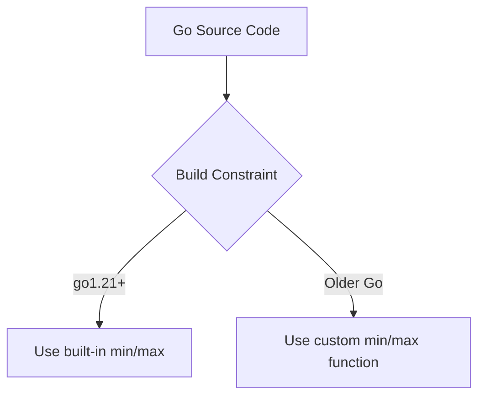
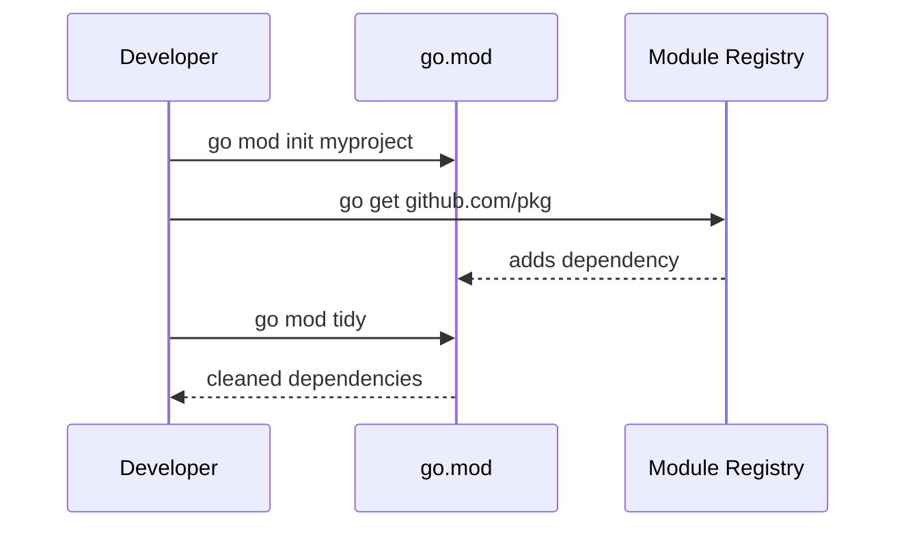

# History of Go — Junior

<!-- level-focus -->
At junior level, focus on this question:

> How can I apply **History of Go** in one small example and prove the result?

Use the smallest realistic scenario that exposes the decision and its failure behavior.
## Core Concepts

### Concept 1: The Creators

Go was designed by three legendary computer scientists at Google:
- **Rob Pike** — co-created the UTF-8 encoding and the Plan 9 operating system
- **Ken Thompson** — co-created Unix and the C programming language
- **Robert Griesemer** — worked on the V8 JavaScript engine and the Java HotSpot VM

Their combined experience with systems programming led them to design a language that avoids the mistakes of C++ and Java while keeping the performance of compiled languages.

### Concept 2: The Problem Go Solved

In 2007, Google engineers faced daily pain:
- C++ builds took **45 minutes** or more
- Adding a feature to a large codebase was terrifyingly complex
- Writing concurrent code (to use multi-core CPUs) was error-prone
- Dependency management was a nightmare

Go was designed to solve all of these problems at once.

### Concept 3: Key Milestones

- **2007** — Design began at Google
- **November 10, 2009** — Go announced as open source
- **March 28, 2012** — Go 1.0 released with the Go 1 Compatibility Promise
- **August 2015** — Go 1.5: compiler rewritten from C to Go (self-hosting)
- **February 2018** — Go 1.11: Go Modules introduced
- **March 2022** — Go 1.18: Generics added (the most requested feature)
- **August 2023** — Go 1.21: built-in `min`, `max`, `clear` functions
- **February 2024** — Go 1.22: range over integers, improved for-loop variable scoping

### Concept 4: The Go 1 Compatibility Promise

When Go 1.0 was released, the team made a bold promise: **any program written for Go 1.0 will continue to compile and run correctly with future Go 1.x releases.** This means code you write today will still work years from now without modification — a rare guarantee in the programming world.

---

## Code Examples

### Example 1: Your First Go Program

```go
// Every Go program starts with a package declaration
package main

// Import the "fmt" package for formatted I/O
import "fmt"

// The main function is the entry point of every Go program
func main() {
    // Print the Go version history
    fmt.Println("Go was designed in 2007")
    fmt.Println("Go was open-sourced in 2009")
    fmt.Println("Go 1.0 was released in 2012")
}
```

**What it does:** Prints three key dates in Go's history.
**How to run:** `go run main.go`

### Example 2: Checking Your Go Version

```go
package main

import (
    "fmt"
    "runtime"
)

func main() {
    // runtime.Version() returns the Go version used to build this binary
    fmt.Println("Go version:", runtime.Version())

    // runtime.GOOS and runtime.GOARCH tell you the OS and architecture
    fmt.Printf("OS: %s, Architecture: %s\n", runtime.GOOS, runtime.GOARCH)

    // runtime.NumCPU() shows how many CPUs Go can use
    // Go was designed for multi-core CPUs — this is why concurrency is built-in
    fmt.Printf("Available CPUs: %d\n", runtime.NumCPU())
}
```

**What it does:** Displays the Go version, operating system, architecture, and CPU count.
**How to run:** `go run main.go`

### Example 3: Go's Concurrency — The Reason Go Exists

```go
package main

import (
    "fmt"
    "sync"
)

func main() {
    // WaitGroup tracks goroutines — a key Go concurrency primitive
    var wg sync.WaitGroup

    milestones := []string{
        "2007: Go design began at Google",
        "2009: Go open-sourced",
        "2012: Go 1.0 released",
        "2015: Go 1.5 — self-hosting compiler",
        "2018: Go 1.11 — Modules introduced",
        "2022: Go 1.18 — Generics added",
    }

    for _, milestone := range milestones {
        wg.Add(1)
        go func(m string) {
            defer wg.Done()
            fmt.Println(m)
        }(milestone)
    }

    wg.Wait()
    fmt.Println("All milestones printed!")
}
```

**What it does:** Prints Go milestones concurrently using goroutines.
**How to run:** `go run main.go`

---

## Coding Patterns

### Pattern 1: Build Constraint for Version-Specific Code

**Intent:** Run different code depending on the Go version.
**When to use:** When you need to use features from a newer Go version but still support older ones.

```go
// This file only compiles with Go 1.21 or later
//go:build go1.21

package main

import "fmt"

func main() {
    // min and max are built-in functions starting from Go 1.21
    a, b := 3, 7
    fmt.Println("Min:", min(a, b))
    fmt.Println("Max:", max(a, b))
}
```

**Diagram:**



**Remember:** Build constraints let you write version-aware code. The `//go:build` directive must be the first line in the file.

---

### Pattern 2: Go Modules — Modern Dependency Management

**Intent:** Manage your project's dependencies — introduced in Go 1.11, standard since Go 1.16.
**When to use:** Every Go project should use modules.

```go
// To initialize a new Go module:
// go mod init myproject

// go.mod file (created automatically):
// module myproject
// go 1.22

package main

import "fmt"

func main() {
    fmt.Println("This project uses Go Modules!")
    fmt.Println("go.mod tracks dependencies and Go version")
}
```

**Diagram:**



---

## Best Practices

- **Always use the latest stable Go version** — each release includes performance improvements, bug fixes, and security patches
- **Always use Go Modules** — `go mod init` is the first command for any new project
- **Set the `go` directive in go.mod** — this ensures your project uses the correct minimum Go version
- **Read the release notes** — each Go release has a blog post explaining what changed and why

---

## Edge Cases & Pitfalls

### Pitfall 1: Assuming All Go 1.x Versions Are Identical

```go
package main

import "fmt"

func main() {
    // This code works in Go 1.21+ but NOT in older versions
    result := min(3, 7) // built-in min added in Go 1.21
    fmt.Println(result)
}
```

**What happens:** Compilation fails on Go versions before 1.21 with `undefined: min`.
**How to fix:** Check the `go` directive in your `go.mod` file and ensure your team uses the correct Go version.

### Pitfall 2: For-Loop Variable Capture Changed in Go 1.22

```go
package main

import "fmt"

func main() {
    funcs := []func(){}
    for i := 0; i < 3; i++ {
        funcs = append(funcs, func() {
            fmt.Println(i)
        })
    }
    for _, f := range funcs {
        f()
    }
    // Go < 1.22: prints 3, 3, 3 (shared variable)
    // Go >= 1.22: prints 0, 1, 2 (per-iteration variable)
}
```

**What happens:** The behavior of loop variable capture changed in Go 1.22. Old code may behave differently.
**How to fix:** Set `go 1.22` in your `go.mod` to get the new behavior, or explicitly copy the variable in older versions.

---

## Common Mistakes

### Mistake 1: Using GOPATH instead of Go Modules

```go
// Wrong way (pre-Go 1.11 style)
// Put code in $GOPATH/src/github.com/user/project/

// Correct way (Go 1.16+)
// Use go mod init anywhere on your filesystem
// go mod init github.com/user/project
```

### Mistake 2: Hardcoding Go Version Information

```go
package main

import (
    "fmt"
    "runtime"
)

func main() {
    // Wrong — hardcoded version string that becomes stale
    // fmt.Println("Go version: 1.19")

    // Correct — dynamically get the version
    fmt.Println("Go version:", runtime.Version())
}
```

---

## Common Misconceptions

### Misconception 1: "Go is made by Google, so it could be abandoned anytime"

**Reality:** Go is fully open source under a BSD license. Even if Google stopped supporting it, the community could continue development. Additionally, Google uses Go extensively internally (YouTube, Google Cloud, etc.), making abandonment extremely unlikely.

**Why people think this:** Google has a history of discontinuing products (Google Reader, Google+, etc.), but Go is infrastructure — not a consumer product.

### Misconception 2: "Go is just a simpler C"

**Reality:** While Go's creators had deep C/Unix experience, Go has garbage collection, goroutines, interfaces, built-in maps and slices, and a rich standard library. Go is a modern language that happens to value simplicity like C did.

**Why people think this:** Go's syntax looks C-like, and Ken Thompson co-created C.

### Misconception 3: "Go doesn't have generics"

**Reality:** Go added generics in version 1.18 (March 2022). This was the most requested feature for years. Today Go has full support for type parameters.

**Why people think this:** For 13 years (2009-2022), Go indeed lacked generics, and many blog posts from that era still appear in search results.

---

## Tricky Points

### Tricky Point 1: The `go` Directive in go.mod Affects Behavior

```go
// go.mod with go 1.21:
// module example
// go 1.21

package main

import "fmt"

func main() {
    // With go 1.21 in go.mod, you can use min/max
    fmt.Println(min(3, 7))

    // But if go.mod says "go 1.20", this will NOT compile
    // even if your Go toolchain is 1.22!
}
```

**Why it's tricky:** The `go` directive in `go.mod` controls which language features are available, not just the minimum version required. Changing this one line can break or fix your code.
**Key takeaway:** The `go` directive is a language version selector, not just documentation.

---

## "What If?" Scenarios

**What if Google decided to stop developing Go?**
- **You might think:** Go would die and your code would become useless.
- **But actually:** Go is open source (BSD license). The community could fork and continue development, just like many other open-source projects. Your existing Go binaries would still run, and the Go 1 Compatibility Promise means your code remains valid.

---

## Apply it

1. Choose one small, known input for **History of Go**.
2. Predict the output or observable behavior.
3. Run the smallest example or probe that exercises the concept.
4. Change one input to trigger a failure or boundary case.
5. Explain the evidence using the guide's vocabulary.

## Verify your work

- Record the exact input, command or code path, and output.
- Repeat the probe and confirm the result is consistent.
- Show one expected success and one expected failure.
- Resolve any difference between the prediction and the evidence.

## Review questions

- What problem does History of Go solve in the example?
- Which input changes the observed result, and why?
- What is the smallest useful success check?
- Which beginner mistake would your evidence catch?
