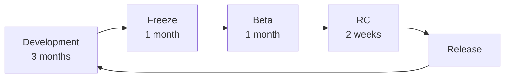
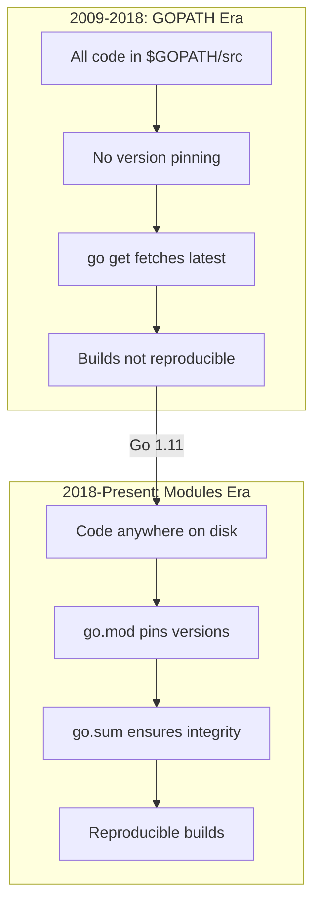
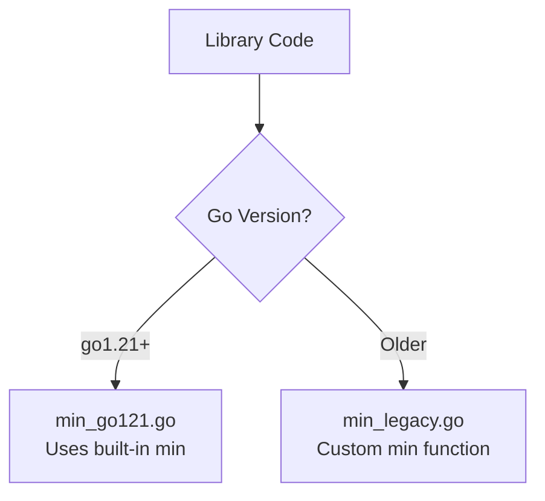
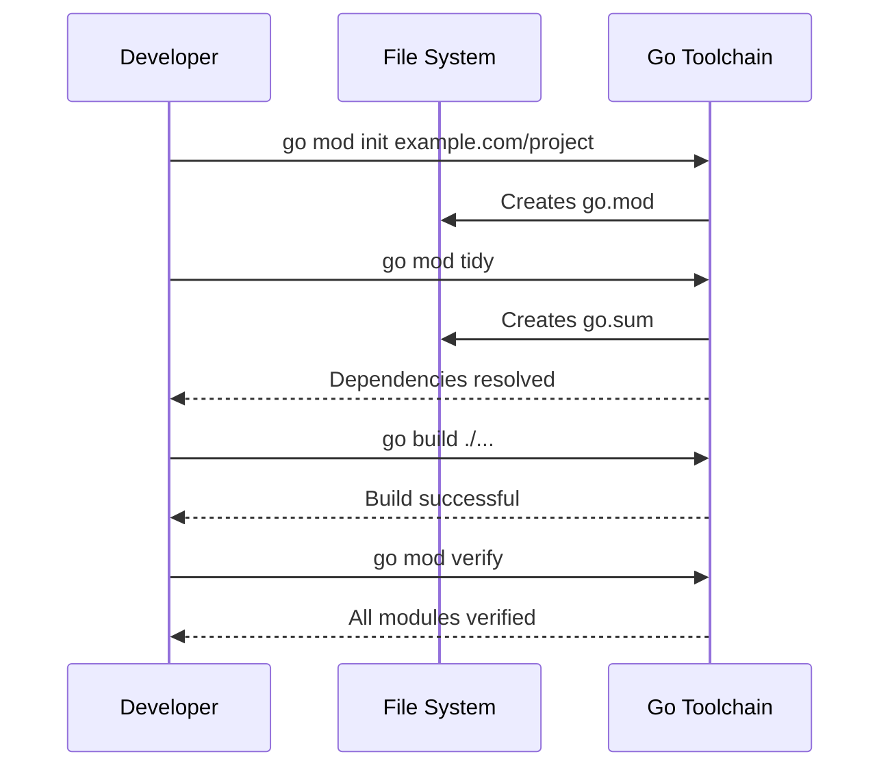
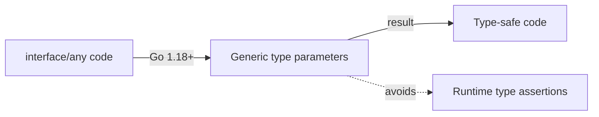

# History of Go — Middle

<!-- level-focus -->
At middle level, focus on this question:

> Where does **History of Go** belong in a maintainable component, and which trade-off selects the design?

Use the smallest realistic scenario that exposes the decision and its failure behavior.
## Core Concepts

### Concept 1: Go's Version Evolution Strategy

Go follows a strict release cadence: **two major releases per year** (February and August), each identified as Go 1.X. Every release goes through a development freeze, beta, release candidate, and final release cycle.



Key version milestones and their architectural reasoning:

| Version | Year | Key Feature | Why It Was Added |
|---------|------|-------------|------------------|
| 1.0 | 2012 | Stability guarantee | Enable enterprise adoption |
| 1.5 | 2015 | Self-hosting compiler | Remove C dependency, enable Go-specific optimizations |
| 1.7 | 2016 | `context` package | Standardize cancellation/timeout propagation |
| 1.11 | 2018 | Go Modules | Replace GOPATH chaos with reproducible builds |
| 1.13 | 2019 | Error wrapping (`%w`) | Standardize error chain inspection |
| 1.14 | 2020 | Go Module mirror/checksum | Supply chain security |
| 1.16 | 2021 | `embed` package, Modules default | Embed static files, finalize module transition |
| 1.18 | 2022 | Generics, fuzzing | Type safety without code generation |
| 1.21 | 2023 | Built-in `min`/`max`/`clear`, `log/slog` | Reduce boilerplate, structured logging |
| 1.22 | 2024 | Range over int, loop var fix | Fix long-standing gotcha, improve ergonomics |
| 1.23 | 2024 | Iterator functions, `unique` | Standardize iteration patterns |

### Concept 2: The Design Decision Framework

Every Go feature goes through a rigorous process. The Go team evaluates features on four axes:

1. **Simplicity** — Does it keep the language simple?
2. **Readability** — Does it make code easier to read?
3. **Orthogonality** — Does it compose well with existing features?
4. **Scalability** — Does it work at Google-scale codebases (millions of lines)?

This is why generics took 13 years. Multiple proposals were rejected because they failed one or more of these criteria.

---

## Evolution & Historical Context

**Before Go (the problems):**
- C++ builds at Google took 45+ minutes for large projects
- Complex dependency graphs caused cascading recompilations
- No standardized dependency management (each team had custom solutions)
- Writing concurrent code in C++/Java was error-prone (threads, locks, mutexes)
- Dynamic languages (Python, Ruby) were too slow for infrastructure

**How Go changed things:**
- **Fast compilation:** Go's import system was designed so the compiler only reads the direct imports, not transitive dependencies — compilation is O(n) not O(n^2)
- **Standardized tooling:** `go fmt`, `go vet`, `go test` built into the standard distribution — no more "which linter/formatter should we use?" debates
- **Concurrency as a first-class feature:** goroutines and channels made concurrent programming accessible to average developers, not just experts

**The GOPATH era vs Modules era:**



---

## Alternative Approaches (Plan B)

| Alternative | How it works | When you might be forced to use it |
|-------------|--------------|-------------------------------------|
| **Rust** | Memory safety without GC, edition-based evolution | When you need zero-cost abstractions and no GC pauses |
| **Java** | Mature ecosystem, preview features system | When enterprise ecosystem (Spring, Hibernate) is required |

---

## Code Examples

### Example 1: Version-Aware Feature Detection

```go
package main

import (
    "fmt"
    "runtime"
    "strings"
)

// parseGoVersion extracts the major.minor version from runtime.Version()
func parseGoVersion() (int, int) {
    v := runtime.Version()
    // runtime.Version() returns "go1.22.1" format
    v = strings.TrimPrefix(v, "go")
    parts := strings.Split(v, ".")
    if len(parts) < 2 {
        return 0, 0
    }
    var major, minor int
    fmt.Sscanf(parts[0], "%d", &major)
    fmt.Sscanf(parts[1], "%d", &minor)
    return major, minor
}

func main() {
    major, minor := parseGoVersion()
    fmt.Printf("Go %d.%d\n", major, minor)

    // Feature availability based on version
    features := []struct {
        name     string
        minMinor int
    }{
        {"Go Modules", 11},
        {"Error wrapping (%w)", 13},
        {"embed package", 16},
        {"Generics", 18},
        {"log/slog", 21},
        {"Range over int", 22},
        {"Iterators", 23},
    }

    for _, f := range features {
        status := "available"
        if minor < f.minMinor {
            status = "NOT available"
        }
        fmt.Printf("  %-25s (Go 1.%d+): %s\n", f.name, f.minMinor, status)
    }
}
```

**Why this pattern:** In production, you sometimes need to verify which features are available in the current runtime. This is especially useful for libraries that must support multiple Go versions.
**Trade-offs:** Checking at runtime is rare in Go — build constraints (`//go:build`) are preferred for compile-time version selection.

### Example 2: Comparing Error Handling Evolution

```go
package main

import (
    "errors"
    "fmt"
)

// --- Pre Go 1.13 style: string comparison ---
func oldStyleError() error {
    return fmt.Errorf("database connection failed")
}

func handleOldStyle() {
    err := oldStyleError()
    if err != nil {
        // Fragile: breaks if error message changes
        if err.Error() == "database connection failed" {
            fmt.Println("Old style: matched by string")
        }
    }
}

// --- Go 1.13+ style: error wrapping with %w ---
var ErrConnection = errors.New("connection failed")

func newStyleError() error {
    return fmt.Errorf("database: %w", ErrConnection)
}

func handleNewStyle() {
    err := newStyleError()
    if err != nil {
        // Robust: works even if error message is wrapped multiple times
        if errors.Is(err, ErrConnection) {
            fmt.Println("New style: matched by errors.Is")
        }
        fmt.Println("Full error:", err)
    }
}

func main() {
    handleOldStyle()
    handleNewStyle()
}
```

**When to use which:** Always use Go 1.13+ error wrapping in new code. Use `errors.Is` and `errors.As` instead of string matching.

---

## Coding Patterns

### Pattern 1: Build Constraints for Multi-Version Support

**Category:** Idiomatic Go
**Intent:** Support multiple Go versions in a single codebase
**When to use:** When maintaining a library that must work with older Go versions
**When NOT to use:** Application code where you control the Go version

**Structure diagram:**



**Implementation:**

```go
// File: min_go121.go
//go:build go1.21

package mathutil

// Min uses the built-in min function (Go 1.21+)
func Min(a, b int) int {
    return min(a, b)
}
```

```go
// File: min_legacy.go
//go:build !go1.21

package mathutil

// Min provides min for Go versions before 1.21
func Min(a, b int) int {
    if a < b {
        return a
    }
    return b
}
```

**Trade-offs:**

| Pros | Cons |
|---------|---------|
| Library works on multiple Go versions | More files to maintain |
| Users don't need to upgrade Go | Testing matrix grows |

---

### Pattern 2: Module Version Migration

**Category:** Idiomatic Go / Project Management
**Intent:** Properly migrate a project from GOPATH to Go Modules

**Flow diagram:**



```go
// After migration, your code looks the same
// But imports are now tracked in go.mod
package main

import (
    "fmt"
    "example.com/project/internal/config"
)

func main() {
    cfg := config.Load()
    fmt.Printf("Project: %s\n", cfg.Name)
}
```

---

### Pattern 3: Generics Migration — Interface{} to Type Parameters

**Category:** Idiomatic Go
**Intent:** Modernize pre-1.18 code that used `interface{}` to use type parameters



```go
package main

import "fmt"

// Pre-generics (Go < 1.18): uses interface{}, needs type assertion
func containsOld(slice []interface{}, target interface{}) bool {
    for _, v := range slice {
        if v == target {
            return true
        }
    }
    return false
}

// Post-generics (Go 1.18+): type-safe at compile time
func contains[T comparable](slice []T, target T) bool {
    for _, v := range slice {
        if v == target {
            return true
        }
    }
    return false
}

func main() {
    // Old way: no compile-time type safety
    fmt.Println(containsOld([]interface{}{1, 2, 3}, 2))

    // New way: compiler catches type mismatches
    fmt.Println(contains([]int{1, 2, 3}, 2))
    fmt.Println(contains([]string{"a", "b", "c"}, "b"))
}
```

---

## Performance Optimization

### Optimization 1: GC Improvements Across Go Versions

```go
package main

import (
    "fmt"
    "runtime"
    "time"
)

func allocateWork() {
    // Simulate allocation-heavy workload
    data := make([][]byte, 10000)
    for i := range data {
        data[i] = make([]byte, 1024)
    }
    _ = data
}

func main() {
    // Measure GC pause time — this has improved dramatically across Go versions
    // Go 1.4: 300ms+ pauses
    // Go 1.5: <10ms pauses (concurrent GC)
    // Go 1.8: <1ms pauses
    // Go 1.19: GOMEMLIMIT for better memory management

    var stats runtime.MemStats
    start := time.Now()
    for i := 0; i < 100; i++ {
        allocateWork()
    }
    runtime.ReadMemStats(&stats)
    fmt.Printf("Go version: %s\n", runtime.Version())
    fmt.Printf("Time: %v\n", time.Since(start))
    fmt.Printf("GC cycles: %d\n", stats.NumGC)
    fmt.Printf("Total GC pause: %v\n", time.Duration(stats.PauseTotalNs))
}
```

**Benchmark results (approximate across versions):**
```
Go 1.4:   Total GC pause: ~300ms
Go 1.5:   Total GC pause: ~8ms
Go 1.8:   Total GC pause: ~0.5ms
Go 1.19+: Total GC pause: ~0.3ms (with GOMEMLIMIT)
```

**When to optimize:** Upgrading Go version is the easiest optimization — always try it first.

### Performance Decision Matrix

| Scenario | Approach | Why |
|----------|----------|-----|
| High GC pressure | Upgrade Go version first | Free improvements |
| Legacy GOPATH project | Migrate to Modules | Better dependency caching |
| Slow compilation | Use Go 1.20+ build cache | Incremental builds |

---

## Debugging Guide

### Problem 1: "Module requires Go >= 1.X" errors

**Symptoms:** `go build` fails with message about Go version being too old.

**Diagnostic steps:**
```bash
go version
cat go.mod | grep "^go "
```

**Root cause:** The `go.mod` file specifies a minimum Go version higher than your installed version.
**Fix:** Upgrade your Go installation or lower the `go` directive in `go.mod` (if you do not need newer features).

### Problem 2: Behavior difference after Go upgrade

**Symptoms:** Tests pass on old Go version but fail on new one.

**Diagnostic steps:**
```bash
go doc -all | grep "Deprecated"
go vet ./...
```

**Root cause:** While Go maintains backward compatibility, subtle behavior changes can occur (e.g., loop variable scoping in Go 1.22).
**Fix:** Read the release notes for each version between your old and new version.

### Useful Tools

| Tool | Command | What it shows |
|------|---------|---------------|
| go version | `go version` | Installed Go version |
| go env | `go env GOVERSION` | Go version for current module |
| govulncheck | `govulncheck ./...` | Known vulnerabilities |
| go vet | `go vet ./...` | Suspicious code patterns |

---

## Best Practices

- **Pin your Go version in CI:** Use exact Go versions in CI/CD (e.g., `go 1.22.1`) to prevent surprise behavior changes
- **Read release notes before upgrading:** Every Go release has a detailed blog post explaining changes
- **Use `go mod tidy` regularly:** Keeps your dependency tree clean
- **Set GOMEMLIMIT (Go 1.19+):** Helps the GC make better decisions about when to collect
- **Test with `-race` flag:** Race detector has improved significantly over Go versions

---

## Edge Cases & Pitfalls

### Pitfall 1: Loop Variable Capture Behavior Change (Go 1.22)

```go
package main

import "fmt"

func main() {
    funcs := make([]func(), 3)
    for i := 0; i < 3; i++ {
        funcs[i] = func() { fmt.Println(i) }
    }
    for _, f := range funcs {
        f()
    }
    // go.mod says "go 1.21" → prints: 3, 3, 3
    // go.mod says "go 1.22" → prints: 0, 1, 2
}
```

**Impact:** Changing the `go` directive in `go.mod` from 1.21 to 1.22 changes program behavior.
**Detection:** Run tests before and after changing the `go` directive.
**Fix:** This is actually a bug fix in Go 1.22 — the new behavior is what most developers intended.

---

## Common Mistakes

### Mistake 1: Ignoring the go directive in go.mod

```go
// Looks correct but go.mod says "go 1.20"
// module myproject
// go 1.20

package main

import "fmt"

func main() {
    // This will NOT compile because go.mod says 1.20
    // min was added in Go 1.21
    fmt.Println(min(1, 2))
}

// Fix: update go.mod to "go 1.21" or later
```

### Mistake 2: Not running govulncheck

```go
// Looks fine but a dependency has a known vulnerability
// Always run:
// govulncheck ./...
// This tool was made official in Go 1.20's toolchain

package main

import "fmt"

func main() {
    fmt.Println("Run govulncheck before every release!")
}
```

---

## Common Misconceptions

### Misconception 1: "Go never breaks backward compatibility"

**Reality:** The Go 1 Compatibility Promise covers the language spec and documented standard library behavior. However, undocumented behavior, bugs, and performance characteristics can change between versions. For example, map iteration order has always been random by spec, but some code accidentally depended on a specific order.

**Evidence:**
```go
package main

import "fmt"

func main() {
    // Map iteration order is intentionally randomized
    // Code that depends on a specific order is ALWAYS wrong
    m := map[string]int{"a": 1, "b": 2, "c": 3}
    for k, v := range m {
        fmt.Println(k, v) // Different order each run
    }
}
```

### Misconception 2: "Newer Go version = always faster code"

**Reality:** While Go generally improves performance with each release, specific workloads can sometimes regress. Always benchmark your actual application after upgrading.

**Why people think this:** Release notes highlight improvements, not regressions. Most benchmarks show improvement, but edge cases exist.

---

## Anti-Patterns

### Anti-Pattern 1: Version Pinning to Ancient Go

```go
// go.mod
// module myproject
// go 1.13

// Using Go 1.13 in 2025 means:
// - No generics
// - No embed
// - No log/slog
// - Missing 6 years of security patches
// - Missing 6 years of performance improvements
```

**Why it's bad:** Technical debt accumulates rapidly. The longer you wait to upgrade, the harder the migration becomes.
**The refactoring:** Upgrade Go versions incrementally. Test thoroughly at each step. Most Go upgrades are painless due to the compatibility promise.

---

## Tricky Points

### Tricky Point 1: GOTOOLCHAIN Directive (Go 1.21+)

```go
// go.mod
// module myproject
// go 1.22.0
// toolchain go1.22.4

// The "toolchain" directive specifies the exact Go version to use
// The "go" directive specifies the minimum language version
// These are different!
```

**What actually happens:** Since Go 1.21, the `go` command can automatically download and use the correct Go version specified in `go.mod`. The `toolchain` directive lets you pin the exact patch version.
**Why:** Go spec reference: Go 1.21 added "forward compatibility" — `go` command downloads newer toolchain if needed.

---

## Comparison with Other Languages

| Aspect | Go | Python | Java | Rust |
|--------|-----|--------|------|------|
| Release cadence | 2x/year | ~1x/year | 2x/year (since Java 9) | 6 weeks |
| Breaking changes | Almost never (Go 1 Promise) | Python 2→3 was painful | Deprecated features removed over years | Edition system (2015, 2018, 2021, 2024) |
| Generics | Added in 1.18 (2022) | Always had (duck typing) | Since Java 5 (2004) | Since 1.0 (2015) |
| Module system | Go Modules (2018) | pip/poetry/uv | Maven/Gradle (long history) | Cargo (since 1.0) |
| Backward compatibility | Extremely strong | Moderate (2→3 broke everything) | Strong (but deprecation warnings) | Strong (editions handle breaking changes) |

### Key differences:
- **Go vs Python:** Go prioritizes backward compatibility above all. Python's 2→3 migration took over a decade and caused immense community pain. Go learned from this.
- **Go vs Java:** Java uses deprecation warnings and eventual removal. Go almost never removes anything.
- **Go vs Rust:** Rust uses "editions" to make breaking changes while maintaining backward compatibility at the compiler level. Go has no edition system — it achieves compatibility by simply never breaking things.

---

## Apply it

1. Find a real component where **History of Go** affects an interface or dependency.
2. Write two plausible choices and the constraint that favors each one.
3. Make the smallest reversible change at that boundary.
4. Exercise the component alone, then exercise the integrated flow.
5. Keep the decision note with the evidence that selected the option.

## Verify your work

- A focused check proves the local behavior.
- An integrated check proves callers and dependencies still agree.
- Logs, traces, compiler output, or benchmarks expose the boundary.
- Reverting the change restores the previous behavior without unrelated edits.

## Review questions

- Which boundary is most affected by History of Go?
- What constraint would make you choose the alternative design?
- How would you isolate a local defect from an integration defect?
- What evidence shows that the change remains maintainable?
